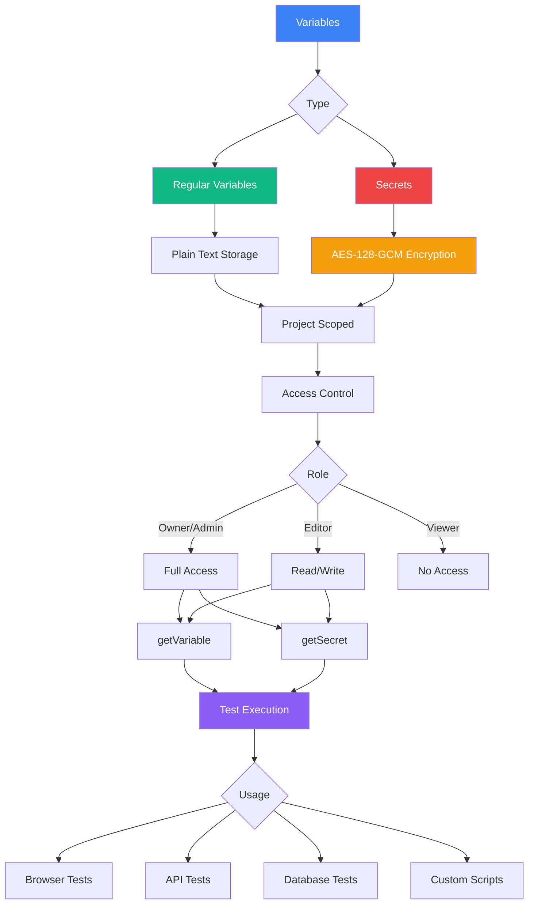
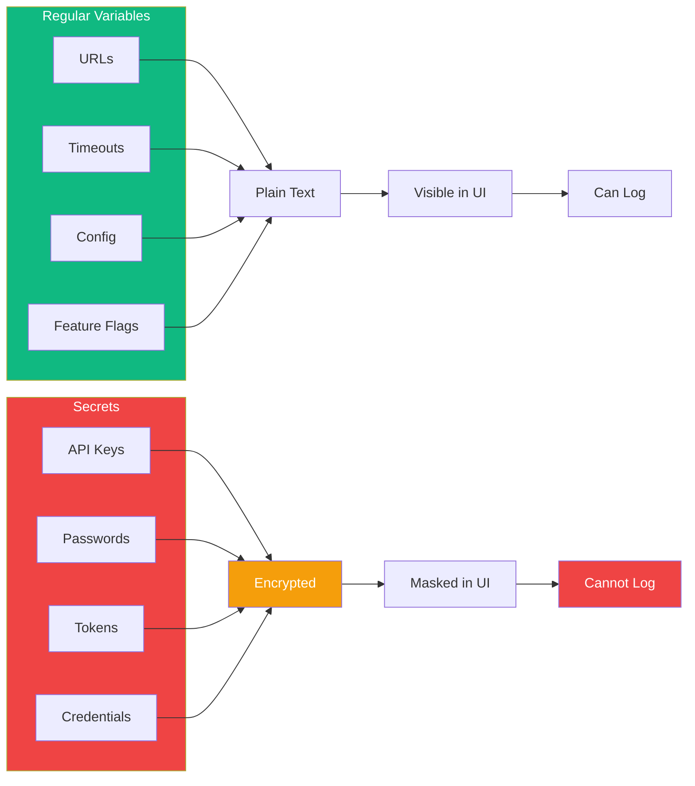
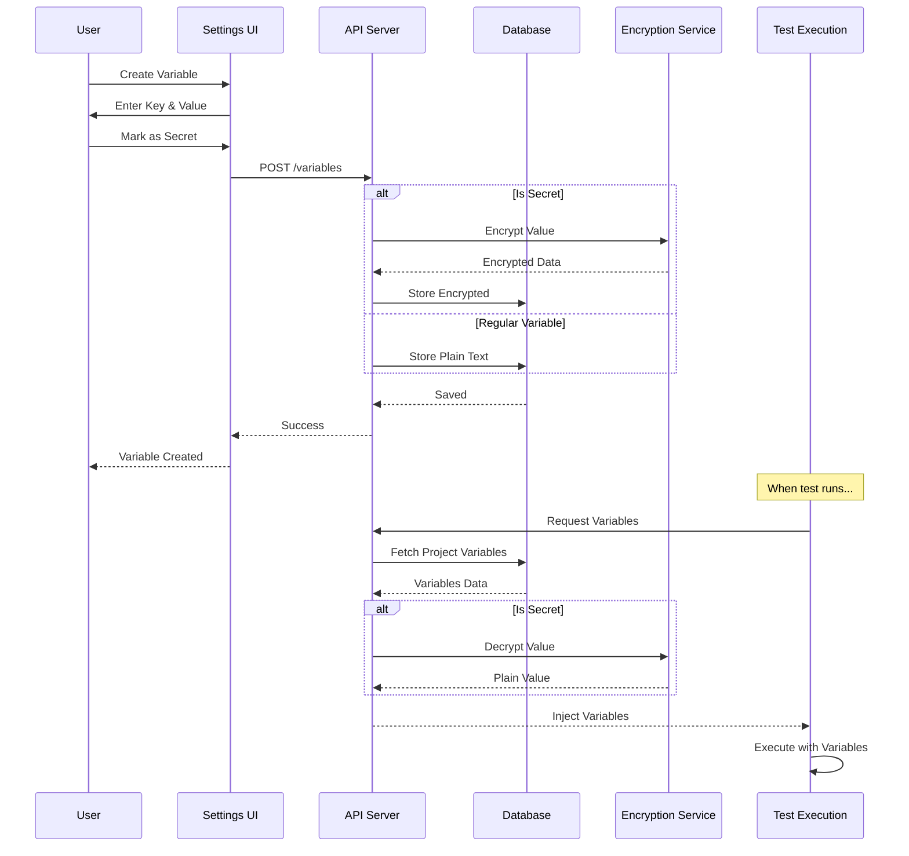
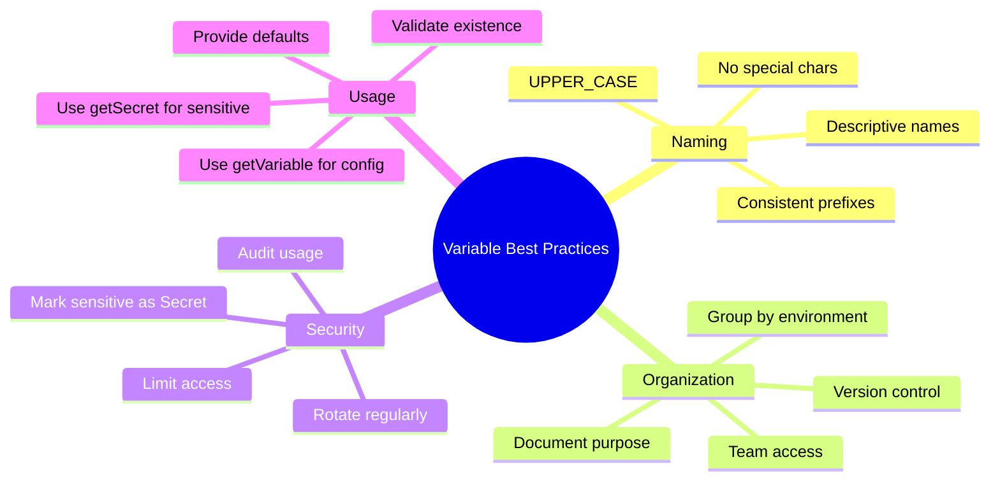
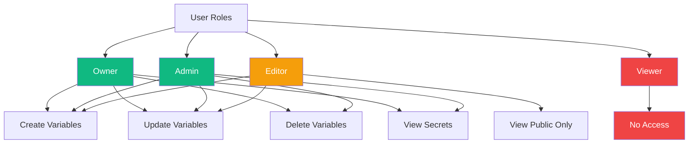

# Variables

Store reusable values like URLs, credentials, and configuration data securely.

## Variable System Architecture



## Variable Types Comparison



## Variable Lifecycle



## Using Variables in Tests

### Regular Variables
```javascript
// Configuration values
const baseUrl = getVariable("BASE_URL");
const timeout = getVariable("TIMEOUT", { type: "number" });
const username = getVariable("TEST_USERNAME");

// Use in your tests
await page.goto(baseUrl + "/login");
await page.fill("#username", username);
```

### Secrets (Protected from Logging)
```javascript
// Sensitive data
const apiKey = getSecret("API_KEY");
const password = getSecret("DB_PASSWORD");
const token = getSecret("AUTH_TOKEN");

// Safe usage - actual values hidden in logs
await page.fill("#password", password);
await page.setExtraHTTPHeaders({
  Authorization: `Bearer ${token}`
});

// Protected from logging
console.log(apiKey); // Shows: "[SECRET]"
console.log(`Key: ${apiKey}`); // Shows: "Key: [SECRET]"
```

## Secret Protection Flow

```mermaid
flowchart TB
    A[getSecret Called] --> B{Context}

    B -->|Console.log| C[Return '[SECRET]']
    B -->|JSON.stringify| D[Return '[SECRET]']
    B -->|String Template| E[Return '[SECRET]']
    B -->|Playwright Action| F[Use Actual Value]
    B -->|API Call| G[Use Actual Value]
    B -->|Comparison| H[Use Actual Value]

    F --> I[✓ Test Executes]
    G --> I
    H --> I

    C --> J[✓ Logs Protected]
    D --> J
    E --> J

    style A fill:#3b82f6,color:#fff
    style F fill:#10b981,color:#fff
    style G fill:#10b981,color:#fff
    style H fill:#10b981,color:#fff
    style C fill:#ef4444,color:#fff
    style D fill:#ef4444,color:#fff
    style E fill:#ef4444,color:#fff
    style J fill:#f59e0b,color:#fff
```

## Best Practices



## Access Control Matrix



## Creating Variables

<Steps>
  <Step>Navigate to **Automate → Variables**</Step>
  <Step>Click **Add Variable**</Step>
  <Step>Enter variable key (e.g., `API_KEY`)</Step>
  <Step>Enter variable value</Step>
  <Step>Toggle **Secret** if sensitive data</Step>
  <Step>Add optional description</Step>
  <Step>Save variable</Step>
</Steps>

## Common Use Cases

### Environment Configuration
```javascript
const env = getVariable("ENVIRONMENT"); // "production"
const apiUrl = getVariable(`${env.toUpperCase()}_API_URL`);
const dbHost = getVariable(`${env.toUpperCase()}_DB_HOST`);
```

### Feature Flags
```javascript
const featureEnabled = getVariable("NEW_FEATURE_ENABLED", {
  type: "boolean",
  default: false
});

if (featureEnabled) {
  // Test new feature
}
```

### Database Connections
```javascript
const dbConfig = {
  host: getVariable("DB_HOST"),
  port: getVariable("DB_PORT", { type: "number" }),
  database: getVariable("DB_NAME"),
  user: getVariable("DB_USER"),
  password: getSecret("DB_PASSWORD")
};
```

## Next Steps

- [Use variables in tests](./tests)
- [Configure jobs with variables](./jobs)
- [Set up environment-specific configs](./tests)
