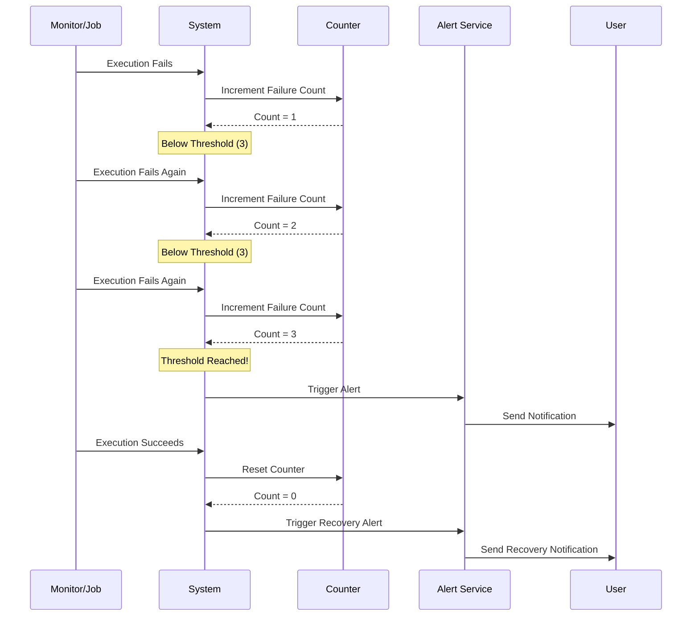

Stay informed about critical events with Supercheck's intelligent alerting system. Get notifications via email, Slack, webhooks, Telegram, or Discord when monitors fail or jobs encounter issues.

<Callout type="info">
  Alerts use threshold logic to prevent notification fatigue while ensuring you're informed of real issues.
</Callout>

## Overview

Supercheck's alerting system provides:

- **Multi-Channel Notifications**: Email, Slack, webhooks, Telegram, Discord
- **Smart Thresholds**: Prevent false alarms with consecutive failure logic
- **Alert History**: Complete audit trail of all notifications
- **Flexible Configuration**: Per-monitor and per-job alert settings
- **Professional Templates**: Beautiful HTML emails and formatted messages

## Notification Providers

### Email Notifications
Send professional HTML email notifications via SMTP.

**Features**:
- Professional HTML templates with responsive design
- SMTP delivery via any provider (Resend SMTP, Gmail, SendGrid, etc.)
- Multiple recipient support
- Batch processing for efficiency
- Plain text fallback for accessibility

**Configuration**:
```bash
SMTP_HOST=smtp.resend.com
SMTP_PORT=587
SMTP_USER=resend
SMTP_PASSWORD=your_api_key
SMTP_FROM_EMAIL=alerts@yourdomain.com
```

### Slack Integration
Real-time notifications in your Slack channels.

**Features**:
- Rich formatting with colors and emojis
- @mentions support
- Direct channel posting
- Custom slack bot integration

**Setup**: Provide your Slack webhook URL and channel name.

### Webhook Notifications
Integrate with any external system via HTTP webhooks.

**Features**:
- Custom HTTP methods (POST, PUT, etc.)
- Custom headers and authentication
- Body template customization
- Retry logic with backoff

**Use Cases**: CI/CD integration, PagerDuty, custom incident management

### Telegram Notifications
Instant mobile notifications via Telegram bot.

**Features**:
- Instant delivery to mobile devices
- Bot-based messaging
- Group chat support
- Message formatting

**Setup**: Provide your Telegram bot token and chat ID.

### Discord Integration
Notifications in Discord channels.

**Features**:
- Rich embeds with custom colors
- Channel-based posting
- Webhook-based delivery
- Custom formatting

**Setup**: Provide your Discord webhook URL.

## Alert Configuration

### Monitor Alerts

Configure alerts for each monitor with these options:

**Alert Types**:
- **On Failure**: Notify when monitor status changes to down
- **On Recovery**: Notify when monitor recovers to up
- **On SSL Expiration**: Warn about expiring SSL certificates

**Thresholds**:
- **Failure Threshold**: Number of consecutive failures before alerting (default: 1)
- **Recovery Threshold**: Number of consecutive successes before recovery alert (default: 1)

### Job Alerts

Configure alerts for job executions:

**Alert Types**:
- **On Failure**: Notify when job execution fails
- **On Success**: Notify on successful completion
- **On Timeout**: Notify when job exceeds time limit

**Thresholds**: Same threshold logic as monitors to prevent alert spam.

## Threshold Logic

The threshold system prevents alert fatigue by requiring multiple consecutive failures/successes before triggering notifications.



### How It Works

<Steps>
  <Step>Monitor/job executes and fails</Step>
  <Step>System counts consecutive failures</Step>
  <Step>Alert sent only when threshold is reached</Step>
  <Step>Counter resets when status changes</Step>
</Steps>

### Example Scenario

**Monitor with Failure Threshold: 3**

```
10:00 AM: Monitor Down → No Alert (1 consecutive < threshold)
10:05 AM: Still Down   → No Alert (2 consecutive < threshold)
10:10 AM: Still Down   → Alert Sent ✉️ (3 consecutive = threshold)
10:15 AM: Still Down   → No Alert (deduplication prevents spam)
10:20 AM: Monitor Up   → Recovery Alert Sent ✉️
```

### Threshold Benefits

- **Prevents False Alarms**: Requires multiple consecutive failures
- **Reduces Noise**: Avoids alerting on temporary issues
- **Configurable Sensitivity**: Different thresholds for different monitors
- **Recovery Detection**: Separate thresholds for failure and recovery

## Setting Up Alerts

### Step 1: Create Notification Providers

<Steps>
  <Step>Navigate to Settings → Notification Providers</Step>
  <Step>Click "Add Provider" and select your notification type</Step>
  <Step>Configure the provider settings (webhook URL, API keys, etc.)</Step>
  <Step>Test the provider to ensure it works</Step>
  <Step>Save the provider for use in alerts</Step>
</Steps>

### Step 2: Configure Monitor Alerts

<Steps>
  <Step>Edit your monitor configuration</Step>
  <Step>Enable "Alerts" in the alert settings section</Step>
  <Step>Select which notification providers to use</Step>
  <Step>Choose alert types (failure, recovery, SSL expiration)</Step>
  <Step>Set failure and recovery thresholds</Step>
  <Step>Add custom message (optional)</Step>
  <Step>Save your changes</Step>
</Steps>

### Step 3: Configure Job Alerts

<Steps>
  <Step>Edit your job configuration</Step>
  <Step>Enable "Alerts" in the alert settings section</Step>
  <Step>Select notification providers</Step>
  <Step>Choose alert types (failure, success, timeout)</Step>
  <Step>Set thresholds</Step>
  <Step>Save your configuration</Step>
</Steps>

## Alert History

Track all sent alerts in the Alert History page:

### Features
- **Complete Audit Trail**: Every alert logged with timestamp
- **Delivery Status**: See which alerts succeeded or failed
- **Error Messages**: View detailed error information for failed deliveries
- **Filter by Type**: Monitor alerts, job alerts, provider, status
- **Search**: Find specific alerts by message content

### Alert Status Types
- **Sent**: Alert delivered successfully
- **Failed**: Delivery failed (see error message)
- **Pending**: Queued for delivery

## Channel Limits

To ensure system stability and prevent notification overload:

- **Maximum Channels per Monitor**: 10 (configurable via environment)
- **Maximum Channels per Job**: 10 (configurable via environment)

<Callout type="warning">
  Selecting more than the configured limit will show an error. Remove channels before adding new ones.
</Callout>

## Best Practices

### Threshold Configuration

<Steps>
  <Step>Use **Failure Threshold: 2-3** for most monitors to avoid false alarms</Step>
  <Step>Use **Recovery Threshold: 1-2** for quick recovery notifications</Step>
  <Step>Adjust based on monitor frequency and criticality</Step>
  <Step>Test your thresholds with intentional failures</Step>
</Steps>

### Provider Selection

- **Critical Alerts**: Use multiple providers (email + Slack + PagerDuty)
- **Info Alerts**: Single channel (Slack or email)
- **Dev Environments**: Separate providers from production
- **Regular Review**: Audit which alerts are actually actionable

### Custom Messages

Use custom messages to provide context:

```
Production API monitor failed - investigate immediately
Database connection timeout - check RDS health
```

## Troubleshooting

### Email Delivery Failed

<Callout type="warning">
  **Common causes**: Invalid SMTP credentials, unverified sender domain, rate limits
</Callout>

**Solutions**:
1. Verify SMTP configuration in environment variables
2. Check that sender email domain is verified with your provider
3. Test SMTP connection using the provider test endpoint
4. Review SMTP provider logs for specific errors

### Webhook Not Receiving Alerts

**Common causes**: Invalid URL, authentication issues, firewall blocking

**Solutions**:
1. Test webhook endpoint manually with curl
2. Verify authentication headers are correct
3. Check if your firewall allows incoming from Supercheck IPs
4. Review webhook delivery logs in Alert History

### Slack Messages Not Appearing

**Common causes**: Invalid webhook URL, channel permissions

**Solutions**:
1. Verify webhook URL is correct and active
2. Check that Slack app has permission to post in the channel
3. Test with a simple message first
4. Regenerate webhook URL if needed

## Security Features

### Data Protection
- **Credential Encryption**: All API keys and tokens encrypted at rest
- **Secure Transmission**: HTTPS for all external requests
- **No Logging**: Sensitive data never logged in plain text
- **Access Control**: Role-based access to notification settings

### Alert History Privacy
- **Filtered Views**: Users only see alerts for their accessible projects
- **Audit Trail**: Who created/modified provider configurations
- **Retention**: Alert history retained for compliance requirements

## Advanced Configuration

### Environment Variables

```bash
# Email Configuration
SMTP_ENABLED=true
SMTP_HOST=smtp.resend.com
SMTP_PORT=587
SMTP_USER=resend
SMTP_PASSWORD=your_api_key
SMTP_FROM_EMAIL=alerts@yourdomain.com

# Channel Limits (runtime configurable via /api/config/app)
MAX_MONITOR_NOTIFICATION_CHANNELS=10
MAX_JOB_NOTIFICATION_CHANNELS=10
```

### API Integration

Use the Supercheck API to:
- Create/update notification providers programmatically
- Configure alert settings via API
- Query alert history for custom dashboards
- Integrate with external incident management systems

## Related Features

<Cards>
  <Card
    title="Monitors"
    description="Set up 24/7 monitoring with automatic alerts"
    href="../monitor/monitors"
  />
  <Card
    title="Jobs"
    description="Configure job execution alerts"
    href="../automate/jobs"
  />
  <Card
    title="Status Pages"
    description="Automatically update status pages on incidents"
    href="./status-pages"
  />
</Cards>

## Need Help?

- **Provider Setup**: Check provider-specific documentation for webhook URLs and API keys
- **Threshold Tuning**: Start conservative and adjust based on alert volume
- **Email Issues**: Contact your SMTP provider for delivery problems
- **Support**: Reach us at support@supercheck.io for alert configuration help
