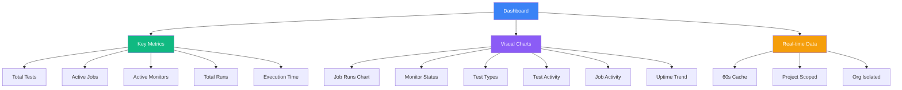

The Dashboard is your central hub for monitoring project health, tracking test execution, and understanding system performance at a glance.

<Callout type="info">
  The Dashboard automatically updates with real-time data from your tests, jobs, and monitors.
</Callout>

## Overview

The Dashboard provides a comprehensive view of your project's activity with real-time insights and visualizations.

**Key Features:**
- **Key Metrics**: Quick stats on tests, jobs, monitors, and recent runs
- **Visual Charts**: Interactive visualizations of trends and patterns
- **Real-time Updates**: Live data refreshed every minute
- **Project Scoping**: All data filtered to your current project

## Key Metrics Cards

The top section displays 5 essential metrics:

### Total Tests
Total number of test cases available in your project across all test types (browser, API, database, custom).

### Active Jobs
Number of currently scheduled or running jobs that execute your tests automatically.

### Active Monitors
Count of enabled monitoring endpoints that check your services 24/7.

### Total Runs
Number of job executions in the last 7 days, showing your automation activity.

### Execution Time
Total Playwright execution time across all test runs in the last 7 days.

## Dashboard Charts

### Job Runs Chart (Bar Chart)
**Description**: Job execution success vs failure last 7 days

Shows the distribution of successful vs failed job runs, helping you quickly identify reliability trends.

- **Success** (green): Jobs that completed successfully
- **Failed** (red): Jobs that encountered failures

### Monitor Status Chart (Bar Chart)
**Description**: Current monitor health distribution

Displays the current health status of all your monitors:

- **Up** (green): Monitors reporting healthy status
- **Down** (red): Monitors detecting issues

### Test Types Chart (Pie Chart)
**Description**: Distribution of test types

Visual breakdown of your test suite composition:

- Browser tests
- API tests
- Database tests
- Custom tests

### Test Activity Chart (Area Chart)
**Description**: Playground test executions last 7 days

Tracks daily playground test execution trends, showing development and testing activity over time.

### Job Activity Chart (Stacked Area Chart)
**Description**: Job execution by trigger types last 7 days

Shows how jobs are being triggered across different execution methods:

- **Manual** (green): User-initiated job runs from the UI
- **Scheduled** (blue): Automatic runs based on cron schedules
- **Remote** (orange): API-triggered runs from CI/CD or external systems

### Uptime Trend Chart (Line Chart)
**Description**: Monitor uptime percentage last 7 days

Displays the daily uptime trend for your monitors, helping you track reliability over time. Y-axis is scaled from 80-100% for better visibility of minor fluctuations.

## Data Freshness

The Dashboard data is:

- **Cached**: Updates every 60 seconds for optimal performance
- **Project-scoped**: Shows only data from your current project
- **Organization-isolated**: Data is fully isolated per organization

## Security Features

### Access Control
- **Authentication Required**: Must be signed in to view dashboard
- **Project Context**: Automatically filtered to your accessible projects
- **RBAC Integration**: Role-based access control enforced

### Data Security
- **Private Caching**: Dashboard data is never cached publicly
- **Encrypted Transit**: All data transmitted over HTTPS
- **Input Validation**: All queries validated and sanitized

## Performance

The Dashboard is optimized for speed:

- **Server-side Caching**: Reduces database load
- **Efficient Queries**: Indexed database operations
- **Parallel Loading**: Charts load concurrently
- **Memoization**: Client-side optimization prevents unnecessary recalculations

## Best Practices

### Monitoring Dashboard Health

<Steps>
  <Step>Review key metrics daily to understand project activity</Step>
  <Step>Check the Job Runs chart to identify failure patterns</Step>
  <Step>Monitor the Uptime Trend to ensure reliability targets are met</Step>
  <Step>Use Test Activity to track development velocity</Step>
</Steps>

### Interpreting Trends

- **Rising Failures**: May indicate code regressions or environmental issues
- **Dropping Uptime**: Could signal infrastructure problems
- **Increased Manual Runs**: Might suggest need for better automation
- **Test Type Imbalance**: Consider diversifying your test coverage

## Common Scenarios

### New Project Setup
When starting a new project, your dashboard will be mostly empty. Begin by:

1. Creating your first tests (browser, API, or database)
2. Setting up jobs to run tests automatically
3. Configuring monitors for critical endpoints
4. Reviewing the dashboard after 24 hours to see initial trends

### Troubleshooting Issues

If you notice anomalies in the dashboard:

1. **High Failure Rate**: Check the Runs page for detailed error messages
2. **Low Uptime**: Review monitor results for specific outages
3. **No Recent Activity**: Verify your jobs are properly scheduled
4. **Missing Data**: Ensure tests are running and completing successfully

## Technical Details

### Data Sources

The Dashboard aggregates data from:

- **Monitors Table**: Status, uptime, response times
- **Jobs Table**: Execution statistics, schedules
- **Runs Table**: Job execution history, success/failure rates
- **Tests Table**: Test counts and types
- **Audit Logs**: Playground execution history

### Query Optimization

- **Indexed Queries**: All queries use indexed columns for fast retrieval
- **Date Filtering**: Efficient time-range queries for recent data
- **Result Limiting**: Reasonable limits prevent excessive data transfer
- **Parallel Execution**: Multiple queries run concurrently

## Related Features

<Cards>
  <Card
    title="Alerts"
    description="Set up notifications for critical events"
    href="./alerts"
  />
  <Card
    title="Jobs"
    description="View detailed job execution history"
    href="../automate/jobs"
  />
  <Card
    title="Monitors"
    description="Monitor your services 24/7"
    href="../monitor/monitors"
  />
</Cards>

## Need Help?

- **In-app Support**: Click the help menu for context-specific tips
- **Dashboard Guide**: Review this documentation for detailed insights
- **Community**: Browse best practices in our resources section
