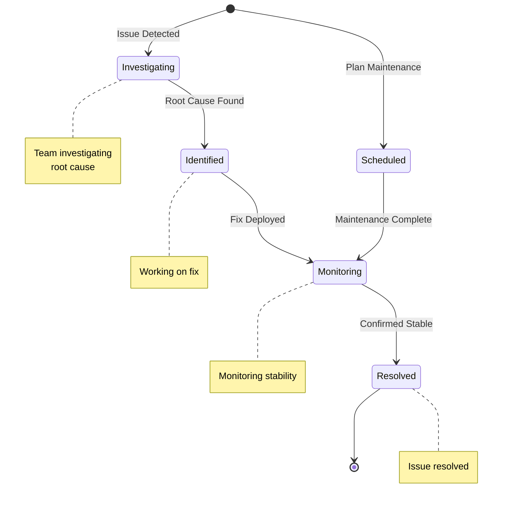

# Status Pages

Build trust with your users by creating beautiful, public-facing status pages that communicate system health, incidents, and scheduled maintenance in real-time.

<Callout type="info">
  Status pages are hosted on unique subdomains (e.g., `your-uuid.supercheck.io`) and are publicly accessible without authentication.
</Callout>

## Overview

Supercheck Status Pages provide:

- **Public Communication**: Share system status with users and stakeholders
- **Incident Management**: Create and update incidents with full workflow support
- **Component Tracking**: Organize services into logical components
- **Subscriber Notifications**: Email updates for incidents and status changes
- **Custom Branding**: Match your brand with custom colors and logos
- **Uptime Visualization**: 90-day uptime charts for transparency

## Key Features

### Component Management
Organize your services into logical components:

- **Component Groups**: Group related services (e.g., "Web Services", "Infrastructure")
- **Status Indicators**: 5 status types (operational, degraded, partial outage, major outage, maintenance)
- **Monitor Integration**: Link components to monitors for automatic status updates
- **Visibility Controls**: Show/hide components based on status

### Incident Management
Manual control over incident communication:

- **Incident Workflow**: Investigating → Identified → Monitoring → Resolved
- **Impact Levels**: None, Minor, Major, Critical
- **Incident Updates**: Timeline of updates with status changes
- **Component Linking**: Tag affected components in incidents
- **Scheduled Maintenance**: Plan and communicate upcoming maintenance

### Subscriber Management
Keep users informed automatically:

- **Email Subscriptions**: Users can subscribe for updates
- **Email Verification**: Double opt-in for security
- **Component-Specific**: Subscribe to specific components only
- **Professional Templates**: Beautifully formatted notification emails
- **Unsubscribe Support**: Easy one-click unsubscribe

### Custom Branding
Make your status page match your brand:

- **Custom Colors**: Customize status colors, backgrounds, fonts
- **Logo Upload**: Add favicon, header logo, and cover image
- **Custom Domains**: Use your own domain (enterprise)
- **Timezone Support**: Display times in your preferred timezone

## Getting Started

### Step 1: Create a Status Page

<Steps>
  <Step>Navigate to **Communicate → Status Pages**</Step>
  <Step>Click **Create Status Page**</Step>
  <Step>Enter page name, headline, and description</Step>
  <Step>Save to get your unique subdomain (UUID-based)</Step>
</Steps>

Your status page will be accessible at `https://[your-uuid].supercheck.io`

### Step 2: Add Components

<Steps>
  <Step>Open your status page and go to the **Components** tab</Step>
  <Step>Create component groups (e.g., "Web Services", "Infrastructure")</Step>
  <Step>Add components within each group</Step>
  <Step>Link components to monitors for automatic status updates</Step>
  <Step>Configure component visibility and display settings</Step>
</Steps>

### Step 3: Configure Settings

<Steps>
  <Step>Go to the **Settings** tab</Step>
  <Step>Upload your logo and favicon</Step>
  <Step>Customize colors to match your brand</Step>
  <Step>Set support URL and notification settings</Step>
  <Step>Configure subscriber permissions</Step>
</Steps>

### Step 4: Publish Your Page

<Steps>
  <Step>Review your status page in preview mode</Step>
  <Step>Click **Publish** to make it publicly accessible</Step>
  <Step>Share the URL with your users and stakeholders</Step>
</Steps>

## Creating and Managing Incidents

### Creating an Incident

<Steps>
  <Step>Navigate to the **Incidents** tab</Step>
  <Step>Click **Create Incident**</Step>
  <Step>Enter incident name and initial description</Step>
  <Step>Select affected components</Step>
  <Step>Choose impact level (Minor, Major, Critical)</Step>
  <Step>Set initial status (usually "Investigating")</Step>
  <Step>Enable/disable email notifications</Step>
  <Step>Save to create the incident</Step>
</Steps>

### Incident Workflow

The incident lifecycle follows a clear progression from detection to resolution:

**Status Progression**:
1. **Investigating**: Issue detected, team investigating root cause
2. **Identified**: Root cause found, working on fix
3. **Monitoring**: Fix applied, monitoring for stability
4. **Resolved**: Issue completely resolved
5. **Scheduled**: For planned maintenance

### Adding Incident Updates

Keep users informed with timeline updates:

<Steps>
  <Step>Open an existing incident</Step>
  <Step>Click **Add Update**</Step>
  <Step>Write update message describing current status</Step>
  <Step>Update incident status if needed</Step>
  <Step>Choose whether to send notifications</Step>
  <Step>Save the update</Step>
</Steps>

### Scheduled Maintenance

Communicate planned maintenance in advance:

<Steps>
  <Step>Create incident with status **Scheduled**</Step>
  <Step>Set scheduled start and end times</Step>
  <Step>Enable automatic status transitions</Step>
  <Step>Configure reminder notifications (3, 6, 12, 24 hours before)</Step>
  <Step>System automatically updates status during maintenance window</Step>
</Steps>

## Component Status Types

### Operational (Green)
All systems functioning normally. No issues detected.

### Degraded Performance (Yellow)
Service is running but slower than normal. Minor issues affecting performance.

### Partial Outage (Orange)
Some features or services are unavailable. Partial functionality remains.

### Major Outage (Red)
Service is completely down or severely impaired. Critical issue.

### Under Maintenance (Blue)
Scheduled maintenance in progress. Temporary service interruption.

## Subscriber Management

### Email Subscriptions

Users can subscribe to your status page:

1. User visits your public status page
2. Clicks "Subscribe to Updates"
3. Enters email address
4. Receives verification email
5. Clicks verification link
6. Subscribed and receives future updates

### Managing Subscribers

In the **Subscribers** tab:

- View all subscribers with verification status
- See subscription date and email addresses
- Export subscriber list to CSV
- Manually remove subscribers if needed
- Track subscriber growth over time

### Email Notification Templates

Professional email templates for:

- **Incident Creation**: New incident notifications
- **Incident Updates**: Status change notifications
- **Resolution**: Incident resolved notifications
- **Scheduled Maintenance**: Upcoming maintenance reminders

## Linking Components to Monitors

### Automatic Status Updates

Link components to monitors for automatic status propagation:

<Steps>
  <Step>Edit a component</Step>
  <Step>Select one or more monitors to link</Step>
  <Step>Choose aggregation method (worst case, best case, weighted average)</Step>
  <Step>Set failure threshold (how many monitors must fail)</Step>
  <Step>Save configuration</Step>
</Steps>

### Aggregation Methods

**Worst Case** (default):
- Component fails if ANY linked monitor fails
- Best for critical services requiring 100% availability

**Best Case**:
- Component fails only if ALL monitors fail
- Useful for redundant services with multiple instances

**Weighted Average**:
- Weighted average of monitor statuses
- Good for services with monitors of varying importance

**Majority Vote**:
- Component status based on majority of monitors
- Balanced approach for distributed systems

## Customization Options

### Color Scheme

Customize these colors to match your brand:

- Body background color
- Font colors (primary and light)
- Status colors (green, yellow, orange, red, blue)
- Border and graph colors
- Link colors

### Logo Assets

Upload these assets for professional branding:

- **Favicon**: Small icon for browser tabs (32x32px recommended)
- **Logo**: Header logo for status page
- **Cover Image**: Hero banner image
- **Email Logo**: Logo used in email notifications

### Advanced Settings

- **Support URL**: Link to your support portal
- **Timezone**: Display times in your preferred timezone
- **Subscriber Controls**: Enable/disable different subscription types
- **RSS/Atom Feeds**: Enable feed subscriptions
- **Notification Footer**: Custom text in email notifications

## Public Status Page Features

### What Users See

On your public status page:

- **Current System Status**: Overall health summary
- **Component List**: All components with current status
- **90-Day Uptime**: Visual uptime history
- **Active Incidents**: Current incidents with timeline
- **Incident History**: Past 30 days of incidents (paginated)
- **Subscribe Button**: Email subscription form

### Mobile Responsive

Status pages are fully responsive:
- Optimized for mobile devices
- Touch-friendly navigation
- Fast loading times
- Accessible design

### SEO Optimized

- Proper meta tags for search engines
- Open Graph tags for social sharing
- Semantic HTML structure
- Fast page load performance

## Best Practices

### Component Organization

<Steps>
  <Step>Group related services logically</Step>
  <Step>Use clear, user-friendly component names</Step>
  <Step>Link components to relevant monitors</Step>
  <Step>Keep component list focused (5-15 components ideal)</Step>
</Steps>

### Incident Communication

- **Be Transparent**: Share what you know, when you know it
- **Update Regularly**: Even if no progress, acknowledge you're working on it
- **Clear Language**: Avoid jargon, explain in simple terms
- **Set Expectations**: Provide estimated resolution times when possible

### Subscriber Management

- **Respect Privacy**: Only collect necessary information
- **Easy Unsubscribe**: Make it simple to opt-out
- **Valuable Updates**: Only send important notifications
- **Test Emails**: Preview notifications before sending

### Maintenance Communication

- **Advance Notice**: Announce maintenance at least 24 hours ahead
- **Clear Schedule**: Specify start and end times with timezone
- **Impact Description**: Explain what users should expect
- **Alternative Options**: Provide workarounds if available

## Security Features

### Public Access Control

- **Draft Mode**: Status pages not public until published
- **UUID Subdomains**: Unique, hard-to-guess URLs
- **No Sensitive Data**: Only display information intended for public
- **Rate Limiting**: Protection against abuse

### Subscriber Security

- **Email Verification**: Double opt-in prevents spam subscriptions
- **Unsubscribe Tokens**: Secure, time-limited unsubscribe links
- **No Password Needed**: Passwordless subscription system
- **GDPR Compliance**: Respect user privacy and data rights

## Troubleshooting

### Status Page Not Loading

<Callout type="warning">
  **Check**: Ensure status page is published (not in draft mode)
</Callout>

**Solutions**:
1. Verify the page is published in settings
2. Check if subdomain is correctly configured
3. Clear browser cache and try again
4. Contact support if issue persists

### Subscribers Not Receiving Emails

**Common Causes**: Email not verified, emails in spam folder, SMTP issues

**Solutions**:
1. Verify subscriber's email is verified (check Subscribers tab)
2. Ask subscribers to check spam/junk folders
3. Ensure SMTP settings are configured correctly
4. Test email delivery with test notification

### Component Status Not Updating

**Common Causes**: Monitor not linked, incorrect aggregation settings

**Solutions**:
1. Verify monitor is linked to component
2. Check monitor is actually running checks
3. Review aggregation method and threshold settings
4. Manually update component status if needed

## Related Features

<Cards>
  <Card
    title="Monitors"
    description="Link monitors to components for automatic status updates"
    href="../monitor/monitors"
  />
  <Card
    title="Alerts"
    description="Configure alerts to know when to create incidents"
    href="./alerts"
  />
  <Card
    title="Dashboard"
    description="Monitor overall system health"
    href="./dashboard"
  />
</Cards>

## Production Deployment

### Custom Domains (Enterprise)

Use your own domain for status pages:

1. Create CNAME record: `status.yourdomain.com` → `supercheck.io`
2. Configure custom domain in status page settings
3. SSL certificate automatically provisioned
4. Status page accessible at `status.yourdomain.com`

### Monitoring Status Page Health

Track status page performance:
- Page view analytics
- Subscriber growth metrics
- Incident frequency trends
- Response time monitoring

## Need Help?

- **Status Page Setup**: Follow the getting started guide above
- **Incident Communication**: Review best practices for effective communication
- **Custom Branding**: Check settings tab for all customization options
- **Support**: Contact us at support@supercheck.io for assistance
