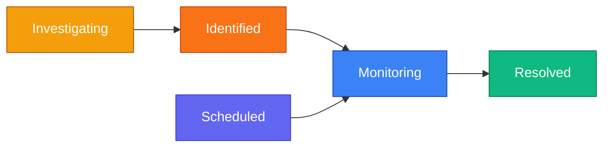
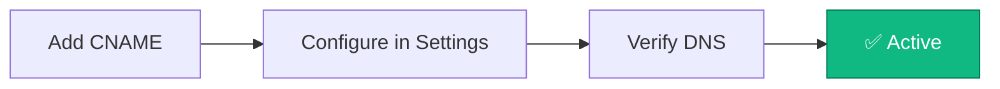
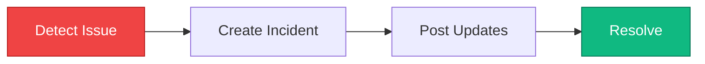

Create public status pages to communicate system health, incidents, and scheduled maintenance to your users.

<Callout type="info">
Status pages are hosted on unique subdomains and are publicly accessible without authentication.
</Callout>

## Public Status Page

Once published, your status page displays real-time system health to users:

**What users see:**
- **Status Banner** — Overall system health (All Systems Operational, Partial Outage, etc.)
- **Components** — Individual services with current status and 90-day uptime chart
- **Past Incidents** — Recent incident history grouped by date
- **Subscribe Button** — Subscribe to receive incident notifications

### Incident Details

Users can click any incident to view the full timeline of updates:

## Subscribing to Updates

Users can subscribe to receive notifications when incidents are created, updated, or resolved.

### Email Subscription

1. Click **Subscribe** on the status page
2. Enter email address
3. Click **Subscribe via Email**
4. Check inbox for verification email
5. Click verification link to activate subscription

### Slack Integration

Send incident notifications directly to a Slack channel:

1. Create a Slack app at [api.slack.com/apps](https://api.slack.com/apps)
2. Enable **Incoming Webhooks**
3. Add webhook to your workspace and select channel
4. Copy the webhook URL
5. Paste URL in the subscription dialog

**Slack notifications include:**
- Rich formatted messages
- Color-coded by incident impact
- Affected services and status updates
- Direct link to status page

### Webhook Integration

For custom integrations, subscribe via webhook:

1. Select **Webhook** tab
2. Enter your webhook endpoint URL
3. Receive JSON payloads for all incident events

### RSS Feed

Subscribe via RSS for feed readers and monitoring tools.

---

## Managing Status Pages

Navigate to **Communicate → Status Pages** to view all your status pages.

Click **Manage** to access the management interface:

### Creating a Status Page

1. Click **Create Status Page**
2. Enter:
   - **Name** — Internal identifier
   - **Headline** — Public title shown on the page
   - **Description** — Brief description for users
3. Click **Create**

Your page is created in **draft mode**. Configure components and settings before publishing.

### Publishing

1. Add at least one component
2. Configure branding in Settings
3. Click **Publish** to make the page public
4. Share the URL with your users

---

## Components

Components represent individual services or features on your status page.

### Adding Components

1. Go to **Components** tab
2. Click **Add Component**
3. Enter:
   - **Name** — Service name (e.g., "API", "Website", "Database")
   - **Description** — Brief explanation
   - **Status** — Current operational status
   - **Linked Monitors** — Associate monitors for reference

### Component Status Types

| Status | Color | Description |
|--------|-------|-------------|
| **Operational** | Green | Service functioning normally |
| **Degraded Performance** | Yellow | Running but slower than normal |
| **Partial Outage** | Orange | Some features unavailable |
| **Major Outage** | Red | Service completely down |
| **Under Maintenance** | Blue | Scheduled maintenance in progress |

### Linked Monitors

Associate monitors with components for reference. Linked monitors appear in the Overview tab and help you track which monitors relate to each service.

<Callout type="info">
Component status is managed manually. Update component status when creating or resolving incidents.
</Callout>

---

## Incidents

Incidents communicate service disruptions to your users.

### Creating an Incident

1. Go to **Incidents** tab
2. Click **Create Incident**
3. Enter:
   - **Title** — Brief description (e.g., "API Response Delays")
   - **Message** — Initial update for users
   - **Status** — Current investigation status
   - **Impact** — Severity level
   - **Affected Components** — Which services are impacted
4. Choose whether to notify subscribers
5. Click **Create**

### Incident Status Workflow

| Status | Description |
|--------|-------------|
| **Investigating** | Issue detected, team investigating |
| **Identified** | Root cause found, working on fix |
| **Monitoring** | Fix deployed, monitoring stability |
| **Resolved** | Issue completely resolved |
| **Scheduled** | Planned maintenance |

### Impact Levels

| Impact | Description |
|--------|-------------|
| **None** | Informational update |
| **Minor** | Small subset of users affected |
| **Major** | Significant impact on service |
| **Critical** | Complete service outage |

### Incident Updates

Add updates to keep users informed:

1. Open an existing incident
2. Click **Add Update**
3. Write update message
4. Update status if changed
5. Choose whether to notify subscribers

### Scheduled Maintenance

Communicate planned maintenance in advance:

1. Create incident with **Scheduled** status
2. Set start and end times
3. Enable automatic status transitions
4. Configure reminder notifications

The system automatically updates status during the maintenance window.

---

## Subscribers

Manage users who receive incident notifications.

**Features:**
- View all subscribers (email, webhook, Slack)
- See verification status
- Search and filter by email or URL
- Export to CSV
- Delete subscribers
- View statistics (total, verified, pending)

### Notification Types

Subscribers receive notifications for:
- New incidents created
- Incident status updates
- Incident resolution
- Scheduled maintenance reminders

---

## Settings

Configure branding and notification settings.

### Branding

- **Logo** — Header logo for status page
- **Favicon** — Browser tab icon
- **Status Colors** — Customize colors for each status type
- **Custom Domain** — Use your own domain (e.g., `status.yourcompany.com`)

### Notifications

- **Subscriber Types** — Enable/disable email, webhook, Slack subscriptions
- **RSS Feed** — Enable RSS feed for subscribers
- **Email Footer** — Custom text in notification emails

### Custom Domains

Use your own domain (e.g., `status.yourcompany.com`) instead of the default subdomain.

#### How Custom Domains Work

#### Step-by-Step Setup

<Steps>
  <Step>
    **Add DNS Record**
    
    Log in to your DNS provider (e.g., Cloudflare, GoDaddy, Namecheap) and add a CNAME record:

    | Type | Name | Target |
    |------|------|--------|
    | CNAME | `status` | Your Supercheck domain* |

    <Callout type="info">
    **CNAME Target:**
    - **Cloud users:** Point to `supercheck.io`
    - **Self-hosted:** Point to your `STATUS_PAGE_DOMAIN` value
    </Callout>
  </Step>
  <Step>
    **Configure in Supercheck**
    
    1. Go to your status page → **Settings** tab
    2. Enter your custom domain (e.g., `status.yourcompany.com`)
    3. Click **Save**
  </Step>
  <Step>
    **Verify DNS**
    
    1. Wait 5-15 minutes for DNS propagation
    2. Click **Verify DNS** button
    3. Once verified, your custom domain is active
  </Step>
  <Step>
    **SSL Certificate**
    
    An SSL certificate is automatically provisioned via Let's Encrypt. Your custom domain will serve HTTPS traffic within minutes of verification.
  </Step>
</Steps>

#### DNS Verification

Supercheck verifies your domain by checking that your CNAME record points to the correct target. When you click **Verify DNS**, it resolves your domain and confirms it points to your Supercheck domain.

#### Troubleshooting

| Issue | Solution |
|-------|----------|
| "CNAME not found" | Wait 15-30 minutes for DNS propagation |
| "Points to wrong target" | Verify CNAME target matches your Supercheck domain |
| "Domain already in use" | The domain is configured on another status page |
| SSL certificate pending | Wait a few minutes after verification |

<Callout type="tip">
**Test DNS Propagation:** Use [dnschecker.org](https://dnschecker.org) to verify your CNAME record has propagated globally.
</Callout>

---

## Best Practices

### Incident Communication

**Tips for effective incident communication:**
- **Be transparent** — Share what you know, even if incomplete
- **Update regularly** — Post updates every 30-60 minutes during active incidents
- **Use clear language** — Avoid technical jargon your users won't understand
- **Set expectations** — Provide estimated resolution times when possible

### Organizing Components

- **Use clear names** — "Website" and "API" are better than internal service names
- **Keep it focused** — 5-15 components is ideal for most status pages
- **Add descriptions** — Help users understand what each component does

### Managing Subscribers

- **Enable all channels** — Let users choose email, Slack, or webhooks
- **Enable RSS** — Technical users often prefer RSS feeds
- **Review regularly** — Check the Subscribers tab to see engagement
- **One-click unsubscribe** — Users can unsubscribe anytime via email link

### Custom Domain Tips

- **Use a subdomain** — `status.yourcompany.com` is the industry standard
- **Test before sharing** — Verify your custom domain works before announcing it
- **Allow DNS time** — Wait 15-30 minutes for DNS changes to propagate
