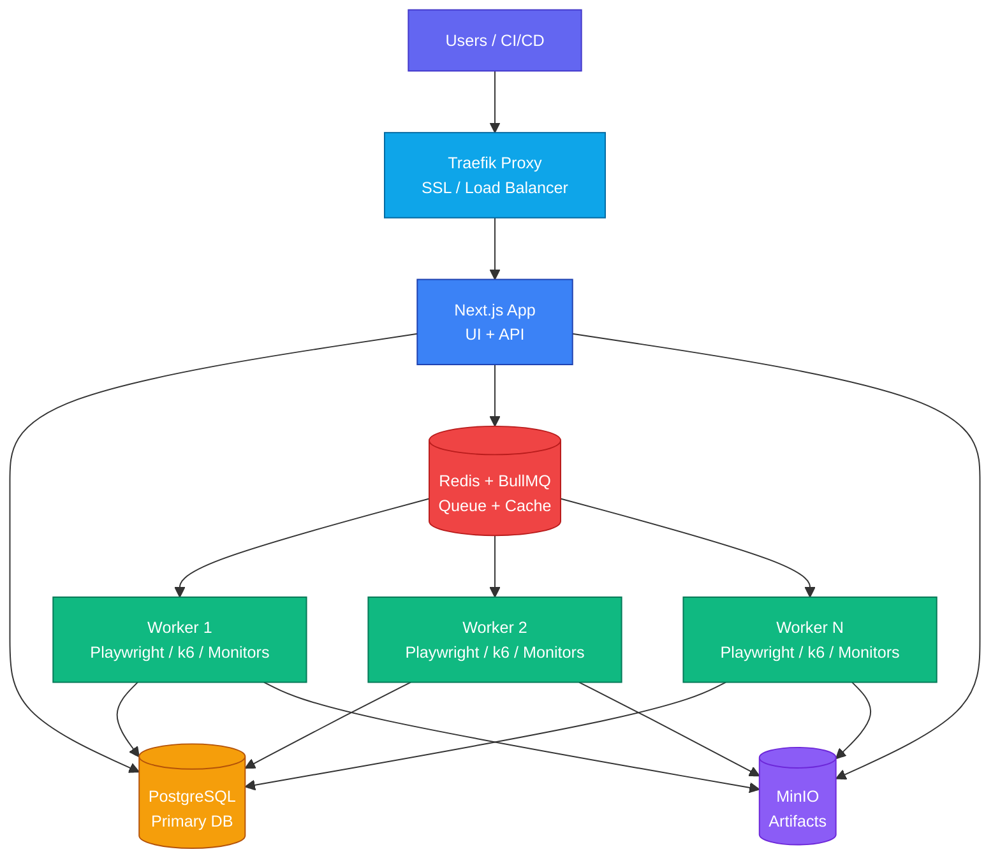

Deploy Supercheck on your own infrastructure with Docker Compose. All data stays on your servers.



<Callout type="info">
For true multi-location monitoring, see [Multi-Location Workers](/docs/deployment/multi-location).
</Callout>

## Deployment Options

| Option | SSL/HTTPS | Status Pages |
|--------|-----------|--------------|
| **Without Domain** | ❌ HTTP only | ❌ No |
| **With Domain** | ✅ Automatic | ✅ Yes |

---

## Option 1: Without Domain

Best for testing or internal networks.

### 1. Install Docker

<Callout type="info">
Already have Docker or Docker Desktop installed? [Skip to Clone and Configure](#2-clone-and-configure).
</Callout>

<Tabs items={['macOS', 'Windows', 'Linux']}>
  <Tab value="macOS">
    Download and install [Docker Desktop](https://www.docker.com/products/docker-desktop/) for Mac.
    
    After installation, start Docker Desktop from your Applications folder.
  </Tab>
  <Tab value="Windows">
    Download and install [Docker Desktop](https://www.docker.com/products/docker-desktop/) for Windows.
    
    After installation, start Docker Desktop from the Start menu.
  </Tab>
  <Tab value="Linux">
    ```bash
    curl -fsSL https://get.docker.com | sh
    sudo usermod -aG docker $USER
    newgrp docker  # Apply group changes without logout
    ```
  </Tab>
</Tabs>

### 2. Clone and Configure

```bash
git clone https://github.com/supercheck-io/supercheck.git
cd supercheck/deploy/docker

# Auto-generate secure secrets
./init-secrets.sh
```

Edit `.env` and add your OAuth credentials:

```bash
GITHUB_CLIENT_ID=your-github-client-id
GITHUB_CLIENT_SECRET=your-github-client-secret
```

### 3. Deploy

```bash
docker compose up -d
```

### 4. Create Admin

1. Sign up at `http://localhost:3000` using GitHub or Google OAuth
2. Promote your account to super admin:

```bash
docker compose exec app npm run setup:admin your-email@example.com
```

---

## Option 2: With Domain

For production with HTTPS and status pages.

### 1. Install Docker

<Callout type="info">
Already have Docker or Docker Desktop installed? [Skip to Configure DNS](#2-configure-dns).
</Callout>

<Tabs items={['macOS', 'Windows', 'Linux']}>
  <Tab value="macOS">
    Download and install [Docker Desktop](https://www.docker.com/products/docker-desktop/) for Mac.
    
    After installation, start Docker Desktop from your Applications folder.
  </Tab>
  <Tab value="Windows">
    Download and install [Docker Desktop](https://www.docker.com/products/docker-desktop/) for Windows.
    
    After installation, start Docker Desktop from the Start menu.
  </Tab>
  <Tab value="Linux">
    ```bash
    curl -fsSL https://get.docker.com | sh
    sudo usermod -aG docker $USER
    newgrp docker  # Apply group changes without logout
    ```
  </Tab>
</Tabs>

### 2. Configure DNS

Before deploying, point your domain to your server by adding DNS records through your **domain provider** (e.g., Cloudflare, GoDaddy, Namecheap, or wherever you purchased your domain).

<Steps>
  <Step>
    **Find Your Server's IP Address**
    
    You'll need your server's public IP address. Run this on your server:
    ```bash
    curl -4 ifconfig.me
    ```
  </Step>
  <Step>
    **Log in to Your Domain Provider**
    
    Go to your domain registrar's website and navigate to the DNS management section. This is usually labeled as "DNS Settings", "Manage DNS", or "DNS Records".
  </Step>
  <Step>
    **Add the Following DNS Records**
    
    | Type | Name | Value | TTL |
    |------|------|-------|-----|
    | A | `app` | Your Server IP (e.g., `203.0.113.50`) | Auto or 3600 |
    | A | `*` | Your Server IP (e.g., `203.0.113.50`) | Auto or 3600 |

    <Callout type="info">
    The wildcard (`*`) record enables custom subdomains for status pages (e.g., `status.yourdomain.com`, `api-status.yourdomain.com`).
    </Callout>
  </Step>
  <Step>
    **Wait for DNS Propagation**
    
    DNS changes can take a few minutes to propagate. Verify your records are active:
    ```bash
    # Should return your server IP
    dig +short app.yourdomain.com
    ```
  </Step>
</Steps>

### 3. Clone and Configure

```bash
git clone https://github.com/supercheck-io/supercheck.git
cd supercheck/deploy/docker

# Auto-generate secure secrets
./init-secrets.sh
```

Edit `.env` and add your domain and OAuth credentials:

```bash
APP_DOMAIN=app.yourdomain.com
ACME_EMAIL=admin@yourdomain.com

GITHUB_CLIENT_ID=your-github-client-id
GITHUB_CLIENT_SECRET=your-github-client-secret
```

### 4. Deploy

```bash
docker compose -f docker-compose-secure.yml up -d
```

### 5. Create Admin

1. Sign up at `https://app.yourdomain.com` using GitHub or Google OAuth
2. Promote your account to super admin:

```bash
docker compose exec app npm run setup:admin your-email@example.com
```

---

## OAuth Setup

<Callout type="warning">
At least one OAuth provider (GitHub or Google) is required for authentication.
</Callout>

### GitHub OAuth

<Steps>
  <Step>
    Go to [GitHub Developer Settings](https://github.com/settings/developers)
  </Step>
  <Step>
    Click **OAuth Apps** → **New OAuth App**
  </Step>
  <Step>
    Configure the app:
    - Homepage URL: `https://app.yourdomain.com`
    - Callback URL: `https://app.yourdomain.com/api/auth/callback/github`
  </Step>
  <Step>
    Copy Client ID and generate Client Secret, add to `.env`:
    
    ```bash
    GITHUB_CLIENT_ID=your-client-id
    GITHUB_CLIENT_SECRET=your-client-secret
    ```
  </Step>
</Steps>

### Google OAuth

<Steps>
  <Step>
    Go to [Google Cloud Console](https://console.cloud.google.com/) and create a project
  </Step>
  <Step>
    Navigate to **APIs & Services** → **Credentials**
  </Step>
  <Step>
    Configure OAuth consent screen (select External)
  </Step>
  <Step>
    Create **OAuth client ID** (Web application) with redirect URI:
    `https://app.yourdomain.com/api/auth/callback/google`
  </Step>
  <Step>
    Copy credentials and add to `.env`:
    
    ```bash
    GOOGLE_CLIENT_ID=your-client-id.apps.googleusercontent.com
    GOOGLE_CLIENT_SECRET=your-client-secret
    ```
  </Step>
</Steps>

<Callout type="info">
For local development, use `http://localhost:3000` for all URLs.
</Callout>

---

## Optional Features

### Email (SMTP)

Required for alerts and invitations.

```bash
SMTP_HOST=smtp.gmail.com
SMTP_PORT=587
SMTP_USER=your-email@gmail.com
SMTP_PASSWORD=your-app-password
SMTP_FROM_EMAIL=notifications@yourdomain.com
```

### AI Features

AI Create and AI Fix for Playwright and k6 tests, plus AI Analyze for k6 performance run insights.

```bash
OPENAI_API_KEY=sk-your-api-key
AI_MODEL=gpt-4o-mini
```

---

## Scaling Workers

```bash
# Scale to 2 workers
WORKER_REPLICAS=2 RUNNING_CAPACITY=2 docker compose up -d
```

| Workers | Concurrent Tests | Server Size |
|---------|------------------|-------------|
| 1 | 1 | 2 vCPU / 4GB |
| 2 | 2 | 4 vCPU / 8GB |
| 4 | 4 | 8 vCPU / 16GB |

---

## Maintenance

**Update:**
```bash
docker compose pull && docker compose up -d
```

**Backup:**
```bash
docker compose exec postgres pg_dump -U postgres supercheck > backup.sql
```

**Troubleshoot:**
```bash
docker compose logs app
docker compose ps
```

---

## Next Steps

<Cards>
  <Card
    icon={<MapPin className="text-emerald-500" />}
    title="Multi-Location Workers"
    description="Deploy workers in multiple regions for true global coverage"
    href="/docs/deployment/multi-location"
  />
</Cards>
