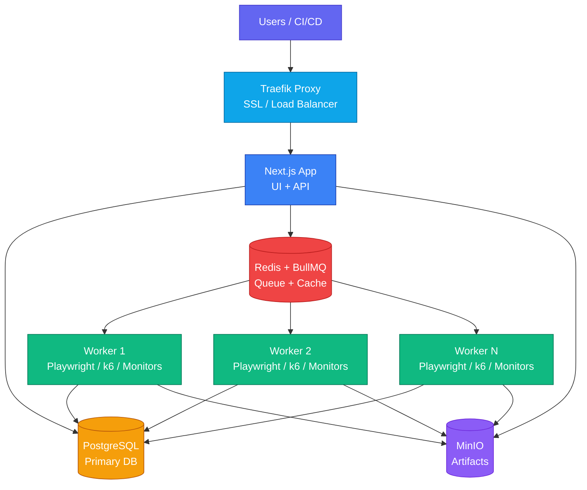

Deploy Supercheck on your own infrastructure with Docker Compose. All data stays on your servers.



<Callout type="warning">
**OAuth Required**: At least one OAuth provider (GitHub or Google) must be configured for user authentication.
</Callout>

## Deployment Options

| Option | SSL/HTTPS | Status Pages |
|--------|-----------|--------------| 
| **Without Domain** | ❌ HTTP only | ❌ No |
| **With Domain** | ✅ Automatic | ✅ Yes |

---

## Option 1: Without Domain

Best for testing or internal networks. **No configuration required** — all secrets are auto-generated.

### 1. Install Docker

<Callout type="info">
**Skip this step** if you already have Docker or Docker Desktop installed.
</Callout>

**Option A: Docker Engine (Linux/Server)**
```bash
curl -fsSL https://get.docker.com | sh
sudo usermod -aG docker $USER
```

**Option B: Docker Desktop (Mac/Windows/Linux)**

Download from [docker.com/products/docker-desktop](https://www.docker.com/products/docker-desktop/)

### 2. Clone Repository

```bash
git clone https://github.com/supercheck-io/supercheck.git
cd supercheck/deploy/docker
```

### 3. Configure OAuth

At least one OAuth provider is required. Create a `.env` file:

```bash
# GitHub OAuth (get from https://github.com/settings/developers)
GITHUB_CLIENT_ID=your-github-client-id
GITHUB_CLIENT_SECRET=your-github-client-secret
```

See [OAuth Setup](#oauth-required) for detailed instructions.

### 4. Deploy

```bash
docker compose up -d
```

### 5. Create Super Admin

After deployment, create your first super admin account:

```bash
docker compose exec app npm run setup:admin your-email@example.com
```

This creates an admin account with the provided email. Sign in using GitHub/Google OAuth with the same email address to gain super admin access.

<Callout type="info">
The super admin has full platform access including user management, organization oversight, and system configuration. See [Admin Documentation](https://supercheck.io/docs/admin) for details.
</Callout>

Access at `http://localhost:3000`.

<Callout type="info">
Security secrets (`BETTER_AUTH_SECRET`, `SECRET_ENCRYPTION_KEY`, database passwords) are auto-generated with secure defaults. Override in `.env` only if needed.
</Callout>

---

## Option 2: With Domain

For deployments with HTTPS and status pages.

### 1. Install Docker

<Callout type="info">
**Skip this step** if you already have Docker or Docker Desktop installed.
</Callout>

**Option A: Docker Engine (Linux/Server)**
```bash
curl -fsSL https://get.docker.com | sh
sudo usermod -aG docker $USER
```

**Option B: Docker Desktop (Mac/Windows/Linux)**

Download from [docker.com/products/docker-desktop](https://www.docker.com/products/docker-desktop/)

### 2. Configure DNS

1. Go to your DNS provider (Cloudflare, Route53, etc.)
2. Create an **A Record**: `app.yourdomain.com` → Your server IP
3. For status pages: `*.yourdomain.com` → Your server IP

<Callout type="info">
DNS changes take 5-30 minutes. Verify with `dig app.yourdomain.com`.
</Callout>

### 3. Clone Repository

```bash
git clone https://github.com/supercheck-io/supercheck.git
cd supercheck/deploy/docker
```

### 4. Configure Environment

Create `.env` file with your domain:

```bash
# Your domain (required) - all URLs are derived from this
APP_DOMAIN=app.yourdomain.com
ACME_EMAIL=admin@yourdomain.com

# OAuth (at least one provider required)
GITHUB_CLIENT_ID=your-github-client-id
GITHUB_CLIENT_SECRET=your-github-client-secret
```

<Callout type="info">
Security secrets are auto-generated. Only your domain is required.
</Callout>

### 5. Deploy

```bash
docker compose -f docker-compose-secure.yml up -d
```

### 6. Create Super Admin

After deployment, create your first super admin account:

```bash
docker compose exec app npm run setup:admin your-email@example.com
```

This creates an admin account with the provided email. Sign in using GitHub/Google OAuth with the same email address to gain super admin access.

<Callout type="info">
The super admin has full platform access including user management, organization oversight, and system configuration. See [Admin Documentation](https://supercheck.io/docs/admin) for details.
</Callout>

Access at `https://app.yourdomain.com`.

---

## OAuth (Required)

At least one OAuth provider is required for authentication. You can configure GitHub, Google, or both.

### GitHub OAuth

**Step 1: Create OAuth App**

1. Go to [GitHub Developer Settings](https://github.com/settings/developers)
2. Click **OAuth Apps** in the left sidebar
3. Click **New OAuth App**

**Step 2: Configure the App**

| Field | Value |
|-------|-------|
| **Application name** | Supercheck (or your preferred name) |
| **Homepage URL** | `https://app.yourdomain.com` (or `http://localhost:3000` for local) |
| **Authorization callback URL** | `https://app.yourdomain.com/api/auth/callback/github` |

<Callout type="warning">
For local development without a domain, use:
- Homepage URL: `http://localhost:3000`
- Callback URL: `http://localhost:3000/api/auth/callback/github`
</Callout>

**Step 3: Get Credentials**

1. Click **Register application**
2. Copy the **Client ID**
3. Click **Generate a new client secret**
4. Copy the **Client Secret** (shown only once)

**Step 4: Add to Environment**

```bash
GITHUB_CLIENT_ID=your-github-client-id
GITHUB_CLIENT_SECRET=your-github-client-secret
```

### Google OAuth

**Step 1: Create Project**

1. Go to [Google Cloud Console](https://console.cloud.google.com/)
2. Create a new project or select an existing one
3. Go to **APIs & Services → Credentials**

**Step 2: Configure OAuth Consent Screen**

1. Click **OAuth consent screen** in the left sidebar
2. Select **External** (or Internal for Google Workspace)
3. Fill in the required fields:
   - **App name**: Supercheck
   - **User support email**: Your email
   - **Developer contact**: Your email
4. Click **Save and Continue**
5. Skip **Scopes** (defaults are sufficient)
6. Add test users if needed, then **Save and Continue**

**Step 3: Create OAuth Credentials**

1. Go to **Credentials** in the left sidebar
2. Click **Create Credentials → OAuth client ID**
3. Select **Web application**
4. Configure:

| Field | Value |
|-------|-------|
| **Name** | Supercheck Web Client |
| **Authorized JavaScript origins** | `https://app.yourdomain.com` |
| **Authorized redirect URIs** | `https://app.yourdomain.com/api/auth/callback/google` |

<Callout type="warning">
For local development without a domain, use:
- JavaScript origins: `http://localhost:3000`
- Redirect URI: `http://localhost:3000/api/auth/callback/google`
</Callout>

**Step 4: Get Credentials**

1. Click **Create**
2. Copy the **Client ID** and **Client Secret**

**Step 5: Add to Environment**

```bash
GOOGLE_CLIENT_ID=your-client-id.apps.googleusercontent.com
GOOGLE_CLIENT_SECRET=your-google-client-secret
```

### Verifying OAuth Setup

After deployment, test your OAuth configuration:

1. Go to your Supercheck instance
2. Click **Sign in with GitHub** or **Sign in with Google**
3. Complete the OAuth flow
4. Verify you're redirected back and logged in

<Callout type="info">
If you encounter errors, check:
- Callback URLs match exactly (including trailing slashes)
- Client ID and Secret are correct
- For Google: OAuth consent screen is configured
</Callout>

---

## Optional: Email (SMTP)

Required for alerts, password resets, and invitations.

```bash
# Your SMTP server (Gmail, SendGrid, Mailgun, AWS SES, etc.)
SMTP_HOST=smtp.gmail.com
SMTP_PORT=587
SMTP_USER=your-email@gmail.com
SMTP_PASSWORD=your-app-password
SMTP_FROM_EMAIL=notifications@yourdomain.com
```

---

## Optional: AI Features

Enables AI-powered test fix suggestions.

```bash
# OpenAI API key from https://platform.openai.com
OPENAI_API_KEY=sk-your-api-key

# Model options: gpt-4o, gpt-4o-mini, gpt-4-turbo, gpt-3.5-turbo
AI_MODEL=gpt-4o-mini
```

---

## Scaling Workers

By default, Supercheck runs with **1 worker** for single-server deployments. Scale for more concurrent tests:

```bash
# Scale to 2 workers (requires RUNNING_CAPACITY adjustment)
WORKER_REPLICAS=2 RUNNING_CAPACITY=2 docker compose up -d
```

### Capacity Planning

| Workers | Concurrent Tests | Server Size |
|---------|------------------|-------------|
| 1 | 1 | 2 vCPU / 4GB |
| 2 | 2 | 4 vCPU / 8GB |
| 4 | 4 | 8 vCPU / 16GB |

<Callout type="info">
Each worker runs one Playwright test at a time with **1 browser worker** inside the container (default for 2GB container memory). For larger servers, set `PLAYWRIGHT_WORKERS=2`.
</Callout>

---

## Updates

```bash
# Pull latest images
docker compose pull
docker compose up -d
```

## Backup

```bash
# Export database
docker exec supercheck-postgres pg_dump -U postgres supercheck > backup.sql

# Restore
cat backup.sql | docker exec -i supercheck-postgres psql -U postgres supercheck
```

## Troubleshooting

**Container won't start**: `docker compose logs app`

**Database errors**: `docker compose ps`

**SSL issues**: Ensure ports 80/443 are open

**DNS not resolving**: Wait for propagation or check with `dig yourdomain.com`
