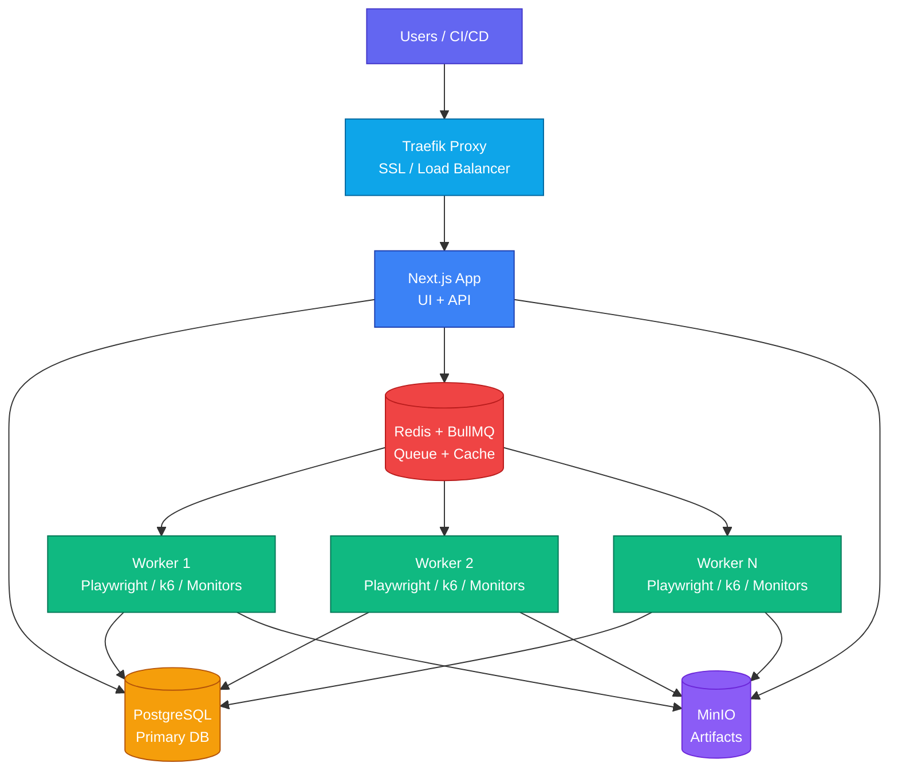

Deploy Supercheck on your own infrastructure with Docker Compose. All data stays on your servers.

<Callout type="info">
For true multi-location monitoring, see [Multi-Location Workers](/docs/deployment/multi-location).
</Callout>

## Quick Start

[](https://github.com/supercheck-io/supercheck/blob/main/deploy/coolify/README.md)

One-click deployment on [Coolify](https://coolify.io) — the easiest way to self-host.

---

## Docker Compose

Choose your deployment type:

<Tabs items={['Local Testing', 'Production (HTTPS)']}>
  <Tab value="Local Testing">
    Best for local development, testing, or internal networks without a domain.

    ### 1. Install Docker

    <Tabs items={['macOS', 'Windows', 'Linux']}>
      <Tab value="macOS">
        Download and install [Docker Desktop](https://www.docker.com/products/docker-desktop/) for Mac.
      </Tab>
      <Tab value="Windows">
        Download and install [Docker Desktop](https://www.docker.com/products/docker-desktop/) for Windows.
      </Tab>
      <Tab value="Linux">
        ```bash
        curl -fsSL https://get.docker.com | sh
        sudo usermod -aG docker $USER
        newgrp docker
        ```
      </Tab>
    </Tabs>

    ### 2. Clone and Configure

    ```bash
    git clone https://github.com/supercheck-io/supercheck.git
    cd supercheck/deploy/docker

    # Generate secure secrets
    bash init-secrets.sh
    ```

    Edit `.env` and add your [OAuth credentials](#oauth-setup):

    ```bash
    GITHUB_CLIENT_ID=your-github-client-id
    GITHUB_CLIENT_SECRET=your-github-client-secret
    ```

    ### 3. Deploy

    ```bash
    docker compose up -d
    ```

    ### 4. Access

    Open `http://localhost:3000`, sign in with OAuth, then create your admin:

    ```bash
    docker compose exec app npm run setup:admin your-email@example.com
    ```
  </Tab>

  <Tab value="Production (HTTPS)">
    For production with HTTPS, custom domain, and status pages.

    ### 1. Install Docker

    <Tabs items={['macOS', 'Windows', 'Linux']}>
      <Tab value="macOS">
        Download and install [Docker Desktop](https://www.docker.com/products/docker-desktop/) for Mac.
      </Tab>
      <Tab value="Windows">
        Download and install [Docker Desktop](https://www.docker.com/products/docker-desktop/) for Windows.
      </Tab>
      <Tab value="Linux">
        ```bash
        curl -fsSL https://get.docker.com | sh
        sudo usermod -aG docker $USER
        newgrp docker
        ```
      </Tab>
    </Tabs>

    ### 2. Configure DNS

    Add these records at your domain provider:

    | Type | Name | Value |
    |------|------|-------|
    | A | `app` | Your Server IP |
    | A | `*` | Your Server IP |

    <Callout type="info">
    The wildcard (`*`) record enables status page subdomains like `status.yourdomain.com`.
    </Callout>

    Verify DNS:
    ```bash
    dig +short app.yourdomain.com
    ```

    ### 3. Clone and Configure

    ```bash
    git clone https://github.com/supercheck-io/supercheck.git
    cd supercheck/deploy/docker

    # Generate secure secrets
    bash init-secrets.sh
    ```

    Edit `.env`:

    ```bash
    # Domain (required)
    APP_DOMAIN=app.yourdomain.com
    ACME_EMAIL=admin@yourdomain.com
    STATUS_PAGE_DOMAIN=yourdomain.com

    # OAuth (required)
    GITHUB_CLIENT_ID=your-github-client-id
    GITHUB_CLIENT_SECRET=your-github-client-secret
    ```

    ### 4. Deploy

    ```bash
    docker compose -f docker-compose-secure.yml up -d
    ```

    ### 5. Access

    Open `https://app.yourdomain.com`, sign in with OAuth, then create your admin:

    ```bash
    docker compose -f docker-compose-secure.yml exec app npm run setup:admin your-email@example.com
    ```
  </Tab>
</Tabs>

---

## OAuth Setup

<Callout type="warning">
At least one OAuth provider (GitHub or Google) is required.
</Callout>

<Accordions>
  <Accordion title="GitHub OAuth">
    1. Go to [GitHub Developer Settings](https://github.com/settings/developers)
    2. Click **OAuth Apps** → **New OAuth App**
    3. Set Homepage URL: `https://app.yourdomain.com` (or `http://localhost:3000` for local)
    4. Set Callback URL: `https://app.yourdomain.com/api/auth/callback/github`
    5. Copy Client ID and generate Client Secret
    6. Add to `.env`:
       ```bash
       GITHUB_CLIENT_ID=your-client-id
       GITHUB_CLIENT_SECRET=your-client-secret
       ```
  </Accordion>
  <Accordion title="Google OAuth">
    1. Go to [Google Cloud Console](https://console.cloud.google.com/)
    2. Create a project → **APIs & Services** → **Credentials**
    3. Configure OAuth consent screen (External)
    4. Create **OAuth client ID** (Web application)
    5. Set redirect URI: `https://app.yourdomain.com/api/auth/callback/google`
    6. Add to `.env`:
       ```bash
       GOOGLE_CLIENT_ID=your-client-id.apps.googleusercontent.com
       GOOGLE_CLIENT_SECRET=your-client-secret
       ```
  </Accordion>
</Accordions>

---

## Optional Configuration

<Accordions>
  <Accordion title="Email (SMTP)">
    Required for alerts and team invitations.

    ```bash
    SMTP_HOST=smtp.gmail.com
    SMTP_PORT=587
    SMTP_USER=your-email@gmail.com
    SMTP_PASSWORD=your-app-password
    SMTP_FROM_EMAIL=notifications@yourdomain.com
    ```

    **Recommended providers:** [Resend](https://resend.com), [SendGrid](https://sendgrid.com), [AWS SES](https://aws.amazon.com/ses/)
  </Accordion>
</Accordions>

### AI Configuration

Enable AI-powered test creation, fixes, and performance analysis. Choose your provider:

<Tabs items={['OpenAI', 'Azure OpenAI', 'Anthropic', 'Gemini', 'Vertex AI', 'Bedrock', 'OpenRouter']}>
  <Tab value="OpenAI">
    **Recommended for most users.**
    
    ```bash
    AI_PROVIDER=openai
    AI_MODEL=gpt-4o-mini
    OPENAI_API_KEY=sk-your-api-key
    ```
  </Tab>
  <Tab value="Azure OpenAI">
    Enterprise-grade OpenAI hosting.

    ```bash
    AI_PROVIDER=azure
    AZURE_RESOURCE_NAME=your-resource-name
    AZURE_API_KEY=your-api-key
    AZURE_OPENAI_DEPLOYMENT=your-deployment-name
    ```
  </Tab>
  <Tab value="Anthropic">
    Claude models (Haiku, Sonnet, Opus).

    ```bash
    AI_PROVIDER=anthropic
    AI_MODEL=claude-3-5-haiku-20241022
    ANTHROPIC_API_KEY=sk-ant-your-key
    ```
  </Tab>
  <Tab value="Gemini">
    Google AI Studio (API Key).

    ```bash
    AI_PROVIDER=gemini
    AI_MODEL=gemini-2.5-flash
    GOOGLE_GENERATIVE_AI_API_KEY=your-api-key
    ```
  </Tab>
  <Tab value="Vertex AI">
    Google Cloud Vertex AI. Requires GCP project.

    ```bash
    AI_PROVIDER=google-vertex
    AI_MODEL=gemini-2.5-flash
    GOOGLE_VERTEX_PROJECT=your-project-id
    # Ensure ADC or GOOGLE_APPLICATION_CREDENTIALS are set in the container
    ```
  </Tab>
  <Tab value="Bedrock">
    AWS Bedrock.

    ```bash
    AI_PROVIDER=bedrock
    AI_MODEL=anthropic.claude-3-5-haiku-20241022-v1:0
    BEDROCK_AWS_REGION=us-east-1
    BEDROCK_AWS_ACCESS_KEY_ID=your-access-key
    BEDROCK_AWS_SECRET_ACCESS_KEY=your-secret-key
    ```
  </Tab>
  <Tab value="OpenRouter">
    Access to 400+ models via single API.

    ```bash
    AI_PROVIDER=openrouter
    AI_MODEL=anthropic/claude-3.5-haiku
    OPENROUTER_API_KEY=your-api-key
    ```
  </Tab>
</Tabs>


---

## Operations

### Scaling Workers

Workers run Playwright and k6 tests in isolated Docker containers.

```bash
# Scale to 2 workers
WORKER_REPLICAS=2 RUNNING_CAPACITY=2 docker compose up -d
```

| Configuration | Workers | Concurrent Tests | Minimum Server |
|---------------|---------|------------------|----------------|
| **Small** | 1 | 1 | 2 vCPU / 4GB |
| **Medium** | 2 | 2 | 4 vCPU / 8GB |
| **Large** | 4 | 4 | 8 vCPU / 16GB |

### Backups

<Callout type="error">
**Critical:** Your data is in Docker volumes. Back up regularly!
</Callout>

```bash
# Create backup
docker compose exec postgres pg_dump -U postgres supercheck > backup.sql

# Restore backup
docker compose exec -T postgres psql -U postgres supercheck < backup.sql
```

### Updates

```bash
docker compose pull && docker compose up -d
```

### Troubleshooting

```bash
docker compose logs app      # View app logs
docker compose ps            # Check service status
```

---

## Architecture



---

## Next Steps

<Cards>
  <Card
    icon={<MapPin className="text-emerald-500" />}
    title="Multi-Location Workers"
    description="Deploy workers in multiple regions for true global coverage"
    href="/docs/deployment/multi-location"
  />
</Cards>
