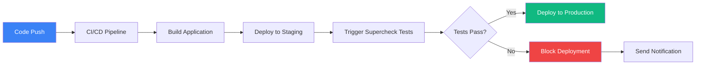
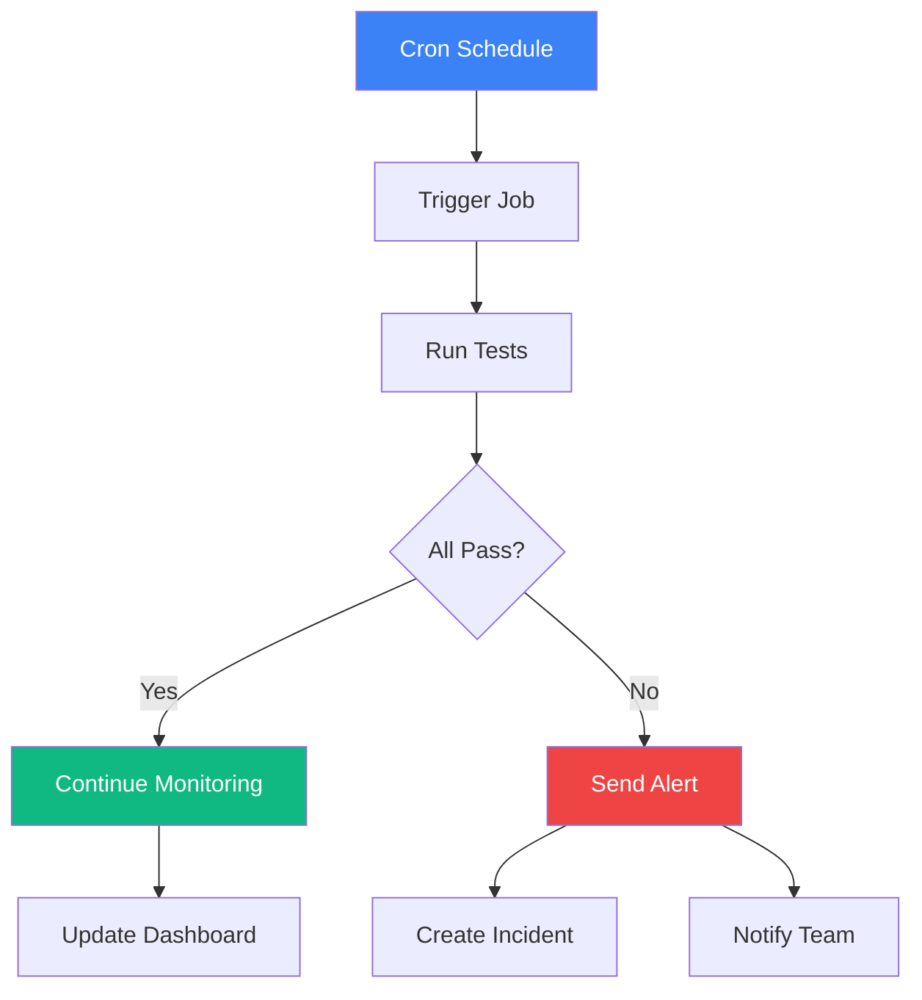
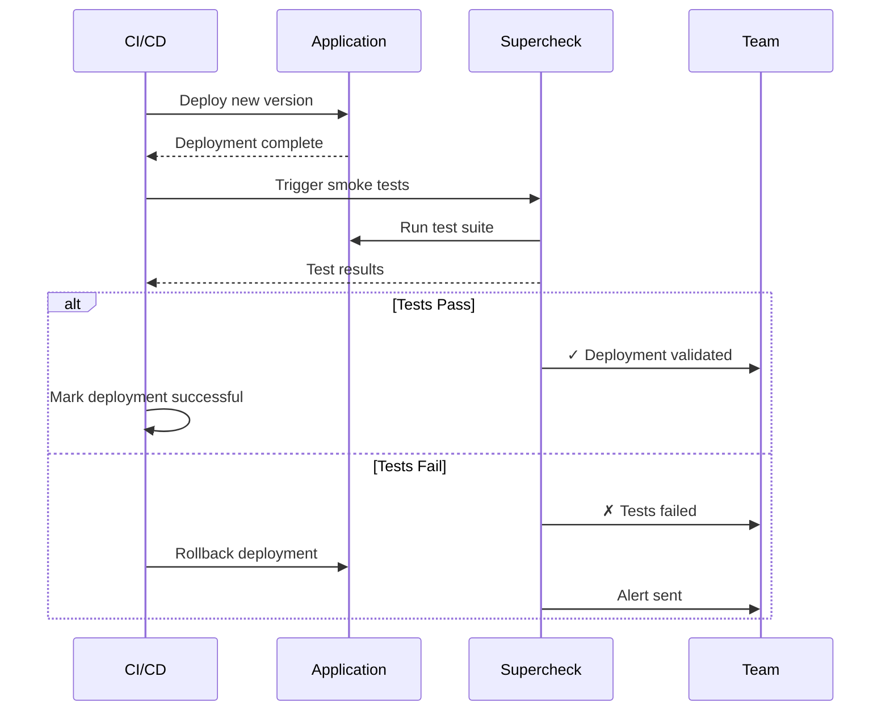

Connect Supercheck to your delivery workflow, CI/CD pipelines, and external tools—securely and predictably.

<Callout type="info">
  Use scoped API keys and webhooks to trigger jobs, fetch results, and push status where your team works.
</Callout>

## Overview

Pick the integration path that fits your team:

- **API**: Trigger jobs, fetch runs, and stream results.
- **CI/CD**: Gate deployments with jobs/tests in GitHub Actions, GitLab, Jenkins, and friends.
- **Webhooks**: Receive real-time notifications and pipe them to chat/incident tools.
- **Scoped Keys**: Job-scoped API keys with rotation and auditing.

## Integration Options

<Cards>
  <Card
    title="API Integration"
    description="Trigger jobs and access test results via REST API"
    href="./api-integration"
  />
  <Card
    title="CI/CD Integration"
    description="Integrate with GitHub Actions, GitLab CI, Jenkins, and more"
    href="./ci-cd"
  />
  <Card
    title="Webhooks"
    description="Receive real-time notifications via webhooks"
    href="./webhooks"
  />
</Cards>

## Common Patterns

### Continuous Testing

Run tests automatically on every code change:



### Scheduled Monitoring

Run tests on a schedule to catch regressions:



### Post-Deployment Validation

Verify deployment success with automated tests:



## Getting Started

### Step 1: Create an API Key

<Steps>
  <Step>Navigate to the Job you want to trigger remotely</Step>
  <Step>Go to the **API Keys** tab</Step>
  <Step>Click **Create API Key**</Step>
  <Step>Name your key (e.g., "GitHub Actions CI")</Step>
  <Step>Copy the generated API key (shown only once!)</Step>
  <Step>Store the key securely in your CI/CD secrets</Step>
</Steps>

### Step 2: Trigger Jobs via API

Use the API key to trigger jobs:

```bash
curl -X POST https://api.supercheck.io/jobs/{job-id}/trigger \
  -H "Authorization: Bearer YOUR_API_KEY" \
  -H "Content-Type: application/json"
```

### Step 3: Monitor Results

Poll for results or use webhooks for real-time updates:

```bash
# Get run status
curl https://api.supercheck.io/runs/{run-id} \
  -H "Authorization: Bearer YOUR_API_KEY"
```

## Security Best Practices

### API Key Management

<Steps>
  <Step>Never commit API keys to source control</Step>
  <Step>Store keys in CI/CD secrets or environment variables</Step>
  <Step>Use separate keys for different environments</Step>
  <Step>Rotate keys regularly</Step>
  <Step>Revoke unused or compromised keys immediately</Step>
</Steps>

### Access Control

- **Job-Specific Keys**: Each API key is scoped to a single job
- **Least Privilege**: Create separate keys for different purposes
- **Audit Trail**: All API requests are logged with key identifier
- **Expiration**: Set expiration dates for temporary access

## Integration Examples

### GitHub Actions

```yaml
name: Run Supercheck Tests
on: [push]

jobs:
  test:
    runs-on: ubuntu-latest
    steps:
      - name: Trigger Supercheck Job
        run: |
          curl -X POST https://api.supercheck.io/jobs/${{ secrets.JOB_ID }}/trigger \
            -H "Authorization: Bearer ${{ secrets.SUPERCHECK_API_KEY }}"
```

### GitLab CI

```yaml
test:
  stage: test
  script:
    - |
      curl -X POST https://api.supercheck.io/jobs/${JOB_ID}/trigger \
        -H "Authorization: Bearer ${SUPERCHECK_API_KEY}"
```

### Jenkins

```groovy
pipeline {
    agent any
    stages {
        stage('Test') {
            steps {
                sh '''
                    curl -X POST https://api.supercheck.io/jobs/${JOB_ID}/trigger \
                      -H "Authorization: Bearer ${SUPERCHECK_API_KEY}"
                '''
            }
        }
    }
}
```

## Webhook Integration

Receive real-time notifications:

<Steps>
  <Step>Configure webhook URL in notification settings</Step>
  <Step>Select events to receive (job completion, failures, etc.)</Step>
  <Step>Implement webhook endpoint to receive POST requests</Step>
  <Step>Process test results and take action</Step>
</Steps>

Example webhook payload:

```json
{
  "event": "job.completed",
  "job_id": "123e4567-e89b-12d3-a456-426614174000",
  "run_id": "987fcdeb-51a2-43f8-b123-456789abcdef",
  "status": "failed",
  "timestamp": "2024-01-15T10:30:00Z",
  "results": {
    "total_tests": 10,
    "passed": 8,
    "failed": 2,
    "duration_ms": 45000
  }
}
```

## Rate Limiting

API requests are rate limited to ensure system stability:

- **Default Limit**: 100 requests per hour per API key
- **Burst Limit**: 10 requests per minute
- **Headers**: Rate limit info returned in response headers

```
X-RateLimit-Limit: 100
X-RateLimit-Remaining: 95
X-RateLimit-Reset: 1642252800
```

## Troubleshooting

### Authentication Errors

<Callout type="warning">
  **401 Unauthorized**: Invalid or expired API key
</Callout>

**Solutions**:
- Verify API key is correct
- Check key hasn't been revoked
- Ensure key is enabled
- Verify key is for the correct job

### Rate Limit Exceeded

<Callout type="warning">
  **429 Too Many Requests**: Rate limit exceeded
</Callout>

**Solutions**:
- Implement exponential backoff
- Reduce request frequency
- Contact support for higher limits
- Use webhooks instead of polling

### Job Not Found

<Callout type="warning">
  **404 Not Found**: Job doesn't exist or no access
</Callout>

**Solutions**:
- Verify job ID is correct
- Check API key has access to this job
- Ensure job hasn't been deleted

## Related Features

<Cards>
  <Card
    title="API Reference"
    description="Complete API documentation"
    href="./api-integration"
  />
  <Card
    title="CI/CD Examples"
    description="Integration examples for popular CI/CD platforms"
    href="./ci-cd"
  />
  <Card
    title="Jobs"
    description="Learn about creating and managing jobs"
    href="../automate/jobs"
  />
</Cards>

## Need Help?

- **Integration Support**: Contact support for help with specific integrations
- **API Questions**: Review the API integration guide
- **Custom Workflows**: Reach out for complex integration scenarios
- **Support**: Email support@supercheck.io with integration questions
