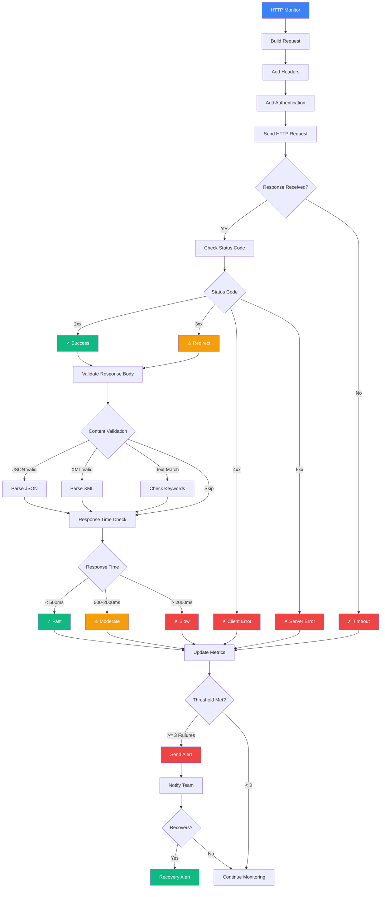
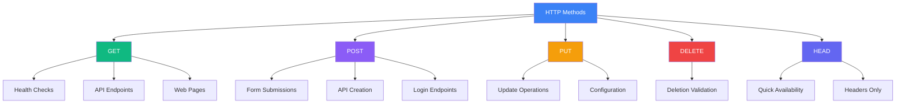
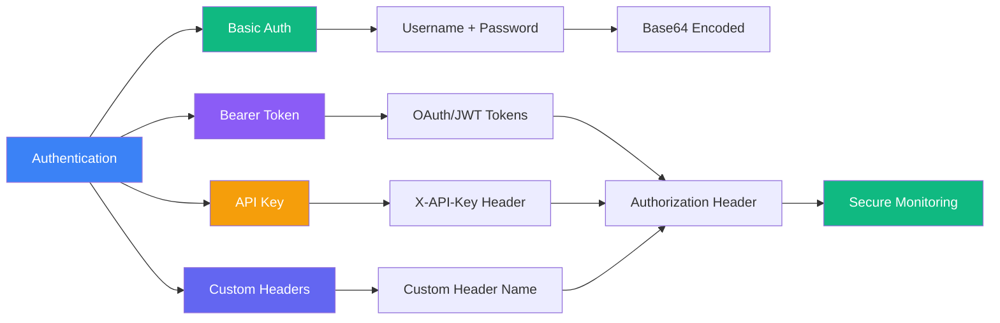

# HTTP Monitor

Monitor HTTP/HTTPS endpoints to ensure your APIs and web services are responding correctly.

## HTTP Monitoring Flow

## Features

- Request/response validation
- Custom headers and authentication
- Response time tracking
- Status code monitoring
- JSON/XML response validation

## Creating an HTTP Monitor

<Steps>
  <Step>Navigate to **Monitor → Create → HTTP Monitor**</Step>
  <Step>Configure your endpoint URL</Step>
  <Step>Set up request headers and authentication if needed</Step>
  <Step>Define success criteria (status codes, response validation)</Step>
  <Step>Set monitoring interval and locations</Step>
</Steps>

## Request Methods & Use Cases

## Authentication Types

## Best Practices

- Monitor critical API endpoints with appropriate HTTP methods
- Set appropriate timeout values based on endpoint complexity
  - Simple GET: 5-10 seconds
  - Complex POST: 15-30 seconds
- Use authentication when monitoring protected endpoints
- Validate response body content for critical APIs
- Monitor from multiple locations to detect regional issues
- Track response time trends for performance monitoring
- Configure alerts for consecutive failures (3+)
- Use HEAD requests for simple availability checks (faster)
- Set up proper success criteria (2xx status codes + content validation)
