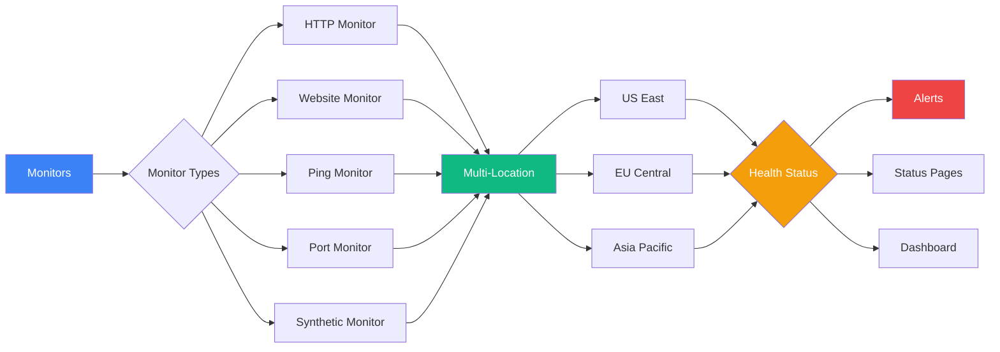

Monitor your services, APIs, and infrastructure 24/7 with real-time health checks, alerting, and multi-location monitoring capabilities.

<Callout type="info">
  Monitors run continuously at configurable intervals and send alerts when issues are detected.
</Callout>

## Overview

Supercheck's monitoring system provides comprehensive 24/7 monitoring with enterprise-grade reliability, security, and multi-location support for your services and infrastructure.

## Monitor Types

<Cards>
  <Card title="HTTP Monitor" description="Advanced HTTP/HTTPS endpoint monitoring" href="./http-monitor" />
  <Card title="Website Monitor" description="Simple website availability checking" href="./website-monitor" />
  <Card title="Ping Monitor" description="Network connectivity via ICMP ping" href="./ping-monitor" />
  <Card title="Port Monitor" description="TCP/UDP port availability monitoring" href="./port-monitor" />
  <Card title="Synthetic Monitor" description="Playwright-based user journey validation" href="./synthetic-monitor" />
</Cards>

## Key Features

- **Multi-Location Monitoring**: Check from US East, EU Central, and Asia Pacific
- **Real-time Alerts**: Instant notifications via multiple channels
- **SSL Certificate Tracking**: Automatic expiration monitoring
- **Smart Thresholds**: Prevent alert fatigue with consecutive failure logic

## Quick Start

<Steps>
  <Step>Choose a monitor type and create your first monitor</Step>
  <Step>Configure check frequency and location settings</Step>
  <Step>Set up alerts with threshold logic</Step>
  <Step>Monitor real-time results and uptime trends</Step>
</Steps>
