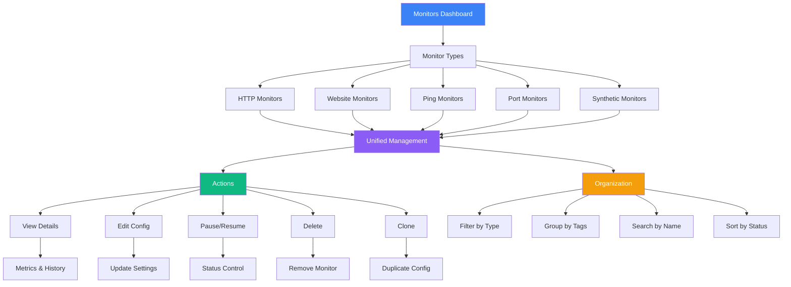
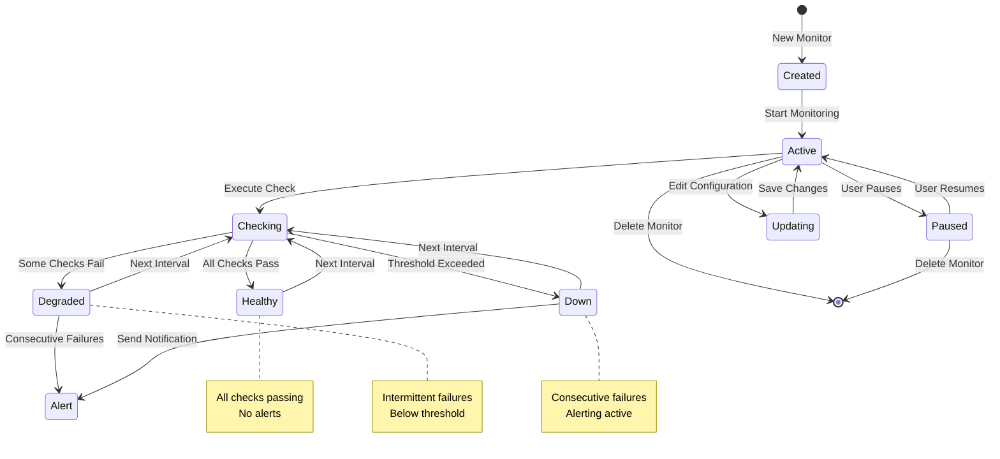
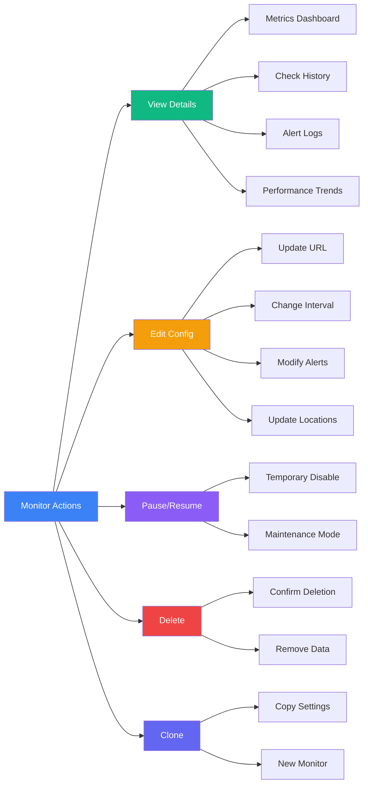
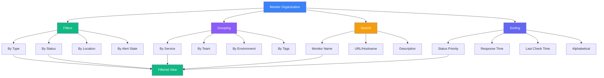

# Monitors

The Monitors page provides a centralized view of all your active monitors across all types.

## Monitor Management Architecture

## Monitor Dashboard

View all your monitors in one place:

- Monitor status and health
- Recent check results
- Response times and trends
- Alert history
- Configuration details

## Monitor Lifecycle

## Monitor Actions

## Organization & Filtering

## Best Practices

- **Naming**: Use descriptive monitor names that clearly identify what's being monitored
  - Good: "Production API - User Service"
  - Bad: "Monitor 1"
- **Tagging**: Tag monitors by service, team, or environment for easy filtering
  - `service:api`, `team:backend`, `env:production`
- **Review**: Regularly review monitor performance and adjust thresholds
  - Check for false positives
  - Adjust failure thresholds based on actual patterns
- **Cleanup**: Remove or pause unused monitors to reduce noise
- **Alert Routing**: Set up proper alert routing to notify the right teams
  - Use tags to route alerts to specific channels
  - Configure escalation policies
- **Documentation**: Add descriptions to monitors explaining their purpose
- **Maintenance**: Use pause feature during planned maintenance windows
