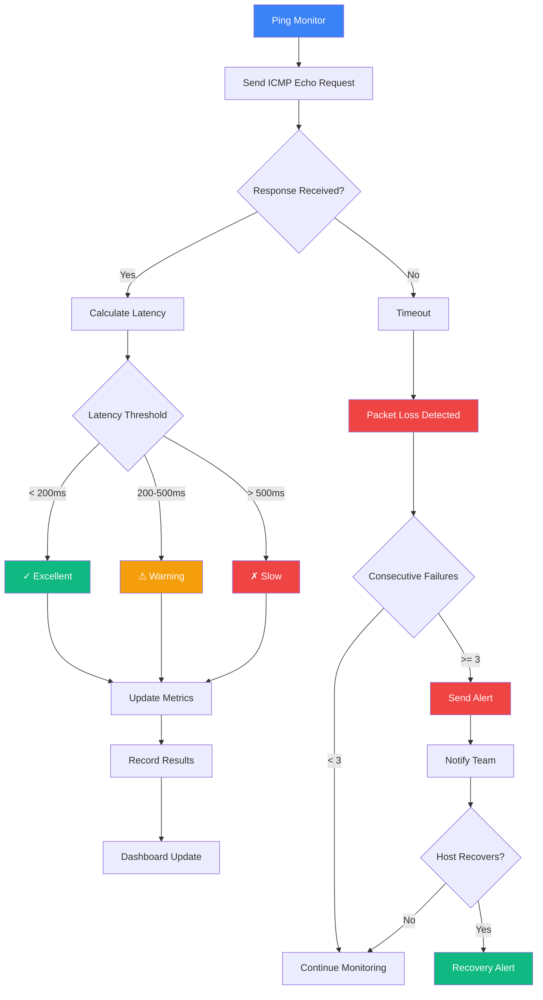
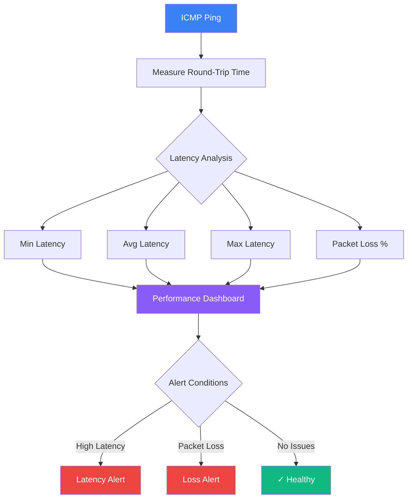

title: Ping Monitor
description: Monitor host availability via ICMP ping
icon: Radio
---

# Ping Monitor

Monitor network connectivity and host availability using ICMP ping.

## Ping Monitoring Flow

## Features

- ICMP ping monitoring
- Latency tracking
- Packet loss detection
- Network diagnostics
- Multi-location testing

## Creating a Ping Monitor

<Steps>
  <Step>Navigate to **Monitor → Create → Ping Monitor**</Step>
  <Step>Enter the hostname or IP address</Step>
  <Step>Configure ping interval (1-60 minutes)</Step>
  <Step>Set packet count and timeout</Step>
  <Step>Choose monitoring locations (US East, EU Central, Asia Pacific)</Step>
</Steps>

## Latency Metrics

## Best Practices

- Monitor critical infrastructure
- Set appropriate timeout values (5-10 seconds)
- Monitor from multiple geographic locations
- Track latency trends over time
- Set packet count to 3-5 for reliability
- Configure alerts for consecutive failures (3+)
