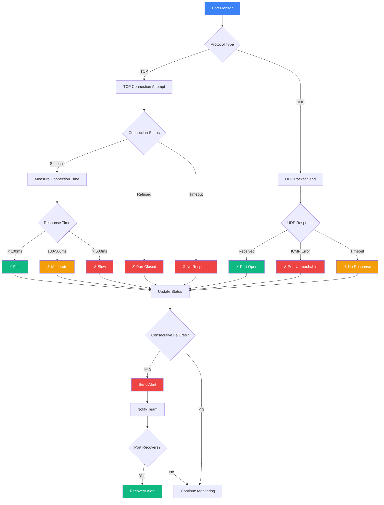
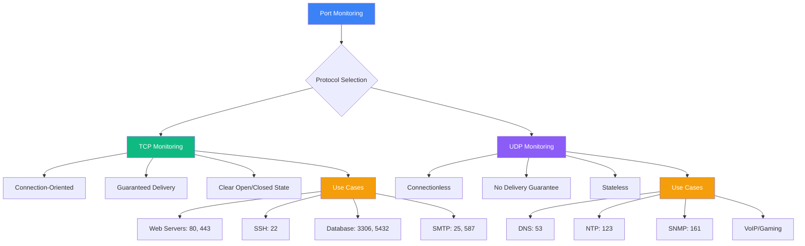

# Port Monitor

Monitor TCP/UDP ports to ensure your services are accessible on the network.

## Port Monitoring Flow

## Features

- TCP/UDP port checking
- Connection time monitoring
- Service availability tracking
- Protocol validation
- Multi-location testing

## Creating a Port Monitor

<Steps>
  <Step>Navigate to **Monitor → Create → Port Monitor**</Step>
  <Step>Enter hostname/IP and port number</Step>
  <Step>Select protocol (TCP/UDP)</Step>
  <Step>Configure check interval (1-60 minutes)</Step>
  <Step>Set timeout and retry settings</Step>
</Steps>

## Protocol Comparison

## Best Practices

- Monitor critical service ports (80, 443, 22, 3306, etc.)
- Set appropriate timeouts based on protocol
  - TCP: 5-10 seconds
  - UDP: 10-15 seconds (stateless nature)
- Monitor from multiple locations to detect regional issues
- Track connection time trends for performance insights
- Use TCP for most services (more reliable)
- Use UDP for DNS, NTP, and other stateless protocols
- Configure alerts for consecutive failures (3+)
