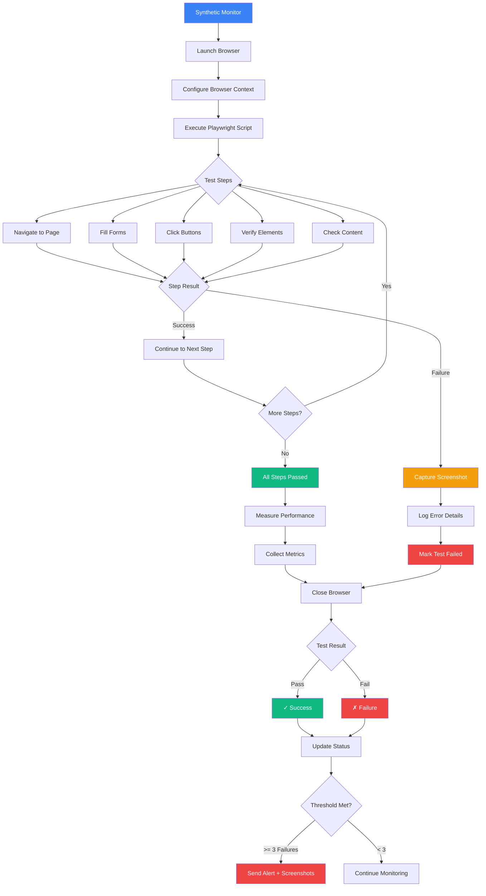
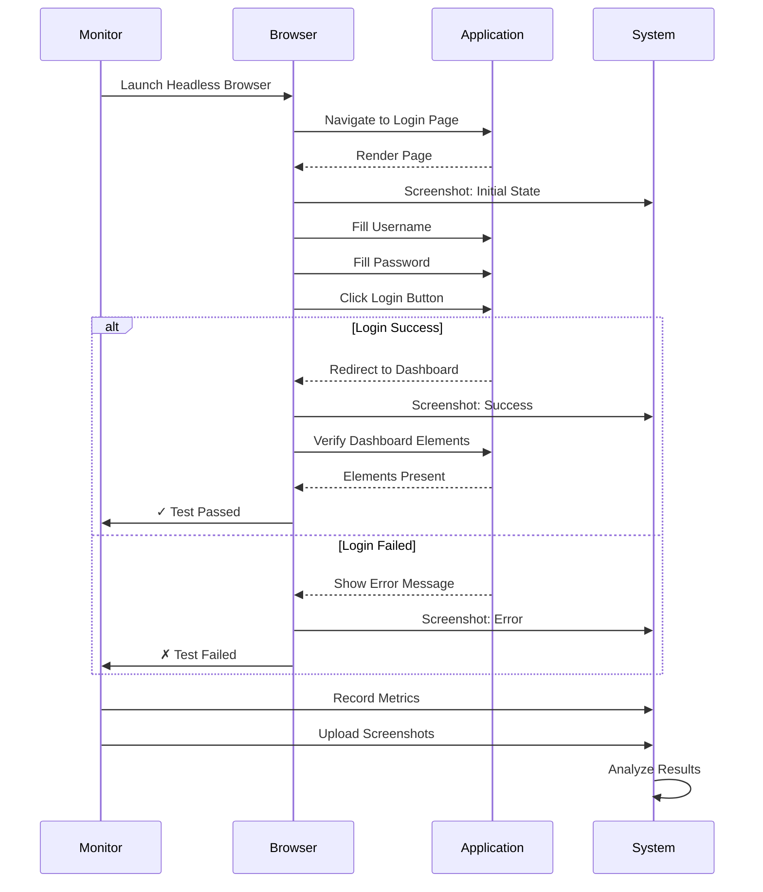
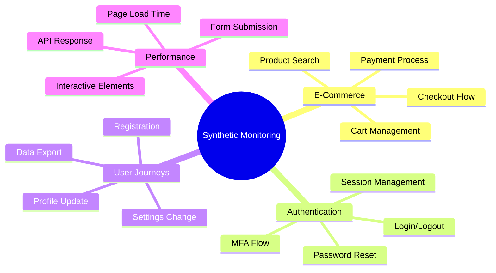

# Synthetic Monitor

Run automated browser-based tests to monitor user journeys and complex workflows.

## Synthetic Monitoring Flow

## Features

- Browser automation with Playwright
- Real user journey testing
- Screenshot capture on failures
- Performance metrics
- Multi-step workflow testing

## Creating a Synthetic Monitor

<Steps>
  <Step>Navigate to **Monitor → Create → Synthetic Monitor**</Step>
  <Step>Write your Playwright test script</Step>
  <Step>Configure execution schedule</Step>
  <Step>Set success criteria</Step>
  <Step>Choose browser and device settings</Step>
</Steps>

## User Journey Testing

## Common Use Cases

## Best Practices

- Test critical user journeys end-to-end
- Keep tests focused and maintainable (single responsibility)
- Use appropriate wait strategies
  - `waitForLoadState('networkidle')` for SPAs
  - `waitForSelector()` for dynamic content
  - Avoid fixed `wait()` calls
- Monitor from relevant geographic locations
- Review screenshots on failures for debugging
- Set realistic timeouts (30-60 seconds for complex flows)
- Use descriptive test names and comments
- Configure alerts for consecutive failures (3+)
- Capture performance metrics (FCP, LCP, TTI)
