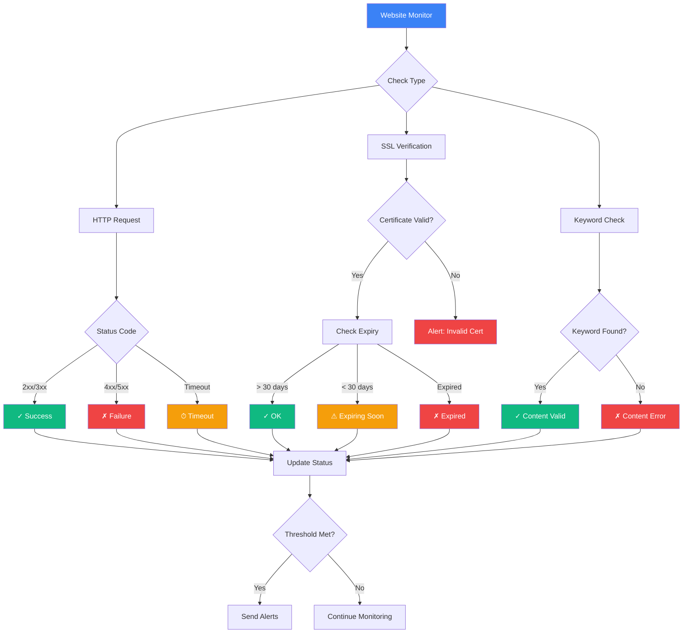

# Website Monitor

Monitor your websites to ensure they're accessible and performing well for your users.

## Website Monitoring Flow

## Features

- Page load time monitoring
- Content verification
- SSL certificate monitoring
- Response code tracking
- Performance metrics

## Creating a Website Monitor

### Configuration Steps

<Steps>
  <Step>Navigate to **Monitor → Create → Website Monitor**</Step>
  <Step>Enter your website URL</Step>
  <Step>Configure check intervals (1-60 minutes)</Step>
  <Step>Set up alerts for downtime</Step>
  <Step>Choose monitoring locations (US East, EU Central, Asia Pacific)</Step>
</Steps>

## Best Practices

- Monitor from multiple geographic locations
- Set realistic timeout thresholds
- Monitor SSL certificate expiration
- Track performance trends over time
