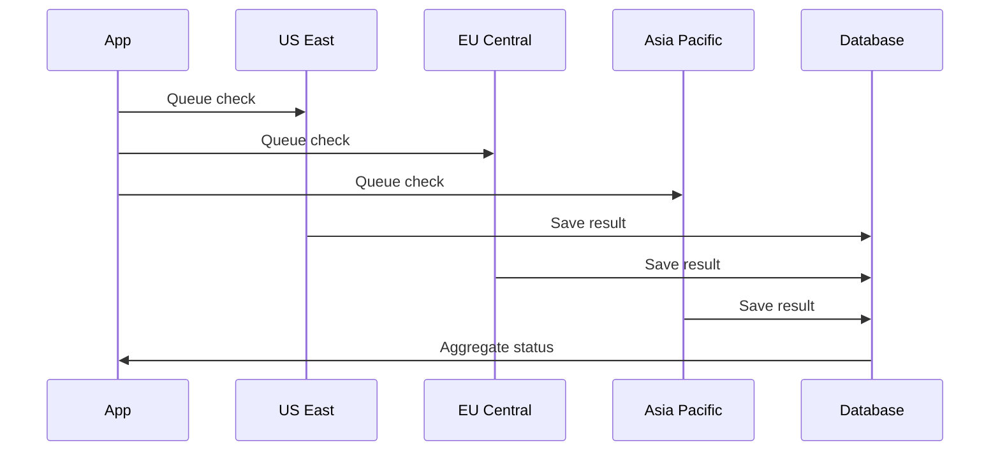

Monitors continuously check your services and alert you when issues occur. Run checks from multiple geographic regions to detect localized outages and ensure global availability.

## Monitor Types

Supercheck offers five monitor types, each designed for specific use cases:

<Cards>
<Card icon={<ArrowLeftRight className="text-teal-600" />} title="HTTP Monitor">
Full-featured API and endpoint monitoring with custom headers, authentication, and response validation
</Card>

<Card icon={<LaptopMinimal className="text-sky-600" />} title="Website Monitor">
Simple website availability checks with SSL certificate expiration tracking
</Card>

<Card icon={<ChevronsLeftRightEllipsis className="text-cyan-600" />} title="Ping Monitor">
Network-level ICMP ping checks for server availability and latency measurement
</Card>

<Card icon={<EthernetPort className="text-blue-600" />} title="Port Monitor">
TCP/UDP port checks to verify that specific services are accepting connections
</Card>

<Card icon={<Laptop className="text-purple-600" />} title="Synthetic Monitor">
Run full Playwright browser tests on a schedule to validate complete user journeys
</Card>
</Cards>

## HTTP Monitor

The most versatile monitor type for APIs and web services.

**What it checks:**
- HTTP/HTTPS endpoint availability
- Response status codes (2xx, 3xx, 4xx, 5xx)
- Response time and latency
- Response body content (keyword validation)
- JSON response structure (JSON path validation)
- SSL certificate validity and expiration

**Configuration options:**
- **HTTP Method** — GET, POST, PUT, DELETE, PATCH, HEAD, OPTIONS
- **Custom Headers** — Add authentication tokens, API keys, or custom headers
- **Request Body** — Send JSON or form data for POST/PUT requests
- **Authentication** — Basic Auth or Bearer Token support
- **Expected Status** — Validate specific status codes or ranges
- **Keyword Validation** — Check for presence or absence of text in response

<Callout type="info">
Use HTTP monitors for APIs, health check endpoints, and any service that responds to HTTP requests.
</Callout>

## Website Monitor

Simplified monitoring for web pages with built-in SSL tracking.

**What it checks:**
- Page loads successfully (HTTP 200)
- SSL certificate is valid
- SSL certificate expiration date
- Optional keyword presence on page

**Best for:**
- Marketing websites
- Landing pages
- Public-facing web applications
- SSL certificate expiration alerts

## Ping Monitor

Network-level monitoring using ICMP ping.

**What it checks:**
- Host is reachable on the network
- Round-trip latency (response time)
- Packet loss percentage

**Best for:**
- Server availability
- Network infrastructure
- VPN endpoints
- Internal services

<Callout type="warning">
Some cloud providers and firewalls block ICMP traffic. If ping monitors fail unexpectedly, verify that ICMP is allowed on your target host.
</Callout>

## Port Monitor

Verify that specific services are listening on expected ports.

**What it checks:**
- TCP or UDP port is open and accepting connections
- Connection can be established within timeout
- Service is responding on the specified port

**Best for:**
- Database servers (PostgreSQL 5432, MySQL 3306)
- Cache servers (Redis 6379, Memcached 11211)
- Mail servers (SMTP 25/587, IMAP 993)
- Custom services on non-standard ports

## Synthetic Monitor

Run full Playwright browser tests on a schedule to validate complete user flows.

**What it checks:**
- Complete user journeys (login, checkout, form submission)
- JavaScript-rendered content
- Multi-step workflows
- Visual elements and interactions

**Best for:**
- Critical user flows (login, signup, checkout)
- Single-page applications (SPAs)
- Complex workflows requiring browser interaction
- End-to-end validation of user experience

**How it works:**
1. Create a Playwright test in the [Playground](/docs/automate/playground)
2. Save the test to your project
3. Create a Synthetic Monitor and select your test
4. Set the check interval (minimum 5 minutes recommended)
5. Monitor runs your test and reports pass/fail status

<Callout type="info">
Set synthetic monitor intervals longer than your test execution time to prevent overlapping runs. For a test that takes 2 minutes, use a 5+ minute interval.
</Callout>

📚 [Playwright Documentation](https://playwright.dev/docs/intro) — Learn more about writing browser tests

## Multi-Region Monitoring

Run checks from multiple geographic locations to detect regional outages and measure latency from different parts of the world.

### Available Regions

| Region | Location |
|--------|----------|
| **US East** | Ashburn, Virginia, USA |
| **EU Central** | Nuremberg, Germany |
| **Asia Pacific** | Singapore |

### How Multi-Region Works

When you enable multiple regions, checks run independently from each location and results are aggregated to determine overall status.

**Status calculation:** Once all locations report, the system calculates overall status. A monitor is "Up" if the majority of locations report success.

<Callout type="info">
**Self-Hosted Deployments**: In self-hosted mode, all region selections execute from your single worker location. The multi-region selector is available for configuration consistency, but checks run sequentially from one location. For true geographic distribution, deploy workers in multiple regions.
</Callout>

## Alert Configuration

Configure when and how you receive notifications about monitor status changes.

### Alert Settings

| Setting | Description | Recommended |
|---------|-------------|-------------|
| **Enable Alerts** | Turn notifications on/off for this monitor | On for production services |
| **Alert on Failure** | Notify when monitor exceeds failure threshold | Always enable |
| **Alert on Recovery** | Notify when monitor returns to healthy state | Enable for critical services |
| **Failure Threshold** | Consecutive failures before alerting (1-5) | 2-3 to avoid false positives |
| **Recovery Threshold** | Consecutive successes before recovery alert (1-5) | 2 to confirm stability |
| **Notification Channels** | Which providers receive alerts | Multiple channels for critical services |

### Threshold Logic

Thresholds prevent alert fatigue from transient issues:

<Tabs items={['How It Works', 'Example']}>
<Tab value="How It Works">

**Failure Threshold**

The number of consecutive failures required before sending the first failure alert. This prevents alerts from single network blips.

**Recovery Threshold**

The number of consecutive successes required before sending a recovery alert. This ensures the service is truly stable before confirming recovery.

**Alert Limiting**

- Maximum **3 alerts** per failure or recovery sequence
- Counter resets when status changes

</Tab>
<Tab value="Example">

**Configuration:** Failure Threshold = 3, Recovery Threshold = 2

| Check | Result | Consecutive Count | Alert Sent |
|-------|--------|-------------------|------------|
| 1 | ❌ Fail | 1 failure | — |
| 2 | ❌ Fail | 2 failures | — |
| 3 | ❌ Fail | 3 failures ✓ | **Failure Alert** |
| 4 | ❌ Fail | 4 failures | — |
| 5 | ✅ Pass | 1 success | — |
| 6 | ✅ Pass | 2 successes ✓ | **Recovery Alert** |

</Tab>
</Tabs>

<Callout type="info">
A threshold of 2-3 works well for most services. Use 1 only for extremely critical services where any failure requires immediate attention.
</Callout>

## Monitor Details Page

The monitor details page provides comprehensive visibility into your monitor's health, performance, and history.

### Header Section

The header displays essential monitor information at a glance:

- **Monitor Name** — The name you assigned to the monitor
- **Test ID** — For synthetic monitors, shows the linked Playwright test ID (click to copy)
- **Action Buttons** — Quick access to Pause, Edit, Delete, and **AI Analyze** operations

### AI Analyze

Click **AI Analyze** in the header to generate an AI-powered analysis report for your monitor.

**What AI Analyze Provides:**
- **Health Assessment** — Clear status summary based on actual metrics
- **Performance Analysis** — Response time trends using your monitor's exact data
- **Issue Diagnosis** — Root cause analysis with specific error messages and timestamps
- **Recommendations** — Actionable next steps based on observed issues (only when problems exist)

<Callout type="info">
AI Analyze requires an OpenAI API key configured in your environment. See [Deployment](/docs/deployment/self-hosted) for configuration.
</Callout>

### Key Metrics Bar

Eight key metrics are displayed prominently below the header:

| Metric | Description |
|--------|-------------|
| **Status** | Current monitor status (Up, Down, Paused, Pending, Maintenance, Error) |
| **Interval** | How frequently checks run (e.g., 5m, 15m) |
| **Resp Time** | Latest response time from the most recent check |
| **Uptime (24h)** | Percentage of successful checks in the last 24 hours |
| **Avg Resp (24h)** | Average response time over the last 24 hours |
| **P95 Resp (24h)** | 95th percentile response time (24h) — shows worst-case latency |
| **Uptime (30d)** | Percentage of successful checks in the last 30 days |
| **Avg Resp (30d)** | Average response time over the last 30 days |
| **P95 Resp (30d)** | 95th percentile response time (30d) — long-term performance indicator |

<Callout type="info">
**P95 Response Time** represents the response time that 95% of your checks complete within. This metric helps identify tail latency issues that averages might hide.
</Callout>

### Availability Overview

A visual bar chart showing the status of the last 100 individual checks:

- **Green bars** — Successful checks (monitor was up)
- **Red bars** — Failed checks (monitor was down)
- **Location Filter** — Filter by specific region or view all locations combined

This visualization helps you quickly identify patterns like intermittent failures or sustained outages.

### Response Time Chart

An interactive line chart displaying response times over time:

- **100 Data Points** — Shows the most recent 100 check results
- **Multi-Location Lines** — Different colored lines for each monitoring region
- **Hover Details** — View exact response time and timestamp on hover
- **Visual Patterns** — Identify latency spikes, trends, and anomalies

The chart helps you spot performance degradation before it impacts users.

### Recent Check Results Table

A paginated table showing detailed results for each check:

| Column | Description |
|--------|-------------|
| **Result** | Pass (✓) or Fail (✗) indicator |
| **Checked At** | When the check was performed (relative time) |
| **Location** | Which region performed the check (with flag icon) |
| **Response Time** | How long the check took |
| **Error** | For failed checks, shows the error message or links to report |

**Features:**
- **Pagination** — Navigate through historical results (10 per page)
- **Date Filter** — Filter results by specific date
- **Location Filter** — View results from a specific region only

## Monitor Reports

For **Synthetic Monitors**, detailed reports are generated when checks fail. Access reports by clicking the report icon in the **Error** column of the Recent Check Results table.

### Report Contents

| Section | Description |
|---------|-------------|
| **Test Summary** | Test name, file path, browser used, and execution duration |
| **Error Details** | Assertion failures with expected vs received values and stack trace |
| **Test Steps** | Timeline of all actions with pass/fail status and timing |
| **View Trace** | Opens trace viewer with video recording, screenshots, and network logs |

<Callout type="info">
Use **Copy Prompt** to copy error details for AI-assisted debugging.
</Callout>

## Monitor Status

| Status | Meaning | Action |
|--------|---------|--------|
| **Up** | All checks passing | No action needed |
| **Down** | Failure threshold exceeded | Alerts sent, investigate immediately |
| **Paused** | Monitoring disabled | Re-enable when ready |
| **Pending** | Initial check in progress | Wait for first result |
| **Maintenance** | Under maintenance | Monitor temporarily disabled |
| **Error** | Configuration or system error | Fix monitor configuration |

## Check Intervals

| Interval | Best For | Notes |
|----------|----------|-------|
| **1 minute** | Critical production APIs | Fastest detection, highest resource usage |
| **5 minutes** | Standard production services | Good balance of speed and efficiency |
| **15 minutes** | Less critical services | Reduced resource usage |
| **30-60 minutes** | Low-priority or development | Minimal resource usage |

<Callout type="info">
**Synthetic Monitors**: Minimum interval is 5 minutes to prevent overlapping Playwright executions. Set intervals longer than your test execution time—for a 2-minute test, use 5+ minute intervals.
</Callout>

## Tags

Organize monitors with color-coded tags for easy filtering and categorization.

- **Create tags** — Add custom tags with any of 8 available colors
- **Filter by tags** — Quickly find monitors by tag in the list view
- **Bulk operations** — Apply or remove tags from multiple monitors

Tags are project-scoped, so each project can have its own tagging system.
