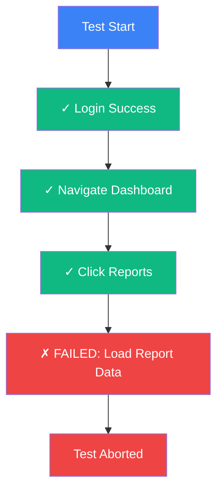
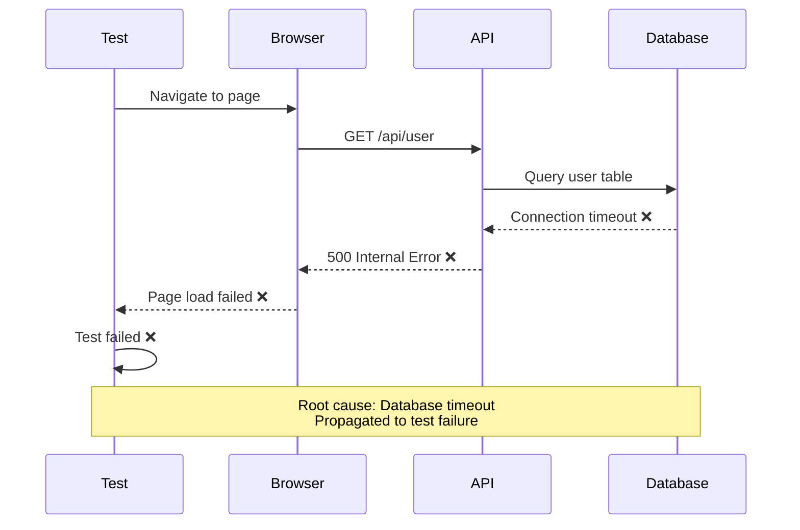

# Debugging with Traces

Use distributed tracing to quickly identify and fix test failures with detailed execution context.

<Callout type="info">
  Traces provide much more context than traditional logs, showing exactly what happened, when, and why.
</Callout>

## Why Trace-Based Debugging?

Traditional debugging challenges:
- Scattered logs across multiple systems
- Missing context around failures
- Difficult to reproduce issues
- Limited visibility into async operations

Trace-based debugging provides:
- **Complete Context**: Full execution history
- **Visual Timeline**: See exact sequence of events
- **Error Pinpointing**: Identify exact failure point
- **Network Visibility**: All HTTP requests and responses
- **Performance Data**: Identify if slowness contributed to failure

## Debugging Workflow

### Step 1: Find the Failed Trace

<Steps>
  <Step>Navigate to **Observe → Traces**</Step>
  <Step>Filter by **Status: Failed** or **Status: Error**</Step>
  <Step>Filter by time range when failure occurred</Step>
  <Step>Click the failed trace to open details</Step>
</Steps>

### Step 2: Identify the Failure Point

Look for the first failed span (usually marked in red):



### Step 3: Analyze Error Details

Click the failed span to see:
- **Error Message**: What went wrong
- **Stack Trace**: Where in the code it failed
- **Attributes**: Context like URL, status code, selectors
- **Events**: Logs leading up to the failure

### Step 4: Review Timeline

Check what happened before the failure:
1. Were there slow operations?
2. Did any network requests fail?
3. Was there unusual timing?
4. Were there errors in earlier spans?

### Step 5: Compare with Successful Run

Find a successful run of the same test and compare:
- Timing differences
- Response payloads
- Network requests
- Page state

## Common Failure Patterns

### Element Not Found

**Symptom**: Test fails trying to interact with an element

**Trace Indicators**:
```
Span: Click Button
Status: Error
Error Message: Element not found: button[type="submit"]
Duration: 30.0s (timeout)
```

**Debugging Steps**:
<Steps>
  <Step>Check screenshot at time of failure</Step>
  <Step>Review previous navigation - did page load?</Step>
  <Step>Check network spans - were there failed requests?</Step>
  <Step>Look for timing issues - did element load after timeout?</Step>
  <Step>Verify selector is correct</Step>
</Steps>

**Common Causes**:
- Element takes longer than timeout to appear
- Selector changed due to code deployment
- JavaScript error preventing element from rendering
- Network request failed, page didn't fully load

### API Request Failed

**Symptom**: HTTP request returns error status

**Trace Indicators**:
```
Span: HTTP POST /api/users
Status: Error
http.status_code: 500
http.response_body: "Internal Server Error"
Duration: 2.3s
```

**Debugging Steps**:
<Steps>
  <Step>Check status code (4xx vs 5xx)</Step>
  <Step>Review request payload in span attributes</Step>
  <Step>Check response body for error message</Step>
  <Step>Review prior spans - was authentication successful?</Step>
  <Step>Check if API is down (other tests failing?)</Step>
</Steps>

**Common Causes**:
- API deployment introduced regression
- Authentication token expired
- Request payload validation failed
- Database connectivity issues
- Rate limiting

### Timeout Error

**Symptom**: Operation exceeds timeout limit

**Trace Indicators**:
```
Span: Wait for Element
Status: Error
Error Message: Timeout 30000ms exceeded
Duration: 30.0s
```

**Debugging Steps**:
<Steps>
  <Step>Review timeline - what was happening during timeout?</Step>
  <Step>Check if network requests were stuck</Step>
  <Step>Look for infinite loading states</Step>
  <Step>Verify element selector and conditions</Step>
  <Step>Check for performance issues in prior spans</Step>
</Steps>

**Common Causes**:
- Element never appears due to code bug
- Network requests hanging
- Page stuck in loading state
- Resource loading failures
- Overly strict wait conditions

### Assertion Failure

**Symptom**: Test validation fails

**Trace Indicators**:
```
Span: Expect Text
Status: Error
Error Message: Expected "Welcome, John" but found "Welcome, Guest"
expected: "Welcome, John"
actual: "Welcome, Guest"
```

**Debugging Steps**:
<Steps>
  <Step>Review expected vs actual values</Step>
  <Step>Check prior operations - did login succeed?</Step>
  <Step>Look for data issues in network responses</Step>
  <Step>Verify test data setup was successful</Step>
  <Step>Check for timing issues (data not loaded yet)</Step>
</Steps>

**Common Causes**:
- Test data not properly initialized
- Race condition (assertion ran before data loaded)
- Code change modified expected behavior
- Environment-specific data differences

## Advanced Debugging Techniques

### Network Waterfall Analysis

Review all network requests in timeline order:

<Steps>
  <Step>Filter spans to show only network requests</Step>
  <Step>Sort by start time</Step>
  <Step>Check for failed requests (4xx, 5xx)</Step>
  <Step>Identify slow requests (>1s)</Step>
  <Step>Look for sequential calls that could be parallel</Step>
</Steps>

### Error Propagation

Trace how errors propagate through the system:



### Comparing Multiple Failures

When multiple tests fail:
1. Open traces for each failed test
2. Look for common patterns
3. Identify shared failed spans
4. Determine if it's environment-wide issue

## Using Attributes for Debugging

### Key Attributes to Check

**For Browser Tests**:
- `page.url` - Was test on correct page?
- `element.selector` - Was selector correct?
- `screenshot.url` - Visual evidence
- `page.title` - Did page load correctly?

**For API Tests**:
- `http.url` - Correct endpoint?
- `http.method` - Right HTTP method?
- `http.request_body` - Valid payload?
- `http.response_body` - Error details
- `http.status_code` - What went wrong?

**For All Tests**:
- `error.message` - Primary error
- `error.stack` - Code location
- `trigger.type` - Manual vs Scheduled (timing dependent?)
- `environment` - Production vs Staging difference?

## Debugging Checklist

When investigating a failed test:

- [ ] Identify the first failed span
- [ ] Read the error message carefully
- [ ] Check screenshot (if browser test)
- [ ] Review network requests before failure
- [ ] Compare timing with successful runs
- [ ] Check for environmental differences
- [ ] Verify test data and setup
- [ ] Look for code changes that coincide with failure
- [ ] Check if other tests are failing similarly
- [ ] Review span attributes for additional context

## Root Cause Analysis

### Categorizing Failures

**Test Issues** (Fix the test):
- Incorrect selectors
- Flaky waits/timing
- Bad assertions
- Test data problems

**Application Issues** (Fix the app):
- Actual bugs in the application
- API errors
- Performance degradation
- Missing functionality

**Environment Issues** (Fix infrastructure):
- Service outages
- Network problems
- Database connectivity
- Third-party API failures

### Determining Root Cause

<Steps>
  <Step>Gather evidence from trace attributes and timeline</Step>
  <Step>Reproduce the issue if possible</Step>
  <Step>Isolate the specific failing operation</Step>
  <Step>Identify what changed (code, data, environment)</Step>
  <Step>Categorize as test, app, or environment issue</Step>
  <Step>Create action plan to fix</Step>
</Steps>

## Best Practices

### Proactive Debugging

Don't wait for failures:
- Review traces of passing tests periodically
- Look for warning signs (slow operations, near-timeouts)
- Set up alerts for performance degradation
- Compare baseline traces with current runs

### Collaborative Debugging

Share traces with your team:
1. Copy trace URL
2. Share with team members
3. Point out specific spans of interest
4. Discuss findings in trace comments

### Documentation

Document recurring issues:
- Create runbook entries
- Link to example traces
- Document resolution steps
- Track patterns over time

## AI-Powered Fix Suggestions

For failed tests, Supercheck can suggest fixes:

<Steps>
  <Step>View failed test run</Step>
  <Step>Click **AI Fix** button</Step>
  <Step>Review suggested fixes based on trace analysis</Step>
  <Step>Apply fix and re-run test</Step>
</Steps>

The AI analyzes:
- Error messages from trace
- Network failures
- Element selectors
- Timing issues
- Common failure patterns

## Related Features

<Cards>
  <Card
    title="View Traces"
    description="Explore detailed execution traces"
    href="./traces"
  />
  <Card
    title="Runs"
    description="See all test runs and their results"
    href="../automate/runs"
  />
  <Card
    title="AI Fix"
    description="Get intelligent fix suggestions"
    href="../automate/tests#ai-powered-fixes"
  />
</Cards>

## Need Help?

- **Complex Failures**: Reach out to support with trace URL
- **Performance Issues**: Share trace for performance analysis
- **Pattern Analysis**: Support can help identify recurring issues
- **Support**: Contact support@supercheck.io with trace links
