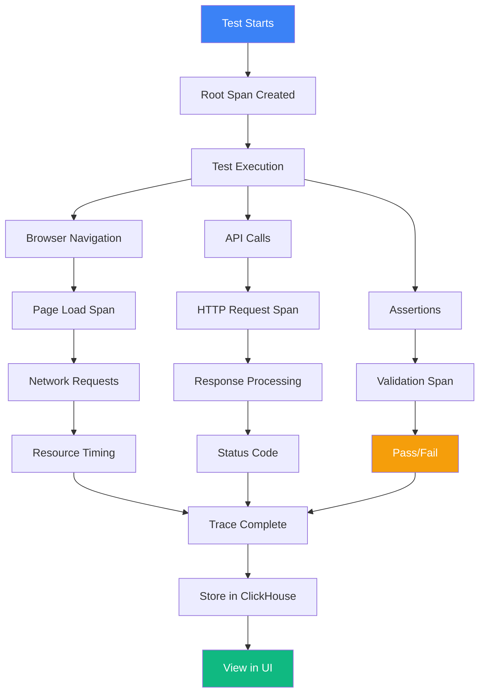

Monitor and debug your tests with comprehensive distributed tracing and observability powered by OpenTelemetry.

<Callout type="info">
  Observability provides detailed insights into test execution, helping you identify performance bottlenecks and debug failures faster.
</Callout>

## Overview

Supercheck's observability features provide:

- **Distributed Tracing**: Visualize end-to-end test execution flow
- **Performance Insights**: Identify slow operations and bottlenecks
- **Error Tracking**: Pinpoint exact failure points with detailed context
- **Network Analysis**: See all HTTP requests and responses
- **Timeline Visualization**: Understand execution sequence and timing

## Key Features

<Cards>
  <Card
    title="Traces"
    description="View detailed execution traces for every test run"
    href="./traces"
  />
  <Card
    title="Debugging"
    description="Debug test failures with comprehensive execution context"
    href="./debugging"
  />
</Cards>

## What is Distributed Tracing?

Distributed tracing tracks the complete journey of a test execution, from start to finish, capturing:

- **Spans**: Individual operations (page navigation, API calls, assertions)
- **Timeline**: When each operation started and how long it took
- **Attributes**: Metadata like URLs, status codes, error messages
- **Relationships**: Parent-child relationships between operations

## How It Works

## Use Cases

### Debugging Test Failures

When a test fails, traces show you:
1. Exactly which step failed
2. The error message and stack trace
3. Network requests before the failure
4. Page state at time of failure
5. Performance metrics for each operation

### Performance Optimization

Identify bottlenecks by:
1. Viewing operation durations
2. Comparing execution times across runs
3. Identifying slow network requests
4. Finding inefficient test steps
5. Tracking resource loading times

### Understanding Test Behavior

Gain insights into:
1. Complete execution flow
2. Network traffic patterns
3. Third-party API dependencies
4. Browser resource loading
5. Assertion timing and logic

## Observability Stack

Supercheck uses industry-standard observability tools:

- **OpenTelemetry**: Standard for distributed tracing and metrics
- **ClickHouse**: High-performance database for trace storage
- **Custom UI**: Purpose-built interface for test trace analysis

## Getting Started

<Steps>
  <Step>Run any test in Supercheck</Step>
  <Step>Navigate to **Observe → Traces**</Step>
  <Step>Find your test run in the trace list</Step>
  <Step>Click to view detailed execution trace</Step>
  <Step>Analyze timeline, spans, and attributes</Step>
</Steps>

## Trace Retention

Traces are retained based on your plan:
- **Free**: 7 days
- **Pro**: 30 days
- **Enterprise**: 90 days (configurable)

## Privacy and Security

- **Project Isolation**: Traces are isolated per project
- **No Sensitive Data**: Passwords and secrets are automatically redacted
- **Role-Based Access**: Only authorized users can view traces
- **Encrypted Storage**: All traces encrypted at rest

## Next Steps

<Cards>
  <Card
    title="View Traces"
    description="Explore execution traces for your tests"
    href="./traces"
  />
  <Card
    title="Debug Failures"
    description="Learn how to debug test failures with traces"
    href="./debugging"
  />
  <Card
    title="Automate Tests"
    description="Create tests that generate traces"
    href="../automate"
  />
</Cards>

## Need Help?

- **Trace Analysis**: Review the debugging guide for tips on analyzing traces
- **Performance Tuning**: Use traces to identify and fix performance issues
- **Support**: Contact support@supercheck.io for assistance with observability features
