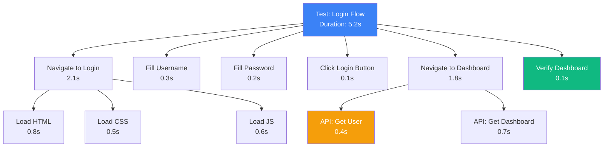
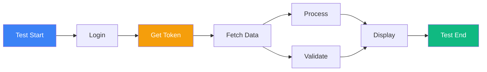

# Traces

Explore detailed execution traces to understand test performance, debug failures, and optimize your automation.

## Viewing Traces

### Accessing the Traces Page

<Steps>
  <Step>Navigate to **Observe → Traces** from the sidebar</Step>
  <Step>View list of recent test executions with trace data</Step>
  <Step>Filter by project, test type, status, or time range</Step>
  <Step>Click any trace to view detailed execution timeline</Step>
</Steps>

## Trace List View

The traces page shows all test executions with key information:

| Column | Description |
|--------|-------------|
| **Trace ID** | Unique identifier for this execution |
| **Test Name** | Name of the test that was executed |
| **Status** | Pass/Fail status |
| **Duration** | Total execution time |
| **Timestamp** | When the test ran |
| **Span Count** | Number of operations in the trace |

### Filtering Traces

Use filters to find specific traces:

- **Project**: Filter by project name
- **Test Type**: Browser, API, Database, Custom, Performance
- **Status**: Passed, Failed, Error
- **Time Range**: Last hour, 24 hours, 7 days, 30 days, custom
- **Search**: Search by test name or trace ID

## Trace Detail View

Click any trace to see the complete execution timeline with all operations.

### Timeline Visualization

```mermaid
gantt
    title Test Execution Timeline
    dateFormat  HH:mm:ss
    axisFormat %H:%M:%S

    section Test Root
    Test Execution         :active, root, 00:00:00, 15s

    section Browser
    Navigate to Page       :nav, 00:00:01, 2s
    Wait for Load          :load, 00:00:03, 1s

    section Network
    API Request 1          :api1, 00:00:04, 0.5s
    API Request 2          :api2, 00:00:05, 0.3s
    Image Load             :img, 00:00:06, 1s

    section Actions
    Click Button           :click, 00:00:08, 0.2s
    Fill Form              :fill, 00:00:09, 0.5s
    Submit                 :submit, 00:00:10, 0.3s

    section Assertions
    Validate Response      :assert1, 00:00:12, 0.1s
    Check Element Visible  :assert2, 00:00:13, 0.1s
    Verify Text Content    :assert3, 00:00:14, 0.1s
```

### Span Details

Each span in the timeline shows:

**Basic Information**:
- Span name (e.g., "HTTP GET /api/users")
- Duration (e.g., "234ms")
- Start time (relative to test start)
- Status (OK, Error)

**Attributes**:
- HTTP method and URL
- Status code
- Request/response headers
- Error messages
- Custom tags

**Events**:
- Logs within the span
- Exceptions and errors
- Timing marks

## Understanding Spans

### Span Types

**Root Span**:
- Represents the entire test execution
- Parent of all other spans
- Duration = total test time

**Navigation Spans**:
- Page navigations
- URL changes
- Back/forward actions

**Network Spans**:
- HTTP requests
- WebSocket connections
- Resource loading

**Action Spans**:
- Clicks
- Form inputs
- Keyboard actions

**Assertion Spans**:
- Validations
- Checks
- Expectations

### Span Hierarchy



## Trace Attributes

### Standard Attributes

Common attributes available on all spans:

| Attribute | Description | Example |
|-----------|-------------|---------|
| `span.kind` | Type of operation | `CLIENT`, `SERVER`, `INTERNAL` |
| `http.method` | HTTP method | `GET`, `POST`, `PUT` |
| `http.url` | Full URL | `https://api.example.com/users` |
| `http.status_code` | Response status | `200`, `404`, `500` |
| `error` | Error flag | `true`, `false` |
| `error.message` | Error description | `Element not found` |

### Custom Attributes

Supercheck adds custom attributes for richer context:

| Attribute | Description |
|-----------|-------------|
| `test.id` | Test identifier |
| `test.name` | Test name |
| `test.type` | Browser, API, Database, Custom |
| `job.id` | Associated job ID |
| `project.id` | Project identifier |
| `user.id` | User who triggered test |
| `trigger.type` | Manual, Scheduled, Remote |

### Browser-Specific Attributes

For browser tests:

| Attribute | Description |
|-----------|-------------|
| `page.url` | Current page URL |
| `page.title` | Page title |
| `element.selector` | CSS selector |
| `element.text` | Element text content |
| `screenshot.url` | Link to screenshot |

## Analyzing Performance

### Identifying Bottlenecks

<Steps>
  <Step>Sort spans by duration (longest first)</Step>
  <Step>Look for unexpectedly slow operations</Step>
  <Step>Check network requests for slow APIs</Step>
  <Step>Identify sequential operations that could be parallel</Step>
  <Step>Review wait times and timeouts</Step>
</Steps>

### Performance Metrics

Key metrics to monitor:

**Time to First Byte (TTFB)**:
- Network latency to API/server
- Should be < 200ms for APIs

**Page Load Time**:
- Complete page load including resources
- Target < 3 seconds

**API Response Time**:
- Individual API call duration
- Should be < 500ms for most endpoints

**Total Test Duration**:
- End-to-end execution time
- Compare against baseline

## Trace Graph Visualization

View execution flow as an interactive graph showing:

- Span relationships (parent-child)
- Execution order
- Parallel vs sequential operations
- Critical path through the test



## Exporting Traces

Export trace data for analysis:

<Steps>
  <Step>Open trace detail view</Step>
  <Step>Click **Export** button</Step>
  <Step>Choose format: JSON, CSV, or OTLP</Step>
  <Step>Download trace data</Step>
  <Step>Use external tools for advanced analysis</Step>
</Steps>

### Export Formats

**JSON**:
- Complete trace data
- All spans and attributes
- Human-readable format

**CSV**:
- Flat span list
- Good for spreadsheet analysis
- Performance metrics

**OTLP** (OpenTelemetry Protocol):
- Standard format
- Import into other observability tools
- Jaeger, Grafana, DataDog compatible

## Best Practices

### Effective Trace Analysis

<Steps>
  <Step>Start with the timeline view to understand flow</Step>
  <Step>Identify the longest spans first</Step>
  <Step>Check failed spans for error messages</Step>
  <Step>Review network spans for API issues</Step>
  <Step>Compare traces across multiple runs for patterns</Step>
</Steps>

### Performance Investigation

When optimizing tests:

1. **Establish Baseline**: Run test multiple times to get average
2. **Identify Hotspots**: Find spans taking >20% of total time
3. **Analyze Network**: Check if APIs are slow or timing out
4. **Review Waits**: Look for unnecessary explicit waits
5. **Compare Runs**: Before/after optimization comparison

### Troubleshooting Failures

For failed tests:

1. **Find Error Span**: Locate the red/failed span
2. **Read Error Message**: Check error attributes
3. **Review Context**: What happened before the failure?
4. **Check Network**: Were there failed requests?
5. **View Screenshot**: Visual evidence of page state

## Advanced Features

### Custom Spans

You can create custom spans in your tests for better observability:

```typescript
// Browser test example
await page.evaluate(() => {
  // Custom operation you want to trace
  performance.mark('custom-operation-start');
  // ... your code ...
  performance.mark('custom-operation-end');
});
```

### Trace Sampling

For high-volume testing:
- Default: 100% of tests traced
- Can configure sampling rate (e.g., 10% for load tests)
- Always trace failures regardless of sampling

## Related Features

<Cards>
  <Card
    title="Debugging Guide"
    description="Learn how to debug test failures with traces"
    href="./debugging"
  />
  <Card
    title="Tests"
    description="Create tests that generate rich traces"
    href="../automate/tests"
  />
  <Card
    title="Runs"
    description="View all test runs with trace data"
    href="../automate/runs"
  />
</Cards>

## Need Help?

- **Understanding Spans**: Review the span types section above
- **Performance Issues**: Use the performance analysis guide
- **Export Questions**: Check export formats documentation
- **Support**: Contact support@supercheck.io for trace analysis assistance
