# Authentication System Specification

## Overview

Supercheck uses **Better Auth 1.2.8** as its comprehensive authentication framework, providing:
- **Email/Password Authentication**: Traditional credential-based sign-in
- **Social Authentication**: GitHub and Google OAuth 2.0 sign-in
- **Multi-Tenant Organization Management**: Built-in organization support
- **Role-Based Access Control (RBAC)**: Fine-grained permissions
- **Admin Capabilities**: User impersonation and management
- **Polar Billing Integration**: Automatic customer creation for cloud deployments

## Table of Contents

1. [System Architecture](#system-architecture)
2. [Authentication Flows](#authentication-flows)
3. [Better Auth Configuration](#better-auth-configuration)
4. [RBAC System](#rbac-system)
5. [Session Management](#session-management)
6. [Security Features](#security-features)
7. [Email Integration](#email-integration)
8. [Organization Management](#organization-management)
9. [API Integration](#api-integration)
10. [Database Schema](#database-schema)
11. [Testing Guide](#testing-guide)

## System Architecture

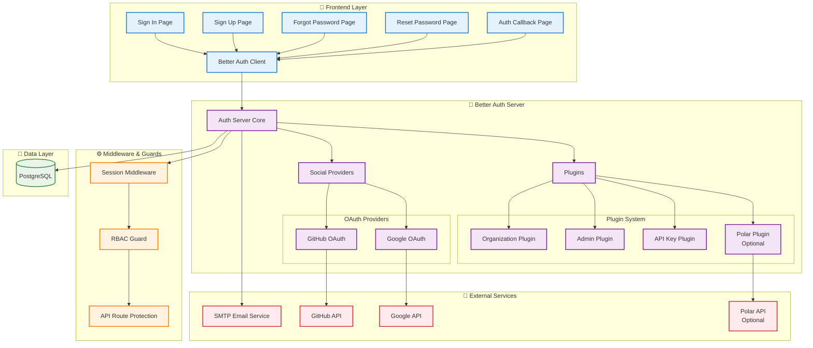

## Authentication Flows

### Sign In Flow

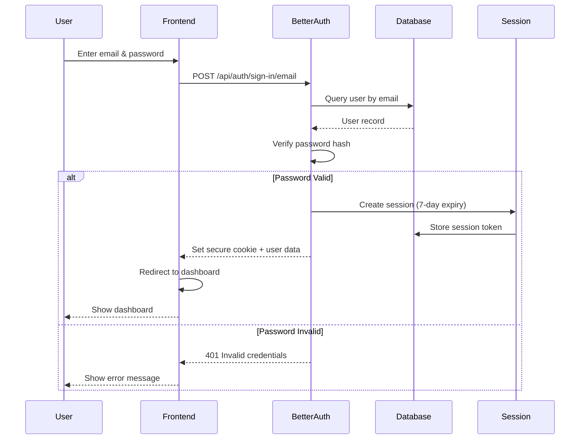

### Sign Up Flow

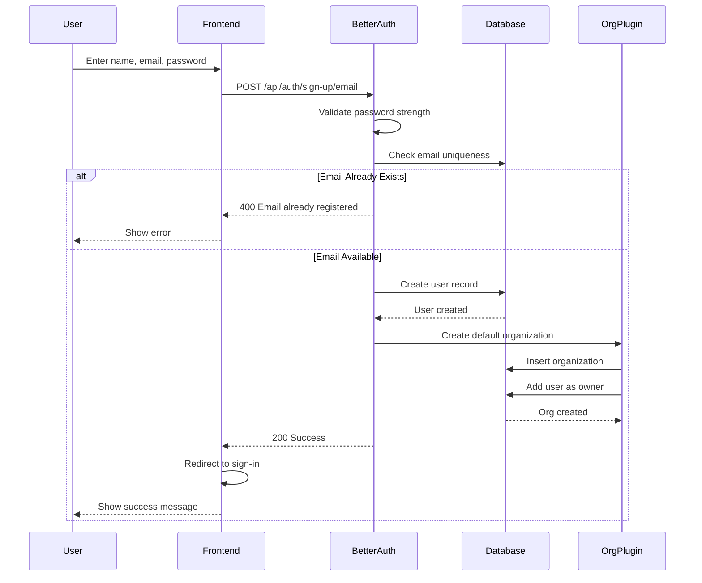

### Forgot Password Flow

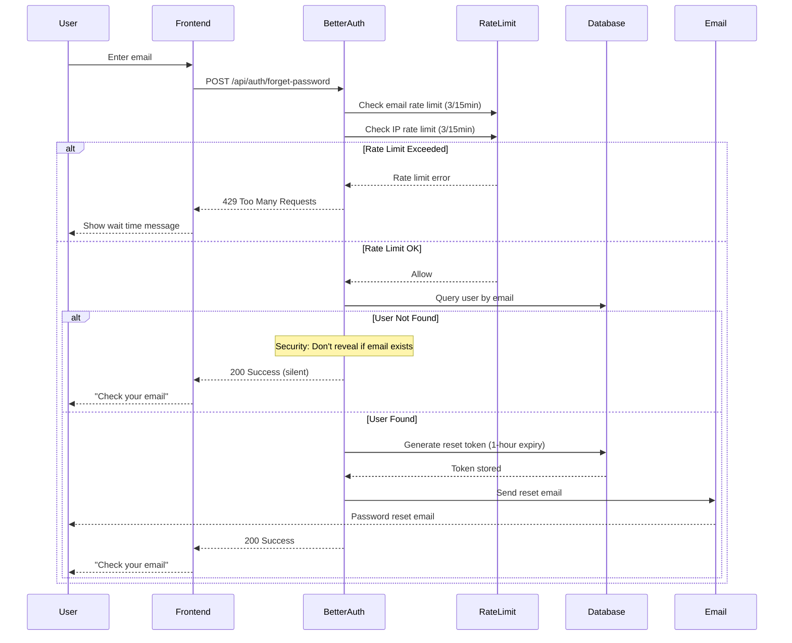

### Reset Password Flow

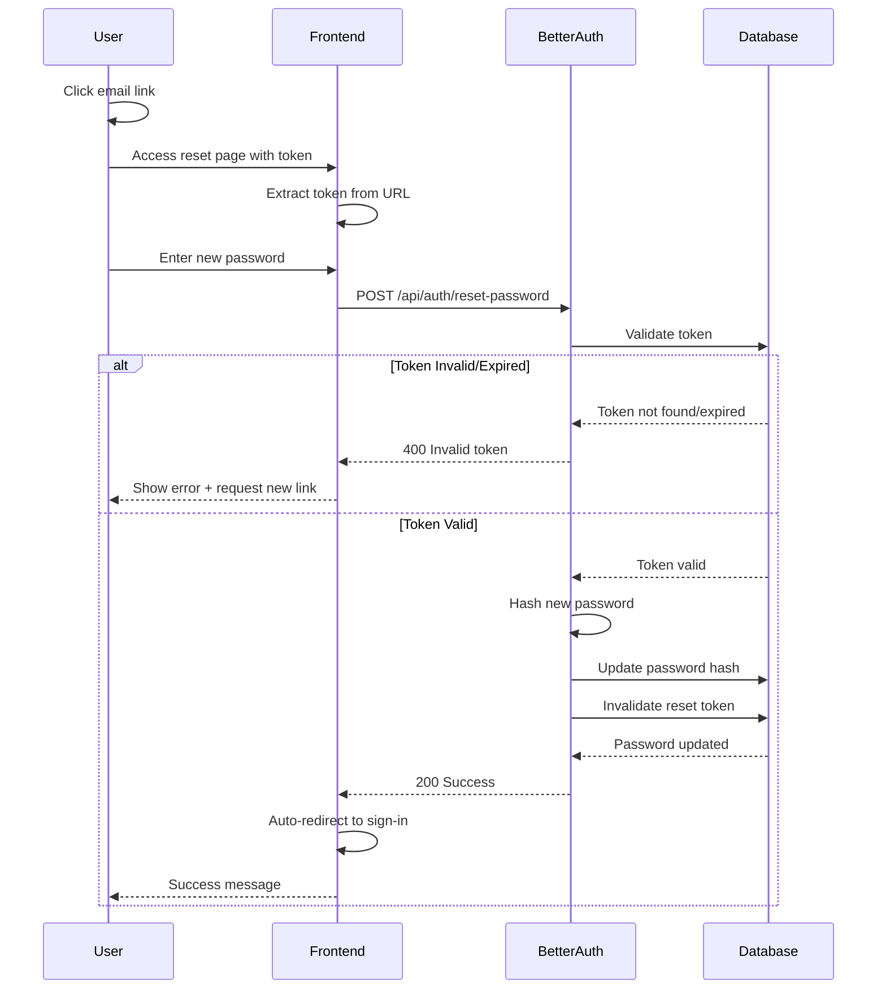

### Social Sign-In Flow (GitHub/Google)

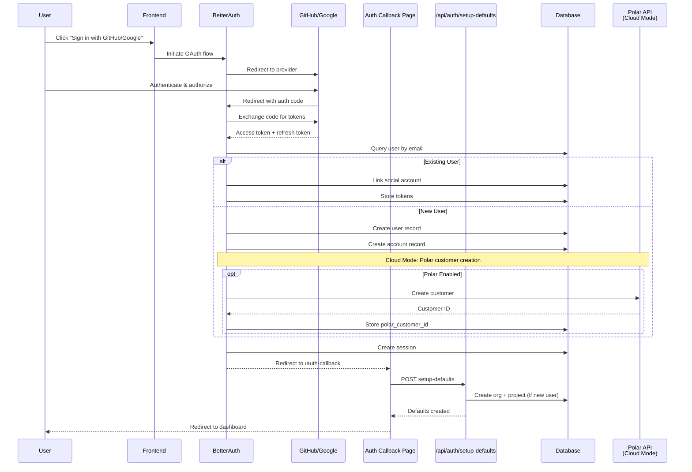

### Social Sign-Up Flow Details

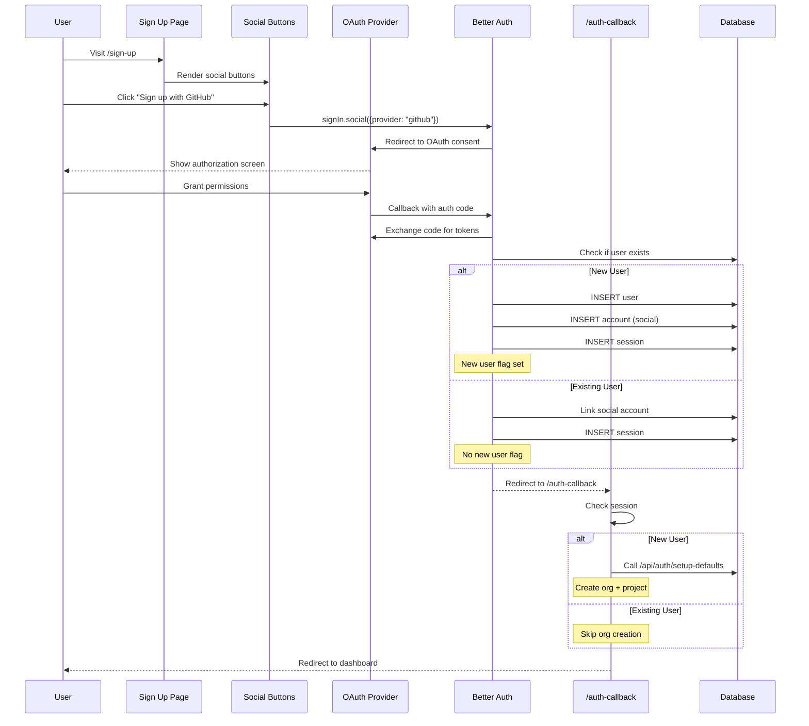

## Better Auth Configuration

### Core Configuration

**Location:** `app/src/utils/auth.ts`

**Key Features:**
- **Email/Password Authentication**: Traditional credential-based auth
- **Social Authentication**:
  - GitHub OAuth 2.0 (conditionally enabled)
  - Google OAuth 2.0 (conditionally enabled, with offline access and refresh tokens)
- **Organization Plugin**: Org creation handled in the API layer (`/api/auth/setup-defaults` + invitations)
- **Admin Plugin**: Super admin roles with impersonation support
- **API Key Plugin**: Programmatic access for jobs and monitors
- **Polar Plugin** *(Optional)*: Automatic customer creation for cloud deployments
- **Session Duration**: 7 days
- **Session Update Age**: 24 hours (refreshes with activity)
- **Database Adapter**: Drizzle ORM with PostgreSQL

### Social Authentication Configuration

**GitHub OAuth:**
```typescript
socialProviders: {
  github: {
    clientId: process.env.GITHUB_CLIENT_ID,
    clientSecret: process.env.GITHUB_CLIENT_SECRET,
    enabled: !!(process.env.GITHUB_CLIENT_ID && process.env.GITHUB_CLIENT_SECRET),
  },
}
```

**Google OAuth:**
```typescript
socialProviders: {
  google: {
    clientId: process.env.GOOGLE_CLIENT_ID,
    clientSecret: process.env.GOOGLE_CLIENT_SECRET,
    enabled: !!(process.env.GOOGLE_CLIENT_ID && process.env.GOOGLE_CLIENT_SECRET),
    accessType: "offline",  // Always get refresh tokens
    prompt: "select_account consent",  // Force account selection
  },
}
```

**Environment Variables:**
```bash
# GitHub OAuth (Optional - buttons shown automatically when configured)
GITHUB_CLIENT_ID=your-github-client-id
GITHUB_CLIENT_SECRET=your-github-client-secret

# Google OAuth (Optional - buttons shown automatically when configured)
GOOGLE_CLIENT_ID=your-client-id.apps.googleusercontent.com
GOOGLE_CLIENT_SECRET=your-google-client-secret
```

> **Note:** Social auth buttons are dynamically loaded via `/api/config/auth-providers` endpoint, allowing runtime configuration without rebuilding the application.

**Callback URLs:**
- GitHub: `{BASE_URL}/api/auth/callback/github`
- Google: `{BASE_URL}/api/auth/callback/google`

**Setup Requirements:**
- GitHub: Create OAuth App at [GitHub Developer Settings](https://github.com/settings/developers)
  - **Important**: For GitHub Apps, enable email read permissions
- Google: Create OAuth credentials at [Google Cloud Console](https://console.cloud.google.com/apis/credentials)
  - **Important**: Configure OAuth consent screen first
  - Add authorized redirect URIs exactly matching your callback URLs

### Plugins Enabled

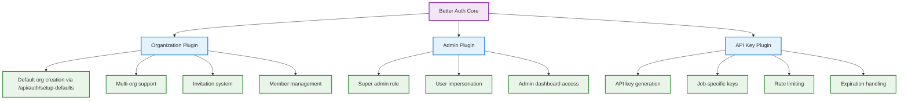

## RBAC System

### Role Hierarchy

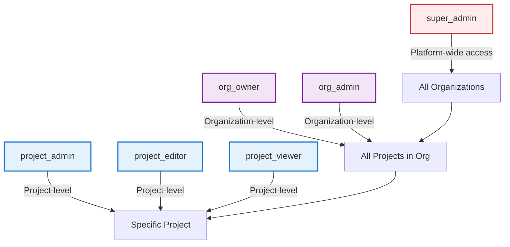

### Permission Matrix

| Role | Create Project | Create Test | Execute Test | Create Job | Trigger Job | Manage Members | View Only |
|------|----------------|-------------|--------------|------------|-------------|----------------|-----------|
| `super_admin` | ✅ | ✅ | ✅ | ✅ | ✅ | ✅ | ✅ |
| `org_owner` | ✅ | ✅ | ✅ | ✅ | ✅ | ✅ | ✅ |
| `org_admin` | ✅ | ✅ | ✅ | ✅ | ✅ | ✅ | ✅ |
| `project_admin` | ❌ | ✅ | ✅ | ✅ | ✅ | ✅ (project) | ✅ |
| `project_editor` | ❌ | ✅ | ✅ | ✅ | ✅ | ❌ | ✅ |
| `project_viewer` | ❌ | ❌ | ❌ | ❌ | ❌ | ❌ | ✅ |

### Authorization Flow

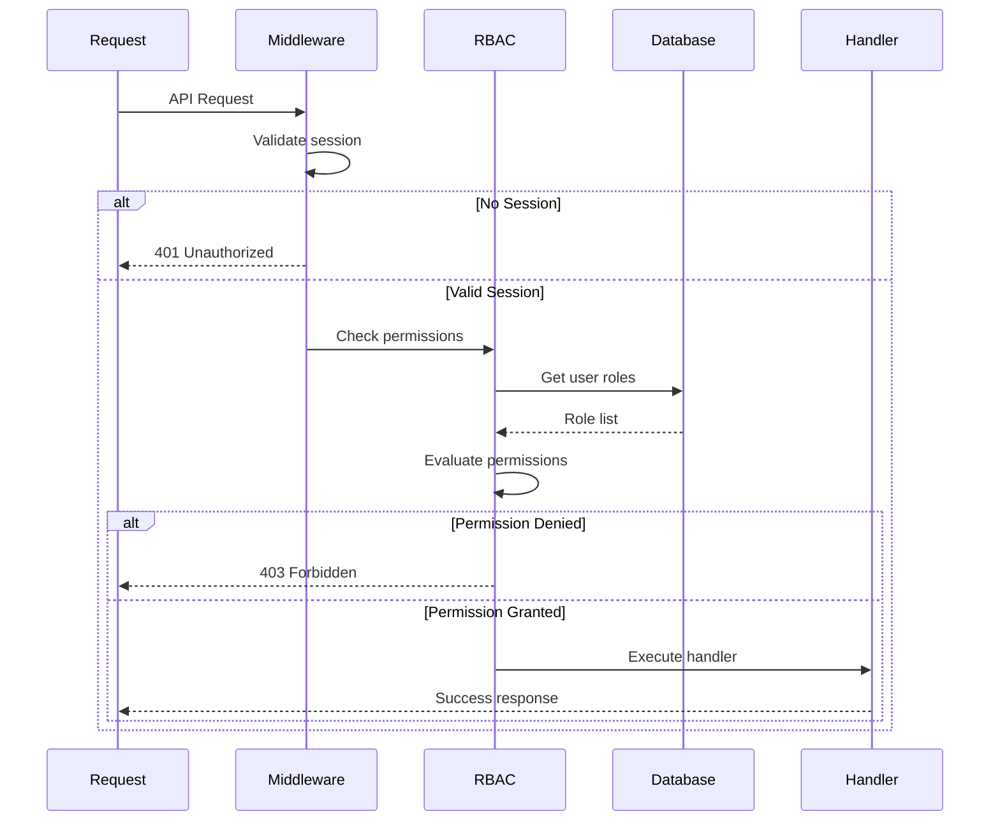

## Session Management

### Session Lifecycle

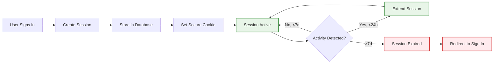

### Session Configuration

**Properties:**
- **Duration:** 7 days (604800 seconds)
- **Update Age:** 24 hours (session token refreshes daily with activity)
- **Cookie Settings:**
  - `httpOnly: true` (prevents XSS)
  - `secure: true` (HTTPS only in production)
  - `sameSite: 'lax'` (CSRF protection)
  - `path: '/'` (application-wide)

**Security Features:**
- IP address tracking (optional verification)
- User agent tracking
- Last activity timestamp
- Automatic token rotation on update
- Secure session invalidation on sign out

## Security Features

### Rate Limiting

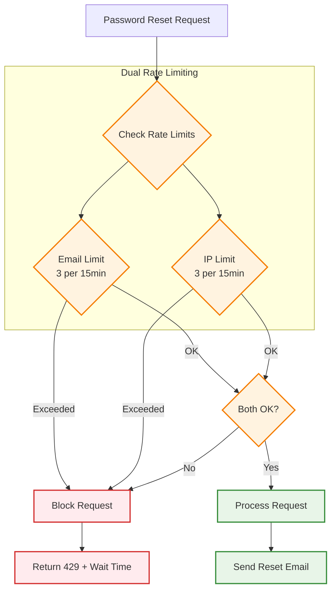

**Rate Limiting Implementation:**
- In-memory rate limit store (production should use Redis)
- Automatic cleanup every 5 minutes
- Separate limits for email and IP
- Clear error messages with wait time
- Prevents both user-targeted and distributed attacks

### Password Security

**Requirements:**
```mermaid
graph TB
    A[Password Policy] --> B[Minimum 8 characters]
    A --> C[At least 1 uppercase]
    A --> D[At least 1 lowercase]
    A --> E[At least 1 number]
    A --> F[At least 1 special character]

    G[Storage Security] --> H[Bcrypt hashing]
    G --> I[Automatic salt]
    G --> J[Cost factor: 10]

    K[Reset Security] --> L[1-hour token expiry]
    K --> M[Single-use tokens]
    K --> N[Cryptographically secure]

    classDef policy fill:#e3f2fd,stroke:#1976d2,stroke-width:2px
    classDef storage fill:#f3e5f5,stroke:#7b1fa2,stroke-width:2px
    classDef reset fill:#e8f5e8,stroke:#388e3c,stroke-width:2px

    class A,B,C,D,E,F policy
    class G,H,I,J storage
    class K,L,M,N reset
```

### Additional Security Measures

**Implementation:**
- CSRF protection via SameSite cookies
- XSS prevention via httpOnly cookies
- SQL injection prevention via parameterized queries
- Password visibility toggle (UX improvement)
- Secure error messages (no information leakage)
- Token invalidation after successful reset
- Automatic session cleanup on suspicious activity

## Email Integration

### Email Service Architecture

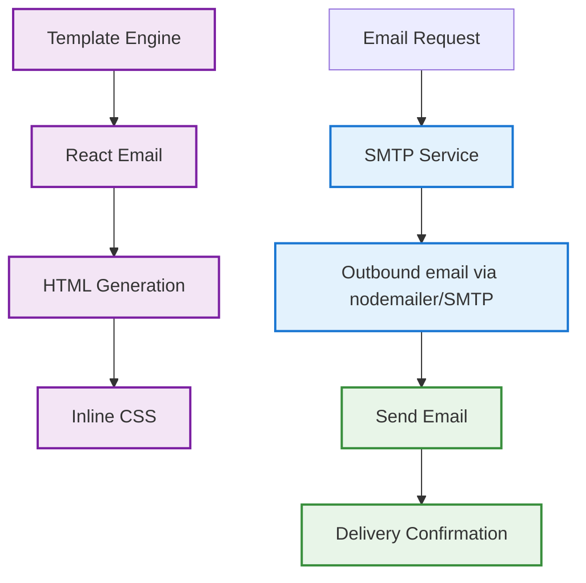

### Email Templates

**Password Reset Email Features:**
- Professional HTML template with branding
- Plain text fallback for compatibility
- Clear call-to-action button
- Security warnings about expiration
- Advice for unauthorized requests
- Consistent application branding
- Mobile-responsive design

**Configuration Variables:**
- `SMTP_HOST` - SMTP server hostname
- `SMTP_PORT` - SMTP server port
- `SMTP_USER` - SMTP username
- `SMTP_PASSWORD` - SMTP password
- `SMTP_SECURE` - Use TLS/SSL (true/false)
- `SMTP_FROM_EMAIL` - Sender email address

## Organization Management

### Organization Creation Flow

```mermaid
sequenceDiagram
    participant User
    participant System
    participant Database

    User->>System: Sign in or sign up
    System->>Database: Check existing memberships
    Database-->>System: Memberships (if any)

    alt Already in org or pending invite
        System-->>User: Skip default org creation
    else No org and no pending invites
        System->>/api/auth/setup-defaults: Create org + default project
        Database-->>System: Org and project created
        System-->>User: Default org ready
    end
```

### Invitation System

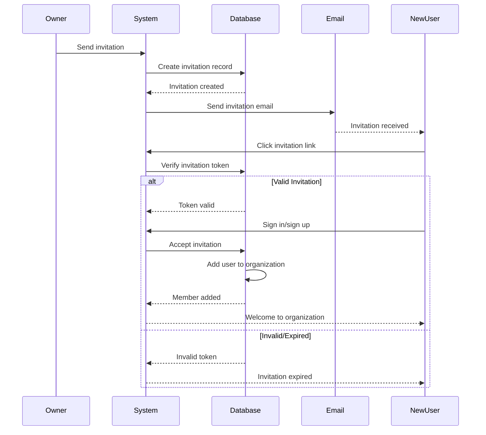

## API Integration

### Authentication Endpoints

**Better Auth handlers (App Router):**
- `/api/auth/[...all]` and `/api/auth` handle sign-in, sign-up, sign-out, password reset, and session retrieval.
- `/api/auth/sign-in/email` and `/api/auth/sign-up/email` are dedicated email/password entrypoints used by the auth pages.
- `/api/auth/callback/github` - GitHub OAuth callback handler
- `/api/auth/callback/google` - Google OAuth callback handler
- `/api/auth/impersonation-status`, `/api/admin/stop-impersonation` surface impersonation state/stop controls.
- `/api/auth/user` returns the current session's user.
- `/api/auth/setup-defaults` creates a default org/project when the user has no memberships and no pending invites.
- `/api/auth/verify-key` validates job-scoped API keys.

**Frontend Routes:**
- `/sign-in` - Sign-in page with email/password and social auth buttons
- `/sign-up` - Sign-up page with email/password and social auth buttons
- `/auth-callback` - OAuth redirect handler, calls setup-defaults for new users
- `/forgot-password` - Password reset request page
- `/reset-password` - Password reset form page

**Organization & membership APIs (outside Better Auth):**
- `/api/organizations/*` and `/api/projects/*` manage orgs, projects, members, invitations, and variables; access is enforced via RBAC middleware rather than Better Auth plugins.

### Client SDK Methods

**Email/Password Authentication:**
- `authClient.signIn.email(credentials)` - Sign in with email/password
- `authClient.signUp.email(userData)` - Sign up with email/password
- `authClient.signOut()` - Sign out (all methods)
- `authClient.forgetPassword(email)` - Request password reset
- `authClient.resetPassword(data)` - Reset password with token

**Social Authentication:**
- `authClient.signIn.social({ provider: "github", callbackURL })` - Sign in with GitHub
- `authClient.signIn.social({ provider: "google", callbackURL })` - Sign in with Google
- Auto-redirects to OAuth provider, then back to callbackURL
- Handles both new user signup and existing user signin
- Automatically links social accounts to existing email accounts

**Organizations & Admin (Better Auth client plugins):**
- `organization.create/list/setActive(...)` - Manage org membership context
- `organization.inviteMember(...)`, `organization.removeMember(...)`, `organization.updateMemberRole(...)` - Org membership controls
- `admin.listUsers/createUser/banUser/unbanUser/impersonateUser/removeUser` - Super-admin actions

**React Hooks:**
- `useSession()` - Get current session (works for all auth methods)

## Database Schema

### Authentication Tables

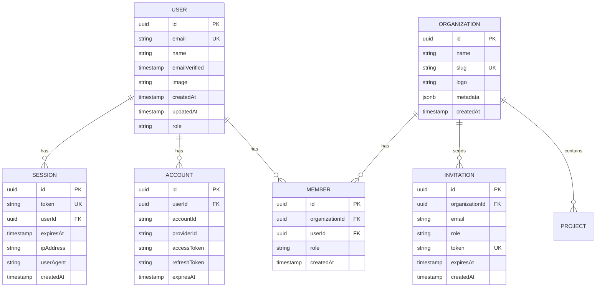

## Testing Guide

### Test Scenarios

#### 1. Sign Up Flow
**Steps:**
1. Navigate to sign-up page
2. Enter valid email, name, password
3. Submit form
4. Verify user created in database
5. Verify default organization created
6. Verify user assigned as owner

**Expected:** User redirected to sign-in with success message

#### 2. Sign In Flow
**Steps:**
1. Navigate to sign-in page
2. Enter registered email and password
3. Submit form
4. Verify session created
5. Verify secure cookie set

**Expected:** User redirected to dashboard

#### 3. Password Reset Flow
**Steps:**
1. Navigate to forgot password
2. Enter registered email
3. Check email received
4. Click reset link
5. Enter new password
6. Submit form
7. Attempt sign in with new password

**Expected:** Password successfully reset, sign in works

#### 4. Rate Limiting
**Steps:**
1. Request password reset 4 times in quick succession
2. Verify 4th request blocked
3. Check error message includes wait time

**Expected:** Rate limit enforced after 3 attempts

#### 5. Organization Invitation
**Steps:**
1. Owner sends invitation to email
2. New user receives invitation email
3. New user clicks link and signs up/in
4. Verify user added to organization
5. Verify correct role assigned

**Expected:** New member added to organization

## Related Documentation

- **RBAC System:** See `RBAC_DOCUMENTATION.md` for detailed permission model
- **API Keys:** See `API_KEY_SYSTEM.md` for programmatic access
- **Database Schema:** See `ERD_DIAGRAM.md` for complete database structure
- **Organization Management:** See `ORGANIZATION_AND_PROJECT_IMPLEMENTATION.md`
