# Execution System - Complete Architecture

## Overview

The Supercheck execution system provides a **distributed, secure, and scalable architecture** for running Playwright tests, K6 performance tests, and health monitoring checks. The system uses **BullMQ** job queues with **Redis**, **container-based execution** for security isolation, and **horizontal scaling** for high throughput.

**🔒 Security-First Design:** All test execution runs in isolated Docker containers with comprehensive security boundaries, preventing code injection attacks and ensuring complete isolation from the host system.

**📍 Multi-Location Support:** Tests and monitors can execute from multiple geographic locations for distributed load testing and global monitoring coverage.

---

## Table of Contents

1. [System Architecture](#system-architecture)
2. [BullMQ Queue System](#bullmq-queue-system)
3. [Capacity Management](#capacity-management)
4. [Container Execution & Security](#container-execution--security)
5. [Test Execution Flow](#test-execution-flow)
6. [Job Execution Flow](#job-execution-flow)
7. [Multi-Location Execution](#multi-location-execution)
8. [Scheduler System](#scheduler-system)
9. [Worker Architecture](#worker-architecture)
10. [Resource Management](#resource-management)
11. [Docker Compose Best Practices](#docker-compose-best-practices)
12. [Error Handling & Retries](#error-handling--retries)
13. [Performance Optimization](#performance-optimization)
14. [Monitoring & Observability](#monitoring--observability)

---

## System Architecture

### Complete System Overview


### Data Flow Architecture


---

## BullMQ Queue System

### Queue Definitions

The system manages distinct queues for different execution types and regions:
### Worker Architecture

**Production:** 3 location-based workers, each handling multiple queue types:

| Worker | Location | Regional Queues | Global Queues |
|--------|----------|----------------|---------------|
| `supercheck-worker-us` | us-east | `k6-us-east`, `monitor-us-east` | `playwright-global`, `k6-global` |
| `supercheck-worker-eu` | eu-central | `k6-eu-central`, `monitor-eu-central` | `playwright-global`, `k6-global` |
| `supercheck-worker-apac` | asia-pacific | `k6-asia-pacific`, `monitor-asia-pacific` | `playwright-global`, `k6-global` |

**Architecture Benefits:**
- ✅ **Resource efficiency**: Each worker handles multiple job types
- ✅ **Automatic load balancing**: Global queues processed by any available worker
- ✅ **Geographic accuracy**: Regional queues ensure correct execution location
- ✅ **Simple scaling**: Scale by region (3 deployments vs 8)

**Single Cluster Deployment:**
In a single cluster setup, geographic isolation is achieved via **Node Affinity**.
- Nodes must be labeled with `region={us-east|eu-central|asia-pacific}`.
- Worker deployments use `nodeSelector` to target specific nodes.
- This allows logical separation of "regions" even within the same physical cluster if needed, or physical separation if nodes are in different zones/regions but connected to the same control plane.

**Local Development:** Set `WORKER_REGION=local` to process all queues on a single worker. Configured automatically in Docker Compose.

### Active Queues (14 Total)


**Playwright Execution (Global):**
- **playwright-global** - Handles all Playwright tests and jobs (consolidated)

**K6 Execution (Regional):**
- **k6-us-east** - K6 load tests from US East region
- **k6-eu-central** - K6 load tests from EU Central region
- **k6-asia-pacific** - K6 load tests from Asia Pacific region
- **k6-global** - K6 load tests from Global region

**Monitor Execution (Regional):**
- **monitor-us-east** - Synthetic monitors from US East region
- **monitor-eu-central** - Synthetic monitors from EU Central region (default)
- **monitor-asia-pacific** - Synthetic monitors from Asia Pacific region

**Scheduler Queues (3):**
- **job-scheduler** - Triggers scheduled jobs hourly
- **k6-job-scheduler** - Triggers scheduled K6 jobs hourly
- **monitor-scheduler** - Triggers scheduled monitors every 5 minutes

**Utility Queues (2):**
- **email-template-render** - Email template rendering
- **data-lifecycle-cleanup** - Database and artifact cleanup

### Queue Architecture

```mermaid
graph TB
    subgraph "Queue Types"
        Q1[playwright-global<br/>All Playwright Tasks]
        Q2["k6-{region}<br/>Regional Load Tests"]
        Q3["monitor-{region}<br/>Regional Monitors"]
        Q4[Scheduler Queues<br/>Cron Jobs]
    end

    subgraph "Queue Configuration"
        C1[Max Concurrency: 2/worker]
        C2[Job Timeout: 15 min]
        C3[Retry: 3 attempts]
        C4[Exponential Backoff]
        C5[Remove on Complete: 500]
        C6[Remove on Fail: 1000]
    end

    subgraph "Queue Events"
        E1[waiting → Job added]
        E2[active → Worker processing]
        E3[completed → Success]
        E4[failed → Error]
        E5[stalled → Timeout]
    end

    Q1 & Q2 & Q3 & Q4 & Q5 & Q6 --> C1
    C1 --> C2 --> C3 --> C4 --> C5 --> C6

    C6 --> E1 --> E2 --> E3
    E2 --> E4
    E2 --> E5

    classDef queue fill:#fff3e0,stroke:#f57c00,stroke-width:2px
    classDef config fill:#e3f2fd,stroke:#1976d2,stroke-width:2px
    classDef event fill:#e8f5e8,stroke:#388e3c,stroke-width:2px

    class Q1,Q2,Q3,Q4,Q5,Q6 queue
    class C1,C2,C3,C4,C5,C6 config
    class E1,E2,E3,E4,E5 event
```



### Job Lifecycle States


### Job Cancellation System

The execution system supports **real-time cancellation** of running and queued jobs via Redis-based signaling.

#### Cancellation Architecture

```mermaid
sequenceDiagram
    participant User
    participant API as Cancel API
    participant Redis as Redis
    participant Queue as BullMQ Queue
    participant Worker as Worker
    participant Container as Container

    User->>API: POST /api/runs/{runId}/cancel
    API->>API: Validate permissions (RBAC)
    API->>Redis: SET supercheck:cancel:{runId} = 1 (TTL 1h)
    
    alt Job in Queue (Waiting)
        API->>Queue: job.remove()
        Queue-->>API: Job removed
        API->>API: Update DB status → error
    else Job Running (Active)
        API->>API: Update DB status → error
        Note over Worker: Polling every 1s
        Worker->>Redis: GET supercheck:cancel:{runId}
        Redis-->>Worker: "1" (cancelled)
        Worker->>Container: docker kill {containerName}
        Container-->>Worker: Killed
        Worker->>Redis: DEL supercheck:cancel:{runId}
    end
    
    API-->>User: { success: true }
```



#### Cancellation Flow

**1. API Layer (App)**
- Validates user has permission to cancel (organization membership)
- Sets cancellation signal in Redis with 1-hour TTL
- Attempts to remove job from BullMQ queue (works for waiting/delayed jobs)
- Updates database status to 'error' with "Cancellation requested by user"

**2. Worker Layer**
- **Pre-execution check**: Processor checks for cancellation signal before starting
- **During execution**: `ContainerExecutorService` polls Redis every 1 second
- **On cancellation detected**: Kills Docker container immediately, clears signal

#### Key Components

| Component | Location | Responsibility |
|-----------|----------|----------------|
| `setCancellationSignal()` | `app/src/lib/cancellation-service.ts` | Set Redis flag from API |
| `CancellationService` | `worker/src/common/services/cancellation.service.ts` | Redis operations in worker |
| `CancellationModule` | `worker/src/common/services/cancellation.module.ts` | NestJS module for DI |
| `ContainerExecutorService` | `worker/src/common/security/container-executor.service.ts` | Polls & kills containers |

#### Redis Key Format

```
supercheck:cancel:{runId}
```

- **Value**: `"1"` when cancelled
- **TTL**: 3600 seconds (1 hour) - prevents stale signals
- **Cleared**: After worker acknowledges cancellation

#### Container Cancellation

When a cancellation signal is detected during container execution:

1. **Immediate Kill**: `docker kill {containerName}` (SIGKILL, exit code 137)
2. **Container Cleanup**: `docker rm -f {containerName}`
3. **Signal Clear**: Redis key deleted
4. **Status Update**: Run marked as `error` in database with `errorDetails: "Cancellation requested by user"`

#### UI Status Display

Cancelled runs are displayed distinctly in the UI:

| Database Status | Error Details | UI Display | Icon |
|-----------------|---------------|------------|------|
| `error` | Contains "cancellation" or "cancelled" | **Cancelled** | Ban (🚫) |
| `error` | Other errors | **Error** | AlertCircle |
| `failed` | Any | **Failed** | XCircle |
| `passed` | Any | **Passed** | CheckCircle |
| `running` | Any | **Running** | Loader |

The UI maps the database `error` status to "Cancelled" when the `errorDetails` field contains cancellation-related keywords. This allows the faceted filters to correctly count and filter cancelled runs separately from other errors.

#### Cancellation Confirmation

Both Jobs and Playground pages show a confirmation dialog before cancelling:
- **Title**: "Cancel Execution?"
- **Description**: Warns that the action cannot be undone
- **Actions**: "Continue Running" (cancel) or "Cancel Execution" (confirm)

#### Playground vs Job Cancellation

The system distinguishes between playground runs and scheduled job runs:

| Aspect | Playground Runs | Job Runs |
|--------|-----------------|----------|
| **Job ID** | `null` (no associated job) | UUID of parent job |
| **SSE Events** | Filtered out from `/api/job-status/events` | Broadcast to all subscribers |
| **Cancellation Toast** | Simple "Run cancelled" message | "Job execution cancelled" with report link |
| **Report Detection** | Immediate cancellation detection via GET pre-check | Standard SSE notification flow |

**Implementation Details:**
- The `/api/job-status/events` SSE endpoint filters out runs without a `jobId` to prevent duplicate notifications for playground executions
- Playground runs have their own status handling via `/api/test-status/events/{testId}` (Playwright) or streaming events (K6)
- The `ReportViewer` component uses a GET request (instead of HEAD) to detect cancellation errors immediately by reading the JSON response body

#### Playground ID Architecture

Playground tests use two distinct IDs that serve different purposes:

| ID | Generated By | Used For | Example |
|----|--------------|----------|---------|
| `testId` | `crypto.randomUUID()` in API | Report storage (S3 key prefix), SSE events, report URL | `522d7409-ea38-...` |
| `runId` | Database `runs.id` | Queue job ID, cancellation, database tracking | `35f574bc-b5d4-...` |

**Critical for Cancellation:**
- The `runId` (database run ID) is used as the BullMQ job ID
- Cancellation API looks up runs by `runId` in the database
- Redis cancellation signal key uses `runId`: `supercheck:cancel:{runId}`
- Worker checks `task.runId` for cancellation signals

**Frontend must use `runId` for cancellation:**
```typescript
// Correct: Use runId for cancellation
setCurrentRunId(result.runId || result.testId);

// The cancel API will then correctly find and cancel the job
await fetch(`/api/runs/${currentRunId}/cancel`, { method: 'POST' });
```

### Playground Execution Database Tracking

**All playground executions (Playwright & K6) create database records in the `runs` table:**

| Field | Value | Purpose |
|-------|-------|---------|
| `id` | UUID | Unique run identifier |
| `jobId` | `null` | Identifies as playground run (vs scheduled job) |
| `status` | `"running"` → `"passed"` \| `"failed"` | Execution status |
| `trigger` | `"manual"` | Indicates manual/ad-hoc execution |
| `metadata.source` | `"playground"` | Identifies execution source |
| `metadata.testType` | `"browser"` \| `"api"` \| `"custom"` \| `"performance"` | Maps to execution engine |
| `startedAt` | Timestamp | Execution start time |
| `completedAt` | Timestamp | Execution completion time |

**Rationale for Database Tracking:**
- ✅ Provides audit trail of playground usage
- ✅ Enables execution visibility in UI (Executions Dialog)
- ✅ Supports future analytics and usage reporting
- ✅ Consistent architecture (K6 and Playwright behave the same)
- ✅ Minimal storage impact with automated cleanup

**Data Lifecycle Management:**

Playground runs are automatically cleaned up by the `job_runs` cleanup strategy:

| Cleanup Type | Retention Period | Schedule |
|--------------|------------------|----------|
| **Database Records** | 30 days | Daily at 3 AM UTC |
| **S3 Artifacts** | 24 hours | Every 6 hours |

The cleanup strategy distinguishes between job runs and playground runs for monitoring and reporting:

```typescript
// Example cleanup log output
[DATA_LIFECYCLE] job_runs: Deleted 150 runs (120 jobs, 30 playground) and 450 S3 objects
```

**Cleanup Implementation:**
- Uses `JobRunsCleanupStrategy` in `data-lifecycle-service.ts`
- Identifies playground runs by `jobId IS NULL`
- Tracks and reports job vs playground run counts separately
- Cleans associated S3 artifacts and report records

#### Why Redis-Based Signaling?

- ✅ **Distributed**: Works across multiple worker instances
- ✅ **Real-time**: Sub-second detection with 1s polling interval
- ✅ **Reliable**: TTL prevents orphaned signals
- ✅ **Simple**: No complex coordination required

#### Stale Run Detection & Recovery

The system includes automatic detection and recovery for stale runs (database shows "running" but queue job is completed/missing):

**Detection Mechanism:**
- `/api/jobs/status/running` endpoint verifies each "running" run against BullMQ queue state
- Uses 2000ms timeout for BullMQ lookups (increased for connection stability)
- Only runs older than **60 minutes** (platform max execution time) are marked as stale
- Recent runs not found in queue are kept as valid (handles transient connection issues)
- Stale runs are automatically updated to `error` status with appropriate error details

**Recovery Actions:**
```typescript
// Stale run recovery (automatic)
await db.update(runs).set({
  status: "error",
  completedAt: new Date(),
  errorDetails: "Job status inconsistency detected - not found in execution queue",
}).where(inArray(runs.id, staleRunIds));
```

**Root Cause Prevention:**
- Worker processors now update `runs` table status on completion (both success and failure)
- Playground tests (single test execution) update status via `dbService.updateRunStatus()`
- Job runs update status via the same mechanism
- K6 tests directly update the `runs` table in the processor

**Monitoring:**
```
[JobStatus] Found 6 stale runs. Syncing with queue state...
[JobStatus] Synced 6 stale runs to error status
```

### Queue Configuration

Each queue is configured with memory-optimized settings:

**Job Retention:**
- Completed jobs: 500 maximum, kept for 24 hours
- Failed jobs: 1000 maximum, kept for 7 days
- Automatic removal based on age and count

**Retry Strategy:**
- Attempts: 3 retries for execution jobs, 2 for job execution
- Backoff: Exponential with 1-second initial delay
- Stalled job detection: Every 30 seconds

**Metrics:**
- Maximum 60 data points per queue (1 hour at 1-minute intervals)
- Prevents unbounded Redis memory growth

---

## Capacity Management

### Overview

Capacity is managed through **Redis-based atomic counters** with **organization-specific limits**. The system uses Lua scripts to prevent race conditions and enforce plan-based capacity constraints.

### Capacity Limits by Plan

| Plan | Running Capacity | Queued Capacity | Use Case |
|------|------------------|-----------------|----------|
| Plus | 5 concurrent | 50 queued | Small teams |
| Pro | 10 concurrent | 100 queued | Growing teams |
| Unlimited (Self-hosted) | 999 concurrent | 9999 queued | Self-hosted deployments |

**Environment Variable Overrides (Self-hosted only):**
```bash
RUNNING_CAPACITY=10    # Override plan-specific running limit
QUEUED_CAPACITY=100    # Override plan-specific queued limit
```

### Atomic Capacity Enforcement

**✅ Race Condition Prevention**
- Uses Redis Lua scripts for atomic capacity check + slot reservation
- Eliminates race conditions between concurrent requests
- Per-organization key isolation: `capacity:running:{orgId}`, `capacity:queued:{orgId}`

**✅ Counter Leak Prevention**
- 24-hour TTL on all Redis counters
- Job lifecycle events properly release counters:
  - `active`: transitions queued→running
  - `completed/failed`: releases running slots
  - `failed` (before active): releases queued slots
  - `stalled`: releases running slots with warnings

### Atomic Capacity Check Flow


### Organization-Specific Capacity Tracking


### Queue Statistics

Queue statistics track:
- Currently active jobs (running count)
- Max allowed running jobs (capacity)
- Jobs waiting to run (queued count)
- Max allowed queued jobs (capacity)

Execution queues counted in statistics:
- playwright-global
- k6-{region} (us-east, eu-central, asia-pacific, global)

**Real-time Updates (QueueEventHub):**
To ensure instant UI feedback without polling, the system uses the centralized QueueEventHub:
1. **Event Detection**: QueueEventHub listens to BullMQ queue events (waiting, active, completed, failed, stalled).
2. **SSE Subscription**: The SSE endpoints (`/api/queue-stats/sse` and `/api/executions/events`) subscribe to QueueEventHub.
3. **Immediate Refresh**: On any job lifecycle event, connected clients receive updated stats immediately.

**Monitor Execution Bypass:**
- ✅ **Critical monitors bypass capacity limits entirely**
- ✅ Monitor queues are excluded from capacity calculations
- ✅ Dedicated regional queues: `monitor-{region}` 
- ✅ Ensures uninterrupted health monitoring regardless of test capacity

---

## Container Execution & Security

### Overview

**All test execution (Playwright and K6) runs exclusively in Docker containers** for security isolation. There is no fallback to local execution. This prevents code injection attacks and ensures consistent, reproducible test environments.

### Container Execution Flow


### Docker Images Used

**Both Playwright & K6 - Unified Worker Image:**
- Image: `ghcr.io/supercheck-io/supercheck/worker:latest`
- Size: ~3.26 GB (cached after first pull)
- **Includes Both:**
  - **Playwright**: Pre-installed browsers (Chromium, Firefox, WebKit) at `/ms-playwright`
  - **K6**: Custom binary with xk6-dashboard extension at `/usr/local/bin/k6`
  - Node.js 20 runtime
  - All browser dependencies (fonts, libraries, codecs)
- **Why Unified Image:**
  - ✅ Single image for both test types (consistency)
  - ✅ Pre-installed browsers & k6 (no runtime installations)
  - ✅ No network dependency during execution (faster, more secure)
  - ✅ Guaranteed version consistency across all environments
  - ✅ Simplified deployment (one image to manage)
- Volume Mount: Worker node_modules → `/workspace/node_modules` (read-only)
- Environment: `PLAYWRIGHT_BROWSERS_PATH=/ms-playwright`
- **Test Execution Mode:** Inline scripts injected, no host filesystem dependency

### Container Security Configuration


### Container Lifecycle Management


### Container Cleanup & Lifecycle


### Why No Local Cleanup is Needed

**Execution happens inside container:**
- Temporary files created inside container's isolated filesystem
- Container has its own /tmp directory
- No files written to host machine

**Container cleanup is automatic:**
- When container execution completes, container is destroyed
- All temporary files destroyed with container
- No scheduled cleanup operations needed

**Host machine remains clean:**
- No local `playwright-reports/` folders accumulate
- No local `k6-reports/` folders accumulate
- No temporary test files on host
- Container filesystem is completely isolated

---

## Test Execution Flow

### Complete Test Execution Sequence


### Process Steps

**1. Job Submission (API Layer)**
- Receive test execution request with test data
- Check current capacity via fetchQueueStats()
- Validate running count < RUNNING_CAPACITY
- Validate queued count < QUEUED_CAPACITY
- Resolve variables and secrets
- Add job to test-execution queue with priority and retention settings
- Return job ID and status 202 (Accepted)

**2. Worker Processing**
- Worker picks up job from test-execution queue
- Validate job data structure and required fields
- Route to appropriate executor (Playwright, K6, Monitor)
- Execute in container environment
- Process and return results

**3. Container Execution**
- Create isolated container context with unique ID
- Prepare test script with trace configuration
- Execute inside container with resource limits
- Collect artifacts (traces, screenshots, logs)
- Upload artifacts to S3
- Container cleanup is automatic - no local folders remain

**4. Result Handling**
- Save results to database
- Upload reports to S3
- Emit completion event
- Update run status if applicable
- Clean up execution tracking

---

## Job Execution Flow

### Sequential Multi-Test Execution


### Process Steps

**1. Job Submission**
- Fetch job configuration from database
- Check capacity limits
- Create run record
- Resolve variables and secrets
- Add to job-execution queue with retention settings
- Return run ID and queue job ID

**2. Sequential Test Execution**
- Update run status to "running"
- Execute tests sequentially (one at a time)
- For each test:
  - Execute in container
  - Save individual test result
  - Continue on error
- Aggregate all results
- Update run status based on aggregated results
- Generate report
- Upload report to S3
- Update run with report path and completion time

---

## Multi-Location Execution

### Playwright Execution (Global)

Playwright tests and jobs are executed via a **single global queue** (`playwright-global`). This simplifies the architecture as browser-based tests are typically less sensitive to geographic latency for functional verification compared to load tests.

### K6 Multi-Location Execution

K6 load tests can be executed from multiple geographic locations for distributed load testing:

**Location Configuration:**
- US East (Primary)
- US West
- Europe
- Asia Pacific
- Global (Default)

**Execution Strategy:**
- Each location runs the same K6 script independently
- Results are aggregated by execution group ID
- Distributed load from multiple geographic points
- Better simulation of global user behavior

**Queue Flow for Multi-Location K6:**


### Monitor Multi-Location Execution

Health checks and monitors can run from multiple locations for global coverage:

**Location Configuration:**
- US_EAST (Default)
- EU_CENTRAL 
- ASIA_PACIFIC
- Additional custom locations

**Execution Modes:**

**Single Location Mode (Default):**
- Monitor runs from EU_CENTRAL only
- Fastest execution
- Lower resource usage

**Multi-Location Mode:**
- Monitor runs from all configured locations simultaneously
- Execution group ID tracks related jobs
- Results aggregated by location
- Threshold strategy determines overall status

**Threshold Strategies:**
- **Majority** - More than 50% of locations must be up
- **All** - All locations must be up
- **Any** - At least one location must be up

**Queue Flow for Multi-Location Monitors:**


### Location Service

The location service manages location configurations:

**Available Monitoring Locations:**
- US_EAST: United States (East Coast)
- EU_CENTRAL: Europe (Central)
- ASIA_PACIFIC: Asia Pacific

**Default Configuration:**
- Enabled: false (single location mode)
- Primary location: EU_CENTRAL
- Threshold: 50% (majority strategy)
- Strategy: Majority

**Effective Locations Logic:**
- If multi-location disabled: Use default primary location (EU_CENTRAL)
- If multi-location enabled: Use configured locations
- Fallback: Default to EU_CENTRAL if no locations specified

---

## Scheduler System

### Job Scheduler

**Execution Schedule:** Every hour (0 * * * *)

**Process:**


**Scheduler Steps:**
1. Scheduler checks database for scheduled jobs
   - Query jobs with schedule enabled
   - Check if next execution time has passed
   - Filter by organization/project access
2. For each job to schedule:
   - Create run record
   - Add to job-execution queue
   - Update next execution time
3. Scheduler runs asynchronously
   - Non-blocking operation
   - Continues even if individual jobs fail

### Monitor Scheduler

**Execution Schedule:** Every 5 minutes (*/5 * * * *)

**Process:**


**Scheduler Steps:**
1. Scheduler checks database for active monitors
   - Query monitors with enabled status
   - Check if next check time has passed
   - Determine execution location(s)
2. For each monitor to check:
   - Add to monitor-execution queue
   - Include location configuration
   - Update next check time
3. Multi-location support:
   - If multi-location enabled: Create jobs for each location
   - If single location: Create single job
   - Execution group ID tracks related jobs

---

## Worker Architecture

### Worker Service Components


### Worker Execution Model


---

## Resource Management

### Worker Resource Limits

**Worker Container Configuration:**
- CPU Limits: 2.0 vCPU max per worker
- Memory Limits: 2GB max per worker
- CPU Reservations: 0.5 vCPU guaranteed
- Memory Reservations: 1GB guaranteed

### Test Container Resource Limits

**Container Resource Configuration:**
- Memory: 2048m (2GB limit from CONTAINER_MEMORY_LIMIT_MB)
- CPUs: 1.5 (1.5 vCPU limit from CONTAINER_CPU_LIMIT)
- PIDs Limit: 100 (max 100 processes)
- Shared Memory: 512m (for browsers)
- Temporary Files: Uses regular container filesystem

### Resource Allocation Strategy


### Monitoring Resource Usage

```mermaid
graph LR
    A[Resource Monitor] --> B{Memory > 85%?}
    A --> C{CPU > 90%?}
    A --> D{Disk > 90%?}

    B -->|Yes| E[Block New Jobs]
    C -->|Yes| F[Scale Workers Down]
    D -->|Yes| G[Trigger Cleanup]

    E --> H[Alert Admin]
    F --> H
    G --> H

    classDef alert fill:#ffebee,stroke:#d32f2f,stroke-width:2px
    classDef normal fill:#e8f5e8,stroke:#388e3c,stroke-width:2px

    class E,F,G,H alert
```

---

## Docker Compose Best Practices

### Production Configuration Example

**Key Best Practices:**

1. **YAML Anchors for DRY Configuration**
   - Common environment variables
   - Default health checks
   - Resource limits

2. **Health Checks**
   - Interval: 30 seconds
   - Timeout: 10 seconds
   - Retries: 3
   - Start period: 60 seconds

3. **Resource Limits**
   - CPU limits and reservations
   - Memory limits and reservations
   - Prevents resource exhaustion

4. **Security Hardening**
   - Read-only Docker socket
   - no-new-privileges security option
   - Capability drops (ALL)

5. **Horizontal Scaling**
   - Worker replicas: 3 (configurable)
   - Low per-worker concurrency (2)
   - Scale by adding workers, not increasing concurrency

### Scaling Docker Compose Deployments

> **Note:** For Kubernetes deployments, we use **KEDA** for event-driven autoscaling based on BullMQ queue depth. See [SCALING_GUIDE.md](../08-operations/SCALING_GUIDE.md#kubernetes-autoscaling-keda) for details.

**Horizontal Scaling Strategy:**

```mermaid
graph TB
    A[Scaling Decision] --> B{Current Load}

    B -->|Low| C[1-2 Workers<br/>Concurrency: 2]
    B -->|Medium| D[3-5 Workers<br/>Concurrency: 2]
    B -->|High| E[6-10 Workers<br/>Concurrency: 2]
    B -->|Very High| F[10+ Workers<br/>Concurrency: 2]

    C & D & E & F --> G[Monitor Performance]
    G --> H{Optimal?}
    H -->|No| A
    H -->|Yes| I[Maintain Configuration]

    classDef low fill:#e8f5e8,stroke:#388e3c,stroke-width:2px
    classDef medium fill:#fff3e0,stroke:#f57c00,stroke-width:2px
    classDef high fill:#ffebee,stroke:#d32f2f,stroke-width:2px

    class C low
    class D,E medium
    class F high
```

**Best Practices Summary:**

**🎯 Scaling Best Practices:**
1. Horizontal over Vertical - Scale worker count, not individual worker size
2. Resource Limits - Always set CPU and memory limits
3. Health Checks - Implement comprehensive health monitoring
4. Restart Policies - Configure automatic restart on failure
5. Security Hardening - Use read-only filesystems and capability drops

**🔧 Docker Compose Best Practices:**
1. YAML Anchors - Use anchors for DRY configuration
2. Environment Variables - Externalize all configuration
3. Network Isolation - Use custom networks
4. Volume Management - Use named volumes with proper drivers
5. Multi-Stage Builds - Optimize image sizes

---

## Error Handling & Retries

### Retry Strategy

**Default job options for all execution queues:**
- Attempts: 3 retries for execution jobs
- Backoff type: Exponential
- Initial delay: 5 seconds
- Keep completed jobs: 500 max, 24 hours
- Keep failed jobs: 1000 max, 7 days

### Error Recovery Strategy

```mermaid
graph TB
    A[Error Detected] --> B{Error Type?}

    B -->|Network Error| C[Retry 3x with backoff]
    B -->|Timeout| D[Mark as timeout, no retry]
    B -->|Out of Memory| E[Cleanup + Retry once]
    B -->|Validation Error| F[Fail immediately]
    B -->|Browser Crash| G[Retry 2x]

    C --> H{Retry Success?}
    H -->|Yes| I[Continue]
    H -->|No| J[Mark Failed]

    E --> K{Cleanup Success?}
    K -->|Yes| L[Retry Execution]
    K -->|No| J

    G --> M{Retry Success?}
    M -->|Yes| I
    M -->|No| J

    D --> J
    F --> J

    J --> N[Save Error Details]
    N --> O[Capture Screenshot]
    O --> P[Upload Error Artifacts]
    P --> Q[Send Notification]

    classDef retry fill:#fff3e0,stroke:#f57c00,stroke-width:2px
    classDef success fill:#e8f5e8,stroke:#388e3c,stroke-width:2px
    classDef fail fill:#ffebee,stroke:#d32f2f,stroke-width:2px

    class C,E,G,H,K,L,M retry
    class I success
    class D,F,J,N,O,P,Q fail
```

### Failure Scenarios

| Scenario | Handling | Reason |
|----------|----------|--------|
| Container timeout | Extract reports, fail job, don't retry | Partial reports preserve execution history for debugging |
| Network error | Retry with exponential backoff | Transient error, likely to succeed on retry |
| Database error | Retry with exponential backoff | Transient error, database may recover |
| Invalid script | Fail immediately, don't retry | Code error, retries won't help |

### Timeout Handling & Report Extraction

**Critical Improvement (v1.1.7+):**
- **Before**: Container removed immediately on timeout → reports lost
- **After**: Reports extracted even on timeout → debugging enabled

**Execution Flow on Timeout:**
```
Timeout detected
    ↓
Container kept alive (NOT removed)
    ↓
Extract reports from container
    ↓
Container cleaned up
    ↓
Partial reports available for analysis
```

**Benefits:**
- ✅ **Debugging**: See what test accomplished before timeout
- ✅ **History**: Report shows progress, failures, screenshots
- ✅ **Investigation**: Identify slow operations, flaky tests
- ✅ **Proper Cleanup**: Container always removed after extraction

**Timeout Configuration:**
- `TEST_EXECUTION_TIMEOUT_MS=300000` (5 minutes per test)
- `JOB_EXECUTION_TIMEOUT_MS=900000` (15 minutes per job)
- `K6_TEST_EXECUTION_TIMEOUT_MS=3600000` (60 minutes for k6)

| Out of memory | Fail job, don't retry | Resource issue, needs manual intervention |
| Location unavailable | Fail for that location, continue others | Multi-location: other locations may succeed |

---

## Performance Optimization

### Optimization Strategies

```mermaid
graph TB
    subgraph "Queue Optimization"
        Q1[Job Priority Levels]
        Q2[Batch Test Execution]
        Q3[Intelligent Retry Logic]
    end

    subgraph "Execution Optimization"
        E1[Browser Instance Reuse]
        E2[Parallel Test Execution]
        E3[Headless Mode Default]
        E4[Trace on Failure Only]
    end

    subgraph "Storage Optimization"
        S1[Compress Screenshots]
        S2[Stream Large Files]
        S3[Cleanup Old Artifacts]
        S4[Incremental Uploads]
    end

    subgraph "Resource Optimization"
        R1[Memory Pool Management]
        R2[CPU Affinity]
        R3[Disk Space Monitoring]
        R4[Network Bandwidth Control]
    end

    Q1 & Q2 & Q3 --> PERF[Performance Gains]
    E1 & E2 & E3 & E4 --> PERF
    S1 & S2 & S3 & S4 --> PERF
    R1 & R2 & R3 & R4 --> PERF

    PERF --> RESULT["50% Faster Execution<br/>30% Lower Resource Usage"]

    classDef opt fill:#e3f2fd,stroke:#1976d2,stroke-width:2px
    classDef result fill:#e8f5e8,stroke:#388e3c,stroke-width:2px

    class Q1,Q2,Q3,E1,E2,E3,E4,S1,S2,S3,S4,R1,R2,R3,R4 opt
    class RESULT result
```

### Capacity Tuning

**Container Resource Allocation (per execution container):**

| Type | Memory | CPUs | Notes |
|------|--------|------|-------|
| **Playwright** | 2048MB | 1.5 | Default container limits |
| **K6** | 2048MB | 1.5 | Default container limits |
| **Process Limits** | — | — | `--pids-limit=100` for process isolation |
| **Shared Memory** | — | — | Default container configuration |

**Worker Container Resource Allocation (docker-compose deployment):**

| Environment | CPU Limits | Memory Limits | CPU Reservations | Memory Reservations |
|-------------|-----------|---------------|------------------|-------------------|
| **Production** (docker-compose.yml) | 1.8 | 3.0G | 0.5 | 1.5G |
| **Staging/Secure** (docker-compose-secure.yml) | 1.8 | 3.0G | 0.5 | 1.5G |
| **External** (docker-compose-external.yml) | 1.8 | 3.0G | 0.5 | 1.5G |
| **Local Dev** (docker-compose-local.yml) | 1.8 | 3.0G | 0.5 | 1.5G |

Worker container resources provide overhead for:
- Docker socket communication with execution containers
- Report extraction and processing
- Redis/Database connections
- Concurrent container orchestration

**Environment variables to tune:**
- `TEST_EXECUTION_TIMEOUT_MS=300000` (Test timeout in milliseconds, default 5 min)
- `MAX_CONCURRENT_EXECUTIONS=1` (Single Playwright container execution per worker)
- `PLAYWRIGHT_WORKERS=2` (Parallel test execution within container)
- `K6_MAX_CONCURRENCY=1` (Single k6 test container per worker)
- `RUNNING_CAPACITY=6` (Global queue system parallelism, 3 replicas × 2 concurrent)
- `QUEUED_CAPACITY=50` (Queue depth limit)
- `CONTAINER_CPU_LIMIT=1.5` (CPU limit per execution container)
- `CONTAINER_MEMORY_LIMIT_MB=2048` (Memory limit per execution container in MB)

**Playwright Performance Tuning:**
- **Test Timeout**: 240s per individual test (global timeout 5 minutes)
- **Worker Count**: 2 workers run tests in parallel inside container
- **Retry Strategy**: 1 retry on failure
- **Expected throughput**: 2 parallel workers × multiple tests = 1.5-2x faster execution
- **Container Resources**: 2048MB RAM, 1.5 CPUs per execution container (configurable via env vars)

**K6 Performance Tuning:**
- **VU Limit**: 100-500 concurrent virtual users depending on endpoint complexity
- **Container Resources**: 2048MB RAM, 1.5 CPUs per execution container
- **Expected throughput**: Can handle high-concurrency load tests efficiently
- **Shared Memory**: Default container configuration for dashboard exports

**Tuning Guidelines:**
- Increase `MAX_CONCURRENT_EXECUTIONS` if worker has spare resources (CPU/RAM)
- Increase `PLAYWRIGHT_WORKERS` for faster test execution (requires more memory)
- Increase `TEST_EXECUTION_TIMEOUT_MS` if tests consistently timeout
- Adjust `CONTAINER_CPU_LIMIT` and `CONTAINER_MEMORY_LIMIT_MB` for container resources
- Adjust `RUNNING_CAPACITY` based on available system resources (scale horizontally with replicas)
- Monitor queue depth to detect bottlenecks
- Each worker replica requires: 1.8 CPUs limit, 3.0GB memory limit (for orchestration)

### Key Performance Metrics

| Metric | Target | Current | Status | Notes |
|--------|--------|---------|--------|-------|
| Queue Wait Time | < 30s | 15s avg | ✅ | BullMQ with efficient queue processing |
| Test Execution Time (Playwright) | < 2 min | 1.0-1.5 min avg | ✅ | 2 parallel workers per container |
| Test Execution Time (K6) | < 10 min | 5-8 min avg | ✅ | High-concurrency load testing |
| Artifact Upload Time | < 10s | 8s avg | ✅ | S3/MinIO transfer with optimized chunks |
| Worker Utilization | 70-80% | 75% avg | ✅ | 3 replicas with balanced load |
| Memory per Container | 2048MB | 2048MB (Playwright/K6) | ✅ | Configurable via CONTAINER_MEMORY_LIMIT_MB |
| CPU per Container | 1.5 | 1.5 (Playwright/K6) | ✅ | Configurable via CONTAINER_CPU_LIMIT |
| Concurrent Executions | 2 per worker | 2 | ✅ | Scale horizontally with replicas |
| Global Throughput (3 replicas) | 6 concurrent | 6 | ✅ | 3 workers × 2 concurrent executions |

### Redis Memory Management

- Completed jobs kept for 24 hours (500 max)
- Failed jobs kept for 7 days (1000 max)
- Metrics limited to 60 data points (1 hour at 1 min interval)
- Stalled job check every 30 seconds
- Automatic cleanup of orphaned keys
- TTL-based expiration for all keys

---

## Monitoring & Observability

### Queue Monitoring

**Queue Statistics:**
- Running: current active jobs / capacity
- Queued: current waiting jobs / capacity
- Check if system is at capacity
- Monitor queue depth trends

**Health Checks:**
- Stalled job detection: Every 30 seconds
- Failed job tracking: 7-day retention
- Completed job tracking: 24-hour retention
- Metrics collection: 60 data points per queue

### Artifact Storage Monitoring

```mermaid
graph TB
    subgraph "Artifact Generation"
        A1[Playwright Execution]
        A2[HTML Report]
        A3[Screenshots PNG/JPEG]
        A4[Videos WebM]
        A5[Trace Files ZIP]
        A6[Console Logs]
    end

    subgraph "Local Storage"
        L1[/tmp/playwright-reports/]
        L2[playwright-results/]
    end

    subgraph "S3/MinIO Buckets"
        S1[playwright-test-artifacts]
        S2[playwright-job-artifacts]
        S3[k6-performance-artifacts]
        S4[playwright-monitor-artifacts]
    end

    subgraph "Database"
        D1[runs table<br/>Metadata + S3 URLs]
    end

    A1 --> A2 & A3 & A4 & A5 & A6
    A2 & A3 & A4 & A5 & A6 --> L1
    L1 --> L2

    L2 -->|Upload| S1 & S2 & S3 & S4
    S1 & S2 & S3 & S4 -->|Reference| D1

    classDef gen fill:#e3f2fd,stroke:#1976d2,stroke-width:2px
    classDef local fill:#fff3e0,stroke:#f57c00,stroke-width:2px
    classDef s3 fill:#e8f5e8,stroke:#388e3c,stroke-width:2px
    classDef db fill:#f3e5f5,stroke:#7b1fa2,stroke-width:2px

    class A1,A2,A3,A4,A5,A6 gen
    class L1,L2 local
    class S1,S2,S3,S4 s3
    class D1 db
```

---

## Configuration Reference

### Environment Variables

**Capacity Configuration:**
- `RUNNING_CAPACITY` - Maximum concurrent executions (default: 5)
- `QUEUED_CAPACITY` - Maximum queued jobs (default: 50)
- `MAX_CONCURRENT_EXECUTIONS` - Per-worker concurrency (default: 1)

> **Note:** These defaults are placeholders. When subscription-aware capacity management ships, limits will be derived from organization settings stored in the database.

**Redis Capacity Keys:**
- `capacity:running:{orgId}` - Running job counter per organization
- `capacity:queued:{orgId}` - Queued job counter per organization
- TTL: 24 hours for all capacity keys

**Timeout Configuration:**
- `TEST_EXECUTION_TIMEOUT_MS` - Single test timeout (default: 120000 = 2 min)
- `JOB_EXECUTION_TIMEOUT_MS` - Job timeout (default: 900000 = 15 min)

**Playwright Configuration:**
- `PLAYWRIGHT_HEADLESS` - Run headless (default: true)
- `PLAYWRIGHT_RETRIES` - Retry count (default: 1)
- `PLAYWRIGHT_TRACE` - Trace mode (default: retain-on-failure)

**Resource Configuration:**
- `WORKER_MEMORY_LIMIT` - Memory limit (default: 3GB)
- `CLEANUP_INTERVAL_MS` - Cleanup frequency (default: 1800000 = 30 min)

---

## Database Connection Management

### Connection Pooling Configuration

The system uses **postgres.js** with Drizzle ORM for database operations, configured with production-ready connection pooling.

**Worker Implementation:** `worker/src/db/db.service.ts`

```typescript
const queryClient = postgres(process.env.DATABASE_URL!, {
  max: parseInt(process.env.DB_POOL_MAX || '10', 10),           // Max connections
  idle_timeout: parseInt(process.env.DB_IDLE_TIMEOUT || '30', 10),  // Idle timeout (seconds)
  connect_timeout: parseInt(process.env.DB_CONNECT_TIMEOUT || '10', 10), // Connect timeout (seconds)
  max_lifetime: parseInt(process.env.DB_MAX_LIFETIME || '1800', 10),  // Max connection age (seconds)
});
```

### Environment Variables

| Variable | Default | Description |
|----------|---------|-------------|
| `DATABASE_URL` | Required | PostgreSQL connection string |
| `DB_POOL_MAX` | `10` | Maximum connections per worker instance |
| `DB_IDLE_TIMEOUT` | `30` | Seconds before idle connection is closed |
| `DB_CONNECT_TIMEOUT` | `10` | Seconds to wait for connection establishment |
| `DB_MAX_LIFETIME` | `1800` | Maximum connection age (30 minutes) |

### Connection Pool Sizing

**Recommended Configuration:**
- **Next.js App**: 10 connections per instance
- **Worker Service**: 10 connections per instance
- **Total Budget**: 100-200 connections for PostgreSQL

**Calculation:**
```
Total Connections = (# Next.js instances × 10) + (# Worker instances × 10)

Example Production:
- 2 Next.js instances × 10 = 20 connections
- 3 Worker instances × 10 = 30 connections
- Total: 50 connections (well within PostgreSQL limits)
```

### Resource Manager (Worker)

The worker includes a comprehensive `ResourceManagerService` for HTTP connection pooling:

**Implementation:** `worker/src/common/resources/resource-manager.service.ts`

**Features:**
- ✅ Connection pooling for HTTP monitors
- ✅ Automatic resource cleanup (idle timeout)
- ✅ Memory limit enforcement
- ✅ Concurrent connection limits
- ✅ Performance metrics tracking

**Configuration:**
```typescript
MAX_CONCURRENT_CONNECTIONS=100  // Max concurrent HTTP connections
MAX_MEMORY_USAGE_MB=512         // Memory limit per worker
CONNECTION_TIMEOUT_MS=30000     // 30s connection timeout
IDLE_TIMEOUT_MS=60000           // 60s idle cleanup
```

### Transaction Best Practices

**Use Transactions for Atomic Operations:**

```typescript
// ✅ GOOD: Atomic status updates
await db.transaction(async (tx) => {
  await tx.update(runs).set({status: "error"}).where(eq(runs.id, runId));
  await tx.update(jobs).set({status: jobStatus}).where(eq(jobs.id, jobId));
});
```

**Example:** `app/src/app/api/runs/[runId]/cancel/route.ts` (lines 284-322)

### Query Optimization Patterns

**Batch Queries (Avoid N+1):**
```typescript
// ❌ BAD: N+1 queries
for (const id of ids) {
  await db.query.jobs.findFirst({where: eq(jobs.id, id)});
}

// ✅ GOOD: Single query
const jobs = await db.query.jobs.findMany({
  where: inArray(jobs.id, ids)
});
```

**Parallel Independent Queries:**
```typescript
// ✅ GOOD: Concurrent execution
const [jobs, runs, monitors] = await Promise.all([
  db.query.jobs.findMany(),
  db.query.runs.findMany(),
  db.query.monitors.findMany()
]);
```

### Monitoring Recommendations

**Key Metrics to Track:**
- Active connections per instance
- Query duration (p50, p95, p99)
- Connection pool saturation
- Slow queries (>100ms)

**PostgreSQL Queries:**
```sql
-- Check active connections
SELECT count(*) FROM pg_stat_activity;

-- Find slow queries
SELECT query, query_start, state 
FROM pg_stat_activity 
WHERE state = 'active' AND query_start < now() - interval '1 second';
```

### Performance Best Practices

1. **Connection Reuse**: postgres.js automatically reuses connections
2. **Prepared Statements**: Drizzle ORM uses prepared statements by default
3. **Index Strategy**: Ensure indexes on foreign keys (`jobId`, `projectId`, `organizationId`)
4. **Pagination**: Use `limit` and `offset` for large result sets
5. **Column Selection**: Specify only needed columns with `columns: {...}`

### Scaling Considerations

**Horizontal Scaling:**
- Each instance maintains its own connection pool
- PostgreSQL max_connections should accommodate all instances
- Recommended: PostgreSQL max_connections = 200-500

**Vertical Scaling:**
- Increase `DB_POOL_MAX` if single instance needs more throughput
- Monitor connection saturation before increasing
- Balance against PostgreSQL's total connection limit

---

## Summary

The execution system provides:

✅ **Distributed capacity management** via Redis
✅ **Container-based execution** with automatic cleanup
✅ **Multi-location support** for K6 and monitors
✅ **Reliable job processing** with retry logic
✅ **Comprehensive artifact management** via S3
✅ **Scalable architecture** supporting multiple execution types
✅ **No local folder accumulation** - containers handle cleanup
✅ **Global monitoring coverage** with location-based execution
✅ **Horizontal scaling** for high throughput
✅ **Security isolation** with containerized environments
✅ **Production-ready connection pooling** with postgres.js
✅ **Resource management** for HTTP connections and memory

