# Alert History System

## Overview

The Alert History System tracks all alert deliveries, failures, and notification events for monitors and jobs, providing **audit trail** and **debugging capabilities**.

---

## Architecture

```mermaid
graph TB
    subgraph "🔔 Alert Triggers"
        T1[Monitor Failure]
        T2[Monitor Recovery]
        T3[Job Failed]
        T4[Job Success]
        T5[Job Timeout]
        T6[SSL Expiring]
    end

    subgraph "📨 Alert Delivery"
        DELIVER[Alert Delivery Service]
        PROVIDERS[Notification Providers<br/>Email, Slack, Webhooks]
    end

    subgraph "📊 History Tracking"
        HISTORY[(alertHistory Table)]
    end

    T1 & T2 & T3 & T4 & T5 & T6 --> DELIVER
    DELIVER --> PROVIDERS
    DELIVER --> HISTORY

    classDef trigger fill:#ffebee,stroke:#d32f2f,stroke-width:2px
    classDef delivery fill:#fff3e0,stroke:#f57c00,stroke-width:2px
    classDef history fill:#e8f5e8,stroke:#388e3c,stroke-width:2px

    class T1,T2,T3,T4,T5,T6 trigger
    class DELIVER,PROVIDERS delivery
    class HISTORY history
```

---

## Alert Types

---

## Alert History Schema

---

## API Endpoints

### GET /api/alerts/history
Retrieve last 50 alerts, sorted by timestamp. Requires authentication and project context.

### POST /api/alerts/history
Create new alert history entry. **Requires authentication, project context, and `monitor:manage` permission.**

> [!NOTE]
> The POST endpoint is primarily used by internal alerting services. External access requires appropriate RBAC permissions.

---

## Summary

✅ **Complete Audit Trail** - All alert deliveries tracked
✅ **Delivery Status** - Success/failure tracking
✅ **Error Logging** - Failed delivery diagnostics
✅ **Multi-Source** - Monitor and job alerts
✅ **Provider Tracking** - Know which channel was used
