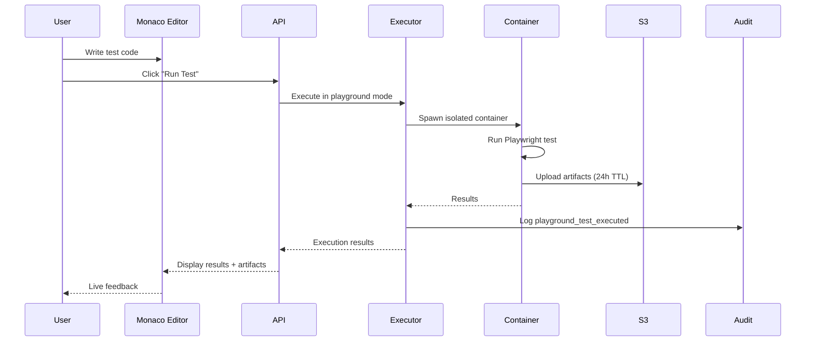
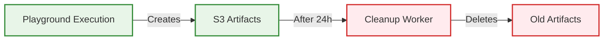
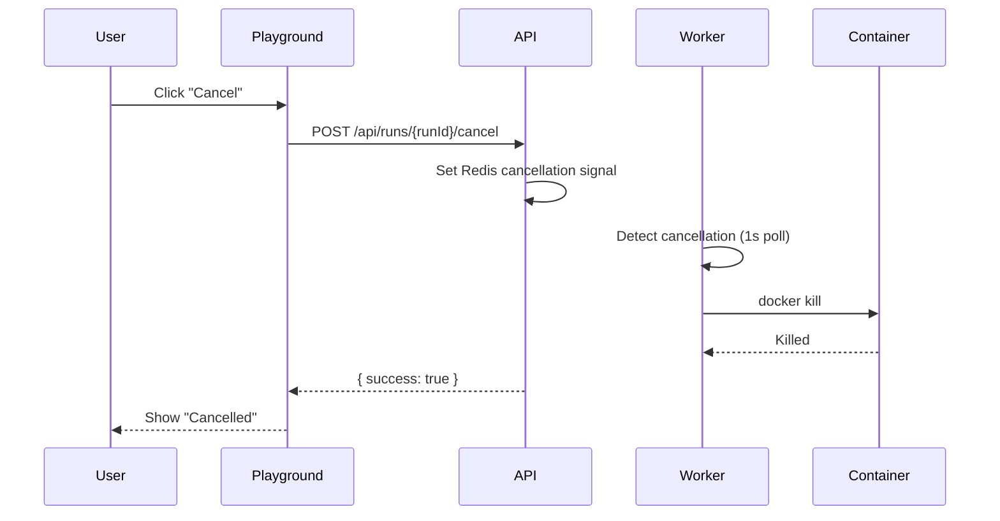

# Playground System

## Overview

The Playground System provides an **interactive sandbox environment** for rapid Playwright test development and debugging with **Monaco code editor**, **AI-powered fixes**, **template library**, and **multi-location execution**.

---

## Architecture

```mermaid
graph TB
    subgraph "🎨 Frontend Components"
        EDITOR[Monaco Code Editor<br/>Syntax highlighting]
        FORM[Test Configuration<br/>Browser, location, timeout]
        TEMPLATES[Template Library<br/>Pre-built examples]
        AI[AI Fix Integration<br/>Error analysis]
        LOCATION[Location Selector<br/>Multi-region support]
    end

    subgraph "⚡ Execution"
        EXEC[Playground Executor]
        CONTAINER[Docker Container<br/>Isolated execution]
    end

    subgraph "💾 Storage & Tracking"
        S3[S3 Artifacts<br/>Temporary storage]
        AUDIT[Audit Logs<br/>playground_test_executed]
        CLEANUP[Cleanup Worker<br/>24-hour retention]
    end

    EDITOR --> EXEC
    FORM --> EXEC
    TEMPLATES --> EDITOR
    AI --> EDITOR

    EXEC --> CONTAINER
    CONTAINER --> S3
    EXEC --> AUDIT
    S3 --> CLEANUP

    classDef frontend fill:#e3f2fd,stroke:#1976d2,stroke-width:2px
    classDef execution fill:#fff3e0,stroke:#f57c00,stroke-width:2px
    classDef storage fill:#e8f5e8,stroke:#388e3c,stroke-width:2px

    class EDITOR,FORM,TEMPLATES,AI,LOCATION frontend
    class EXEC,CONTAINER execution
    class S3,AUDIT,CLEANUP storage
```

---

## Key Features

### 1. Monaco Code Editor

- TypeScript/JavaScript syntax highlighting
- Auto-completion for Playwright APIs
- Real-time error detection
- Code formatting support

### 2. Template Library

- Login flows
- Form submissions
- API testing patterns
- Visual regression examples
- Performance testing

### 3. AI-Powered Fixes

- Automatic error analysis
- Intelligent code suggestions
- One-click fix application
- Diff viewer for changes

### 4. Multi-Location Execution

- US East, US West, EU, APAC
- Geographic performance testing
- Latency comparison

---

## Execution Flow

---

## Data Lifecycle

### Cleanup Strategy

- **Retention:** 24 hours
- **Schedule:** 5 AM daily
- **Target:** S3 playground artifacts
- **Tracking:** Via audit logs

---

## Execution Cancellation

Playground tests support **real-time cancellation** during execution.

### How It Works

1. User clicks "Cancel" button (red X overlay on Run button)
2. **Confirmation dialog** appears asking user to confirm
3. On confirm, API sets cancellation signal in Redis
4. Worker detects signal (polling every 1 second)
5. Docker container is killed immediately (exit code 137)
6. UI shows "Cancelled" status with Ban icon

### UI Consistency with Jobs

The Playground Run button matches the Jobs Run button UI:

- **Run Button**: Blue button with Zap icon, disabled while running
- **Cancel Button**: Red circular overlay on top-right when running
- **Confirmation Dialog**: Same dialog as Jobs page before cancelling
- **Status Display**: "Cancelled" status with Ban icon (same as Jobs/Runs)

### Cancellation Flow

---

## Summary

✅ **Interactive Development** - Real-time code editing and execution
✅ **Template Library** - Jumpstart with pre-built patterns
✅ **AI Integration** - Intelligent error fixing
✅ **Multi-Location** - Test from multiple regions
✅ **Automatic Cleanup** - 24-hour artifact retention
✅ **Cancellation Support** - Stop running tests instantly
