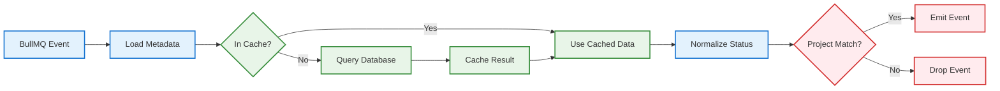
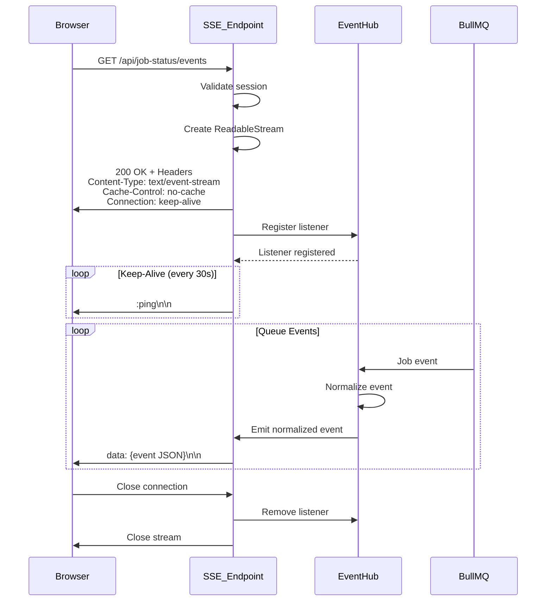
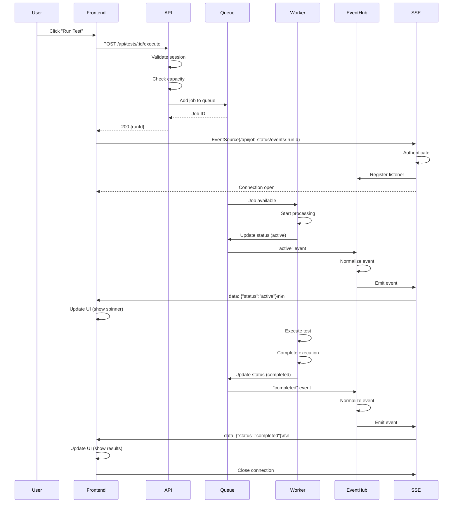
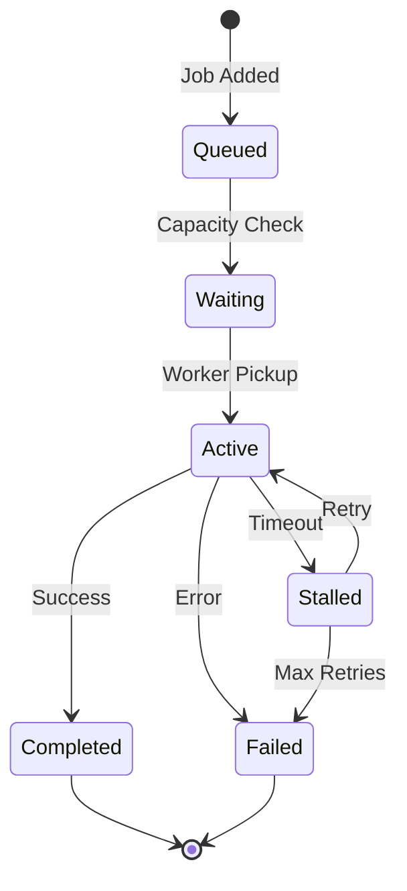
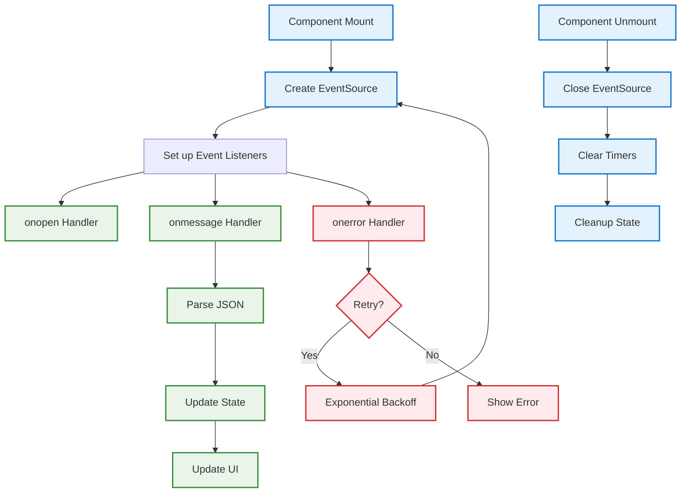
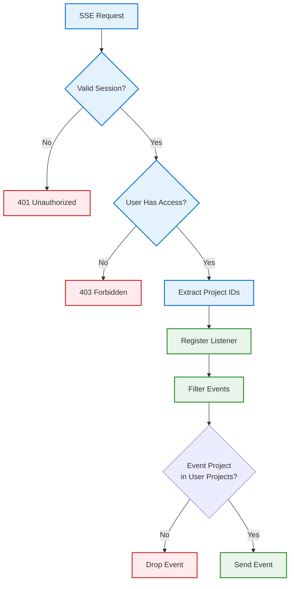
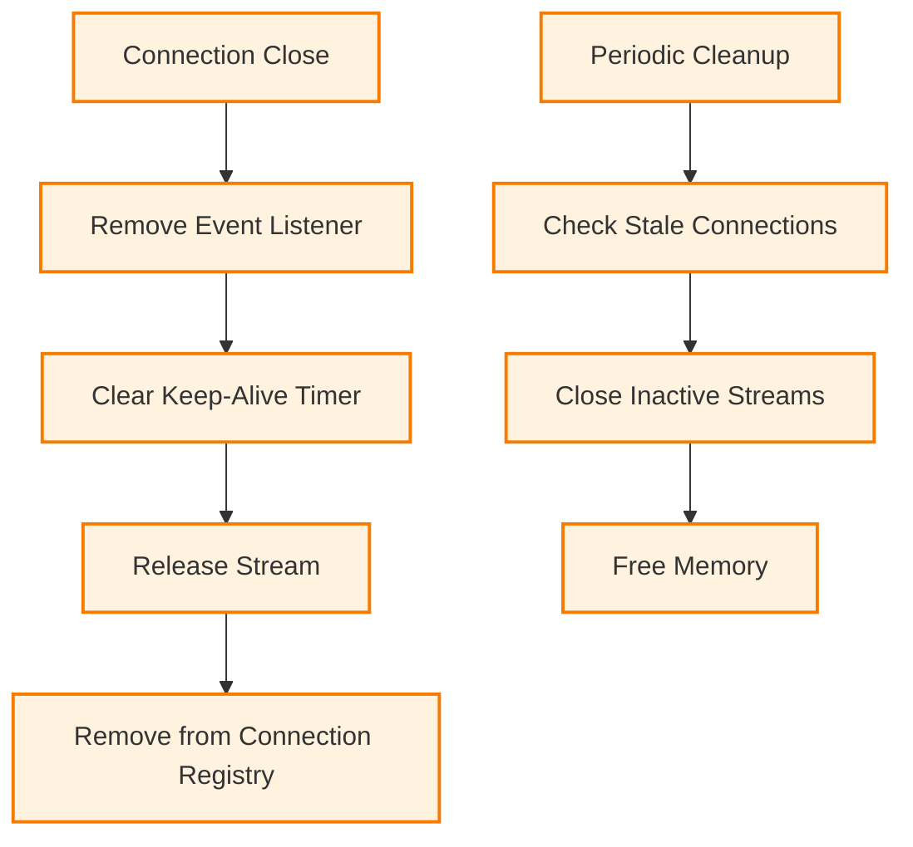

# Real-Time Status Updates with Server-Sent Events (SSE) Specification

## Overview

Supercheck implements real-time status updates using **Server-Sent Events (SSE)** combined with **BullMQ Queue Events** via a centralized **Queue Event Hub**. This provides instant feedback to users during test execution, job processing, and system operations without the overhead of HTTP polling. The Queue Event Hub listens to BullMQ queue events (waiting, active, completed, failed, stalled) and streams them to connected SSE clients.

## Table of Contents

1. [System Architecture](#system-architecture)
2. [Queue Event Hub](#queue-event-hub)
3. [SSE Implementation](#sse-implementation)
4. [Event Flow](#event-flow)
5. [API Endpoints](#api-endpoints)
6. [Frontend Integration](#frontend-integration)
7. [Security & Authorization](#security--authorization)
8. [Performance Optimization](#performance-optimization)
9. [Error Handling](#error-handling)
10. [Testing Guide](#testing-guide)

## System Architecture

```mermaid
graph TB
    subgraph "🎨 Frontend Layer"
        UI[User Interface]
        ES[EventSource Client]
        STATE[React State]
    end

    subgraph "🔐 API Layer"
        SSE1[/api/job-status/events]
        SSE2[/api/job-status/events/:runId]
        SSE3[/api/test-status/:runId/sse]
        SSE4[/api/queue-stats/sse]
    end

    subgraph "📡 Queue Event Hub"
        HUB[Event Hub Singleton]
        EVENTS[Event Emitter]
        BULLMQ[BullMQ QueueEvents]
    end

    subgraph "📨 Queue System"
        REDIS[Redis]
        QUEUE1[playwright-global queue]
        QUEUE2[k6-{region} queues]
        QUEUE3[monitor-{region} queues]
    end

    subgraph "⚙️ Worker Service"
        WORKER[Worker Processor]
        JOBS[Job Execution]
    end

    subgraph "💾 Database"
        DB[(PostgreSQL)]
        CACHE[Run Metadata Cache]
    end

    UI --> ES
    ES --> SSE1 & SSE2 & SSE3 & SSE4

    SSE1 & SSE2 & SSE3 --> HUB
    HUB --> EVENTS
    EVENTS --> BULLMQ

    BULLMQ --> REDIS
    QUEUE1 & QUEUE2 & QUEUE3 --> REDIS

    WORKER --> JOBS
    JOBS --> QUEUE1 & QUEUE2 & QUEUE3

    HUB --> CACHE
    CACHE --> DB

    EVENTS --> ES
    ES --> STATE
    STATE --> UI

    classDef frontend fill:#e3f2fd,stroke:#1976d2,stroke-width:2px
    classDef api fill:#f3e5f5,stroke:#7b1fa2,stroke-width:2px
    classDef hub fill:#fff3e0,stroke:#f57c00,stroke-width:2px
    classDef queue fill:#e8f5e8,stroke:#388e3c,stroke-width:2px
    classDef worker fill:#f3e5f5,stroke:#7b1fa2,stroke-width:2px
    classDef data fill:#e0f2f1,stroke:#00796b,stroke-width:2px

    class UI,ES,STATE frontend
    class SSE1,SSE2,SSE3,SSE4 api
    class HUB,EVENTS,BULLMQ hub
    class REDIS,QUEUE1,QUEUE2,QUEUE3 queue
    class WORKER,JOBS worker
    class DB,CACHE data
```

## Queue Event Hub

### Singleton Pattern

**Location:** `app/src/lib/queue-event-hub.ts`

**Purpose:** Centralized event listener that bridges BullMQ queue events to SSE streams.

```mermaid
graph TB
    A[Queue Event Hub] --> B[Initialization]

    B --> C[Create QueueEvents<br/>for each queue]
    B --> D[Set up Event Listeners]
    B --> E[Initialize Metadata Cache]

    C --> C1[playwright-global queue]
    C --> C2[k6-{region} queues]
    C --> C3[monitor-{region} queues]

    D --> D1[waiting event]
    D --> D2[active event]
    D --> D3[completed event]
    D --> D4[failed event]
    D --> D5[stalled event]

    E --> E1[In-Memory Map<br/>runId → metadata]

    F[Event Emitter] --> G[Emit to SSE Streams]

    D1 & D2 & D3 & D4 & D5 --> F

    classDef init fill:#e3f2fd,stroke:#1976d2,stroke-width:2px
    classDef queue fill:#e8f5e8,stroke:#388e3c,stroke-width:2px
    classDef event fill:#fff3e0,stroke:#f57c00,stroke-width:2px
    classDef emit fill:#f3e5f5,stroke:#7b1fa2,stroke-width:2px

    class A,B init
    class C1,C2,C3 queue
    class D1,D2,D3,D4,D5 event
    class F,G emit
```

### Event Types

| Event Type | Description | When Triggered |
|------------|-------------|----------------|
| `waiting` | Job added to queue | When API adds job to BullMQ |
| `active` | Job picked up by worker | Worker starts processing |
| `completed` | Job finished successfully | Worker completes execution |
| `failed` | Job failed with error | Worker encounters error |
| `stalled` | Job stalled (no progress) | Worker timeout or crash |

### Event Normalization

**Purpose:** Convert BullMQ events to consistent format for frontend consumption.

**Normalization Steps:**
1. Extract job data from BullMQ event
2. Load cached metadata (runId, projectId, organizationId)
3. Determine normalized status
4. Filter by project scope (security)
4. Filter by project scope (security)
5. Emit normalized event

**Note on Monitor Results:**
For monitor executions, the job return value is an array of results (one per location). The Event Hub automatically detects this array format and maps it to a "passed" status if the array is non-empty, ensuring that successful distributed monitor runs are correctly reflected in the UI.



## SSE Implementation

### Connection Lifecycle



### Response Format

**Headers:**
```
Content-Type: text/event-stream
Cache-Control: no-cache
Connection: keep-alive
X-Accel-Buffering: no  (disable nginx buffering)
```

**Event Format:**
```
data: {"runId":"uuid","status":"active","timestamp":1705000000000}\n\n
```

**Keep-Alive:**
```
:ping\n\n
```

## Event Flow

### Complete Event Pipeline



### Status Transitions



## API Endpoints

> [!IMPORTANT]
> All SSE endpoints require authentication via `requireProjectContext()`. Unauthenticated requests return 401 Unauthorized.

### Job Status Events (All Projects)

**Endpoint:** `GET /api/job-status/events`

**Purpose:** Stream events for all jobs in user's accessible projects

**Authentication:** Required (project context)

**Query Parameters:**
- None (project filtering automatic based on user permissions)

**Response:**
- SSE stream with job status events
- Keep-alive pings every 30 seconds
- Automatic cleanup on connection close

**Security:**
- Session validation required
- Project-scoped event filtering
- No cross-project event leakage

### Job Status Events (Specific Run)

**Endpoint:** `GET /api/job-status/events/:runId`

**Purpose:** Stream events for a specific job run

**Authentication:** Required (project context + run ownership)

**Path Parameters:**
- `runId` - UUID of the job run

**Response:**
- SSE stream filtered to specific run
- Immediate completion event if already finished
- Connection closes after completion

**Use Cases:**
- Monitoring single job execution
- Job detail page real-time updates
- CI/CD pipeline status tracking

### Test Status Events

**Endpoint:** `GET /api/test-status/events/:testId`

**Purpose:** Stream events for individual test execution

**Authentication:** Required (project context + test ownership)

**Path Parameters:**
- `testId` - UUID of the test

**Response:**
- SSE stream for test-specific events
- Includes test-level granularity (if available)
- Verifies test belongs to user's organization/project before streaming

### Queue Statistics

**Endpoint:** `GET /api/queue-stats/sse`

**Purpose:** Stream real-time queue metrics

**Authentication:** Required (project context)

**Response:**
- Waiting jobs count
- Active jobs count
- Completed jobs count
- Failed jobs count
- Capacity utilization

**Update Frequency:** Every 5 seconds

## Frontend Integration

### EventSource Setup



### State Management

**React Pattern:**
- Use `useEffect` for EventSource lifecycle
- Store connection in ref to prevent recreations
- Update state on message events
- Cleanup in effect return function

**State Variables:**
- `status` - Current job/test status
- `loading` - Loading indicator
- `error` - Error message if any
- `progress` - Execution progress (if available)

### Connection Management

**Best Practices:**
- One EventSource per monitored resource
- Close connections on component unmount
- Handle reconnection with exponential backoff
- Clear all event listeners on cleanup
- Use AbortController for cleanup

## Security & Authorization

### Session Validation



### RBAC Integration

**Permission Checks:**
- User must have `job:read` or `test:read` permission
- Project membership validated
- Organization membership validated
- Cross-organization isolation enforced

**Event Filtering:**
- Events scoped to user's accessible projects
- No global event streams (security risk)
- Run-specific streams require ownership check

## Performance Optimization

### Connection Limits

**Per-User Limits:**
- Maximum concurrent SSE connections: 10
- Connection timeout: 5 minutes of inactivity
- Keep-alive interval: 30 seconds

**Server Limits:**
- Maximum total connections: 10,000 (configurable)
- Memory per connection: ~50KB
- CPU overhead: Minimal (event-driven)

### Caching Strategy

**Metadata Cache:**
- In-memory Map for run metadata
- TTL: 1 hour
- Max size: 10,000 entries
- Eviction: LRU

**Cache Benefits:**
- Reduces database queries
- Faster event normalization
- Lower database load

### Resource Cleanup



## Error Handling

### Connection Errors

| Error Type | Handling Strategy |
|------------|------------------|
| Network Error | Automatic reconnection with exponential backoff |
| Auth Error | Redirect to login, no retry |
| Parse Error | Log error, continue stream |
| Server Error | Retry after delay, show user message |

### Fallback Mechanisms

**Polling Fallback:**
- If SSE unavailable, fall back to HTTP polling
- Polling interval: 2 seconds
- Automatic switch back to SSE when available

**Database Polling:**
- Secondary fallback if Redis unavailable
- Query database every 3 seconds
- Higher latency but guaranteed delivery

## Testing Guide

### Test Scenarios

#### 1. Connection Establishment
**Steps:**
1. Open browser console
2. Navigate to job execution page
3. Verify EventSource connection in Network tab
4. Check for successful 200 response

**Expected:** Connection established, keep-alive pings received

#### 2. Event Reception
**Steps:**
1. Trigger job execution
2. Monitor EventSource events in console
3. Verify status transitions (waiting → active → completed)

**Expected:** Events received in correct order with valid JSON

#### 3. Connection Cleanup
**Steps:**
1. Start job execution
2. Navigate away from page
3. Check Network tab for closed connection

**Expected:** Connection closed, no memory leaks

#### 4. Reconnection
**Steps:**
1. Establish SSE connection
2. Simulate network interruption
3. Restore network
4. Verify automatic reconnection

**Expected:** Reconnection successful within 5 seconds

#### 5. Authorization
**Steps:**
1. Create job in Project A
2. Log in as user without access to Project A
3. Attempt to connect to job's SSE stream

**Expected:** 403 Forbidden, no event leakage

## Related Documentation

- **Job Execution:** See `EXECUTION_SYSTEM.md`
- **Queue System:** See `SUPERCHECK_ARCHITECTURE.md`
- **Authentication:** See `AUTHENTICATION.md`
- **RBAC:** See `RBAC_DOCUMENTATION.md`
