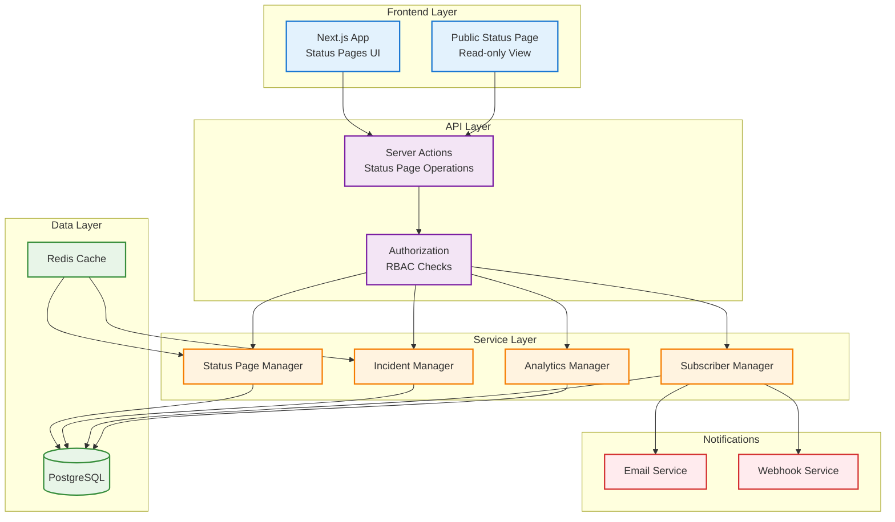
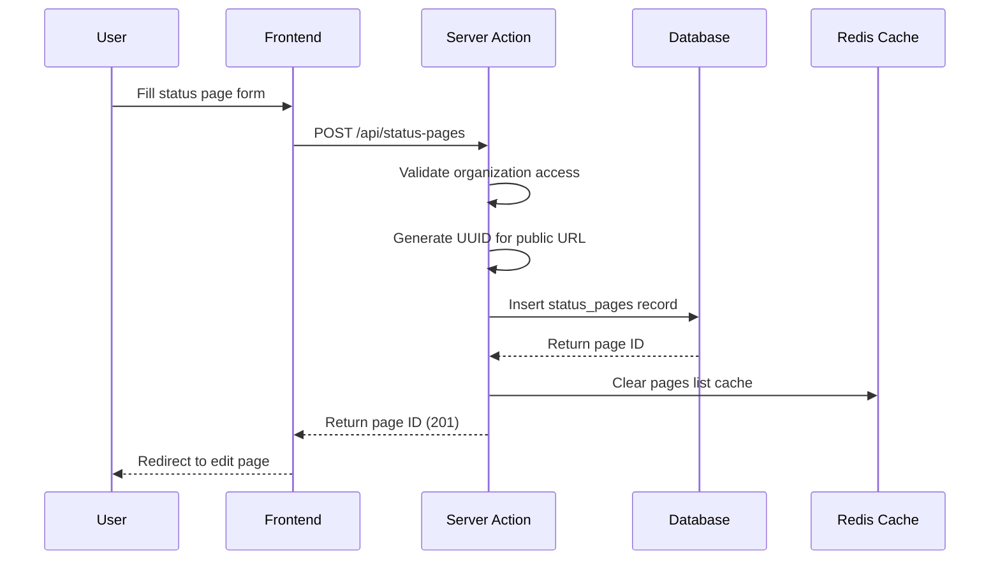
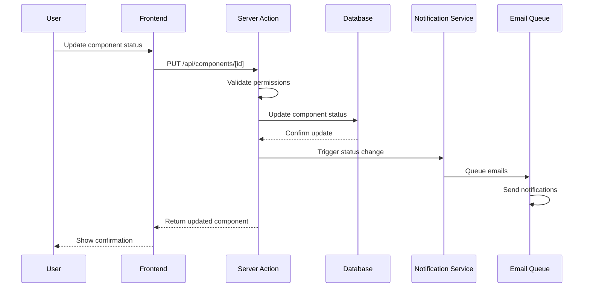
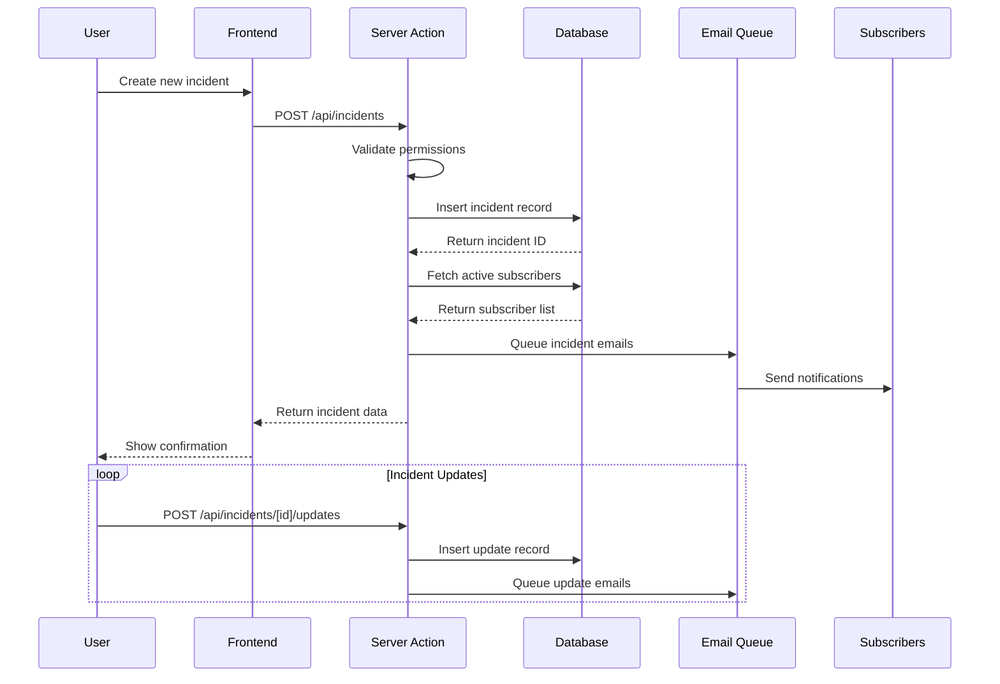
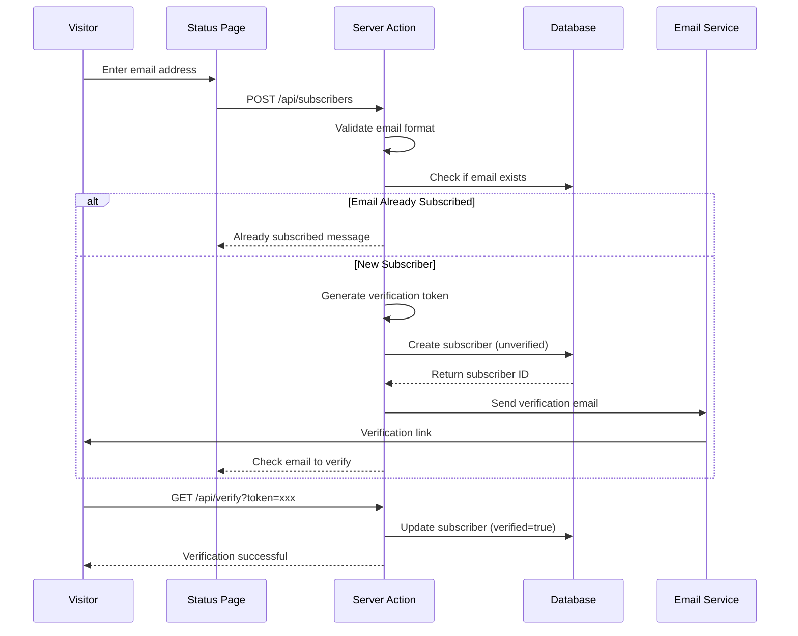
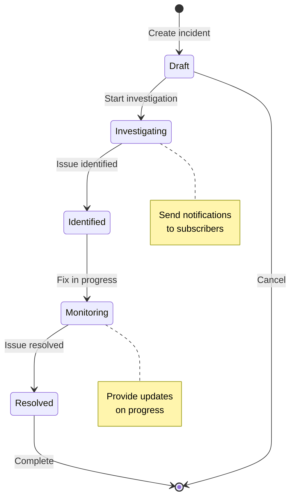

# Status Pages System

## Overview

The Status Pages system provides organizations with a public-facing service health dashboard. Users can publish real-time status updates, manage incidents, and communicate scheduled maintenance to subscribers.

### Core Capabilities

- **UUID-based Subdomains**: Unique identifiers for conflict-free public pages (e.g., `[uuid].supercheck.io`)
- **Component Management**: Organize services into logical components and groups
- **Incident Management**: Create, update, and track incidents with timeline
- **Subscriber System**: Email notifications for status changes and incidents
- **Analytics**: Track page views, subscriber metrics, and incident history
- **Multi-Page Support**: Separate status pages for different services or divisions

---

## Architecture

### System Overview



### URL Routing

**Internal Management (Authenticated):**

- `GET /status-pages` - List all status pages for organization
- `GET /status-pages/[id]` - Edit/manage specific status page
  - Tabs: Overview, Components, Incidents, Subscribers, Settings
- `GET /status-pages/[id]/public` - Preview public status page view
- Server Actions for CRUD operations:
  - `createStatusPage()` - Create new status page
  - `updateStatusPageSettings()` - Update page configuration
  - `publishStatusPage()` - Publish draft page
  - `deleteStatusPage()` - Archive/delete page

**Public Access (No Authentication Required):**

- `GET /status/[subdomain]` - View status page by subdomain
- `GET /status/[uuid]` - View status page by ID (fallback)
- `GET /status/[id]/incidents/[incidentId]` - View incident details
- `GET /api/status-pages/[id]/rss` - RSS feed for incidents
- `POST /api/status-pages/check` - Check subdomain availability
- `POST /api/status-pages/[id]/upload` - Upload branding assets

---

## Database Schema

### Core Tables

**status_pages**

- id (uuid, PK)
- organizationId (uuid, FK) - Required
- projectId (uuid, FK, nullable)
- createdByUserId (uuid, FK, nullable)
- name (varchar, 255) - Required
- subdomain (varchar, 36) - Unique, required
- status (varchar) - "draft" | "published" | "archived"
- pageDescription (text, nullable)
- headline (varchar, 255, nullable)
- supportUrl (varchar, 500, nullable)
- allowPageSubscribers (boolean) - Default: true
- allowIncidentSubscribers (boolean) - Default: true
- allowEmailSubscribers (boolean) - Default: true
- allowWebhookSubscribers (boolean) - Default: true
- allowSlackSubscribers (boolean) - Default: true
- allowRssFeed (boolean) - Default: true
- notificationsFromEmail (varchar, 255, nullable)
- notificationsEmailFooter (text, nullable)
- timezone (varchar, 50) - Default: "UTC"
- Branding: cssBodyBackgroundColor, cssFontColor, cssLightFontColor, cssGreens, cssYellows, cssOranges, cssBlues, cssReds, cssBorderColor, cssGraphColor, cssLinkColor, cssNoData
- faviconLogo (varchar, 500, nullable)
- transactionalLogo (varchar, 500, nullable)
- heroCover (varchar, 500, nullable)
- customDomain (varchar, 255, nullable) - ✅ Implemented
- customDomainVerified (boolean) - Default: false
- theme (jsonb)
- brandingSettings (jsonb)
- createdAt (timestamp)
- updatedAt (timestamp)

**status_page_components**

- id (uuid, PK)
- statusPageId (uuid, FK) - Required
- name (varchar, 255) - Required
- description (text, nullable)
- status (varchar) - "operational" | "degraded" | "offline" | "maintenance"
- showcase (boolean) - Default: true
- onlyShowIfDegraded (boolean) - Default: false
- automationEmail (varchar, 255, nullable)
- startDate (timestamp, nullable)
- position (integer) - Display order, default: 0
- aggregationMethod (varchar) - "worst_case" (monitors linked to component)
- failureThreshold (integer) - Default: 1
- createdAt (timestamp)
- updatedAt (timestamp)

**status_page_component_monitors** (Join table)

- componentId (uuid, FK) - Required
- monitorId (uuid, FK) - Required
- weight (integer) - For weighted aggregation, default: 1
- createdAt (timestamp)
- PK: (componentId, monitorId)

**incidents**

- id (uuid, PK)
- statusPageId (uuid, FK) - Required
- createdByUserId (uuid, FK, nullable)
- name (varchar, 255) - Required (incident title)
- status (varchar) - "investigating" | "identified" | "monitoring" | "resolved"
- impact (varchar) - "minor" | "major" | "critical"
- impactOverride (varchar, nullable)
- body (text, nullable) - Incident description
- scheduledFor (timestamp, nullable) - For scheduled maintenance
- scheduledUntil (timestamp, nullable)
- scheduledRemindPrior (boolean) - Default: true
- autoTransitionToMaintenanceState (boolean) - Default: true
- autoTransitionToOperationalState (boolean) - Default: true
- scheduledAutoInProgress (boolean) - Default: true
- scheduledAutoCompleted (boolean) - Default: true
- autoTransitionDeliverNotificationsAtStart (boolean) - Default: true
- autoTransitionDeliverNotificationsAtEnd (boolean) - Default: true
- reminderIntervals (varchar) - JSON array of minutes, default: "[3,6,12,24]"
- metadata (jsonb)
- deliverNotifications (boolean) - Default: true
- backfillDate (timestamp, nullable)
- backfilled (boolean) - Default: false
- monitoringAt (timestamp, nullable)
- resolvedAt (timestamp, nullable)
- shortlink (varchar, 255, nullable)
- createdAt (timestamp)
- updatedAt (timestamp)

**incident_updates**

- id (uuid, PK)
- incidentId (uuid, FK) - Required
- createdByUserId (uuid, FK, nullable)
- body (text) - Update message, required
- status (varchar) - Current incident status
- deliverNotifications (boolean) - Send notification for this update, default: true
- displayAt (timestamp) - When to show update, default: now
- createdAt (timestamp)
- updatedAt (timestamp)

**incident_components** (Affected components)

- id (uuid, PK)
- incidentId (uuid, FK) - Required
- componentId (uuid, FK) - Required
- oldStatus (varchar, nullable)
- newStatus (varchar, nullable)
- createdAt (timestamp)

**incident_templates**

- id (uuid, PK)
- statusPageId (uuid, FK) - Required
- createdByUserId (uuid, FK, nullable)
- name (varchar, 255) - Template name, required
- title (varchar, 255) - Incident title, required
- body (text) - Template body, required
- updateStatus (varchar) - Default: "investigating"
- shouldSendNotifications (boolean) - Default: true
- createdAt (timestamp)
- updatedAt (timestamp)

**status_page_subscribers**

- id (uuid, PK)
- statusPageId (uuid, FK) - Required
- email (varchar, 255, nullable) - Email subscriber
- endpoint (varchar, 500, nullable) - Webhook endpoint
- mode (varchar) - "email" | "webhook" | "slack" - Required
- skipConfirmationNotification (boolean) - Default: false
- quarantinedAt (timestamp, nullable)
- purgeAt (timestamp, nullable)
- verifiedAt (timestamp, nullable)
- verificationToken (varchar, 255, nullable)
- unsubscribeToken (varchar, 255)
- webhookSecret (varchar, 255, nullable)
- webhookFailures (integer) - Default: 0
- webhookLastAttemptAt (timestamp, nullable)
- webhookLastError (text, nullable)
- createdAt (timestamp)
- updatedAt (timestamp)

**status_page_component_subscriptions** (Component-specific)

- id (uuid, PK)
- subscriberId (uuid, FK) - Required
- componentId (uuid, FK) - Required
- createdAt (timestamp)

**status_page_incident_subscriptions** (Incident-specific)

- id (uuid, PK)
- incidentId (uuid, FK) - Required
- subscriberId (uuid, FK) - Required
- createdAt (timestamp)

**status_page_metrics**

- id (uuid, PK)
- statusPageId (uuid, FK) - Required
- componentId (uuid, FK, nullable)
- date (timestamp) - Metric date
- uptimePercentage (varchar, 10, nullable)
- totalChecks (integer) - Default: 0
- successfulChecks (integer) - Default: 0
- failedChecks (integer) - Default: 0
- averageResponseTimeMs (integer, nullable)
- createdAt (timestamp)
- updatedAt (timestamp)

**postmortems**

- id (uuid, PK)
- incidentId (uuid, FK) - Required, unique
- createdByUserId (uuid, FK, nullable)
- body (text) - Postmortem analysis, required
- bodyLastUpdatedAt (timestamp)
- ignored (boolean) - Default: false
- notifiedSubscribers (boolean) - Default: false
- publishedAt (timestamp, nullable)
- createdAt (timestamp)
- updatedAt (timestamp)

---

## Operation Flows

### Status Page Creation Flow



### Component Status Update Flow



### Incident Creation and Communication Flow



### Subscriber Verification Flow



---

## Security & Permissions

### Access Control

**Authenticated Users (Org Members):**

- View own status pages
- Edit/delete own status pages
- Create incidents
- View subscriber list
- Access analytics

**Project-Level RBAC:**

- OWNER: Full access to status pages
- EDITOR: Create/edit incidents, manage components
- VIEWER: Read-only access

**Public Access:**

- Read-only status page view
- Subscribe to notifications
- No access to edit functions
- No subscriber data exposure

### Security Implementation

**Ownership Validation (Defense in Depth):**
All authenticated server actions implement multi-level ownership validation:

1. **Authentication Check**: Verify user is authenticated via Better Auth
2. **Permission Check**: Validate RBAC permissions via `requirePermissions()`
3. **Ownership Verification**: Verify resource belongs to user's organization AND project
4. **UUID Validation**: All ID parameters validated with Zod UUID schema before database queries

Example pattern:

```typescript
// 1. Authentication and project context
const { userId, organizationId, project } = await requireProjectContext();

// 2. RBAC permission check
await requirePermissions(
  { status_page: ["update"] },
  { organizationId, projectId: project.id }
);

// 3. Ownership verification
const statusPage = await db.query.statusPages.findFirst({
  where: and(
    eq(statusPages.id, statusPageId),
    eq(statusPages.organizationId, organizationId),
    eq(statusPages.projectId, project.id)
  ),
});

if (!statusPage) {
  return { success: false, message: "Status page not found or access denied" };
}
```

**Input Validation:**

- All inputs validated with Zod schemas
- Text fields include `.trim()` and length limits
- Domain names validated with regex patterns
- Color codes validated as hex format (#RRGGBB)
- Numeric fields have min/max bounds

**Error Response Security:**

- Generic error messages returned to clients (no stack traces or implementation details)
- Internal errors logged with security context for debugging
- Failed access attempts logged with `[SECURITY]` prefix

**Audit Logging:**
All mutations are logged via `logAuditEvent()` with:

- userId
- action performed
- resource type and ID
- organizationId and projectId
- success/failure status

### Data Protection

- **Email Encryption**: Subscriber emails encrypted at rest
- **Token Security**: Verification tokens are cryptographically random (64-character hex)
- **Webhook Secrets**: HMAC secrets generated for webhook subscribers
- **Rate Limiting**: API endpoints rate-limited per organization
- **CORS**: Public pages accessible cross-origin, API restricted to same origin
- **Field Selection**: Public endpoints return only necessary fields (no internal IDs or metadata leaked)

---

## Subscriber Management Features

### Subscriber Management Tab

The Subscribers Tab provides comprehensive management of status page subscribers with the following features:

**Subscriber List & Statistics**

- Real-time statistics display: Total subscribers, verified count, pending verification count
- Status indicators for each subscriber (email mode with verification status)
- Last attempt timestamp for webhook subscribers with failure tracking

**Search & Filtering**

- Real-time email search/filtering across all subscribers
- Case-insensitive search with immediate results
- Pagination support (configurable items per page: 5, 10, 25, 50)

**Subscriber Actions**

- **Delete**: Confirmation dialog before removing subscriber
- **Resend Verification**: Send verification email to unverified subscribers
- **Export CSV**: Export all subscriber data in CSV format with headers (Email, Mode, Status, Created Date)

**UI Enhancements**

- Badge-based status indicators (Verified, Pending, Failed)
- Loading states and error messages
- Toast notifications for actions (success/error feedback)
- Responsive table layout with proper spacing
- Empty state message when no subscribers exist

---

## Content Management

### Incident Lifecycle



### Component Status Hierarchy

```
Page Status = Worst component status

Operational (Green)
  └─ All components operational

Degraded (Yellow)
  └─ At least one component degraded
  └─ No components offline

Offline (Red)
  └─ At least one component offline

Maintenance (Blue)
  └─ Scheduled maintenance in progress
```

---

## Notification System

### Email Templates

- **Incident Created**: Notify subscribers of new incident
- **Incident Updated**: Provide status update to subscribers
- **Incident Resolved**: Notify resolution
- **Scheduled Maintenance**: Advanced notice of maintenance
- **Verification Email**: Confirm subscription

### Subscriber Preferences

```json
{
  "notifyOnIncident": true,
  "notifyOnIncidentUpdate": true,
  "notifyOnResolution": true,
  "notifyOnMaintenance": true,
  "frequency": "immediate"
}
```

---

## Analytics & Insights

### Metrics Tracked

**Per Status Page:**

- Total page views
- Unique visitors
- Average visit duration
- Subscriber growth rate
- Unsubscribe rate

**Per Incident:**

- Detection to resolution time
- Number of updates
- Subscriber notifications sent
- Affected components count

### Data Retention

- Daily metrics: 90 days retention
- Incident history: 1 year retention
- Subscriber data: Until unsubscribe + 30 days

---

## Deployment Considerations

### Environment Variables

```
STATUS_PAGE_DOMAIN=supercheck.io
STATUS_PAGE_SUBDOMAIN_WILDCARD=*.supercheck.io
SUBSCRIBER_EMAIL_QUEUE_NAME=status-page-emails
MAX_SUBSCRIBERS_PER_PAGE=10000
INCIDENT_UPDATE_LIMIT=100
```

### Scaling Considerations

- **Read-heavy**: Optimize public page views with caching
- **Write-heavy**: Batch subscriber notifications
- **Storage**: Archive old incidents monthly
- **Email Queue**: Distributed processing for large subscriber bases

### Performance Targets

| Operation               | Target  | Notes              |
| ----------------------- | ------- | ------------------ |
| Load status page        | < 2s    | Cached on CDN      |
| Create incident         | < 1s    | Sync write         |
| Send notifications      | < 5s    | Async queue        |
| List subscribers        | < 500ms | Paginated          |
| Update component status | < 500ms | Cache invalidation |

---

## Implemented Features

✅ **Custom Domains** - Full support with verification flag (customDomain, customDomainVerified)
✅ **Webhook Notifications** - Multi-mode subscribers (email, webhook, slack)
✅ **RSS Feed** - Configurable RSS feed support (allowRssFeed)
✅ **Advanced Incident Management** - Scheduled maintenance, auto-transitions, templated responses
✅ **Component Aggregation** - Link multiple monitors to components with weighted status
✅ **Detailed Analytics** - Uptime tracking, response times, check statistics per component
✅ **Postmortems** - Post-incident analysis and notifications
✅ **Customizable Theming** - Full CSS color customization and branding
✅ **Subscriber Management Enhancements** - CSV export, search/filtering, pagination, deletion confirmation
✅ **Email Verification** - Verification tokens and resend functionality with confirmation dialogs
✅ **Subscriber Statistics** - Live statistics display (total, verified, pending counts)

## Future Enhancements

- **Advanced Analytics**: Historical trends, predictions, and SLA reporting
- **Multi-language**: Support international audiences
- **Public API**: Enable programmatic status updates and integrations
- **Status Page Cloning**: Template creation from existing pages
- **Custom Status Types**: Beyond standard operational/degraded/offline states
- **Integration Marketplace**: Third-party service integrations (PagerDuty, Opsgenie, etc.)
