# Tag Management System

## Overview

The Tag Management System provides **organizational capabilities** for tests and monitors through customizable, color-coded tags. Tags enable efficient categorization, filtering, and bulk operations across testing and monitoring resources.

**🏷️ Project-Scoped Tags:** All tags are scoped to projects with RBAC enforcement for secure multi-tenant operations.

**🎨 User-Defined Colors:** Tag colors are completely customizable - users can assign colors based on their own organizational preferences and workflows.

---

## System Architecture

```mermaid
graph TB
    subgraph "🎨 Frontend Layer"
        UI[Tag Management UI]
        FILTER[Tag Filter Components]
        PICKER[Tag Color Picker]
    end

    subgraph "🔐 API Layer"
        API1[/api/tags - CRUD Operations]
        API2[/api/tags/id - Individual Tag]
        API3[/api/tests/id/tags - Test Associations]
        API4[/api/monitors/id/tags - Monitor Associations]
    end

    subgraph "💾 Database Layer"
        TAGS[(tags table)]
        TEST_TAGS[(testTags join table)]
        MONITOR_TAGS[(monitorTags join table)]
    end

    UI --> API1 & API2
    FILTER --> API1
    PICKER --> API1

    API1 & API2 --> TAGS
    API3 --> TEST_TAGS
    API4 --> MONITOR_TAGS

    TAGS --> TEST_TAGS & MONITOR_TAGS

    classDef frontend fill:#e3f2fd,stroke:#1976d2,stroke-width:2px
    classDef api fill:#f3e5f5,stroke:#7b1fa2,stroke-width:2px
    classDef data fill:#e8f5e8,stroke:#388e3c,stroke-width:2px

    class UI,FILTER,PICKER frontend
    class API1,API2,API3,API4 api
    class TAGS,TEST_TAGS,MONITOR_TAGS data
```

---

## Tag Structure

### Tag Properties

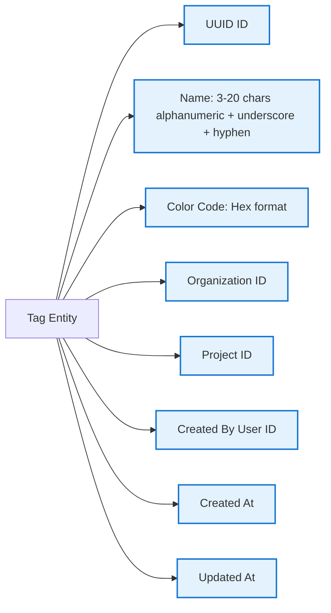

### Available Color Palette

8 default colors are available, but **users can use any color for any purpose**:

| Color | Hex Code |
|-------|----------|
| Blue | `#3b82f6` |
| Green | `#10b981` |
| Red | `#ef4444` |
| Yellow | `#f59e0b` |
| Purple | `#8b5cf6` |
| Pink | `#ec4899` |
| Indigo | `#6366f1` |
| Orange | `#f97316` |

> 💡 **Flexible Usage:** Tag colors are entirely up to the user. Assign colors based on your team's workflow, priorities, test types, or any other organizational system that works for you.

---

## Tag Operations

### Create Tag Flow

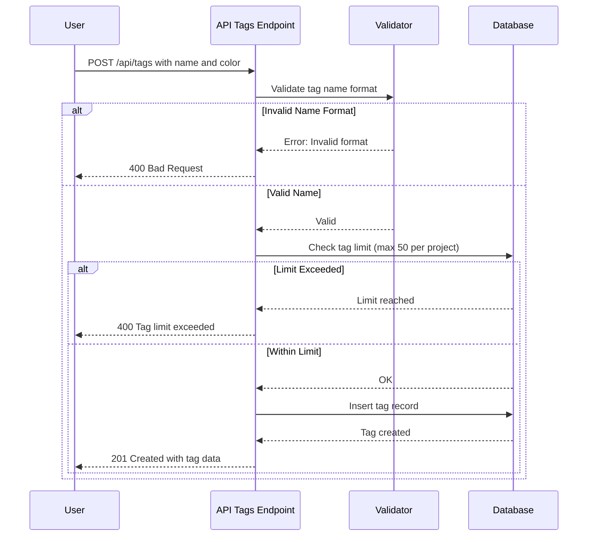

### Tag Association Flow

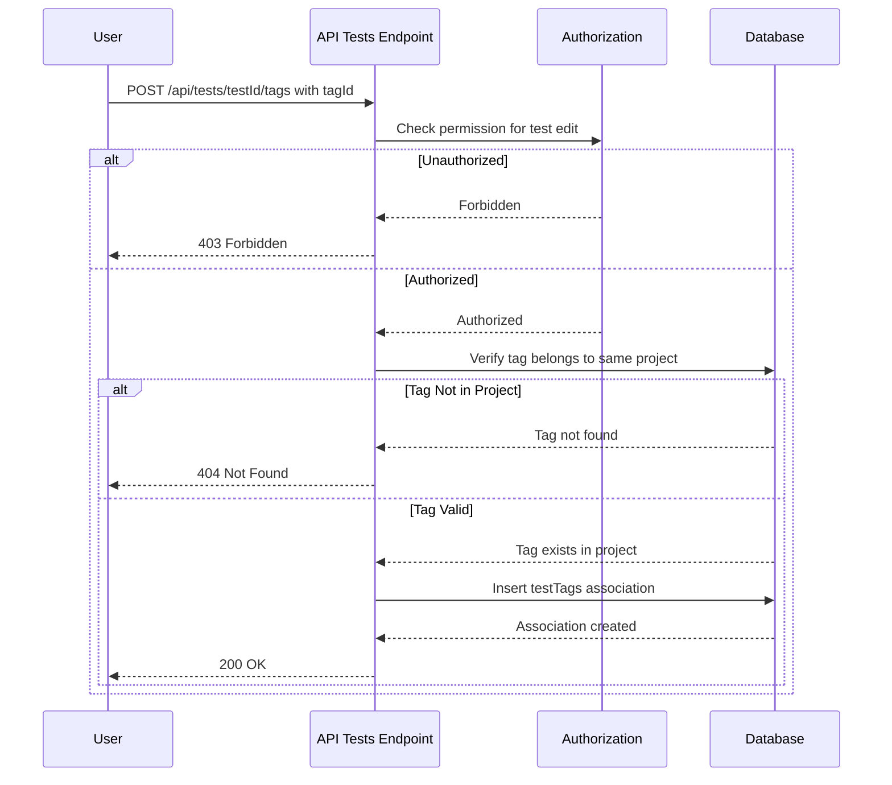

---

## Tag Filtering & Search

### Filter Architecture

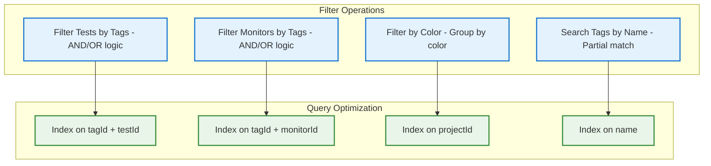

### Filter Query Logic

**AND Logic (Test has ALL specified tags):**
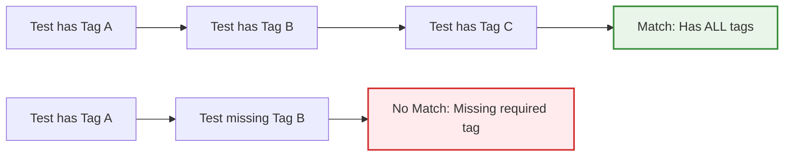

**OR Logic (Test has ANY specified tag):**
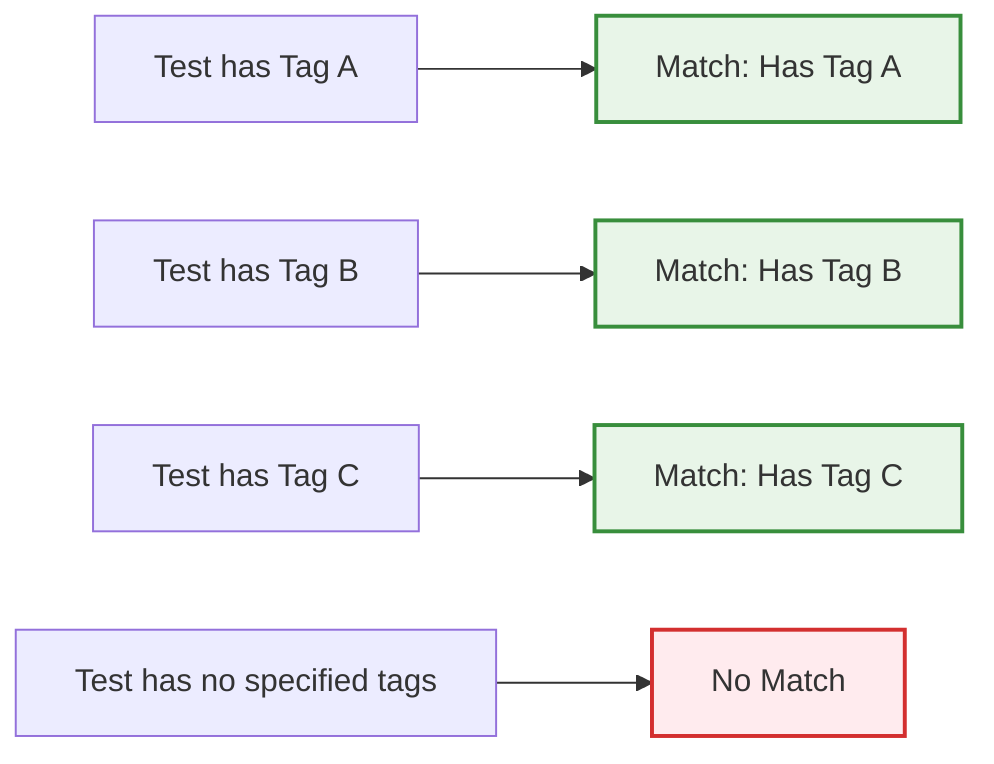

---

## Tag Limits & Validation

### Validation Rules

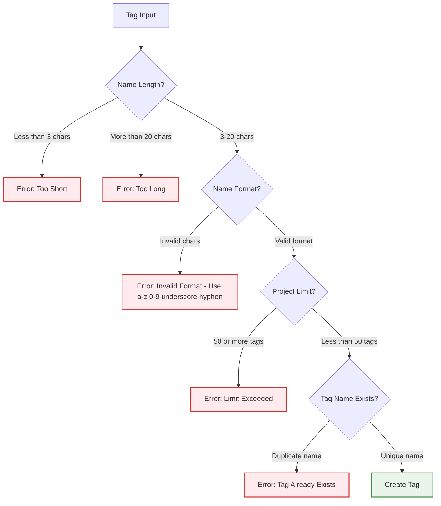

### Tag Limits

| Limit Type | Value | Reason |
|------------|-------|--------|
| Max Tags per Project | 50 | Prevent tag sprawl and maintain organization |
| Name Length Min | 3 chars | Ensure meaningful tag names |
| Name Length Max | 20 chars | UI display constraints |
| Name Format | a-z, 0-9, _, - | Alphanumeric, underscore, hyphen only |
| Color Format | Hex (#rrggbb) | Standard color representation |

---

## Bulk Operations

### Bulk Tag Assignment

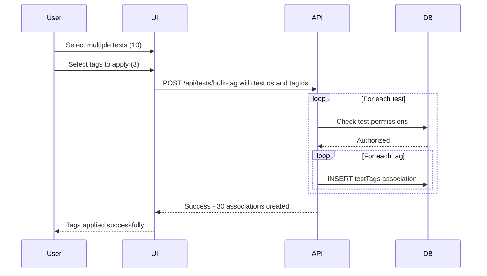

### Bulk Tag Removal

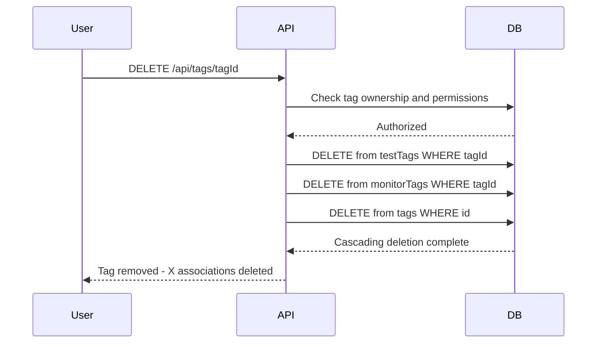

---

## Tag Usage Analytics

### Tag Statistics

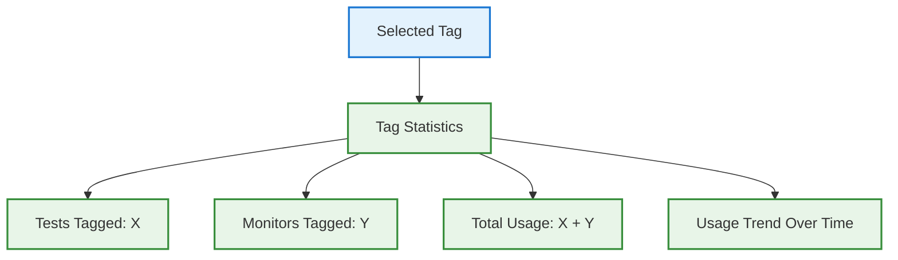

---

## RBAC Integration

### Permission Matrix

| Action | Required Permission | Notes |
|--------|-------------------|-------|
| View Tags | `test:view` or `monitor:view` | Read-only access to tags |
| Create Tag | `test:edit` | Project editor role or higher |
| Update Tag | `test:edit` | Tag creator or project admin |
| Delete Tag | `test:delete` | Tag creator or project admin |
| Assign Tag to Resource | `test:edit` | Can assign to owned resources |

### Permission Check Flow

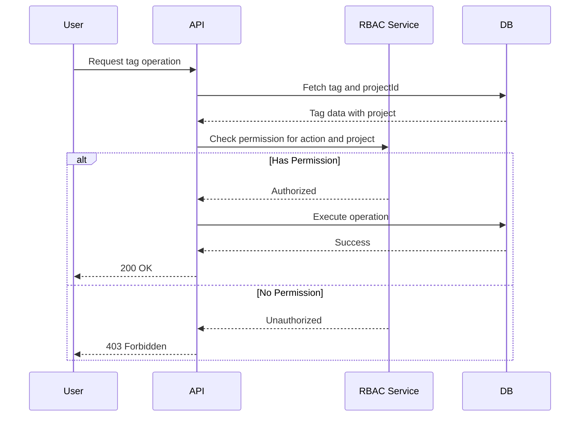

---

## Best Practices

### Recommended Tagging Strategies

Users can organize tags however they prefer. Here are some common patterns teams use:

**By Environment:**
- `dev`, `staging`, `production`

**By Test Type:**
- `e2e`, `api`, `unit`, `integration`, `smoke`

**By Priority:**
- `critical`, `high`, `medium`, `low`, `p0`, `p1`

**By Team:**
- `frontend`, `backend`, `qa`, `devops`

**By Feature:**
- `checkout`, `auth`, `payments`, `dashboard`

**By Status:**
- `stable`, `flaky`, `deprecated`, `wip`

> 💡 **Your Choice:** The above are just examples. Design a tagging system that fits your team's workflow and organizational needs.

### Tag Naming Conventions

✅ **Good Examples:**
- `e2e-checkout`
- `critical-path`
- `api-v2`
- `frontend-team`
- `smoke-test`

❌ **Bad Examples:**
- `test` (too generic)
- `important!!!` (special characters not allowed)
- `e` (too short - minimum 3 characters)
- `very-long-tag-name-exceeds-twenty-chars` (too long - maximum 20 characters)

---

## Summary

The Tag Management System provides:

✅ **Flexible Organization** - Categorize tests and monitors your way
✅ **User-Defined Colors** - 8 colors available, use them however you prefer
✅ **Project Scoping** - Tags isolated per project for multi-tenancy
✅ **RBAC Integration** - Permission-based tag operations
✅ **Bulk Operations** - Efficient tag assignment and removal across multiple resources
✅ **Smart Filtering** - AND/OR logic for advanced query capabilities
✅ **Usage Analytics** - Track tag adoption and usage patterns
✅ **Validation Rules** - Prevent tag sprawl with 50-tag limit per project
✅ **Name Validation** - Ensure consistent, meaningful tag names
