# Data Lifecycle System - Cleanup & Retention Management

## Overview

The Supercheck data lifecycle system provides **enterprise-grade cleanup operations** for managing data retention, archival, and resource cleanup across all entities. The system uses **BullMQ** for distributed job processing and supports **configurable retention policies** per entity type.

**🔄 Automated Cleanup:** Scheduled cleanup jobs run during off-peak hours to maintain optimal database and storage performance.

**🔒 Safe by Design:** Dry-run mode, batch processing, and safety limits prevent accidental data loss.

**🏢 Multi-Tenant Aware:** Organization-level isolation with plan-based retention policies.

---

## Multi-Tenancy & Plan-Based Retention

### Overview

The data lifecycle system is **multi-tenant aware**, meaning it respects organization boundaries and subscription plan limits when cleaning up data. This ensures that:

1. **Each organization's data is isolated** - Cleanup operations process data per-organization
2. **Retention periods match subscription plans** - Different plans have different data retention
3. **Fair resource allocation** - Cleanup doesn't favor larger tenants over smaller ones

### Plan-Based Retention Periods

Supercheck implements a **three-tier data retention model** following industry best practices (Checkly, Better Stack, GitHub Actions):

| Subscription Plan | Raw Data Retention | Aggregated Data Retention | Job Runs Retention | Use Case                             |
| ----------------- | ------------------ | ------------------------- | ------------------ | ------------------------------------ |
| **Plus**          | 7 days             | 30 days                   | 30 days            | Light usage, basic monitoring        |
| **Pro**           | 30 days            | 365 days (1 year)         | 90 days            | Professional teams, compliance needs |
| **Unlimited**     | 365 days           | 730 days (2 years)        | 365 days           | Self-hosted, enterprise deployments  |

**Key Distinction:**

- **Raw Data** (`monitor_results`): Individual check results with full details
- **Aggregated Data** (`monitor_aggregates`): Pre-computed hourly/daily P50, P95, P99, avg, uptime metrics
- **Job Runs** (`runs`): Execution logs, artifacts, and results for scheduled jobs

### Industry Comparison: Data Retention Best Practices

Based on analysis of leading monitoring platforms (December 2024):

#### Checkly Retention Model

| Plan       | Raw Data | Aggregated Metrics | Notes                   |
| ---------- | -------- | ------------------ | ----------------------- |
| Hobby      | 7 days   | 30 days            | Basic monitoring        |
| Starter    | 7 days   | 30 days            | Small teams             |
| Team       | 30 days  | 1 year             | Professional teams      |
| Enterprise | 180 days | 25 months          | Full compliance support |

#### Better Stack Retention Model

| Feature        | Retention | Notes                        |
| -------------- | --------- | ---------------------------- |
| Free metrics   | 30 days   | 2B metrics included          |
| Bundle metrics | 13 months | Extended historical analysis |
| Logs           | 3-30 days | Depends on plan              |

#### CI/CD Platforms Job Retention (Reference for Job Runs)

| Platform       | Default | Maximum            | Notes              |
| -------------- | ------- | ------------------ | ------------------ |
| GitHub Actions | 90 days | 400 days (private) | Logs and artifacts |
| CircleCI       | 30 days | 30 days            | Artifacts storage  |
| GitLab CI      | 30 days | 90 days (Pro)      | Job artifacts      |

#### Key Industry Insights

1. **Tiered Data Strategy**: Industry leaders separate **raw data** (7-30 days) from **aggregated metrics** (months to years)
2. **Resource Optimization**: Raw check results (high volume) are deleted quickly; aggregated P95/avg/uptime stored long-term
3. **Compliance-Friendly**: Enterprise plans extend raw data for audit requirements (180+ days)
4. **Cost Efficiency**: Aggregated data requires ~99% less storage than raw data
5. **Job Artifacts**: CI/CD platforms typically retain job logs 30-90 days (storage-intensive)

#### Supercheck Implementation (Now Aligned with Industry)

| Metric                   | Plus Plan       | Pro Plan          | Unlimited Plan    |
| ------------------------ | --------------- | ----------------- | ----------------- |
| Raw data retention       | 7 days ✅       | 30 days ✅        | 365 days ✅       |
| Aggregated data (hourly) | 7 days          | 7 days            | 7 days            |
| Aggregated data (daily)  | 30 days ✅      | 365 days (1yr) ✅ | 730 days (2yr) ✅ |
| Long-term metrics        | ✅ Pre-computed | ✅ Pre-computed   | ✅ Pre-computed   |

**Storage Efficiency**: Aggregated data provides 98%+ storage reduction compared to raw data while maintaining full visibility into P95, avg, uptime metrics for long-term trend analysis.

### How Multi-Tenancy Works


### Implementation Details

**Monitor Results Cleanup (Multi-Tenant)**:

```typescript
// For each organization:
// 1. Get their plan's dataRetentionDays (7/30/365 for raw data)
// 2. Calculate org-specific cutoff date
// 3. Find monitors belonging to this org
// 4. Delete only that org's old monitor results

// Example: Plus plan org (7 days raw data)
const cutoffDate = new Date(Date.now() - 7 * 24 * 60 * 60 * 1000);
// Example: Pro plan org (30 days raw data)
const cutoffDate = new Date(Date.now() - 30 * 24 * 60 * 60 * 1000);
```

**Monitor Aggregates Cleanup (Multi-Tenant)**:

```typescript
// For each organization:
// 1. Get their plan's aggregatedDataRetentionDays (30/365/730)
// 2. Cleanup hourly aggregates older than 7 days (all plans)
// 3. Cleanup daily aggregates older than plan retention

// Example: Plus plan org (30 days aggregated)
const hourlyCleanup = 7 * 24 * 60 * 60 * 1000; // Always 7 days
const dailyCleanup = 30 * 24 * 60 * 60 * 1000; // Plus: 30 days
// Example: Pro plan org (365 days aggregated)
const dailyCleanup = 365 * 24 * 60 * 60 * 1000; // Pro: 365 days
```

### PostgreSQL TTL Behavior

**Important**: PostgreSQL does **NOT** have automatic TTL (Time-To-Live) row expiration like Redis or MongoDB.

| Feature           | PostgreSQL                       | Redis              | MongoDB            |
| ----------------- | -------------------------------- | ------------------ | ------------------ |
| Automatic TTL     | ❌ No                            | ✅ Yes             | ✅ Yes             |
| Expiration Column | Requires explicit cleanup        | Built-in EXPIRE    | Built-in TTL Index |
| Cleanup Method    | Application-level (this service) | Automatic eviction | Background thread  |

**Why This Matters**:

- The `expiresAt` column in `webhook_idempotency` does NOT auto-delete rows
- The data lifecycle service must explicitly delete expired records
- This is the recommended approach for PostgreSQL-based applications
- Provides more control over cleanup timing and resource usage

### Resource Consumption

The cleanup system is designed to minimize resource impact:

| Optimization                  | Description                   | Impact                          |
| ----------------------------- | ----------------------------- | ------------------------------- |
| **Batch Processing**          | Delete 1000 records at a time | Prevents long-running queries   |
| **Inter-Batch Delay**         | 100ms delay between batches   | Allows other queries to execute |
| **Off-Peak Scheduling**       | 2-4 AM daily                  | Runs during low traffic         |
| **Safety Limits**             | Max 1M records per run        | Prevents runaway deletions      |
| **Sequential Org Processing** | One organization at a time    | Fair resource allocation        |

### Cloud vs Self-Hosted Behavior

| Mode                               | Behavior                                       |
| ---------------------------------- | ---------------------------------------------- |
| **Cloud (SELF_HOSTED=false)**      | Multi-tenant cleanup with plan-based retention |
| **Self-Hosted (SELF_HOSTED=true)** | Global cleanup with configurable retention     |

---

## System Architecture

### Complete Architecture Overview


---

## Cleanup Strategies

### Strategy Overview

```mermaid
graph LR
    subgraph "Cleanup Strategies"
        M[Monitor Results<br/>✅ Enabled by default<br/>Plan-based retention]
        MA[Monitor Aggregates<br/>✅ Enabled by default<br/>Hourly: 7d / Daily: Plan-based]
        J[Job Runs<br/>✅ Enabled by default<br/>Plan-based: 30-365 days]
        P[Playground<br/>✅ Enabled by default<br/>24 hours retention]
        W[Webhook Idempotency<br/>✅ Enabled by default<br/>TTL-based]
    end

    M --> MD[Delete old check results<br/>Preserve status changes]
    MA --> MAD[Delete hourly > 7d<br/>Delete daily per plan]
    J --> JD[Delete run records<br/>Delete S3 artifacts<br/>Delete reports]
    P --> PD[Delete S3 artifacts<br/>Delete temp files]
    W --> WD[Delete expired webhook<br/>deduplication records]

    classDef enabled fill:#e8f5e8,stroke:#388e3c,stroke-width:2px
    classDef disabled fill:#fff3e0,stroke:#f57c00,stroke-width:2px
    classDef action fill:#e3f2fd,stroke:#1976d2,stroke-width:2px

    class M,MA,J,W enabled
    class P disabled
    class MD,MAD,JD,PD,WD action
```



### 1. Monitor Results Cleanup

**Configuration:**

- **Entity Type:** monitor_results
- **Status:** ✅ Enabled by default
- **Schedule:** 2 AM daily (0 2 \* \* \*)
- **Retention:** Plan-based (Plus: 7 days, Pro: 30 days, Unlimited: 365 days)
- **Batch Size:** 1000 records
- **Safety Limit:** 1,000,000 records

**Environment Variables:**

- `MONITOR_CLEANUP_ENABLED`: true
- `MONITOR_CLEANUP_CRON`: "0 2 \* \* \*"
- `MONITOR_CLEANUP_BATCH_SIZE`: 1000
- `MONITOR_CLEANUP_SAFETY_LIMIT`: 1000000

> Note: Retention is configured per plan in the database, not via environment variables.

**What Gets Deleted:**

- ✅ Old monitor check results (older than plan retention)
- ❌ Status change records (preserved for alert history)
- ❌ Recent results (within retention period)

### 2. Monitor Aggregates Cleanup

**Configuration:**

- **Entity Type:** monitor_aggregates
- **Status:** ✅ Enabled by default
- **Schedule:** 2:30 AM daily (30 2 \* \* \*)
- **Retention (Hourly):** 7 days (all plans)
- **Retention (Daily):** Plan-based (Plus: 30 days, Pro: 365 days, Unlimited: 730 days)
- **Batch Size:** 1000 records
- **Safety Limit:** 500,000 records

**Environment Variables:**

- `MONITOR_AGGREGATES_CLEANUP_ENABLED`: true
- `MONITOR_AGGREGATES_CLEANUP_CRON`: "30 2 \* \* \*"
- `MONITOR_AGGREGATES_CLEANUP_BATCH_SIZE`: 1000
- `MONITOR_AGGREGATES_CLEANUP_SAFETY_LIMIT`: 500000

> Note: Retention is configured per plan in the database, not via environment variables.

**What Gets Deleted:**

- ✅ Hourly aggregates older than 7 days (all plans)
- ✅ Daily aggregates older than plan retention
- ❌ Recent aggregates within retention window

### 3. Job Runs Cleanup

**Configuration:**

- **Entity Type:** job_runs
- **Status:** ✅ Enabled by default
- **Schedule:** 3 AM daily (0 3 \* \* \*)
- **Retention:** Plan-based (Plus: 30d, Pro: 90d, Unlimited: 365d)
- **Batch Size:** 100 records
- **Safety Limit:** 10,000 records

**Plan-Based Retention (aligned with CI/CD industry standards):**

| Plan      | Job Retention | Reference                      |
| --------- | ------------- | ------------------------------ |
| Plus      | 30 days       | Matches CircleCI               |
| Pro       | 90 days       | Matches GitHub Actions default |
| Unlimited | 365 days      | Self-hosted, full year         |

**Environment Variables:**

- `JOB_RUNS_CLEANUP_ENABLED`: true
- `JOB_RUNS_CLEANUP_CRON`: "0 3 \* \* \*"
- `JOB_RUNS_CLEANUP_BATCH_SIZE`: 100
- `JOB_RUNS_CLEANUP_SAFETY_LIMIT`: 10000

> Note: Retention is configured per plan in the database, not via environment variables.

**What Gets Deleted:**

- ✅ Old run records (older than plan's retention period)
- ✅ Associated reports from reports table
- ✅ S3 artifacts (reports, traces, screenshots)
- ✅ Playground runs (fixed 30-day retention)
- ❌ Recent runs (within retention window)

### 4. Playground Artifacts Cleanup

**Configuration:**

- **Entity Type:** playground_artifacts
- **Status:** ✅ Enabled by default
- **Schedule:** 5 AM daily (0 5 \* \* \*)
- **Retention:** 24 hours
- **S3 Bucket:** playwright-test-artifacts

**Environment Variables:**

- `PLAYGROUND_CLEANUP_ENABLED`: true
- `PLAYGROUND_CLEANUP_CRON`: "0 5 \* \* \*"
- `PLAYGROUND_CLEANUP_MAX_AGE_HOURS`: 24
- `S3_TEST_BUCKET_NAME`: "playwright-test-artifacts"

**What Gets Deleted:**

- ✅ S3 playground artifacts older than 24 hours
- ✅ Test reports from playground executions
- ✅ Screenshots and traces from playground tests
- ❌ Recent playground artifacts

### 5. Webhook Idempotency Cleanup

**Configuration:**

- **Entity Type:** webhook_idempotency
- **Status:** ✅ Enabled by default
- **Schedule:** 4 AM daily (0 4 \* \* \*)
- **Retention:** TTL-based (uses `expiresAt` column)
- **Batch Size:** 1000 records
- **Safety Limit:** 100,000 records

**Environment Variables:**

- `WEBHOOK_CLEANUP_ENABLED`: true
- `WEBHOOK_CLEANUP_CRON`: "0 4 \* \* \*"
- `WEBHOOK_CLEANUP_BATCH_SIZE`: 1000
- `WEBHOOK_CLEANUP_SAFETY_LIMIT`: 100000

**What Gets Deleted:**

- ✅ Expired webhook idempotency records (past `expiresAt` timestamp)
- ✅ Records used for Polar billing webhook deduplication
- ❌ Active idempotency records (within TTL window)

**PostgreSQL Note:** Unlike Redis or MongoDB, PostgreSQL does NOT have automatic TTL row expiration. The `expiresAt` column is simply a timestamp - this cleanup strategy explicitly deletes records where `expiresAt < NOW()`.

---

## Cleanup Execution Flow

### Scheduled Cleanup Flow


### Job Runs Cascading Deletion


---

## Manual Cleanup & Dry-Run

### Manual Cleanup Trigger


### Dry-Run Mode Behavior

| Operation         | Normal Mode | Dry-Run Mode |
| ----------------- | ----------- | ------------ |
| Query old records | ✅ Executed | ✅ Executed  |
| Count records     | ✅ Counted  | ✅ Counted   |
| Delete from DB    | ✅ Deleted  | ❌ Skipped   |
| Delete from S3    | ✅ Deleted  | ❌ Skipped   |
| Return metrics    | ✅ Returned | ✅ Returned  |

---

## Statistics & Monitoring

### Cleanup Status Dashboard

```mermaid
graph TB
    subgraph "Cleanup Status"
        S[Status API<br/>GET /api/cleanup/status]
    end

    S --> E[Enabled Strategies<br/>Monitor Results ✅<br/>Job Runs ❌<br/>Playground ❌]
    S --> Q[Queue Statistics<br/>Waiting jobs<br/>Active jobs<br/>Completed jobs<br/>Failed jobs]
    S --> T[Strategy Statistics<br/>Total records<br/>Old records<br/>Deletion estimates]

    classDef status fill:#e3f2fd,stroke:#1976d2,stroke-width:2px
    classDef info fill:#e8f5e8,stroke:#388e3c,stroke-width:2px

    class S status
    class E,Q,T info
```



### Performance Metrics

**Cleanup Duration:**

- Monitor Results: ~5-30 seconds
- Job Runs: ~30-120 seconds (includes S3 deletion)
- Playground Artifacts: ~10-60 seconds

**Database Impact:**

- Batch size: 1000 records for monitors, 100 for jobs
- Delay between batches: 100ms
- Minimal impact on running queries

**S3 Impact:**

- Paginated listing: 1000 objects per request
- Batch deletion
- Minimal impact on S3 performance

---

## Error Handling

### Retry Strategy


### Common Errors

| Error                           | Cause                       | Resolution                 |
| ------------------------------- | --------------------------- | -------------------------- |
| "No strategy found"             | Invalid entity type         | Check entity type spelling |
| "Database connection failed"    | DB unavailable              | Check DB connection        |
| "S3 cleanup had failures"       | S3 permission/network issue | Check S3 credentials       |
| "Cleanup queue not initialized" | Service not initialized     | Call initialize() first    |

---

## Configuration & Tuning

### Tuning Guidelines

**For High-Volume Environments:**


**For Low-Volume Environments:**


---

## Best Practices

### Implementation Checklist

```mermaid
graph TB
    START[Enable Cleanup] --> STEP1{Test with Dry-Run?}
    STEP1 -->|No| WARNING[⚠️ Always test first!]
    STEP1 -->|Yes| STEP2[Review records to delete]

    WARNING --> STEP2

    STEP2 --> STEP3[Enable Monitor Cleanup<br/>Safest strategy]
    STEP3 --> STEP4{Monitor for 1 week}
    STEP4 -->|Issues| FIX[Adjust configuration]
    STEP4 -->|No Issues| STEP5[Enable Job Runs Cleanup]

    FIX --> STEP4

    STEP5 --> STEP6{Monitor for 1 week}
    STEP6 -->|Issues| FIX2[Adjust configuration]
    STEP6 -->|No Issues| STEP7[Enable Playground Cleanup]

    FIX2 --> STEP6

    STEP7 --> STEP8[Monitor all strategies]
    STEP8 --> END[✅ Fully Enabled]

    classDef start fill:#e3f2fd,stroke:#1976d2,stroke-width:2px
    classDef step fill:#e8f5e8,stroke:#388e3c,stroke-width:2px
    classDef warning fill:#ffebee,stroke:#d32f2f,stroke-width:2px
    classDef end fill:#e8f5e8,stroke:#388e3c,stroke-width:2px

    class START start
    class STEP1,STEP2,STEP3,STEP4,STEP5,STEP6,STEP7,STEP8 step
    class WARNING,FIX,FIX2 warning
    class END end
```

### Recommended Schedule

| Strategy            | Schedule   | Rationale                            |
| ------------------- | ---------- | ------------------------------------ |
| Monitor Results     | 2 AM Daily | Off-peak hours, sufficient frequency |
| Job Runs            | 3 AM Daily | After monitor cleanup, off-peak      |
| Playground          | 5 AM Daily | After other cleanups, daily cycle    |
| Webhook Idempotency | 4 AM Daily | Clean expired webhook dedup records  |

---

## Security Audit (December 2024)

### Overview

A comprehensive security audit was performed on the data lifecycle system to identify potential vulnerabilities, performance issues, and areas for improvement.

### Issues Identified and Resolved

#### SEC-DL-001: SQL Injection Vulnerability ✅ FIXED

**Severity**: CRITICAL

**Issue**: The `MonitorResultsCleanupStrategy` and `JobRunsCleanupStrategy` used raw SQL template literals for array construction, which could potentially be vulnerable to SQL injection.

**Original Code**:

```typescript
await db.delete(monitorResults).where(
  sql`${monitorResults.id} = ANY(ARRAY[${sql.join(
    ids.map((id) => sql`${id}`),
    sql`, `
  )}])`
);
```

**Fixed Code**:

```typescript
await db.delete(monitorResults).where(inArray(monitorResults.id, ids));
```

**Resolution**: Replaced unsafe SQL array construction with Drizzle's type-safe `inArray()` operator.

#### SEC-DL-002: Missing Webhook Idempotency Cleanup ✅ FIXED

**Severity**: HIGH

**Issue**: The `webhook_idempotency` table (added for billing webhook deduplication) had no cleanup strategy, leading to unbounded growth.

**Resolution**: Added `WebhookIdempotencyCleanupStrategy` that:

- Cleans up records past their `expiresAt` timestamp
- Runs daily at 4 AM
- Processes in batches of 1000 records
- Handles gracefully if table doesn't exist (pre-migration)

#### SEC-DL-003: No Unit Tests ⚠️ NOTED

**Severity**: HIGH

**Issue**: The data lifecycle service has no dedicated unit tests, making it difficult to verify behavior and prevent regressions.

**Recommendation**: Add comprehensive tests covering:

- Each cleanup strategy's execute() method
- Dry-run mode vs actual deletion
- Error handling scenarios
- Batch processing logic
- Edge cases (empty tables, missing S3 buckets)

#### SEC-DL-004: No Transaction Support ⚠️ NOTED

**Severity**: MEDIUM

**Issue**: Multi-step deletions (database + S3) lack atomicity. If S3 deletion succeeds but database deletion fails, orphaned S3 objects remain.

**Current Mitigation**: S3 deletion happens first, then database deletion. This order ensures that if the database deletion fails, S3 objects are already deleted (preventing orphaned S3 objects with database references pointing to them).

**Recommendation**: Consider implementing a soft-delete pattern or distributed transaction for critical data.

#### SEC-DL-005: Race Conditions ⚠️ NOTED

**Severity**: MEDIUM

**Issue**: No distributed locking mechanism prevents concurrent cleanup jobs from running on different instances.

**Current Mitigation**: BullMQ's `concurrency: 1` setting ensures only one job runs at a time on each worker, and jobs are serialized via the queue.

**Recommendation**: Add Redis-based distributed locks for multi-instance deployments:

```typescript
const lockKey = `cleanup:${entityType}:lock`;
const lock = await redisClient.set(lockKey, Date.now(), "EX", 3600, "NX");
if (!lock) {
  console.log(`[DATA_LIFECYCLE] Cleanup already running for ${entityType}`);
  return;
}
```

### Best Practices Implemented

1. **Safe Parameterized Queries**: Using Drizzle's `inArray()` instead of raw SQL
2. **Batch Processing**: Records deleted in configurable batches (default 1000)
3. **Rate Limiting**: 100ms delay between batches to prevent database overload
4. **Safety Limits**: Maximum records per run (default 1M for monitors, 10K for runs)
5. **Dry-Run Support**: Test what would be deleted without actual deletion
6. **Graceful Degradation**: Missing S3 buckets don't fail the cleanup
7. **Status Change Preservation**: Monitor status change records are never deleted
8. **Comprehensive Logging**: All operations logged with entity type and counts

### Environment Variables

Retention periods are configured per plan in the database (`plan_limits` table).
Environment variables control operational settings only (schedules, batch sizes, safety limits).

| Variable                                  | Default      | Description                        |
| ----------------------------------------- | ------------ | ---------------------------------- |
| `MONITOR_CLEANUP_ENABLED`                 | `true`       | Enable monitor results cleanup     |
| `MONITOR_CLEANUP_CRON`                    | `0 2 * * *`  | Cron schedule for monitor cleanup  |
| `MONITOR_CLEANUP_BATCH_SIZE`              | `1000`       | Records per batch                  |
| `MONITOR_CLEANUP_SAFETY_LIMIT`            | `1000000`    | Max records per run                |
| `MONITOR_AGGREGATES_CLEANUP_ENABLED`      | `true`       | Enable monitor aggregates cleanup  |
| `MONITOR_AGGREGATES_CLEANUP_CRON`         | `30 2 * * *` | Cron schedule (2:30 AM daily)      |
| `MONITOR_AGGREGATES_CLEANUP_BATCH_SIZE`   | `1000`       | Records per batch                  |
| `MONITOR_AGGREGATES_CLEANUP_SAFETY_LIMIT` | `500000`     | Max records per run                |
| `JOB_RUNS_CLEANUP_ENABLED`                | `true`       | Enable job runs cleanup            |
| `JOB_RUNS_CLEANUP_CRON`                   | `0 3 * * *`  | Cron schedule for job cleanup      |
| `JOB_RUNS_CLEANUP_BATCH_SIZE`             | `100`        | Records per batch                  |
| `JOB_RUNS_CLEANUP_SAFETY_LIMIT`           | `10000`      | Max records per run                |
| `PLAYGROUND_CLEANUP_ENABLED`              | `true`       | Enable playground cleanup          |
| `PLAYGROUND_CLEANUP_CRON`                 | `0 5 * * *`  | Cron schedule (daily at 5 AM)      |
| `PLAYGROUND_CLEANUP_MAX_AGE_HOURS`        | `24`         | Max age in hours                   |
| `WEBHOOK_CLEANUP_ENABLED`                 | `true`       | Enable webhook idempotency cleanup |
| `WEBHOOK_CLEANUP_CRON`                    | `0 4 * * *`  | Cron schedule                      |
| `WEBHOOK_CLEANUP_BATCH_SIZE`              | `1000`       | Records per batch                  |
| `WEBHOOK_CLEANUP_SAFETY_LIMIT`            | `100000`     | Max records per run                |

---

## Summary

The data lifecycle system provides:

✅ **Pluggable cleanup strategies** for different entity types
✅ **Distributed job queue** via BullMQ/Redis
✅ **Plan-based retention policies** for multi-tenancy
✅ **Dry-run support** for safe testing
✅ **Comprehensive error handling** with retries
✅ **Detailed metrics and logging** for monitoring
✅ **Cascading deletion** for related records
✅ **Batch processing** to minimize database impact
✅ **Safety limits** to prevent accidental mass deletion
✅ **Flexible scheduling** with cron patterns
✅ **Webhook idempotency cleanup** for billing webhooks
✅ **Safe parameterized queries** to prevent SQL injection

---

## Related Documentation

- **[Storage System](./STORAGE_SYSTEM.md)** - S3/MinIO artifact storage
- **[Monitoring System](../04-monitoring/MONITORING_SYSTEM.md)** - Application monitoring and alerting
- **[Resilience Patterns](../08-operations/RESILIENCE_PATTERNS.md)** - Queue alerting, rate limiting, and retry logic
- **[Polar Billing Integration](../11-billing/POLAR_BILLING_INTEGRATION.md)** - Webhook idempotency details
