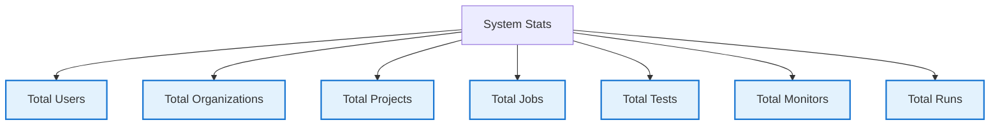
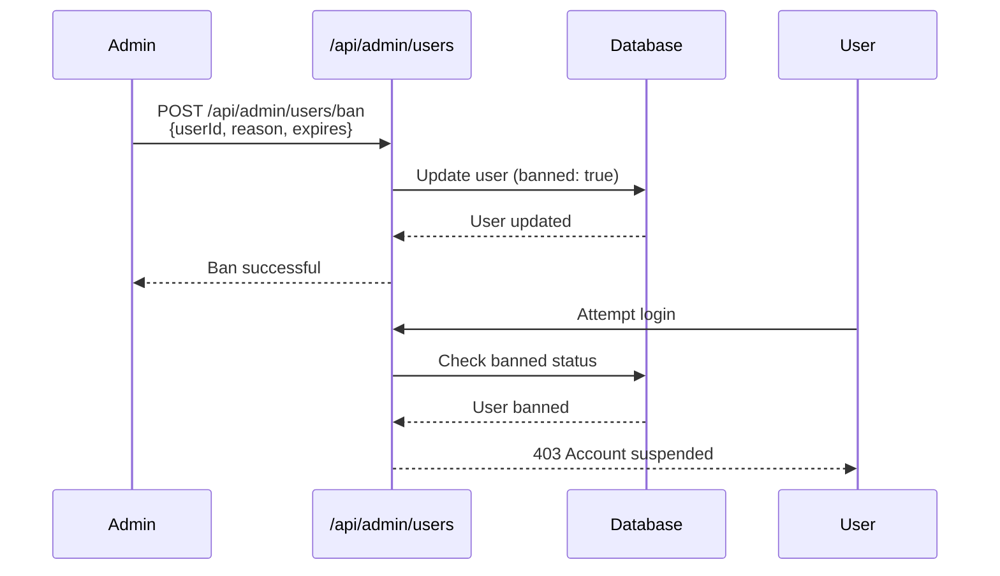
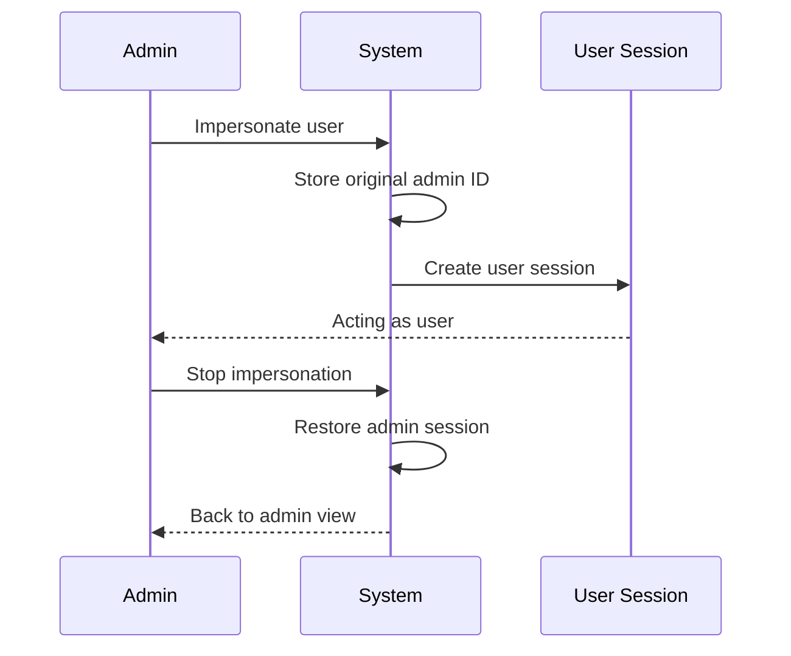

# Super Admin System

## Overview

The Super Admin System provides **platform-level management** capabilities for system administrators, including user management, organization oversight, and system health monitoring.

---

## Architecture

```mermaid
graph TB
    subgraph "👑 Super Admin Panel"
        DASHBOARD[System Dashboard]
        USERS[User Management]
        ORGS[Organization Management]
        SCHEDULER[Scheduler Control]
        QUEUES[Queue Monitor]
        HEALTH[Health Checks]
    end

    subgraph "🔐 Access Control"
        AUTH[Super Admin Auth<br/>user.role = 'super_admin']
    end

    subgraph "💾 Data Management"
        DB[(PostgreSQL<br/>All system data)]
        REDIS[(Redis<br/>Queue stats)]
    end

    DASHBOARD & USERS & ORGS & SCHEDULER & QUEUES & HEALTH --> AUTH
    AUTH --> DB
    AUTH --> REDIS

    classDef admin fill:#ffebee,stroke:#d32f2f,stroke-width:2px
    classDef auth fill:#fff3e0,stroke:#f57c00,stroke-width:2px
    classDef data fill:#e8f5e8,stroke:#388e3c,stroke-width:2px

    class DASHBOARD,USERS,ORGS,SCHEDULER,QUEUES,HEALTH admin
    class AUTH auth
    class DB,REDIS data
```



---

## Bootstrapping

The first super admin must be bootstrapped into the system. There are two methods to achieve this:

### 1. Automatic (Environment Variable) - Recommended

Set the `SUPER_ADMIN_EMAIL` environment variable in your deployment configuration (e.g., `docker-compose.yml`). The system will automatically check for this user on startup and promote them to super admin if they exist.

> [!IMPORTANT]
> Only a **single** email address is supported. Comma-separated lists are strictly prohibited to prevent misconfiguration.

```yaml
environment:
  - SUPER_ADMIN_EMAIL=admin@example.com
```

### 2. Manual (Script)

You can manually promote a user by running the bootstrap script inside the container:

```bash
# Inside the app container
npm run setup:admin -- admin@example.com
```

---

### 3. Revoking Privileges

To replace a super admin or downgrade a user, you must explicitly revoke their privileges using the revocation script:

```bash
# Inside the app container
npm run revoke:admin -- admin@example.com
```

> [!NOTE]
> This will downgrade the user's role to `admin` (Organization Admin). You can then bootstrap a new super admin using the methods above.

## Key Features

### 1. System Statistics



### 2. User Management

- Create/update/delete users
- Ban/unban users with reason
- View all user organizations
- Impersonate users for debugging

### 3. Organization Management

- View all organizations
- Organization statistics
- Member management
- Resource allocation

### 4. Scheduler Control

- Initialize schedulers
- View scheduler status
- Manually trigger jobs
- Monitor queue health

### 5. Queue Dashboard

- Real-time queue statistics
- Job counts (waiting, active, completed, failed)
- Worker utilization
- Performance metrics

#### Bull Dashboard Integration

The Queue Dashboard tab integrates BullMQ's Bull Dashboard for real-time queue monitoring:

**Implementation (`/app/src/app/super-admin/page.tsx`):**

- **Iframe Integration**: Bull Dashboard UI served via `/api/admin/queues` API route
- **Singleton Pattern**: Uses mutex-based singleton initialization to prevent multiple Bull Board instances
- **Timeout Detection**: 15-second timeout with user-friendly error state
- **Error Handling**: Comprehensive error boundary with retry capability
- **Security**: Sandboxed iframe with restricted permissions

**API Route (`/app/src/app/api/admin/queues/[[...path]]/route.ts`):**

- **Singleton Initialization**: Uses mutex to ensure single Bull Board instance
- **Connection Management**: Reuses existing Redis connections from instrumentation
- **Timeout Protection**: 30-second initialization timeout prevents hanging
- **Auto-cleanup**: Existing adapters are cleared before re-initialization

**Security Features:**

- Sandbox attributes: `allow-same-origin allow-scripts allow-forms`
- Super admin authentication required
- No external link capabilities
- Error states show retry button instead of blank iframe

---

## UI Loading States

The Super Admin dashboard implements consistent loading states across all tabs:

### TabLoadingSpinner Component

Located at `/app/src/components/shared/tab-loading-spinner.tsx`, this component provides:

- Centered spinner animation (Loader2 from Lucide)
- Customizable loading message
- Consistent height and styling across tabs

### Loading State Implementation

| Tab           | Loading Trigger | Component                   |
| ------------- | --------------- | --------------------------- |
| Users         | Data fetch      | Built-in UsersTable spinner |
| Organizations | Data fetch      | Built-in OrgsTable spinner  |
| Queues        | Iframe load     | Custom timeout/error states |

**Bull Dashboard Loading States:**

1. **Loading**: Shows "Loading queue dashboard..." with spinner
2. **Error**: Shows error message with "Try Again" button
3. **Timeout**: 15-second timeout triggers error state automatically

---

## API Endpoints

| Endpoint                      | Purpose           | Permission  |
| ----------------------------- | ----------------- | ----------- |
| `/api/admin/stats`            | System statistics | super_admin |
| `/api/admin/users`            | User CRUD         | super_admin |
| `/api/admin/organizations`    | Org management    | super_admin |
| `/api/admin/scheduler/init`   | Init schedulers   | super_admin |
| `/api/admin/scheduler/status` | Scheduler status  | super_admin |
| `/api/admin/queues`           | Queue dashboard   | super_admin |
| `/api/admin/check`            | Health check      | super_admin |

---

## User Ban System



---

## Impersonation System



---

## Summary

✅ **Platform Oversight** - Complete system visibility
✅ **User Management** - Full user lifecycle control
✅ **Organization Management** - Multi-tenant administration
✅ **System Health** - Scheduler and queue monitoring
✅ **Debugging Tools** - Impersonation for troubleshooting
✅ **Queue Dashboard** - Bull Dashboard integration with error handling and timeout detection
✅ **Consistent UX** - TabLoadingSpinner for smooth loading states
