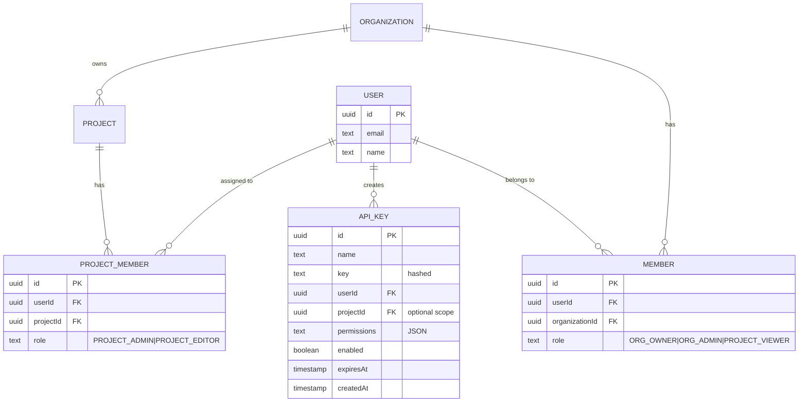
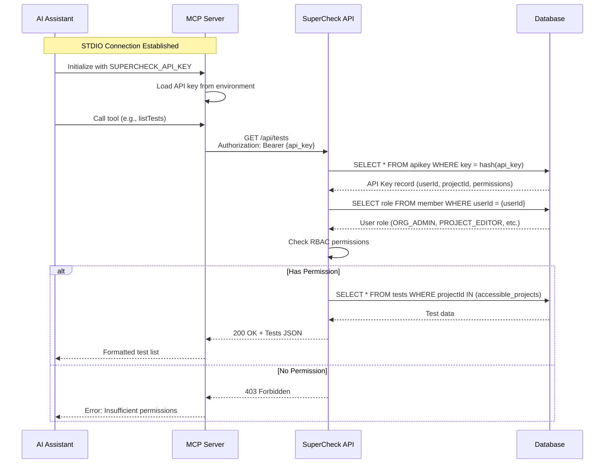
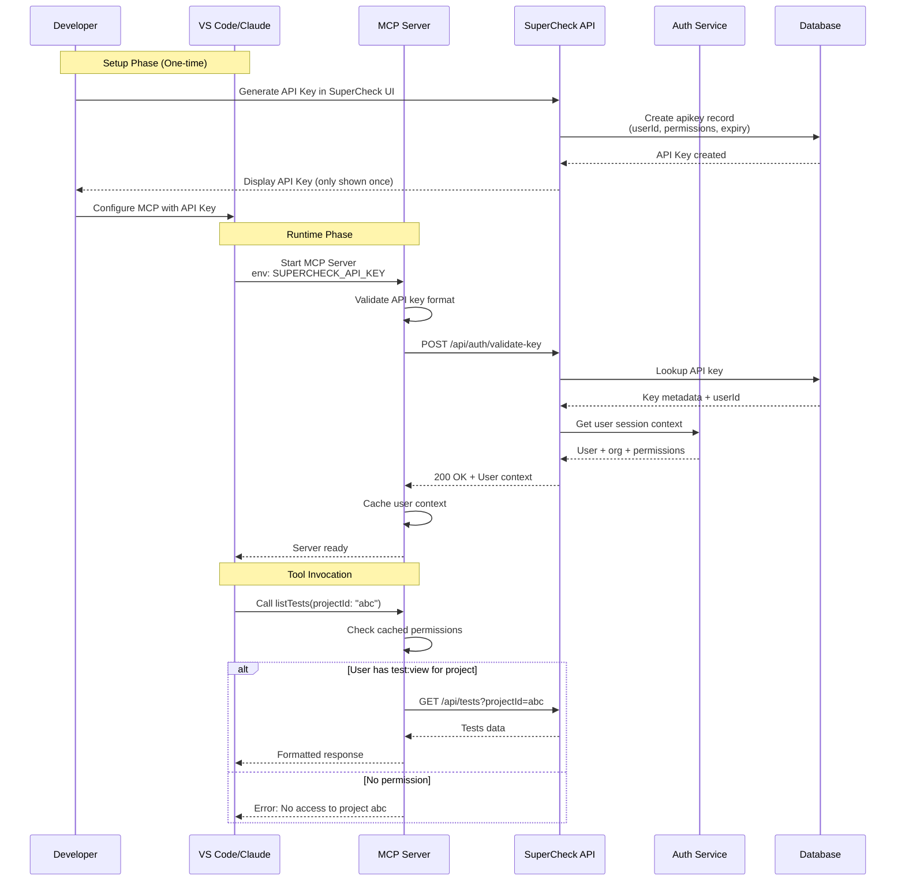
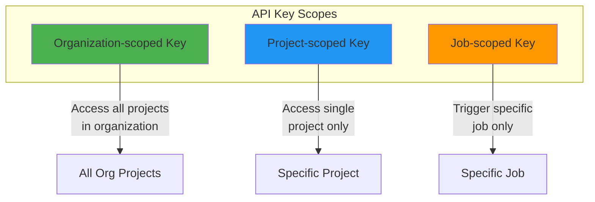
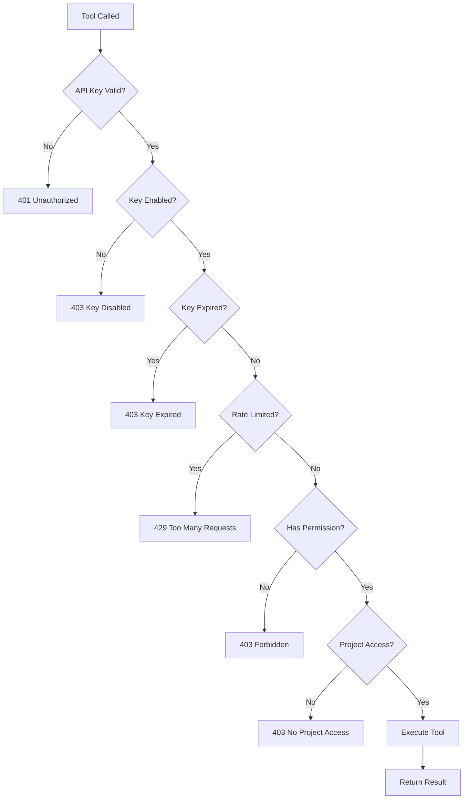
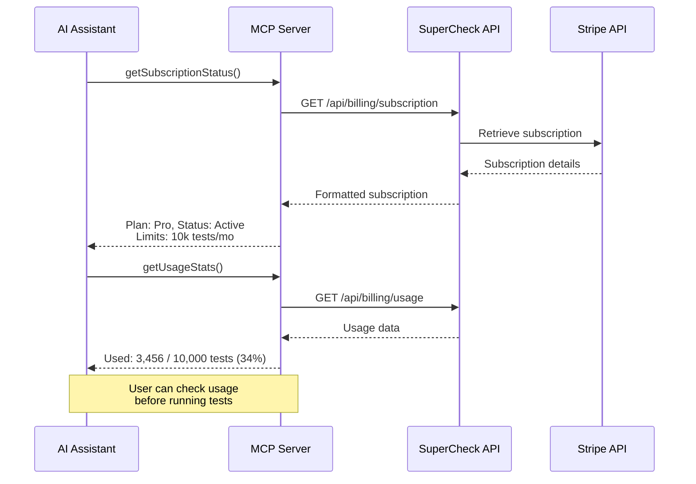

# SuperCheck MCP Server Specification

## 📋 Executive Summary

This document specifies the design and implementation of an MCP (Model Context Protocol) server for SuperCheck, enabling AI applications like Claude Code, VS Code Copilot, Cursor, and other MCP-enabled clients to interact with SuperCheck's testing and monitoring platform through natural language.

**Version**: 1.1.0  
**Status**: Draft  
**Last Updated**: December 2025

---

## 🎯 Goals & Objectives

### Primary Goals

1. **Enable AI-Assisted Testing**: Allow developers to create, run, and manage Playwright tests through natural language
2. **Integrate Monitoring Management**: Provide capabilities to configure, execute, and analyze monitors
3. **Real-time Observability**: Surface test results, monitoring data, and alerts directly to AI assistants
4. **Debugging Support**: Leverage AI to analyze failures and suggest fixes
5. **Seamless Workflow Integration**: Reduce context-switching by bringing SuperCheck capabilities into IDEs
6. **Safe Operations Only**: Provide read-only and create operations; **no destructive actions** (delete/update)

### Target Users

- **Developers** using VS Code, Cursor, or Claude Code
- **QA Engineers** managing test suites and monitoring
- **DevOps Engineers** configuring CI/CD integration
- **SREs** monitoring system health and responding to alerts

### Design Principles

1. **Read-First, Create-Second**: Prioritize read operations; write operations limited to safe creates
2. **No Destructive Actions**: Delete and update operations are excluded from MCP server
3. **Respect RBAC**: All operations enforce existing SuperCheck role-based permissions
4. **Fail Safe**: When in doubt, deny access with clear error messages
5. **Audit Everything**: All MCP operations are logged for compliance

---

## 🏗️ Architecture Overview

### MCP Protocol Fundamentals

MCP follows a client-server architecture:

- **MCP Host**: AI application (Claude Code, VS Code Copilot, Cursor)
- **MCP Client**: Component within the host that connects to MCP servers
- **MCP Server**: SuperCheck MCP server providing tools, resources, and prompts

```
┌─────────────────────────────────────────────────────────────────┐
│                        MCP Host                                  │
│  ┌────────────────┐   ┌────────────────┐   ┌────────────────┐  │
│  │  VS Code +     │   │    Claude      │   │    Cursor      │  │
│  │  Copilot       │   │    Code        │   │                │  │
│  └───────┬────────┘   └───────┬────────┘   └───────┬────────┘  │
│          │                    │                    │            │
│          └────────────────────┼────────────────────┘            │
│                               │                                  │
│                    ┌──────────▼──────────┐                      │
│                    │    MCP Client       │                      │
│                    │ (manages connection)│                      │
│                    └──────────┬──────────┘                      │
└───────────────────────────────┼─────────────────────────────────┘
                                │
                    ┌───────────▼───────────┐
                    │   SuperCheck MCP      │
                    │       Server          │
                    │  ┌─────────────────┐  │
                    │  │     Tools       │  │
                    │  │   Resources     │  │
                    │  │    Prompts      │  │
                    │  └─────────────────┘  │
                    └───────────┬───────────┘
                                │
                    ┌───────────▼───────────┐
                    │   SuperCheck API      │
                    │  ┌─────────────────┐  │
                    │  │  Tests & Jobs   │  │
                    │  │    Monitors     │  │
                    │  │     Alerts      │  │
                    │  │   Status Pages  │  │
                    │  └─────────────────┘  │
                    └───────────────────────┘
```

### Transport Mechanisms

The SuperCheck MCP server will support:

1. **STDIO Transport** (Primary - Local)
   - Direct process communication
   - Ideal for local development
   - No network overhead
2. **Streamable HTTP Transport** (Secondary - Remote)
   - HTTP POST for client-to-server
   - Server-Sent Events for streaming
   - OAuth/API key authentication
   - Enterprise and cloud deployments

---

## 🛠️ MCP Primitives

### Tool Classification: Safe vs Destructive

Based on security best practices, MCP tools are classified as:

| Classification | Actions                        | Included in MCP | Rationale                             |
| -------------- | ------------------------------ | --------------- | ------------------------------------- |
| **Read**       | `list*`, `get*`, `view*`       | ✅ Yes          | Safe, no side effects                 |
| **Execute**    | `run*`, `trigger*`, `execute*` | ✅ Yes          | Controlled execution with rate limits |
| **Create**     | `create*`                      | ✅ Yes          | Adds data, easily reversible via UI   |
| **Update**     | `update*`, `modify*`           | ❌ No           | Potential for unintended changes      |
| **Delete**     | `delete*`, `remove*`           | ❌ No           | Destructive, irreversible             |

> **Security Decision**: The MCP server only exposes **Read**, **Execute**, and **Create** operations. Updates and deletes must be performed through the SuperCheck UI where users have full context and confirmation dialogs.

### 1. Tools (Actions) - MVP Scope

Tools are executable functions that AI can invoke. For the initial MVP, we focus on the most essential operations:

#### 🏷️ Priority 1: Core Read Operations (MVP Phase 1)

| Tool Name           | Description                 | Parameters                                   | Permission Required |
| ------------------- | --------------------------- | -------------------------------------------- | ------------------- |
| `listTests`         | List tests with filters     | `projectId?`, `tags[]?`, `status?`, `limit?` | `test:view`         |
| `getTest`           | Get test details and script | `testId`                                     | `test:view`         |
| `getTestResults`    | Fetch test run results      | `testId`, `limit?`, `status?`                | `run:view`          |
| `listMonitors`      | List monitors               | `projectId?`, `status?`, `type?`             | `monitor:view`      |
| `getMonitorStatus`  | Get current monitor status  | `monitorId`                                  | `monitor:view`      |
| `getMonitorResults` | Fetch monitor check results | `monitorId`, `limit?`, `location?`           | `monitor:view`      |
| `getDashboardStats` | Get project dashboard stats | `projectId?`                                 | `project:view`      |
| `listJobs`          | List scheduled jobs         | `projectId?`, `status?`, `limit?`            | `job:view`          |
| `getJobStatus`      | Get current job status      | `jobId`                                      | `job:view`          |

#### 🏷️ Priority 2: Execution Operations (MVP Phase 1)

| Tool Name     | Description            | Parameters             | Permission Required |
| ------------- | ---------------------- | ---------------------- | ------------------- |
| `executeTest` | Run a test immediately | `testId`, `variables?` | `test:run`          |
| `triggerJob`  | Manually trigger a job | `jobId`                | `job:trigger`       |

#### 🏷️ Priority 3: Create Operations (MVP Phase 2)

| Tool Name       | Description                        | Parameters                                        | Permission Required |
| --------------- | ---------------------------------- | ------------------------------------------------- | ------------------- |
| `createTest`    | Create a new Playwright or K6 test | `name`, `type`, `script`, `projectId`, `tags[]?`  | `test:create`       |
| `createMonitor` | Create a new monitor               | `name`, `type`, `config`, `schedule`, `projectId` | `monitor:create`    |
| `createJob`     | Create a scheduled job             | `name`, `testId`, `schedule`, `projectId`         | `job:create`        |

#### 🏷️ Priority 4: Billing & Subscription (MVP Phase 2)

| Tool Name               | Description                              | Parameters                   | Permission Required |
| ----------------------- | ---------------------------------------- | ---------------------------- | ------------------- |
| `getSubscriptionStatus` | Get current subscription plan and status | -                            | `organization:view` |
| `getUsageStats`         | Get usage statistics for billing period  | `periodStart?`, `periodEnd?` | `organization:view` |
| `getSpendingLimits`     | Get configured spending limits           | -                            | `organization:view` |

#### 🏷️ Priority 5: Alerts & Status Pages (Phase 3)

| Tool Name             | Description              | Parameters                           | Permission Required |
| --------------------- | ------------------------ | ------------------------------------ | ------------------- |
| `listAlerts`          | List active alerts       | `projectId?`, `severity?`, `status?` | `notification:view` |
| `getAlertHistory`     | Get alert history        | `monitorId?`, `limit?`               | `notification:view` |
| `listStatusPages`     | List status pages        | `projectId?`                         | `status_page:view`  |
| `getStatusPageHealth` | Get status page overview | `statusPageId`                       | `status_page:view`  |

#### 🏷️ Priority 6: AI-Assisted Tools (Phase 3)

| Tool Name            | Description                    | Parameters        | Permission Required     |
| -------------------- | ------------------------------ | ----------------- | ----------------------- |
| `analyzeTestFailure` | AI analysis of test failure    | `runId`           | `run:view` + AI enabled |
| `suggestTestFix`     | Get AI-powered fix suggestions | `testId`, `runId` | `run:view` + AI enabled |
| `validateScript`     | Validate Playwright/K6 script  | `script`, `type`  | `test:view`             |

#### ❌ Excluded Tools (Destructive - Must Use UI)

These tools are intentionally **NOT** included in the MCP server:

| Tool Name          | Reason for Exclusion                      |
| ------------------ | ----------------------------------------- |
| `updateTest`       | Risk of unintended script modifications   |
| `deleteTest`       | Irreversible data loss                    |
| `updateMonitor`    | Could disable critical monitoring         |
| `deleteMonitor`    | Irreversible, could cause monitoring gaps |
| `deleteJob`        | Irreversible                              |
| `pauseMonitor`     | Could cause monitoring gaps               |
| `acknowledgeAlert` | Requires human judgment                   |
| `createIncident`   | High-impact action requiring confirmation |
| `updateIncident`   | Requires human oversight                  |

### 2. Resources (Data Sources)

Resources provide contextual data that AI can read:

| Resource URI                                  | Description                  | MIME Type          | Permission          |
| --------------------------------------------- | ---------------------------- | ------------------ | ------------------- |
| `supercheck://tests/{testId}`                 | Test definition and metadata | `application/json` | `test:view`         |
| `supercheck://tests/{testId}/script`          | Test script content          | `text/plain`       | `test:view`         |
| `supercheck://tests/{testId}/report`          | Latest test report           | `text/html`        | `run:view`          |
| `supercheck://jobs/{jobId}`                   | Job configuration            | `application/json` | `job:view`          |
| `supercheck://monitors/{monitorId}`           | Monitor configuration        | `application/json` | `monitor:view`      |
| `supercheck://monitors/{monitorId}/results`   | Recent monitor results       | `application/json` | `monitor:view`      |
| `supercheck://projects/{projectId}`           | Project information          | `application/json` | `project:view`      |
| `supercheck://projects/{projectId}/variables` | Project variables (masked)   | `application/json` | `variable:view`     |
| `supercheck://dashboard`                      | Dashboard summary            | `application/json` | `project:view`      |
| `supercheck://alerts/active`                  | Active alerts                | `application/json` | `notification:view` |
| `supercheck://status-pages/{pageId}`          | Status page info             | `application/json` | `status_page:view`  |
| `supercheck://subscription`                   | Subscription and billing     | `application/json` | `organization:view` |

### 3. Prompts (Interaction Templates)

Prompts help structure common interactions:

| Prompt Name              | Description                              | Arguments                     |
| ------------------------ | ---------------------------------------- | ----------------------------- |
| `create-playwright-test` | Guide for creating a new Playwright test | `description`, `url?`         |
| `create-k6-test`         | Guide for creating K6 performance test   | `description`, `endpoints[]?` |
| `debug-test-failure`     | Structured debugging workflow            | `testId`, `runId`             |
| `setup-monitor`          | Guided monitor creation                  | `type`, `target`              |
| `check-subscription`     | View subscription and usage              | -                             |

---

## 🔐 Authentication & Security

### Overview

The MCP server authenticates users via **API Keys** that are tied to specific users in SuperCheck. Each API key carries the user's identity and permissions, ensuring all MCP operations respect the existing RBAC system.

### API Key Architecture



### How API Key Identifies User



### SuperCheck RBAC Roles

The MCP server respects SuperCheck's existing role-based access control system:

| Role             | Scope             | Permissions                               | MCP Tools Available             |
| ---------------- | ----------------- | ----------------------------------------- | ------------------------------- |
| `SUPER_ADMIN`    | System            | Full system access                        | All tools                       |
| `ORG_OWNER`      | Organization      | Full org + all projects                   | All tools for org               |
| `ORG_ADMIN`      | Organization      | Manage org + all projects (no delete org) | All tools except org delete     |
| `PROJECT_ADMIN`  | Assigned Projects | Full control of assigned projects         | All tools for assigned projects |
| `PROJECT_EDITOR` | Assigned Projects | Create/view/run in assigned projects      | Read + Execute + Create tools   |
| `PROJECT_VIEWER` | Organization      | Read-only access to all projects          | Read-only tools                 |

### Permission Matrix for MCP Tools

```mermaid
graph TD
    subgraph "Read Tools"
        R1[listTests]
        R2[getTest]
        R3[getTestResults]
        R4[listMonitors]
        R5[getMonitorStatus]
        R6[getDashboardStats]
    end

    subgraph "Execute Tools"
        E1[executeTest]
        E2[triggerJob]
    end

    subgraph "Create Tools"
        C1[createTest]
        C2[createMonitor]
        C3[createJob]
    end

    subgraph "Billing Tools"
        B1[getSubscriptionStatus]
        B2[getUsageStats]
    end

    VIEWER[PROJECT_VIEWER] --> R1
    VIEWER --> R2
    VIEWER --> R3
    VIEWER --> R4
    VIEWER --> R5
    VIEWER --> R6

    EDITOR[PROJECT_EDITOR] --> R1
    EDITOR --> R2
    EDITOR --> R3
    EDITOR --> R4
    EDITOR --> R5
    EDITOR --> R6
    EDITOR --> E1
    EDITOR --> E2
    EDITOR --> C1
    EDITOR --> C2
    EDITOR --> C3

    ADMIN[ORG_ADMIN/OWNER] --> R1
    ADMIN --> R2
    ADMIN --> R3
    ADMIN --> R4
    ADMIN --> R5
    ADMIN --> R6
    ADMIN --> E1
    ADMIN --> E2
    ADMIN --> C1
    ADMIN --> C2
    ADMIN --> C3
    ADMIN --> B1
    ADMIN --> B2
```



### Authentication Flow



### API Key Scoping

API keys can be scoped at different levels:



| Scope            | Use Case                          | Permissions                        |
| ---------------- | --------------------------------- | ---------------------------------- |
| **Organization** | Full MCP access for developers    | All tools based on user role       |
| **Project**      | CI/CD integration, limited access | Tools only for specific project    |
| **Job**          | Webhook triggers                  | Only `triggerJob` for specific job |

### API Key Properties

From the existing SuperCheck schema (`apikey` table):

| Property           | Type       | Description                                   |
| ------------------ | ---------- | --------------------------------------------- |
| `id`               | UUID       | Unique identifier                             |
| `name`             | string     | Human-readable name                           |
| `key`              | string     | Hashed API key value                          |
| `userId`           | UUID       | **Owner of the key** - determines permissions |
| `projectId`        | UUID?      | Optional: limit to specific project           |
| `jobId`            | UUID?      | Optional: limit to specific job               |
| `permissions`      | JSON?      | Optional: fine-grained permission overrides   |
| `enabled`          | boolean    | Can be disabled without deletion              |
| `expiresAt`        | timestamp? | Optional expiration date                      |
| `rateLimitEnabled` | boolean    | Enable rate limiting                          |
| `rateLimitMax`     | number     | Max requests per time window                  |

### Security Considerations

#### 1. Input Validation

```typescript
// All tool parameters validated with Zod schemas
const executeTestSchema = z.object({
  testId: z.string().uuid(),
  variables: z.record(z.string()).optional(),
});

// Script content size limits
const createTestSchema = z.object({
  script: z.string().max(1_000_000), // 1MB max
  // ... other fields
});
```

#### 2. Authorization Enforcement

Every tool call goes through permission checking:



#### 3. Rate Limiting

| Tool Category      | Rate Limit  | Window      |
| ------------------ | ----------- | ----------- |
| Read operations    | 100 req/min | Per API key |
| Execute operations | 10 req/min  | Per API key |
| Create operations  | 20 req/min  | Per API key |

#### 4. Secrets Management

- API keys are **never** logged or returned in responses
- Project variables with `isSecret: true` are always masked
- Credentials in test scripts are not exposed in results

#### 5. Audit Logging

All MCP tool invocations are logged:

```typescript
interface McpAuditLog {
  timestamp: Date;
  apiKeyId: string;
  userId: string;
  tool: string;
  parameters: Record<string, any>; // Sensitive data redacted
  result: "success" | "error" | "forbidden";
  duration: number;
  clientInfo: {
    type: "mcp";
    transport: "stdio" | "http";
    host?: string; // For HTTP transport
  };
}
```

### Edge Cases & Error Handling

#### 1. API Key Issues

| Scenario               | Response             | MCP Behavior               |
| ---------------------- | -------------------- | -------------------------- |
| Missing API key        | Server won't start   | Exit with error message    |
| Invalid API key format | 401 on first request | Return clear error         |
| Expired API key        | 403 Forbidden        | Suggest key renewal        |
| Disabled API key       | 403 Forbidden        | Suggest contacting admin   |
| Deleted API key        | 401 Unauthorized     | Suggest generating new key |

#### 2. Permission Issues

| Scenario                  | Response           | MCP Behavior             |
| ------------------------- | ------------------ | ------------------------ |
| No access to project      | 403 Forbidden      | List accessible projects |
| Role changed mid-session  | Next request fails | Auto-refresh context     |
| Removed from organization | 403 Forbidden      | Clear error message      |

#### 3. Resource Issues

| Scenario         | Response        | MCP Behavior               |
| ---------------- | --------------- | -------------------------- |
| Test not found   | 404 Not Found   | Suggest listing tests      |
| Project deleted  | 404 Not Found   | Clear error message        |
| Monitor disabled | 200 with status | Include status in response |

#### 4. System Issues

| Scenario            | Response                | MCP Behavior          |
| ------------------- | ----------------------- | --------------------- |
| SuperCheck API down | 503 Service Unavailable | Retry with backoff    |
| Rate limited        | 429 Too Many Requests   | Wait and retry        |
| Timeout             | 504 Gateway Timeout     | Retry once, then fail |
| Invalid response    | 500 Internal Error      | Log and return error  |

### Configuration Examples

#### VS Code / Cursor (`.vscode/mcp.json`)

```json
{
  "servers": {
    "supercheck": {
      "command": "npx",
      "args": ["-y", "@supercheck/mcp-server@latest"],
      "env": {
        "SUPERCHECK_URL": "https://your-instance.supercheck.io",
        "SUPERCHECK_API_KEY": "${env:SUPERCHECK_API_KEY}"
      }
    }
  }
}
```

> **Best Practice**: Use environment variable reference `${env:SUPERCHECK_API_KEY}` instead of hardcoding the key.

#### Claude Desktop (`claude_desktop_config.json`)

```json
{
  "mcpServers": {
    "supercheck": {
      "command": "npx",
      "args": ["-y", "@supercheck/mcp-server@latest"],
      "env": {
        "SUPERCHECK_URL": "https://your-instance.supercheck.io",
        "SUPERCHECK_API_KEY": "sk_live_..."
      }
    }
  }
}
```

---

## 💰 Billing & Subscription

### Overview

The MCP server provides read-only access to billing and subscription information, allowing users to check their plan status and usage without leaving their IDE.

### Subscription Tools

#### `getSubscriptionStatus`

Returns current subscription plan and status:

```typescript
interface SubscriptionStatus {
  plan: "free" | "pro" | "team" | "enterprise";
  status: "active" | "trialing" | "past_due" | "canceled";
  currentPeriod: {
    start: Date;
    end: Date;
  };
  limits: {
    testsPerMonth: number;
    monitorsPerMonth: number;
    teamMembers: number;
    retentionDays: number;
  };
  features: {
    aiFixEnabled: boolean;
    multiLocation: boolean;
    ssoEnabled: boolean;
    customDomains: boolean;
  };
}
```

#### `getUsageStats`

Returns usage statistics for the billing period:

```typescript
interface UsageStats {
  period: {
    start: Date;
    end: Date;
  };
  usage: {
    testExecutions: {
      used: number;
      limit: number;
      percentage: number;
    };
    monitorChecks: {
      used: number;
      limit: number;
      percentage: number;
    };
    aiFixRequests: {
      used: number;
      limit: number;
      percentage: number;
    };
  };
  spending: {
    current: number; // cents
    limit: number | null; // null = no limit
    projectedMonthEnd: number;
  };
}
```

#### `getSpendingLimits`

Returns configured spending limits:

```typescript
interface SpendingLimits {
  enabled: boolean;
  monthlyLimitCents: number | null;
  hardStopOnLimit: boolean;
  notifications: {
    at50Percent: boolean;
    at80Percent: boolean;
    at90Percent: boolean;
    at100Percent: boolean;
  };
  currentSpendingCents: number;
  percentUsed: number;
}
```

### Billing Sequence Diagram



---

## 📦 Implementation Plan (Revised)

### Phase 1: Core Foundation (MVP) - 2 weeks

**Focus**: Read-only tools with full RBAC support

- [ ] Project setup with TypeScript + MCP SDK
- [ ] STDIO transport implementation
- [ ] **API Key authentication with user identification**
- [ ] **Permission checking middleware**
- [ ] Core read tools:
  - `listTests`, `getTest`, `getTestResults`
  - `listMonitors`, `getMonitorStatus`, `getMonitorResults`
  - `listJobs`, `getJobStatus`
  - `getDashboardStats`
- [ ] Basic resources:
  - `supercheck://tests/{testId}`
  - `supercheck://dashboard`
- [ ] Error handling and logging
- [ ] Audit logging for all operations

### Phase 2: Execution & Creation - 2 weeks

**Focus**: Safe write operations

- [ ] Execution tools:
  - `executeTest` (with rate limiting)
  - `triggerJob` (with rate limiting)
- [ ] Create tools:
  - `createTest` (Playwright/K6)
  - `createMonitor` (HTTP, Ping, Port)
  - `createJob`
- [ ] Script validation: `validateScript`
- [ ] Prompts for guided creation

### Phase 3: Billing & AI - 2 weeks

**Focus**: Subscription awareness and AI features

- [ ] Billing tools:
  - `getSubscriptionStatus`
  - `getUsageStats`
  - `getSpendingLimits`
- [ ] AI tools (if subscription allows):
  - `analyzeTestFailure`
  - `suggestTestFix`
- [ ] Usage quota checking before execution

### Phase 4: Alerts & Status Pages - 1 week

**Focus**: Observability (read-only)

- [ ] Alert tools:
  - `listAlerts`
  - `getAlertHistory`
- [ ] Status page tools:
  - `listStatusPages`
  - `getStatusPageHealth`

### Phase 5: Polish & Production - 1 week

- [ ] Comprehensive error handling
- [ ] Performance optimization
- [ ] Documentation and examples
- [ ] Testing and validation
- [ ] NPM package publication

---

## 🗂️ Project Structure

```
/mcp/
├── package.json
├── tsconfig.json
├── README.md
├── src/
│   ├── index.ts                 # Entry point
│   ├── server.ts                # MCP server setup
│   ├── config.ts                # Configuration management
│   ├── tools/
│   │   ├── index.ts             # Tool registration
│   │   ├── tests.ts             # Test management tools
│   │   ├── jobs.ts              # Job management tools
│   │   ├── monitors.ts          # Monitor management tools
│   │   ├── alerts.ts            # Alert tools
│   │   ├── status-pages.ts      # Status page tools
│   │   ├── ai.ts                # AI-assisted tools
│   │   └── dashboard.ts         # Dashboard tools
│   ├── resources/
│   │   ├── index.ts             # Resource registration
│   │   ├── tests.ts             # Test resources
│   │   ├── monitors.ts          # Monitor resources
│   │   └── projects.ts          # Project resources
│   ├── prompts/
│   │   ├── index.ts             # Prompt registration
│   │   ├── test-creation.ts     # Test creation prompts
│   │   ├── debugging.ts         # Debugging prompts
│   │   └── monitoring.ts        # Monitoring prompts
│   ├── lib/
│   │   ├── api-client.ts        # SuperCheck API client
│   │   ├── auth.ts              # Authentication helpers
│   │   ├── schemas.ts           # Zod validation schemas
│   │   ├── errors.ts            # Error handling
│   │   └── utils.ts             # Utility functions
│   └── types/
│       ├── index.ts             # Type definitions
│       └── api.ts               # API response types
├── tests/
│   ├── tools/
│   ├── resources/
│   └── integration/
└── docs/
    ├── setup.md
    ├── tools-reference.md
    └── examples.md
```

---

## 📝 Configuration

### Standard MCP Configuration

**VS Code / Cursor (`.vscode/mcp.json` or `.cursor/mcp.json`)**:

```json
{
  "servers": {
    "supercheck": {
      "command": "npx",
      "args": ["-y", "@supercheck/mcp-server@latest"],
      "env": {
        "SUPERCHECK_URL": "https://your-instance.supercheck.io",
        "SUPERCHECK_API_KEY": "<your-api-key>"
      }
    }
  }
}
```

**Claude Desktop (`claude_desktop_config.json`)**:

```json
{
  "mcpServers": {
    "supercheck": {
      "command": "npx",
      "args": ["-y", "@supercheck/mcp-server@latest"],
      "env": {
        "SUPERCHECK_URL": "https://your-instance.supercheck.io",
        "SUPERCHECK_API_KEY": "<your-api-key>"
      }
    }
  }
}
```

### Configuration Options

| Environment Variable         | Description                              | Required |
| ---------------------------- | ---------------------------------------- | -------- |
| `SUPERCHECK_URL`             | SuperCheck instance URL                  | Yes      |
| `SUPERCHECK_API_KEY`         | API key for authentication               | Yes      |
| `SUPERCHECK_PROJECT_ID`      | Default project ID                       | No       |
| `SUPERCHECK_ORGANIZATION_ID` | Organization context                     | No       |
| `SUPERCHECK_LOG_LEVEL`       | Logging level (debug, info, warn, error) | No       |

---

## 🎮 Usage Examples

### Example 1: Create and Run a Test

```
User: Create a Playwright test that checks if the login page loads correctly on https://example.com/login

AI: I'll create a Playwright test for you.
[Calls createTest tool]

Created test "Login Page Load Test" (ID: test_abc123)
Would you like me to run this test now?

User: Yes, run it

AI: [Calls executeTest tool]
Test execution started. Run ID: run_xyz789
[Monitors progress via getTestResults]

Test completed successfully!
- Duration: 3.2s
- Status: Passed
- Screenshots: 2 captured
```

### Example 2: Investigate Monitor Alert

```
User: Why is my API health monitor failing?

AI: Let me check your monitor status.
[Calls listMonitors, getMonitorResults]

I found an issue with "API Health Monitor" (ID: mon_456):
- Current Status: DOWN
- Failed since: 10:45 AM
- Error: Connection timeout after 30s

Recent results show:
- us-east: 5 consecutive failures
- eu-central: 3 consecutive failures
- asia-pacific: 2 consecutive failures

The endpoint https://api.example.com/health is not responding.
Would you like me to create an incident for your status page?
```

### Example 3: Debug Test Failure

````
User: My checkout test is failing, can you help debug?

AI: [Calls getTest, getTestResults]

I see your "Checkout Flow Test" failed in the last run. Let me analyze:
[Calls analyzeTestFailure]

The test failed at step "Click checkout button":
- Element not found: button[data-testid="checkout-btn"]
- The page shows a loading spinner that doesn't disappear

Suggested fix:
[Calls suggestTestFix]

Add a wait for the spinner to disappear:
```typescript
await page.waitForSelector('.loading-spinner', { state: 'hidden' });
await page.click('[data-testid="checkout-btn"]');
````

Would you like me to update the test with this fix?

````

---

## 📊 Comparison with Similar Implementations

### Feature Comparison

| Feature | SuperCheck MCP | Playwright MCP | BrowserStack MCP |
|---------|----------------|----------------|------------------|
| Test Management | ✅ Read + Create | ❌ Runtime only | ✅ Full CRUD |
| Test Execution | ✅ Playwright + K6 | ✅ Playwright | ✅ Multiple frameworks |
| Monitoring | ✅ Built-in | ❌ N/A | ❌ N/A |
| Status Pages | ✅ Read-only | ❌ N/A | ❌ N/A |
| AI Fix Suggestions | ✅ Built-in | ❌ N/A | ✅ Self-healing |
| Billing/Subscription | ✅ Read-only | ❌ N/A | ❌ N/A |
| RBAC Integration | ✅ Full | ❌ N/A | ✅ Partial |
| Destructive Actions | ❌ Excluded | ✅ Allowed | ✅ Allowed |
| HTTP Transport | 🔜 Planned | ✅ Supported | ✅ Remote MCP |
| Prompts | ✅ Guided workflows | ❌ N/A | ✅ Limited |

### Security Comparison

| Security Feature | SuperCheck MCP | Playwright MCP | BrowserStack MCP |
|-----------------|----------------|----------------|------------------|
| API Key Auth | ✅ | ❌ | ✅ |
| User Identification | ✅ Via API Key | ❌ | ✅ |
| Role-Based Access | ✅ Full RBAC | ❌ | ✅ Limited |
| Rate Limiting | ✅ Per-key | ❌ | ✅ |
| Audit Logging | ✅ | ❌ | ✅ |
| No Delete Operations | ✅ | ❌ | ❌ |

---

## 🔍 Threat Model & Mitigations

### Potential Threats

| Threat | Risk | Mitigation |
|--------|------|------------|
| **API Key Theft** | High | Keys are hashed in DB; short expiry recommended; can be revoked instantly |
| **Privilege Escalation** | Medium | All permissions verified server-side; MCP trusts nothing from client |
| **Data Exfiltration** | Medium | Rate limiting; audit logs; secrets always masked |
| **Injection via Scripts** | Medium | Scripts validated; sandboxed execution; size limits |
| **Denial of Service** | Low | Rate limits; queue capacity checks; background job limits |
| **Unauthorized Test Creation** | Low | Requires `test:create` permission; easily reversible |

### Trust Boundaries

```mermaid
graph TB
    subgraph "Untrusted"
        AI[AI Assistant]
        MCP_Client[MCP Client]
    end

    subgraph "Trust Boundary"
        MCP[MCP Server]
    end

    subgraph "Trusted"
        API[SuperCheck API]
        DB[(Database)]
        Auth[Auth Service]
    end

    AI --> MCP_Client
    MCP_Client --> MCP
    MCP --> |"Validates all requests"| API
    API --> Auth
    API --> DB

    style MCP fill:#ff9800
````

**Key Principle**: The MCP Server validates all inputs but does NOT make authorization decisions. All authorization is delegated to the SuperCheck API, which has full context of the user's role and permissions.

---

## 🧪 Testing Strategy

### Unit Tests

- Test each tool handler in isolation
- Mock SuperCheck API responses
- Validate parameter schemas
- Test error handling paths

### Integration Tests

- Test against a real SuperCheck instance (staging)
- Verify end-to-end tool execution
- Test authentication flows
- Test permission denied scenarios

### Security Tests

- Test with expired API keys
- Test with disabled API keys
- Test rate limiting enforcement
- Test permission boundary violations
- Test with malformed inputs

### MCP Protocol Tests

- Use MCP Inspector for validation
- Test capability negotiation
- Verify JSON-RPC message format
- Test error response formats

---

## 📚 Documentation Requirements

1. **Setup Guide**: Installation and configuration
2. **Tools Reference**: Detailed documentation for each tool
3. **Examples Cookbook**: Common use cases with prompts
4. **API Reference**: TypeScript types and schemas
5. **Troubleshooting Guide**: Common issues and solutions
6. **Security Guide**: API key management, permissions

---

## ❓ FAQ

### Q: Why can't I delete tests/monitors via MCP?

**A**: Destructive actions require user confirmation and full context that's best provided in the UI. The MCP server focuses on safe operations that can be easily undone or have minimal risk.

### Q: How do I know what permissions my API key has?

**A**: Use `getDashboardStats` - if it succeeds, you have at least viewer access. For more details, check your API key settings in the SuperCheck UI.

### Q: Can I use MCP with a project-scoped API key?

**A**: Yes! Project-scoped keys will only allow access to that specific project. Organization-scoped keys provide access based on your user role.

### Q: What happens if my subscription doesn't include AI features?

**A**: The `analyzeTestFailure` and `suggestTestFix` tools will return an error indicating that AI features require a Pro or higher subscription.

### Q: How do I rotate my API key?

**A**: Generate a new key in SuperCheck UI, update your MCP configuration, then disable the old key. The MCP server will automatically use the new key on next restart.

---

## 🚀 Next Steps

1. **Approve Specification**: Review and finalize this spec
2. **Setup Repository**: Create `@supercheck/mcp-server` package
3. **Implement MVP**: Phase 1 core foundation (read-only tools)
4. **Internal Testing**: Test with VS Code + Copilot + Claude
5. **Documentation**: Complete setup and reference docs
6. **Beta Release**: Publish to NPM as `@supercheck/mcp-server`
7. **Community Feedback**: Iterate based on usage

---

## 📎 References

- [MCP Specification](https://modelcontextprotocol.io/specification/latest)
- [MCP TypeScript SDK](https://github.com/modelcontextprotocol/typescript-sdk)
- [Playwright MCP](https://github.com/microsoft/playwright-mcp)
- [BrowserStack MCP](https://github.com/browserstack/mcp-server)
- [SuperCheck API Documentation](/docs/specs/01-core/API_ROUTES_ANALYSIS.md)
- [SuperCheck Architecture](/docs/specs/01-core/SUPERCHECK_ARCHITECTURE.md)
- [SuperCheck RBAC System](/app/src/lib/rbac/permissions.ts)

---

**Document Version History**:

- v1.1.0 (December 2025): Added RBAC details, security diagrams, billing tools, removed destructive actions
- v1.0.0 (December 2025): Initial specification draft

```

```
