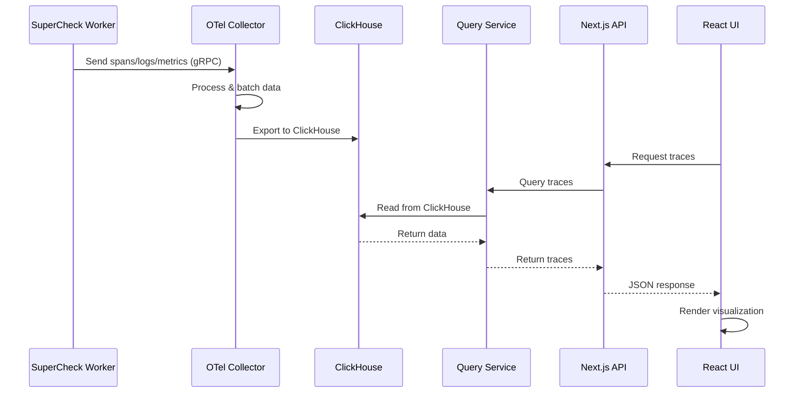

# SuperCheck Observability Module

Complete, production-grade observability solution for SuperCheck platform with distributed tracing, logs, and metrics visualization.

## 📋 Table of Contents

- [Overview](#overview)
- [Architecture](#architecture)
- [Features](#features)
- [Quick Start](#quick-start)
- [Configuration](#configuration)
- [Usage](#usage)
- [Development](#development)
- [API Reference](#api-reference)
- [Troubleshooting](#troubleshooting)

## 🎯 Overview

The SuperCheck Observability module provides comprehensive monitoring and debugging capabilities for:

- **Playwright browser tests** - Trace page navigations, user interactions, and network requests
- **K6 performance tests** - Monitor load test execution, request latency, and throughput
- **Jobs & Monitors** - Track scheduled job execution and monitoring checks
- **Custom applications** - Integrate OpenTelemetry from any service

## 🏗️ Architecture

### System Overview

```mermaid
flowchart TB
    subgraph Workers[SuperCheck Workers]
        PW[Playwright Tests]
        K6[K6 Performance Tests]
        JOB[Scheduled Jobs]
        MON[Monitors]
    end

    subgraph Backend[Observability Backend]
        OTEL[OTel Collector<br/>:4317 gRPC<br/>:4318 HTTP]
        CH[(ClickHouse<br/>Time-Series DB)]
        QS[SigNoz Query Service<br/>:8080]
    end

    subgraph Frontend[Next.js UI]
        API[API Routes<br/>/api/observability/*]
        HOOKS[React Query Hooks]
        PAGES[Pages<br/>Traces | Logs | Metrics]
    end

    PW --> OTEL
    K6 --> OTEL
    JOB --> OTEL
    MON --> OTEL

    OTEL --> CH
    CH --> QS
    QS --> API
    API --> HOOKS
    HOOKS --> PAGES

    style Workers fill:#e1f5ff
    style Backend fill:#fff4e1
    style Frontend fill:#f0e1ff
```

### Data Flow



### Component Architecture

```
app/
├── src/
│   ├── app/
│   │   ├── (main)/
│   │   │   └── observability/
│   │   │       ├── traces/page.tsx         # Traces visualization
│   │   │       ├── logs/page.tsx           # Logs explorer
│   │   │       ├── metrics/page.tsx        # Metrics dashboard
│   │   │       └── layout.tsx
│   │   └── api/
│   │       └── observability/
│   │           ├── traces/
│   │           │   ├── search/route.ts     # Search traces
│   │           │   └── [traceId]/route.ts  # Get trace details
│   │           ├── logs/
│   │           │   └── search/route.ts     # Search logs
│   │           └── metrics/
│   │               └── timeseries/route.ts # Query metrics
│   ├── components/
│   │   └── observability/                  # (Future enhancements)
│   ├── hooks/
│   │   └── useObservability.ts             # React Query hooks
│   ├── lib/
│   │   └── observability/
│   │       ├── client.ts                   # API client & utilities
│   │       ├── mock-data.ts                # Mock data for dev/testing
│   │       └── index.ts
│   ├── types/
│   │   └── observability.ts                # TypeScript types
│   └── db/
│       └── schema/
│           └── observability.ts            # Drizzle ORM schema
│
observability/
├── docker-compose.observability.yaml       # Docker services
├── otel-collector-config.yaml              # OTel configuration
└── clickhouse/
    └── init/
        └── 01_init_schema.sql              # ClickHouse schema
```

## ✨ Features

### Traces
- ✅ Distributed trace visualization
- ✅ Span timeline with service grouping
- ✅ Trace search with filters (time, run type, status)
- ✅ Span details with attributes and events
- ✅ Critical path analysis
- ✅ Correlation with Playwright steps and K6 scenarios
- ⏳ Flamegraph view (planned enhancement)
- ⏳ Trace comparison (planned enhancement)

### Logs
- ✅ Real-time log streaming
- ✅ Severity-based filtering
- ✅ Full-text search
- ✅ Log-to-trace correlation
- ✅ Virtualized table for performance
- ⏳ Log pattern detection (planned enhancement)

### Metrics
- ✅ Time-series visualization
- ✅ Service-level metrics (latency, throughput, errors)
- ✅ Endpoint-level breakdown
- ✅ Custom metric queries
- ⏳ uPlot charts integration (planned enhancement)
- ⏳ Alerting rules (planned enhancement)

### Platform Integration
- ✅ SuperCheck attribute schema (org, project, run context)
- ✅ React Query for efficient data fetching
- ✅ Dark mode support (shadcn/ui)
- ✅ Mobile-responsive design
- ✅ TypeScript throughout

## 🚀 Quick Start

### Prerequisites

- Docker & Docker Compose
- Node.js 20+
- PostgreSQL (for SuperCheck metadata)

### 1. Start Observability Backend

```bash
cd /path/to/supercheck

# Start ClickHouse, OTel Collector, and SigNoz Query Service
docker compose -f docker-compose.observability.yaml up -d

# Verify services are running
docker compose -f docker-compose.observability.yaml ps
```

Expected output:
```
NAME                        STATUS    PORTS
supercheck-clickhouse       Up        0.0.0.0:8123->8123/tcp, 0.0.0.0:9000->9000/tcp
supercheck-otel-collector   Up        0.0.0.0:4317-4318->4317-4318/tcp
supercheck-query-service    Up        0.0.0.0:8080->8080/tcp
```

### 2. Configure Environment

Add to your `.env` file:

```bash
# SigNoz Query Service URL
SIGNOZ_URL=http://localhost:8080

# OTel Collector endpoints (for workers)
OTEL_EXPORTER_OTLP_ENDPOINT=http://localhost:4318
OTEL_EXPORTER_OTLP_PROTOCOL=http/protobuf
```

### 3. Run Database Migrations

```bash
cd app

# Generate and run migrations for observability schema
npm run db:generate
npm run db:migrate
```

### 4. Start the Application

```bash
cd app
npm run dev
```

Navigate to: **http://localhost:3000/observability/traces**

## ⚙️ Configuration

### OTel Attribute Schema

Attach these attributes to your root spans:

```typescript
{
  "sc.org_id": "org-uuid",
  "sc.project_id": "project-uuid",
  "sc.run_id": "run-uuid",
  "sc.run_type": "playwright" | "k6" | "job" | "monitor",
  "sc.test_id": "test-uuid",
  "sc.test_name": "Login Flow Test",
  "sc.job_id": "job-uuid",
  "sc.job_name": "Nightly Regression",
  "sc.monitor_id": "monitor-uuid",
  "sc.monitor_type": "http_request" | "website" | "ping_host",
  "sc.worker_id": "worker-001",
  "sc.region": "us-east-1",
  "sc.artifacts_url": "https://..."
}
```

### Instrumenting Playwright Tests

```typescript
import { trace } from '@opentelemetry/api';

const tracer = trace.getTracer('supercheck-worker');

const span = tracer.startSpan('playwright.test.run', {
  attributes: {
    'sc.org_id': orgId,
    'sc.project_id': projectId,
    'sc.run_id': runId,
    'sc.run_type': 'playwright',
    'sc.test_name': testName,
  }
});

// Your test code here
await page.goto('https://example.com');

span.end();
```

### ClickHouse Retention

Default retention: **72 hours**

To modify, edit `observability/clickhouse/init/01_init_schema.sql`:

```sql
TTL toDateTime(timestamp) + INTERVAL 168 HOUR  -- 7 days
```

## 📖 Usage

### Searching Traces

**By time range:**
```
1. Navigate to /observability/traces
2. Select time range (last 1h, 6h, 24h, 7d)
3. View traces in timeline
```

**By run type:**
```
Filter: Run Type = "Playwright"
Shows: All Playwright test executions
```

**By status:**
```
Filter: Status = "Error"
Shows: Only failed traces
```

### Viewing Trace Details

Click any trace card to view:
- Span timeline with service grouping
- Individual span details
- Attributes and metadata
- Correlated logs

### Searching Logs

```
1. Navigate to /observability/logs
2. Apply filters:
   - Time range
   - Severity level
   - Service name
3. Use search box for full-text search
```

Click a log entry's trace ID to jump to the full trace.

### Metrics Dashboard

```
1. Navigate to /observability/metrics
2. View aggregated metrics:
   - Average latency
   - P95/P99 latency
   - Error rate
   - Throughput
3. Drill down by service
```

## 🛠️ Development

### Running with Mock Data

For development without the backend:

```typescript
// In your component
import { mockTraceSearchResponse } from '~/lib/observability/mock-data';

// Use mock data instead of API call
const traces = mockTraceSearchResponse.data;
```

### Adding Custom Visualizations

```typescript
// Create component in components/observability/
export function CustomChart({ data }: { data: TimeSeries[] }) {
  // Your visualization logic
}
```

### Testing

```bash
# Run type checks
npm run type-check

# Build for production
npm run build
```

## 📡 API Reference

### GET /api/observability/traces/search

Search for traces.

**Query Parameters:**
- `start` (ISO 8601): Start time
- `end` (ISO 8601): End time
- `runType` (string): Filter by run type
- `status` (number): Filter by status (1=OK, 2=ERROR)
- `limit` (number): Max results (default: 50)
- `offset` (number): Pagination offset

**Response:**
```json
{
  "data": [...],
  "total": 150,
  "limit": 50,
  "offset": 0,
  "hasMore": true,
  "services": ["worker", "api"],
  "runTypes": ["playwright", "k6"]
}
```

### GET /api/observability/traces/:traceId

Get trace details with all spans.

**Response:**
```json
{
  "traceId": "abc123",
  "spans": [...],
  "duration": 5000000000,
  "spanCount": 12
}
```

### GET /api/observability/logs/search

Search logs.

**Query Parameters:**
- `start`, `end`: Time range
- `severityLevel`: Filter by log level
- `traceId`: Get logs for specific trace
- `search`: Full-text search

### GET /api/observability/metrics/timeseries

Query time-series metrics.

**Query Parameters:**
- `metricName`: Metric to query
- `aggregation`: "avg" | "p95" | "p99"
- `interval`: "1m" | "5m" | "1h"

## 🐛 Troubleshooting

### No traces appearing

1. **Check OTel Collector**
   ```bash
   docker logs supercheck-otel-collector
   ```

2. **Verify ClickHouse connection**
   ```bash
   docker exec -it supercheck-clickhouse clickhouse-client
   SELECT count() FROM signoz.signoz_traces;
   ```

3. **Check worker is sending data**
   - Ensure `OTEL_EXPORTER_OTLP_ENDPOINT` is set
   - Verify network connectivity to collector

### Slow query performance

1. **Increase ClickHouse memory**
   ```yaml
   # docker-compose.observability.yaml
   clickhouse:
     environment:
       - MAX_MEMORY_USAGE=8000000000  # 8GB
   ```

2. **Optimize time range**
   - Use shorter time ranges
   - Add more specific filters

### API errors

1. **Check SigNoz Query Service**
   ```bash
   curl http://localhost:8080/api/v1/version
   ```

2. **Verify Next.js environment**
   ```bash
   echo $SIGNOZ_URL
   # Should output: http://localhost:8080
   ```

## 📚 Resources

- [OpenTelemetry Documentation](https://opentelemetry.io/docs/)
- [SigNoz Documentation](https://signoz.io/docs/)
- [ClickHouse Documentation](https://clickhouse.com/docs/)
- [TanStack Query](https://tanstack.com/query/latest)

## 🤝 Contributing

Future enhancements planned:
- [ ] Flamegraph visualization with D3/visx
- [ ] Trace comparison tool
- [ ] Custom dashboard builder
- [ ] Alert rule editor
- [ ] Service dependency graph
- [ ] Anomaly detection
- [ ] Export to Jaeger format

## 📄 License

MIT License - see SuperCheck repository for details.

---

**Built with:** Next.js 15, TypeScript, TanStack Query, shadcn/ui, OpenTelemetry, SigNoz, ClickHouse
