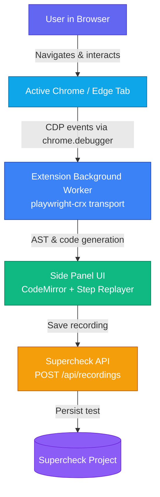

<h1> Supercheck Recorder</h1>

**Browser extension and Playwright CRX runtime for recording and syncing browser tests as code.**

The Supercheck Recorder turns real browser interactions into maintainable Playwright code. Built on Chrome Extensions Manifest V3 and Playwright CRX, it operates directly inside Chrome and Microsoft Edge without requiring external drivers or local runner setups. Record user flows, assert DOM states, inspect selectors, and save generated tests straight to your Supercheck projects with zero manual token copying.

[](https://chromewebstore.google.com/detail/supercheck-recorder/gfmbcelfhhfmifdkccnbgdadibdfhioe)
[](https://microsoftedge.microsoft.com/addons/detail/supercheck-recorder/0rdckc265vb9)
[](https://supercheck.io/docs/recorder)
[](LICENSE)

---

## What Supercheck Recorder includes

- **In-Browser Recording**: Leverages [`chrome.debugger`](https://developer.chrome.com/docs/extensions/reference/debugger/) to capture clicks, navigation, inputs, form fills, and assertions without installing local Node.js or Python environments.
- **1-Click Sync to Supercheck**: Saves generated scripts directly into cloud or self-hosted Supercheck projects, ready for scheduled execution and alerting.
- **Multi-Language Display**: Displays recorded code in TypeScript, JavaScript, Python, C#, or Java; tests saved to Supercheck use JavaScript.
- **Intelligent Selector Engine**: Prioritizes `getByTestId` (`data-testid`), accessible role locators, text, and resilient CSS attributes.
- **Built-in Player & Step Execution**: Replays recorded instructions directly within the extension tab, highlighting lines as they execute.
- **Playwright Trace Viewer Compatible**: Captures standard `.zip` traces compatible with [Playwright Trace Viewer](https://trace.playwright.dev).
- **Seamless Auto-Connect**: Automatically recognizes authenticated Supercheck dashboard sessions to establish recorder-scoped credentials safely.
- **Playwright CRX Source**: Includes the private `playwright-crx` workspace used to build the production Chrome/Edge extension (`examples/recorder-crx`).

---

## Get started

### Install the extension

Install the official extension from your browser's store:

- **Google Chrome**: [Install from Chrome Web Store](https://chromewebstore.google.com/detail/supercheck-recorder/gfmbcelfhhfmifdkccnbgdadibdfhioe)
- **Microsoft Edge**: [Install from Microsoft Edge Add-ons](https://microsoftedge.microsoft.com/addons/detail/supercheck-recorder/0rdckc265vb9)

### Install from source (developer build)

Requires Node.js 18 or later.

```bash
git clone https://github.com/supercheck-io/supercheck.git
cd supercheck/recorder
npm ci
npm run build
```

Then load the unpacked extension in your browser:
1. Navigate to `chrome://extensions` (or `edge://extensions`).
2. Enable **Developer mode** in the top right.
3. Click **Load unpacked** and select the `recorder/examples/recorder-crx/dist` directory.

---

## Connecting to Supercheck

### Supercheck Cloud (Recommended)

1. Open `https://app.supercheck.io` in the same browser profile as the extension.
2. Sign in and open any authenticated dashboard page.
3. The dashboard detects the extension and creates a recorder-scoped credential automatically. No approval dialog or copied API key is required.

### Self-Hosted Supercheck

1. Right-click the extension icon and select **Options**.
2. Enter the HTTPS origin of your self-hosted deployment (e.g. `https://supercheck.yourcompany.com`) or `http://localhost:3000` for local development.
3. Click **Save URL and open Supercheck**.
4. Sign in to your Supercheck instance. An authenticated dashboard page connects the extension automatically.

> **Security Note:** The options page retains an advanced API-key field only for existing recorder-scoped credentials (`ext_*`). Ordinary CLI tokens and job trigger keys cannot upload recordings.

---

## Usage

### Recording tests

1. Open the page you want to test in Chrome or Edge.
2. Click the Supercheck Recorder icon or press `Shift+Alt+R`.
3. The recorder side panel opens.
4. Interact with the page: clicks, typing, navigation, and dropdown selections are captured in real time.
5. Review and customize the generated code in the side panel editor.
6. Click **Save to Supercheck**, select your target project, and save the test.

### Keyboard shortcuts

| Shortcut | Action |
|---|---|
| `Shift+Alt+R` | Start / pause recording |
| `Shift+Alt+C` | Inspect element and generate locator |

Closing the recorder side panel detaches controlled tabs and uninstalls all injected scripts and event listeners.

---

## Architecture



The extension uses `chrome.debugger` to implement Playwright's `ConnectionTransport` interface directly inside the browser. Injected highlighter scripts highlight hovered and clicked DOM elements while generating robust locator strategies. When saving, the extension communicates with the Supercheck backend via origin-validated API endpoints.

---

## Workspace library usage (`playwright-crx`)

The repository workspace includes `playwright-crx` source for building automated workflows into Chrome extensions. The workspace is private and is not published as an official Supercheck npm package.

```typescript
import { crx, expect } from 'playwright-crx/test';

chrome.action.onClicked.addListener(async ({ id: tabId }) => {
  const crxApp = await crx.start({ slowMo: 500 });

  try {
    const page = await crxApp.attach(tabId!).catch(() => crxApp.newPage());

    await page.goto('https://demo.playwright.dev/todomvc/#/');
    await page.getByPlaceholder('What needs to be done?').fill('Buy groceries');
    await page.getByPlaceholder('What needs to be done?').press('Enter');

    await expect(page.getByTestId('todo-title')).toHaveText('Buy groceries');
  } finally {
    await crxApp.detach(page);
    await crxApp.close();
  }
});
```

### Trace capture

Playwright CRX supports tracing compatible with [trace.playwright.dev](https://trace.playwright.dev):

```typescript
await page.context().tracing.start({ screenshots: true, snapshots: true });

await page.goto('https://demo.playwright.dev/todomvc');
await page.getByPlaceholder('What needs to be done?').fill('Verify checkout');
await page.getByPlaceholder('What needs to be done?').press('Enter');

await page.context().tracing.stop({ path: '/tmp/trace.zip' });
const traceData = crx.fs.readFileSync('/tmp/trace.zip');
```

---

## Repository layout

| Path | Purpose |
|---|---|
| [`src/`](src/) | Core `playwright-crx` library source and Chrome debugger transport |
| [`examples/recorder-crx/`](examples/recorder-crx/) | Official Supercheck Recorder Chrome & Edge extension source |
| [`examples/todomvc-crx/`](examples/todomvc-crx/) | Example extension demonstrating Playwright automation inside CRX |
| [`playwright/`](playwright/) | Vendored subset of Playwright v1.51.0 source for reproducible builds |
| [`tests/`](tests/) | Unit tests and browser extension integration test suites |

---

## Development & testing

```bash
# Install dependencies
npm ci

# Lint codebase
npm run lint

# Build library, examples, and extension bundle
npm run build

# Install test browser dependencies
npm run test:install

# Run unit tests
npm run test:unit

# Run full browser extension test suite
npm run test:browser
```

### Vendored Playwright source

The `playwright/` directory contains the exact subset of Microsoft Playwright v1.51.0 source needed to build the extension without external build dependencies or private repositories. When updating Playwright, replace vendored packages from an official release archive, update `playwright/VERSION`, and verify the build and browser test suites.

---

## Contributing and security

Contributions are welcome. Please read [CONTRIBUTING.md](CONTRIBUTING.md) before opening a pull request and adhere to the project [Code of Conduct](../CODE_OF_CONDUCT.md).

Please report security vulnerabilities privately according to [SECURITY.md](../SECURITY.md).

> **Privacy Note:** Recorded page interactions can include text entered into input fields. Always review generated code before saving and avoid recording sensitive passwords, payment details, or personal data.

---

## License

The Supercheck Recorder is distributed under the [Apache-2.0 License](LICENSE). It contains code derived from Playwright CRX and Microsoft Playwright; all upstream licenses and attribution notices are retained in [`LICENSE`](LICENSE), [`NOTICE`](NOTICE), and [`playwright/NOTICE`](playwright/NOTICE).

---

## Community

[](https://discord.gg/UVe327CSbm)
[](https://github.com/supercheck-io/supercheck/issues)
[](https://github.com/supercheck-io/supercheck/discussions)
