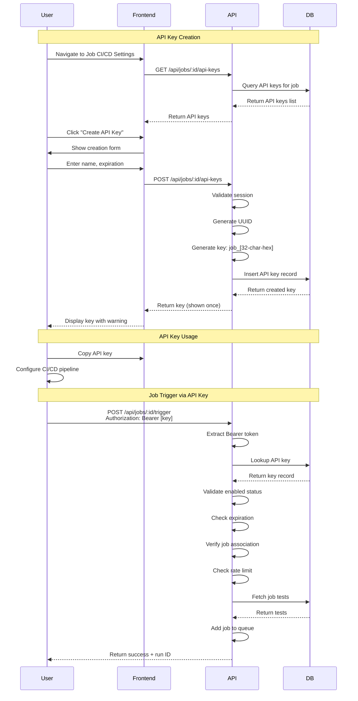
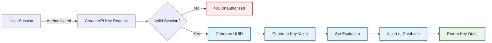
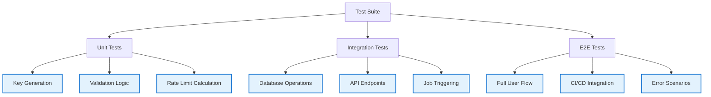

# API Key System Specification

## Overview

The Supercheck API key system provides secure, programmatic access to job triggering functionality through a robust authentication and authorization mechanism. Each API key is directly associated with a specific job and provides scoped access for remote execution from CI/CD pipelines, external systems, or automation scripts.

## Table of Contents

1. [System Architecture](#system-architecture)
2. [Core Components](#core-components)
3. [API Key Lifecycle](#api-key-lifecycle)
4. [Authentication Flow](#authentication-flow)
5. [Security Model](#security-model)
6. [Database Schema](#database-schema)
7. [Rate Limiting](#rate-limiting)
8. [Testing Guide](#testing-guide)

## System Architecture

```mermaid
graph TB
    subgraph "🌐 External Access"
        EXT1[CI/CD Pipeline]
        EXT2[Automation Script]
        EXT3[External System]
    end

    subgraph "🔐 API Gateway"
        API1[Job Trigger Endpoint<br/>/api/jobs/:id/trigger]
        API2[API Key Validation]
        API3[Job Authorization]
    end

    subgraph "💾 Data Layer"
        DB1[(API Key Table)]
        DB2[(Job Table)]
        DB3[(Test Table)]
    end

    subgraph "⚙️ Processing"
        QUEUE[BullMQ Queue]
        WORKER[Worker Service]
    end

    EXT1 & EXT2 & EXT3 -->|Bearer Token| API1
    API1 --> API2
    API2 --> DB1
    API2 --> API3
    API3 --> DB2
    API3 --> DB3
    API3 --> QUEUE
    QUEUE --> WORKER

    classDef external fill:#e3f2fd,stroke:#1976d2,stroke-width:2px
    classDef api fill:#f3e5f5,stroke:#7b1fa2,stroke-width:2px
    classDef data fill:#e8f5e8,stroke:#388e3c,stroke-width:2px
    classDef process fill:#fff3e0,stroke:#f57c00,stroke-width:2px

    class EXT1,EXT2,EXT3 external
    class API1,API2,API3 api
    class DB1,DB2,DB3 data
    class QUEUE,WORKER process
```



## Core Components

### API Key Manager

Handles CRUD operations for API keys within the context of a specific job.

**Key Responsibilities:**
- Create new API keys with job association
- Update API key metadata (name, status)
- Delete API keys
- List API keys for a job
- Toggle enabled/disabled status

**Location:** `app/src/app/api/jobs/[id]/api-keys/route.ts`

### API Key Validator

Validates incoming API keys for job trigger requests.

**Validation Steps:**
1. Extract Bearer token from Authorization header
2. Look up API key in database
3. Verify key is enabled
4. Check expiration timestamp
5. Verify job association matches request
6. Validate rate limit thresholds

**Location:** `app/src/app/api/jobs/[id]/trigger/route.ts`

### Rate Limiter

Token bucket algorithm implementation for controlling API request rates.

**Configuration:**
- Rate limit window (default: 3600 seconds)
- Maximum requests per window (default: 1000)
- Refill rate and amount
- Last refill timestamp tracking

## API Key Lifecycle



## Authentication Flow

### API Key Creation Flow



### Job Trigger Authentication Flow

```mermaid
graph TB
    A[External Request] --> B{Authorization Header?}
    B -->|Missing| C[401 Missing Token]
    B -->|Present| D[Extract Bearer Token]
    D --> E[Query Database]
    E --> F{Key Exists?}
    F -->|No| G[401 Invalid Key]
    F -->|Yes| H{Key Enabled?}
    H -->|No| I[403 Key Disabled]
    H -->|Yes| J{Not Expired?}
    J -->|Expired| K[403 Key Expired]
    J -->|Valid| L{Job Match?}
    L -->|No| M[403 Wrong Job]
    L -->|Yes| N{Rate Limit OK?}
    N -->|Exceeded| O[429 Rate Limited]
    N -->|OK| P[✅ Authorized]
    P --> Q[Add Job to Queue]
    Q --> R[Return Run ID]

    classDef error fill:#ffebee,stroke:#d32f2f,stroke-width:2px
    classDef success fill:#e8f5e8,stroke:#388e3c,stroke-width:2px
    classDef check fill:#fff3e0,stroke:#f57c00,stroke-width:2px

    class C,G,I,K,M,O error
    class P,R success
    class F,H,J,L,N check
```



## Security Model

### Direct Job Association

Each API key is directly associated with a specific job through a foreign key relationship. This provides:

**Benefits:**
- Simple, efficient authorization checks
- No complex JSON permission parsing
- Clear audit trail
- Reduced attack surface
- Database-enforced constraints

**Authorization Check:**
```
IF apiKey.jobId === requestedJobId THEN
    ALLOW
ELSE
    DENY (403 Forbidden)
END IF
```

### Key Lifecycle Management

**User Deletion:**
- API keys are NOT deleted when users are deleted
- Foreign key: `ON DELETE NO ACTION`
- Rationale: Preserves audit trails and allows continued automation
- Result: `userId` becomes a dangling reference but key remains functional

**Job Deletion:**
- API keys ARE deleted when jobs are deleted
- Foreign key: `ON DELETE CASCADE`
- Rationale: No orphaned keys for non-existent jobs
- Result: Clean database state, automatic cleanup

### Access Control Matrix

| Action | Required Permission | Scope |
|--------|-------------------|-------|
| Create API Key | `job:update` | Job-level |
| List API Keys | `job:read` | Job-level |
| Update API Key | `job:update` | Job-level |
| Delete API Key | `job:update` | Job-level |
| Trigger Job | API Key Auth | Key-specific job only |

## Database Schema

### API Key Table Structure

**Table Name:** `apikey`

**Key Fields:**

| Field | Type | Description |
|-------|------|-------------|
| `id` | UUID | Primary key |
| `name` | VARCHAR(255) | Display name for identification |
| `prefix` | VARCHAR(50) | Key prefix (e.g., "job") |
| `start` | VARCHAR(20) | First 8 characters for display |
| `key` | VARCHAR(255) | Full key value (indexed, unique) |
| `userId` | UUID | Creator user ID (FK to users) |
| `jobId` | UUID | Associated job ID (FK to jobs) |
| `projectId` | UUID | Project context (FK to projects) |
| `enabled` | BOOLEAN | Active status flag |
| `expiresAt` | TIMESTAMP | Optional expiration time |
| `createdAt` | TIMESTAMP | Creation timestamp |
| `updatedAt` | TIMESTAMP | Last modification timestamp |
| `permissions` | JSONB | Future use (currently unused) |

**Rate Limiting Fields:**

| Field | Type | Description |
|-------|------|-------------|
| `rateLimitWindow` | INTEGER | Time window in seconds |
| `rateLimitMaxRequests` | INTEGER | Max requests per window |
| `rateLimitRefillRate` | INTEGER | Refill interval in seconds |
| `rateLimitRefillAmount` | INTEGER | Tokens added per refill |
| `rateLimitLastRefill` | TIMESTAMP | Last refill time |

**Foreign Key Relationships:**

```mermaid
graph LR
    A[👤 Users] -->|no action<br/>on delete| B[🔑 API Keys]
    C[⚙️ Jobs] -->|cascade<br/>on delete| B
    D[📁 Projects] -->|no action<br/>on delete| B

    classDef user fill:#e3f2fd,stroke:#1976d2,stroke-width:2px
    classDef key fill:#f3e5f5,stroke:#7b1fa2,stroke-width:2px
    classDef resource fill:#e8f5e8,stroke:#388e3c,stroke-width:2px

    class A user
    class B key
    class C,D resource
```



### Database Indexes

**Performance Indexes:**
- `idx_apikey_key` - Unique index on `key` field (fast lookups)
- `idx_apikey_jobId` - Index on `jobId` (list keys for job)
- `idx_apikey_userId` - Index on `userId` (list keys by user)
- `idx_apikey_enabled_expiresAt` - Composite index for active key queries

## Rate Limiting

### Token Bucket Algorithm

```mermaid
graph TB
    A[Incoming Request] --> B[Load API Key Config]
    B --> C{Rate Limit<br/>Configured?}
    C -->|No| D[✅ Allow Request]
    C -->|Yes| E[Calculate Tokens]
    E --> F[Refill Bucket]
    F --> G{Tokens Available?}
    G -->|No| H[❌ 429 Rate Limited]
    G -->|Yes| I[Consume 1 Token]
    I --> J[Update Last Refill]
    J --> K[✅ Allow Request]

    classDef success fill:#e8f5e8,stroke:#388e3c,stroke-width:2px
    classDef error fill:#ffebee,stroke:#d32f2f,stroke-width:2px
    classDef process fill:#fff3e0,stroke:#f57c00,stroke-width:2px

    class D,K success
    class H error
    class E,F,I,J process
```



### Configuration

**Default Values:**
- Rate limit window: 3600 seconds (1 hour)
- Max requests: 1000
- Refill rate: 60 seconds
- Refill amount: 16 tokens

**Calculation:**
```
elapsedTime = now - lastRefill
tokensToAdd = floor(elapsedTime / refillRate) * refillAmount
currentTokens = min(previousTokens + tokensToAdd, maxRequests)
```

## Testing Guide

### Test Scenarios

#### 1. Create API Key

**Steps:**
1. Navigate to Job → CI/CD Settings
2. Click "Create API Key"
3. Enter name: "CI Pipeline Key"
4. Set expiration: 30 days
5. Click "Create"

**Expected:**
- API key displayed once with copy button
- Key format: `job_[32-character-hex-string]`
- Success message shown
- Key appears in list with partial value (`job_xxxxx...`)

#### 2. Trigger Job with API Key

**HTTP Request:**
```http
POST https://app.supercheck.io/api/jobs/{jobId}/trigger
Authorization: Bearer job_abc123def456...
Content-Type: application/json
```

**Expected Response:**
```json
{
  "message": "Job queued successfully",
  "runId": "uuid-here",
  "jobId": "job-uuid",
  "status": "queued"
}
```

#### 3. Test Invalid Key

**HTTP Request:**
```http
POST /api/jobs/{jobId}/trigger
Authorization: Bearer invalid-key-value
```

**Expected Response:**
```json
{
  "error": "Invalid API key"
}
```
**Status Code:** 401

#### 4. Test Cross-Job Access

**Setup:**
- Create API key for Job A
- Attempt to trigger Job B with Job A's key

**Expected Response:**
```json
{
  "error": "API key not authorized for this job"
}
```
**Status Code:** 403

#### 5. Test Expired Key

**Setup:**
- Create API key with 1-minute expiration
- Wait for expiration
- Attempt to use key

**Expected Response:**
```json
{
  "error": "API key has expired"
}
```
**Status Code:** 403

#### 6. Test Rate Limiting

**Setup:**
- Create API key with rate limit: 10 requests per minute
- Send 11 requests in quick succession

**Expected:**
- First 10 requests succeed
- 11th request returns 429 with retry-after header

#### 7. Test Key Lifecycle with User Deletion

**Steps:**
1. User A creates API key for Job X
2. Admin deletes User A
3. Trigger job with API key

**Expected:**
- API key remains functional
- Job triggers successfully
- User reference is dangling but doesn't affect operation

#### 8. Test Key Lifecycle with Job Deletion

**Steps:**
1. Create API key for Job X
2. Delete Job X
3. Query API keys

**Expected:**
- API key automatically deleted (CASCADE)
- No orphaned keys in database

### Integration Tests



## Security Considerations

### Key Generation

**Format:** `job_` + 32 random hexadecimal characters

**Entropy:** 128 bits (32 hex chars = 16 bytes)

**Algorithm:** Uses `crypto.randomUUID()` with hyphens removed

**Collision Probability:** Negligible (1 in 2^128)

### Storage

**Database:**
- Keys stored as plain text (required for verification)
- Protected by database access controls
- Never logged in application logs
- Masked in UI (only first 8 characters shown)

**Transmission:**
- HTTPS required for all API requests
- Bearer token in Authorization header
- Never passed in URL parameters

### Best Practices

**For Users:**
1. Treat API keys like passwords
2. Use environment variables, never commit to code
3. Rotate keys periodically
4. Use separate keys for different environments
5. Set appropriate expiration times
6. Disable unused keys immediately
7. Monitor usage in audit logs

**For Administrators:**
1. Enforce HTTPS in production
2. Enable rate limiting
3. Set reasonable expiration defaults
4. Monitor for suspicious patterns
5. Audit key usage regularly
6. Implement alerting for unusual activity

## Current Implementation vs Future Possibilities

### Current Implementation

**Authorization Model:**
- Direct `jobId` foreign key relationship
- Simple equality check for authorization
- Efficient database queries with indexed lookups

**Permissions Field:**
- Exists in schema as JSONB
- Not currently used in authorization logic
- Maintained for backward compatibility

### Future Enhancements

**Potential Use Cases:**
1. **Multi-job Keys:** Single key triggering multiple jobs
2. **Granular Permissions:** Read-only vs execute permissions
3. **Conditional Access:** Time-based or IP-based restrictions
4. **Resource Limits:** Per-key execution quotas
5. **Webhook Access:** Keys for webhook endpoints
6. **Read API Access:** Keys for querying results without execution

**Implementation Path:**
```
Phase 1 (Current): Direct jobId association
Phase 2: Optional permissions JSON for advanced use cases
Phase 3: Role-based key permissions
Phase 4: Policy-based access control
```

## API Endpoints Reference

### Create API Key
**Endpoint:** `POST /api/jobs/:id/api-keys`

**Request:**
- `name` (string, required): Display name
- `expiresIn` (number, optional): Expiration in seconds

**Response:**
- `id`: Key UUID
- `key`: Full key value (shown once only)
- `name`: Display name
- `start`: First 8 characters
- `createdAt`: Creation timestamp
- `expiresAt`: Expiration timestamp (if set)

### List API Keys
**Endpoint:** `GET /api/jobs/:id/api-keys`

**Response:**
- Array of API key objects (key field redacted)

### Update API Key
**Endpoint:** `PATCH /api/jobs/:id/api-keys/:keyId`

**Request:**
- `name` (string, optional): New display name
- `enabled` (boolean, optional): Enable/disable key

### Delete API Key
**Endpoint:** `DELETE /api/jobs/:id/api-keys/:keyId`

**Response:**
- `204 No Content` on success

### Trigger Job with API Key
**Endpoint:** `POST /api/jobs/:id/trigger`

**Headers:**
- `Authorization: Bearer <api-key>`

**Response:**
- `message`: Success message
- `runId`: UUID of created run
- `jobId`: Job UUID
- `status`: Initial run status

## Related Documentation

- **Authentication System:** See `AUTHENTICATION.md` for Better Auth integration
- **Job System:** See `JOB_TRIGGER_SYSTEM.md` for job execution details
- **RBAC System:** See `RBAC_DOCUMENTATION.md` for permission model
- **Database Schema:** See `ERD_DIAGRAM.md` for complete schema

