# Authentication System Specification

## Overview

Supercheck uses **Better Auth 1.2.8** as its comprehensive authentication framework, providing secure email/password authentication, multi-tenant organization management, role-based access control (RBAC), and admin capabilities including user impersonation.

## Table of Contents

1. [System Architecture](#system-architecture)
2. [Authentication Flows](#authentication-flows)
3. [Better Auth Configuration](#better-auth-configuration)
4. [RBAC System](#rbac-system)
5. [Session Management](#session-management)
6. [Security Features](#security-features)
7. [Email Integration](#email-integration)
8. [Organization Management](#organization-management)
9. [API Integration](#api-integration)
10. [Database Schema](#database-schema)
11. [Testing Guide](#testing-guide)

## System Architecture

```mermaid
graph TB
    subgraph "🎨 Frontend Layer"
        UI1[Sign In Page]
        UI2[Sign Up Page]
        UI3[Forgot Password Page]
        UI4[Reset Password Page]
        CLIENT[Better Auth Client]
    end

    subgraph "🔐 Better Auth Server"
        SERVER[Auth Server Core]
        PLUGINS[Plugins]

        subgraph "Plugin System"
            ORG[Organization Plugin]
            ADMIN[Admin Plugin]
            APIKEY[API Key Plugin]
        end
    end

    subgraph "⚙️ Middleware & Guards"
        MW1[Session Middleware]
        MW2[RBAC Guard]
        MW3[API Route Protection]
    end

    subgraph "💾 Data Layer"
        DB[(PostgreSQL)]
        CACHE[Redis Session Cache]
    end

    subgraph "📧 External Services"
        SMTP[SMTP Email Service]
        RESEND[Resend.com API]
    end

    UI1 & UI2 & UI3 & UI4 --> CLIENT
    CLIENT --> SERVER
    SERVER --> PLUGINS
    PLUGINS --> ORG & ADMIN & APIKEY

    SERVER --> MW1
    MW1 --> MW2
    MW2 --> MW3

    SERVER --> DB
    MW1 --> CACHE
    SERVER --> SMTP
    SERVER --> RESEND

    classDef frontend fill:#e3f2fd,stroke:#1976d2,stroke-width:2px
    classDef auth fill:#f3e5f5,stroke:#7b1fa2,stroke-width:2px
    classDef middleware fill:#fff3e0,stroke:#f57c00,stroke-width:2px
    classDef data fill:#e8f5e8,stroke:#388e3c,stroke-width:2px
    classDef external fill:#ffebee,stroke:#d32f2f,stroke-width:2px

    class UI1,UI2,UI3,UI4,CLIENT frontend
    class SERVER,PLUGINS,ORG,ADMIN,APIKEY auth
    class MW1,MW2,MW3 middleware
    class DB,CACHE data
    class SMTP,RESEND external
```

## Authentication Flows

### Sign In Flow

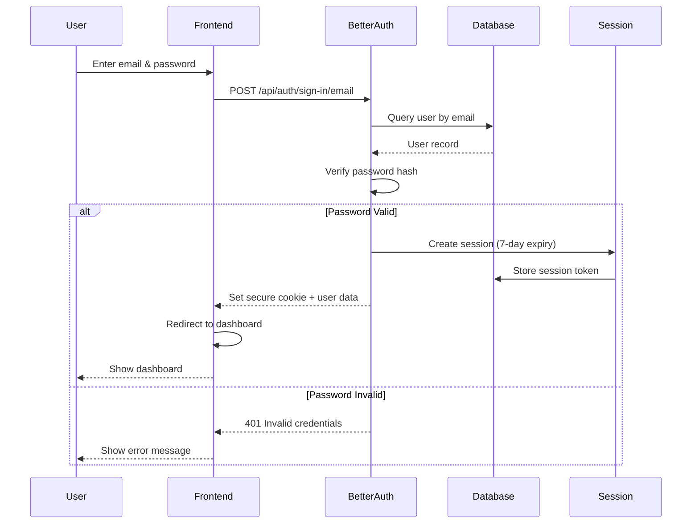

### Sign Up Flow

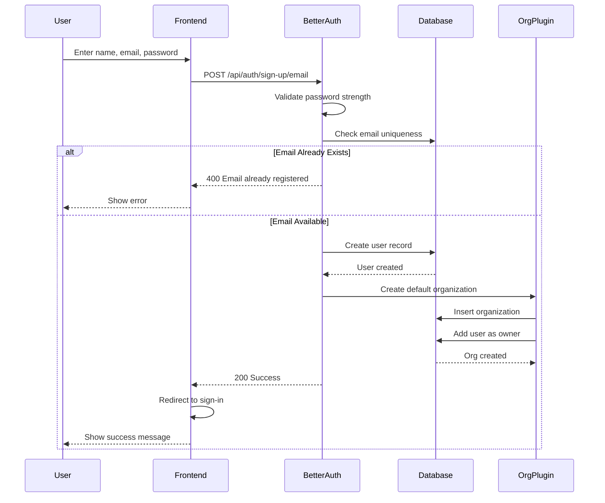

### Forgot Password Flow

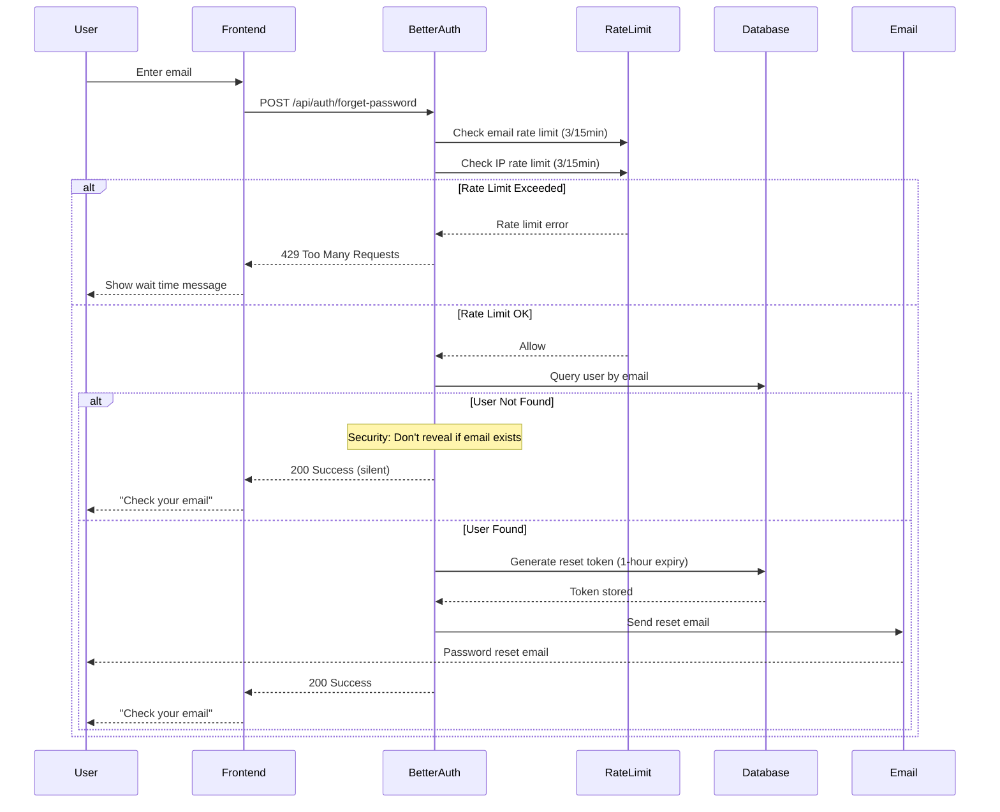

### Reset Password Flow

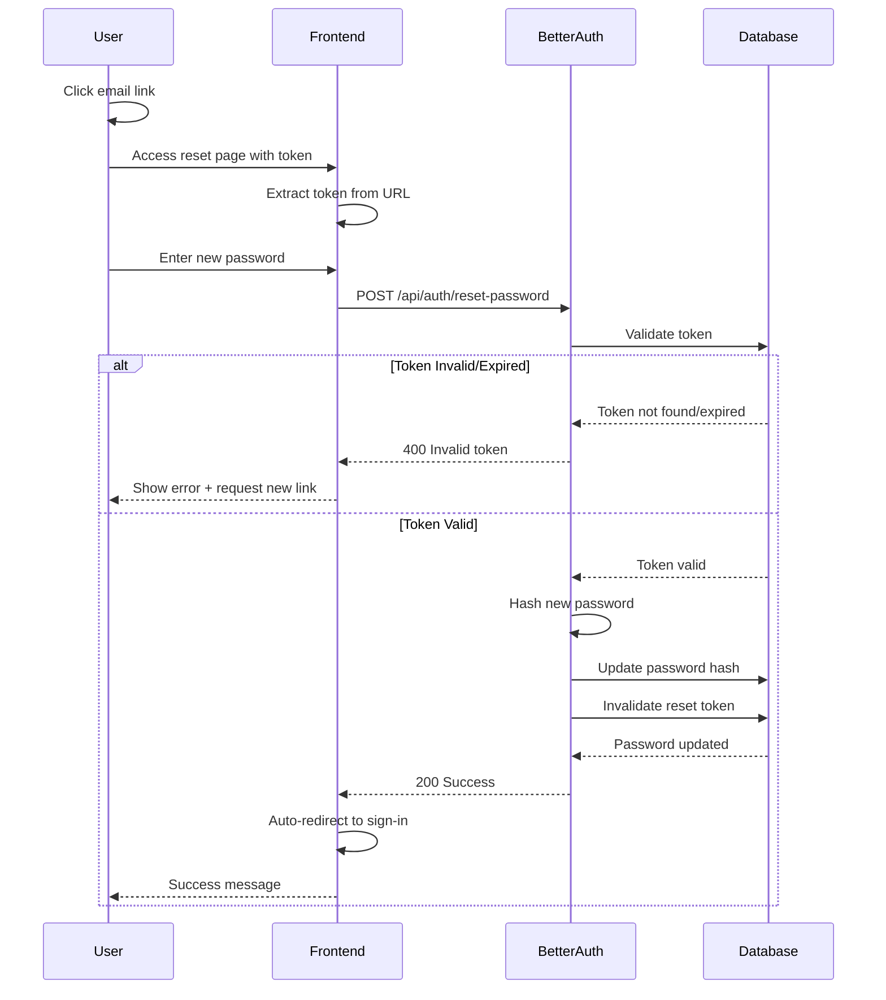

## Better Auth Configuration

### Core Configuration

**Location:** `app/src/utils/auth.ts`

**Key Features:**
- Email/password authentication
- Organization plugin with automatic org creation
- Admin plugin with impersonation support
- API key plugin for programmatic access
- Session duration: 7 days
- Session update age: 24 hours
- Database adapter: Drizzle ORM with PostgreSQL

### Plugins Enabled

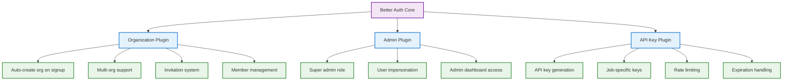

## RBAC System

### Role Hierarchy

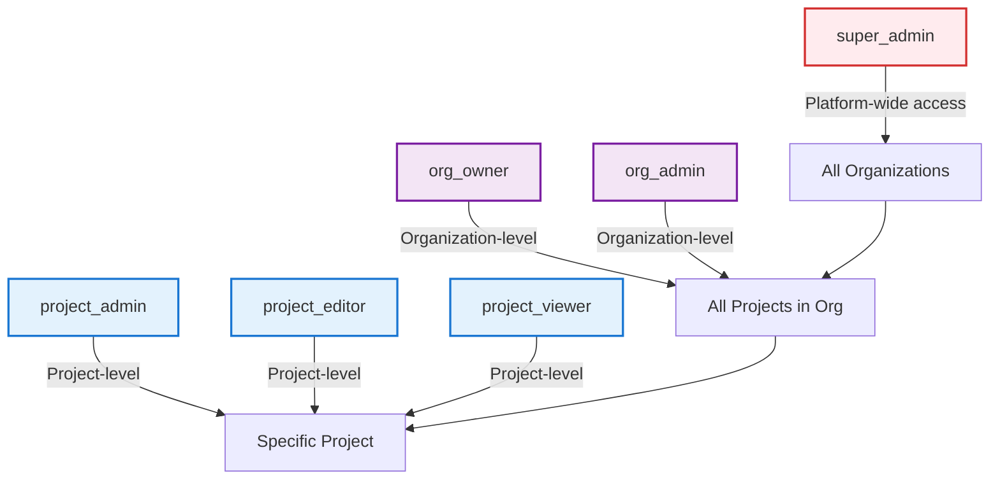

### Permission Matrix

| Role | Create Project | Create Test | Execute Test | Create Job | Trigger Job | Manage Members | View Only |
|------|----------------|-------------|--------------|------------|-------------|----------------|-----------|
| `super_admin` | ✅ | ✅ | ✅ | ✅ | ✅ | ✅ | ✅ |
| `org_owner` | ✅ | ✅ | ✅ | ✅ | ✅ | ✅ | ✅ |
| `org_admin` | ✅ | ✅ | ✅ | ✅ | ✅ | ✅ | ✅ |
| `project_admin` | ❌ | ✅ | ✅ | ✅ | ✅ | ✅ (project) | ✅ |
| `project_editor` | ❌ | ✅ | ✅ | ✅ | ✅ | ❌ | ✅ |
| `project_viewer` | ❌ | ❌ | ❌ | ❌ | ❌ | ❌ | ✅ |

### Authorization Flow

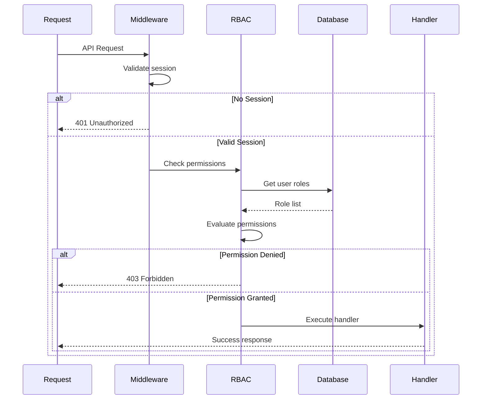

## Session Management

### Session Lifecycle

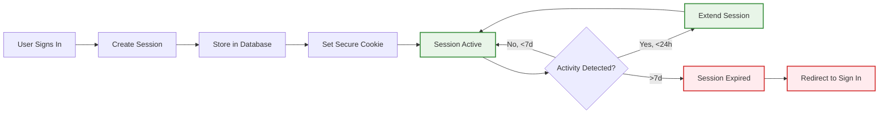

### Session Configuration

**Properties:**
- **Duration:** 7 days (604800 seconds)
- **Update Age:** 24 hours (session token refreshes daily with activity)
- **Cookie Settings:**
  - `httpOnly: true` (prevents XSS)
  - `secure: true` (HTTPS only in production)
  - `sameSite: 'lax'` (CSRF protection)
  - `path: '/'` (application-wide)

**Security Features:**
- IP address tracking (optional verification)
- User agent tracking
- Last activity timestamp
- Automatic token rotation on update
- Secure session invalidation on sign out

## Security Features

### Rate Limiting

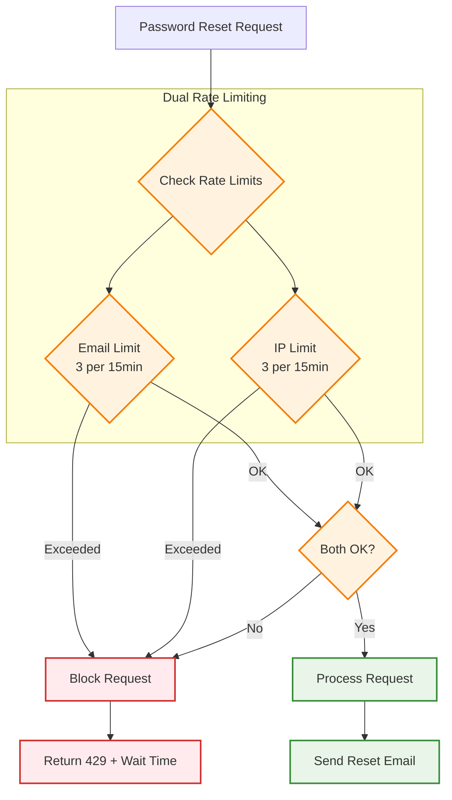

**Rate Limiting Implementation:**
- In-memory rate limit store (production should use Redis)
- Automatic cleanup every 5 minutes
- Separate limits for email and IP
- Clear error messages with wait time
- Prevents both user-targeted and distributed attacks

### Password Security

**Requirements:**
```mermaid
graph TB
    A[Password Policy] --> B[Minimum 8 characters]
    A --> C[At least 1 uppercase]
    A --> D[At least 1 lowercase]
    A --> E[At least 1 number]
    A --> F[At least 1 special character]

    G[Storage Security] --> H[Bcrypt hashing]
    G --> I[Automatic salt]
    G --> J[Cost factor: 10]

    K[Reset Security] --> L[1-hour token expiry]
    K --> M[Single-use tokens]
    K --> N[Cryptographically secure]

    classDef policy fill:#e3f2fd,stroke:#1976d2,stroke-width:2px
    classDef storage fill:#f3e5f5,stroke:#7b1fa2,stroke-width:2px
    classDef reset fill:#e8f5e8,stroke:#388e3c,stroke-width:2px

    class A,B,C,D,E,F policy
    class G,H,I,J storage
    class K,L,M,N reset
```

### Additional Security Measures

**Implementation:**
- CSRF protection via SameSite cookies
- XSS prevention via httpOnly cookies
- SQL injection prevention via parameterized queries
- Password visibility toggle (UX improvement)
- Secure error messages (no information leakage)
- Token invalidation after successful reset
- Automatic session cleanup on suspicious activity

## Email Integration

### Email Service Architecture

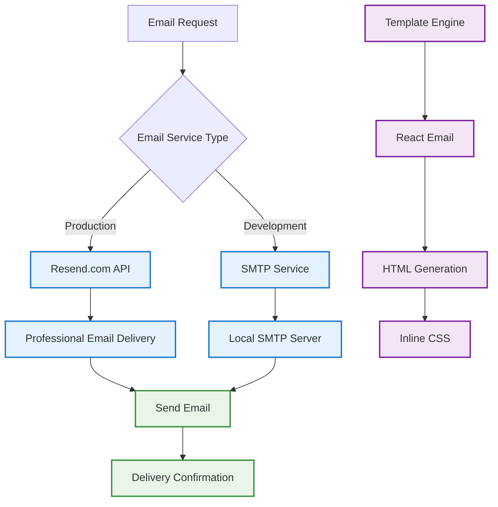

### Email Templates

**Password Reset Email Features:**
- Professional HTML template with branding
- Plain text fallback for compatibility
- Clear call-to-action button
- Security warnings about expiration
- Advice for unauthorized requests
- Consistent application branding
- Mobile-responsive design

**Configuration Variables:**
- `SMTP_HOST` - SMTP server hostname
- `SMTP_PORT` - SMTP server port
- `SMTP_USER` - SMTP username
- `SMTP_PASSWORD` - SMTP password
- `SMTP_SECURE` - Use TLS/SSL (true/false)
- `SMTP_FROM_EMAIL` - Sender email address
- `RESEND_API_KEY` - Resend.com API key (production)

## Organization Management

### Organization Creation Flow

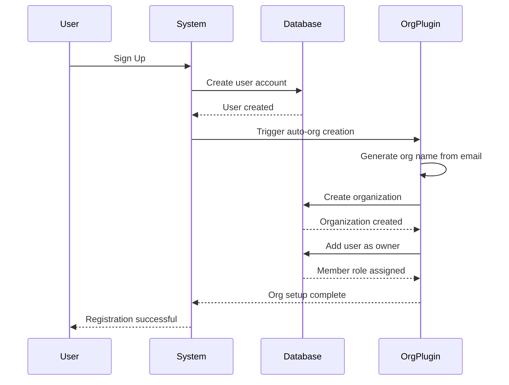

### Invitation System

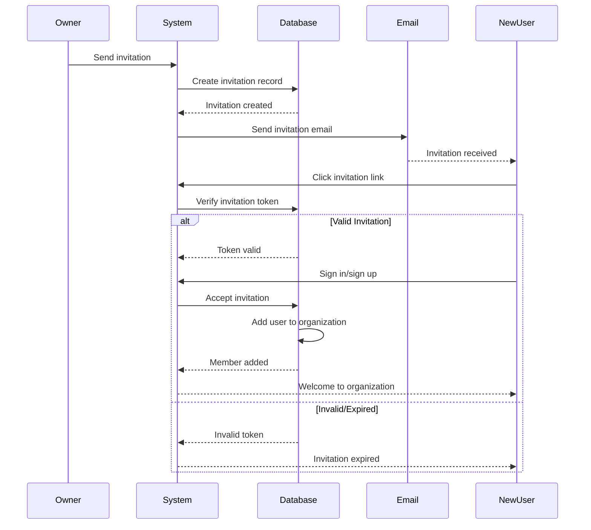

## API Integration

### Authentication Endpoints

**User Authentication:**
- `POST /api/auth/sign-in/email` - Email/password sign-in
- `POST /api/auth/sign-up/email` - User registration
- `POST /api/auth/sign-out` - Session termination
- `GET /api/auth/get-session` - Current session info

**Password Management:**
- `POST /api/auth/forget-password` - Request password reset
- `POST /api/auth/reset-password` - Execute password reset

**Organization Management:**
- `POST /api/auth/organization/create` - Create new organization
- `POST /api/auth/organization/invite-member` - Send invitation
- `GET /api/auth/organization/members` - List organization members
- `DELETE /api/auth/organization/remove-member` - Remove member

**Admin Functions:**
- `POST /api/auth/admin/impersonate` - Impersonate user
- `POST /api/auth/admin/stop-impersonating` - Stop impersonation

### Client SDK Methods

**Authentication:**
- `authClient.signIn.email(credentials)` - Sign in
- `authClient.signUp.email(userData)` - Sign up
- `authClient.signOut()` - Sign out
- `authClient.forgetPassword(email)` - Request reset
- `authClient.resetPassword(data)` - Reset password

**React Hooks:**
- `useSession()` - Get current session
- `useActiveOrganization()` - Get active org
- `useOrganizations()` - List all user orgs

## Database Schema

### Authentication Tables

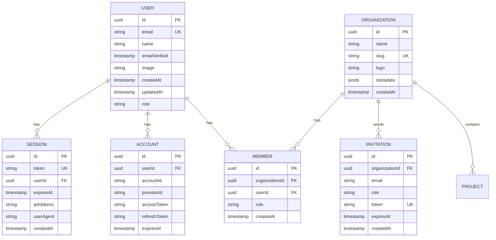

## Testing Guide

### Test Scenarios

#### 1. Sign Up Flow
**Steps:**
1. Navigate to sign-up page
2. Enter valid email, name, password
3. Submit form
4. Verify user created in database
5. Verify default organization created
6. Verify user assigned as owner

**Expected:** User redirected to sign-in with success message

#### 2. Sign In Flow
**Steps:**
1. Navigate to sign-in page
2. Enter registered email and password
3. Submit form
4. Verify session created
5. Verify secure cookie set

**Expected:** User redirected to dashboard

#### 3. Password Reset Flow
**Steps:**
1. Navigate to forgot password
2. Enter registered email
3. Check email received
4. Click reset link
5. Enter new password
6. Submit form
7. Attempt sign in with new password

**Expected:** Password successfully reset, sign in works

#### 4. Rate Limiting
**Steps:**
1. Request password reset 4 times in quick succession
2. Verify 4th request blocked
3. Check error message includes wait time

**Expected:** Rate limit enforced after 3 attempts

#### 5. Organization Invitation
**Steps:**
1. Owner sends invitation to email
2. New user receives invitation email
3. New user clicks link and signs up/in
4. Verify user added to organization
5. Verify correct role assigned

**Expected:** New member added to organization

## Related Documentation

- **RBAC System:** See `RBAC_DOCUMENTATION.md` for detailed permission model
- **API Keys:** See `API_KEY_SYSTEM.md` for programmatic access
- **Database Schema:** See `ERD_DIAGRAM.md` for complete database structure
- **Organization Management:** See `ORGANIZATION_AND_PROJECT_IMPLEMENTATION.md`

## Revision History

| Version | Date | Changes |
|---------|------|---------|
| 3.0 | 2025-01-12 | Updated for Better Auth 1.2.8, enhanced diagrams |
| 2.0 | 2024-12-01 | Added organization plugin details |
| 1.0 | 2024-10-15 | Initial specification |
