# Job Trigger System Specification

## Overview

The Supercheck Job Trigger System provides three distinct execution pathways: **Manual** (user-initiated), **Remote** (API-driven), and **Schedule** (automated). This multi-trigger architecture enables seamless integration with CI/CD pipelines, automated testing workflows, and interactive development scenarios while maintaining complete execution traceability and audit compliance.

## Table of Contents

1. [System Architecture](#system-architecture)
2. [Trigger Types](#trigger-types)
3. [Execution Flow](#execution-flow)
4. [Capacity Management](#capacity-management)
5. [Security & Authorization](#security--authorization)
6. [Database Schema](#database-schema)
7. [API Endpoints](#api-endpoints)
8. [Integration Patterns](#integration-patterns)

## System Architecture

```mermaid
graph TB
    subgraph "🎨 Trigger Sources"
        M1[👤 Web UI<br/>Manual Trigger]
        R1[🔗 External API<br/>Remote Trigger]
        S1[⏰ Cron Scheduler<br/>Schedule Trigger]
    end

    subgraph "🔐 Authentication Layer"
        AUTH1[Session Auth<br/>Manual]
        AUTH2[API Key Auth<br/>Remote]
        AUTH3[Internal Auth<br/>Schedule]
    end

    subgraph "⚙️ Processing Pipeline"
        VALIDATE[Capacity Check<br/>& Validation]
        QUEUE[BullMQ Queue<br/>Job Placement]
        WORKER[Worker Service<br/>Test Execution]
    end

    subgraph "💾 State Management"
        DB[(PostgreSQL<br/>Run Records)]
        CACHE[Redis<br/>Capacity Tracking]
    end

    subgraph "📊 Real-time Updates"
        SSE[Server-Sent Events<br/>Real-time Updates]
    end

    M1 --> AUTH1
    R1 --> AUTH2
    S1 --> AUTH3

    AUTH1 & AUTH2 & AUTH3 --> VALIDATE
    VALIDATE --> CACHE
    VALIDATE --> QUEUE
    QUEUE --> WORKER

    WORKER --> DB
    QUEUE --> SSE

    classDef source fill:#e3f2fd,stroke:#1976d2,stroke-width:2px
    classDef auth fill:#f3e5f5,stroke:#7b1fa2,stroke-width:2px
    classDef process fill:#fff3e0,stroke:#f57c00,stroke-width:2px
    classDef data fill:#e8f5e8,stroke:#388e3c,stroke-width:2px
    classDef obs fill:#fce4ec,stroke:#c2185b,stroke-width:2px

    class M1,R1,S1 source
    class AUTH1,AUTH2,AUTH3 auth
    class VALIDATE,QUEUE,WORKER process
    class DB,CACHE data
    class SSE obs
```



## Trigger Types

### Manual Trigger

**Purpose:** Interactive job execution initiated by authenticated users through the web interface.

**Characteristics:**
- Real-time user feedback
- Immediate capacity validation
- Session-based authentication
- SSE progress updates
- User-specific RBAC enforcement

**Use Cases:**
- Development and debugging
- Ad-hoc test runs
- Manual regression testing
- Interactive test exploration


### Remote Trigger

**Purpose:** Programmatic job execution via API keys for CI/CD integration and external automation.

**Characteristics:**
- API key authentication
- Rate limiting per key
- No user session required
- Webhook-friendly
- Support for job parameters

**Use Cases:**
- CI/CD pipeline integration
- Pre-deployment validation
- Scheduled external triggers
- Third-party integrations


### Schedule Trigger

**Purpose:** Automated time-based job execution using cron expressions.

**Characteristics:**
- Cron-based scheduling
- No external authentication
- System-initiated execution
- Configurable retry logic
- Prevents concurrent executions

**Use Cases:**
- Continuous monitoring
- Nightly regression suites
- Periodic smoke tests
- Regular health checks


## Execution Flow

### Complete Job Lifecycle


### Trigger-Specific Paths


## Capacity Management

### Atomic Capacity Enforcement

**✅ Race Condition Prevention**
- All job triggers (Manual, Remote, Schedule) use atomic capacity management
- Redis Lua scripts prevent concurrent requests from exceeding limits
- Organization-specific capacity limits enforced at the trigger point

### Capacity Tracking Architecture


### Capacity Limits by Plan

| Plan | Running Capacity | Queued Capacity | Scope |
|------|------------------|-----------------|-------|
| **Plus** | 5 concurrent | 50 queued | Organization |
| **Pro** | 10 concurrent | 100 queued | Organization |
| **Unlimited** | 999 concurrent | 9999 queued | Organization |

**Environment Overrides (Self-hosted):**
- `RUNNING_CAPACITY`: Override plan-specific running limit
- `QUEUED_CAPACITY`: Override plan-specific queued limit |
| **Queued Capacity** | 50 | `QUEUED_CAPACITY` | Global |
| **Execution Timeout** | 15 min | `JOB_EXECUTION_TIMEOUT_MS` | Per Job |
| **Max Concurrent Tests** | 1 | `MAX_CONCURRENT_EXECUTIONS` | Per Worker |

## Security & Authorization

### Authorization Matrix


### Security Considerations by Trigger Type

| Security Aspect | Manual | Remote | Schedule |
|----------------|--------|--------|----------|
| **Authentication** | Session cookie | Bearer token | Internal JWT |
| **Authorization** | RBAC + Project membership | API key → Job mapping | System-level |
| **Rate Limiting** | Per user (10/min) | Per API key (configurable) | N/A |
| **Audit Logging** | User ID + timestamp | API key ID + IP | System + cron ID |
| **CSRF Protection** | Required | N/A | N/A |
| **Polar Validation** | Yes | Yes | No (internal) |

### Security Enhancements

#### **Remote Trigger Security**

1. **Polar Customer Validation**
   - All remote triggers validate that the organization has a valid Polar customer
   - Blocks execution for deleted/invalid Polar customers with clear error message
   - Returns HTTP 402 for subscription/customer issues

2. **Atomic API Key Counter**
   - API key usage statistics updated atomically using SQL `COALESCE + INCREMENT`
   - Prevents race conditions from concurrent requests overwriting counts
   - Non-blocking: failures don't prevent job execution

3. **Safe Logging**
   - Organization IDs truncated in logs to prevent data exposure
   - API key names logged but not full key values
   - Error messages sanitized before returning to client

## Database Schema

### Runs Table Structure


### Trigger Field Specification

**Field:** `trigger`
**Type:** `varchar(50)`
**Default:** `'manual'`
**Values:**
- `manual` - User-initiated via web UI
- `remote` - API-triggered via API key
- `schedule` - Cron-based automation

**Indexes:**
- `idx_runs_trigger` - Fast filtering by trigger type
- `idx_runs_job_trigger` - Composite index for job + trigger queries
- `idx_runs_created_trigger` - Timeline queries by trigger type

## API Endpoints

### Manual Trigger

**Endpoint:** `POST /api/jobs/run`

**Authentication:** Session cookie

**Request Body:**
```json
{
  "jobId": "uuid",
  "metadata": {}
}
```

**Response:**
```json
{
  "runId": "uuid",
  "status": "queued",
  "trigger": "manual",
  "message": "Job queued successfully"
}
```

### Remote Trigger

**Endpoint:** `POST /api/jobs/:id/trigger`

**Authentication:** Bearer token (API key)

**Headers:**
```
Authorization: Bearer job_abc123...
```

**Response:**
```json
{
  "runId": "uuid",
  "jobId": "uuid",
  "status": "queued",
  "trigger": "remote",
  "message": "Job queued successfully"
}
```

### Schedule Management

**Endpoint:** `PATCH /api/jobs/:id/schedule`

**Request Body:**
```json
{
  "scheduled": true,
  "cronExpression": "0 2 * * *",
  "timezone": "America/New_York"
}
```

## Integration Patterns

### CI/CD Integration


### Automated Monitoring


## Best Practices

### For Manual Triggers
- Provide clear feedback on queue position
- Show estimated wait time
- **Allow cancellation of queued and running jobs**
- Display capacity status before trigger

## Job Cancellation

### Overview

Users can cancel running or queued jobs via the **Cancel API**. Cancellation uses Redis-based signaling to communicate between the app and distributed workers.

### Cancellation Flow


### API Endpoint

**Endpoint:** `POST /api/runs/:runId/cancel`

**Authentication:** Session cookie (same as Manual Trigger)

**Response:**
```json
{
  "success": true,
  "message": "Run cancelled successfully",
  "runId": "uuid",
  "queueRemoved": true,
  "jobType": "playwright"
}
```

### Cancellation States

| Original State | After Cancel | Notes |
|----------------|--------------|-------|
| `pending` | `error` | Removed from queue |
| `running` | `error` | Container killed (exit code 137) |
| `passed` | N/A | Cannot cancel completed |
| `failed` | N/A | Cannot cancel completed |
| `error` | N/A | Cannot cancel completed |

### UI Confirmation Dialog

Before cancelling, users see a confirmation dialog:
- **Title**: "Cancel Execution?"
- **Description**: "Are you sure you want to cancel this job execution? This action cannot be undone and the run will be marked as cancelled."
- **Actions**: "Continue Running" (cancel) or "Cancel Execution" (confirm)

### UI Status Display

Cancelled runs display as "Cancelled" (not "Error") in the UI:
- Database stores `status: 'error'` with `errorDetails: 'Cancellation requested by user'`
- UI detects cancellation keywords in `errorDetails` and displays "Cancelled" with Ban icon
- Faceted filters correctly count cancelled runs separately from other errors

### Implementation Details

- **Redis Signal TTL**: 1 hour (prevents stale signals)
- **Polling Interval**: 1 second during container execution
- **Container Kill**: Uses `docker kill` (SIGKILL) for immediate termination
- **Cleanup**: Container removed, resources released automatically

## Queue Status Synchronization

### Overview

To prevent jobs from getting "stuck" in a `running` state due to worker crashes or unexpected terminations, the system implements **active queue verification** that synchronizes database status with the actual BullMQ queue state.

### Synchronization Mechanism


### When It Runs

- **On Page Load**: `/api/jobs/status/running` is called by `JobContext` 
- **On Refresh**: Ensures UI always shows accurate state
- **Automatic**: No manual intervention required

### How It Works

**Implementation:** `app/src/app/api/jobs/status/running/route.ts`

1. **Query Database**: Get all runs with `status: 'running'`
2. **Verify with Queue**: For each run, check if job exists in BullMQ queues:
   - Check Playwright global queue
   - Check K6 regional queues
   - Use `queue.getJob(runId)` and `job.getState()`
3. **Detect Inconsistencies**: If queue says job is completed/failed/missing but DB says "running"
4. **Sync Database**: Immediately update stale runs to `error` status
5. **Return Valid Jobs**: Only return jobs that are truly running

### Performance Optimization

- **Parallel Batch Queries**: Checks all runs concurrently using `Promise.all()`
- **Early Exit**: Uses `Promise.race()` to return as soon as job is found in any queue
- **Timeout Protection**: 500ms timeout per run to prevent hanging
- **Complexity**: O(N) instead of O(N×M) where N=runs, M=queues

### Error Messages

Stale jobs are marked with:
```typescript
{
  status: "error",
  errorDetails: "Job status inconsistency detected - not found in execution queue",
  completedAt: <current timestamp>
}
```

### Benefits

- ✅ **Self-Healing**: System automatically fixes stuck jobs
- ✅ **No Background Service**: Simple, synchronous verification
- ✅ **Real-time**: Updates happen on every page load
- ✅ **User Transparency**: Users immediately see accurate status


### For Remote Triggers
- Implement exponential backoff on 429 responses
- Use webhook callbacks instead of polling
- Set appropriate API key rate limits
- Monitor API key usage patterns

### For Schedule Triggers
- Use timezone-aware cron expressions
- Prevent overlapping executions
- Implement schedule drift detection
- Log all schedule changes

## Related Documentation

- **API Keys:** See `API_KEY_SYSTEM.md` for detailed API key documentation
- **Queue System:** See `EXECUTION_SYSTEM.md` for queue details
- **Authentication:** See `AUTHENTICATION.md` for auth mechanisms

