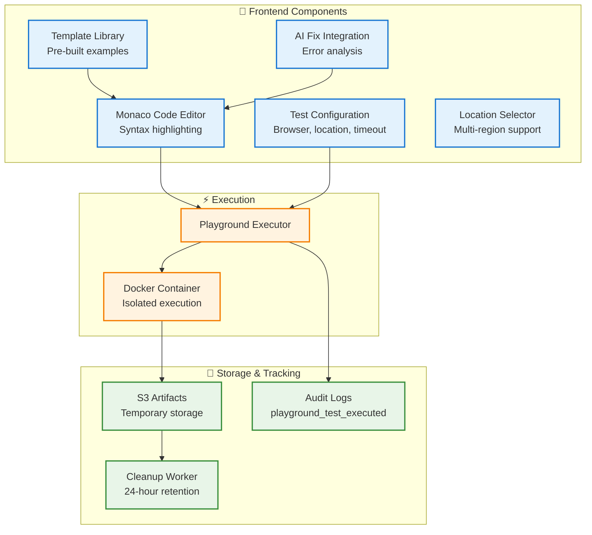
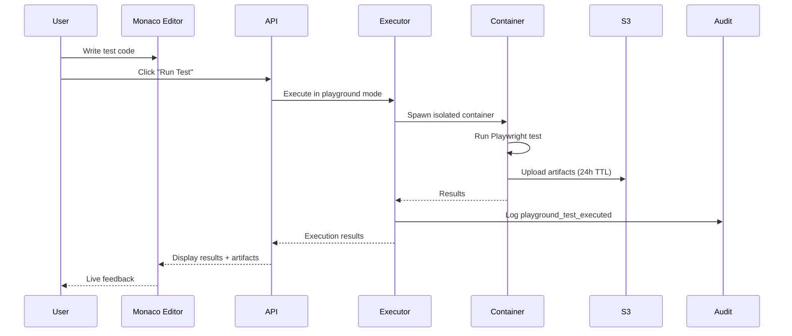
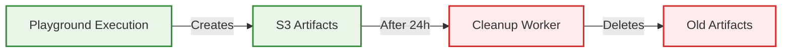

# Playground System

## Overview

The Playground System provides an **interactive sandbox environment** for rapid Playwright test development and debugging with **Monaco code editor**, **AI-powered fixes**, **template library**, and **multi-location execution**.

---

## Architecture

---

## Key Features

### 1. Monaco Code Editor
- TypeScript/JavaScript syntax highlighting
- Auto-completion for Playwright APIs
- Real-time error detection
- Code formatting support

### 2. Template Library
- Login flows
- Form submissions
- API testing patterns
- Visual regression examples
- Performance testing

### 3. AI-Powered Fixes
- Automatic error analysis
- Intelligent code suggestions
- One-click fix application
- Diff viewer for changes

### 4. Multi-Location Execution
- US East, US West, EU, APAC
- Geographic performance testing
- Latency comparison

---

## Execution Flow

---

## Data Lifecycle

### Cleanup Strategy
- **Retention:** 24 hours
- **Schedule:** Every 12 hours
- **Target:** S3 playground artifacts
- **Tracking:** Via audit logs

---

## Summary

✅ **Interactive Development** - Real-time code editing and execution
✅ **Template Library** - Jumpstart with pre-built patterns
✅ **AI Integration** - Intelligent error fixing
✅ **Multi-Location** - Test from multiple regions
✅ **Automatic Cleanup** - 24-hour artifact retention
