# Tag Management System

## Overview

The Tag Management System provides **organizational capabilities** for tests and monitors through customizable, color-coded tags. Tags enable efficient categorization, filtering, and bulk operations across testing and monitoring resources.

**🏷️ Project-Scoped Tags:** All tags are scoped to projects with RBAC enforcement for secure multi-tenant operations.

---

## System Architecture

```mermaid
graph TB
    subgraph "🎨 Frontend Layer"
        UI[Tag Management UI]
        FILTER[Tag Filter Components]
        PICKER[Tag Color Picker]
    end

    subgraph "🔐 API Layer"
        API1[/api/tags<br/>CRUD Operations]
        API2[/api/tags/[id]<br/>Individual Tag]
        API3[/api/tests/[id]/tags<br/>Test Associations]
        API4[/api/monitors/[id]/tags<br/>Monitor Associations]
    end

    subgraph "💾 Database Layer"
        TAGS[(tags table)]
        TEST_TAGS[(testTags join table)]
        MONITOR_TAGS[(monitorTags join table)]
    end

    UI --> API1 & API2
    FILTER --> API1
    PICKER --> API1

    API1 & API2 --> TAGS
    API3 --> TEST_TAGS
    API4 --> MONITOR_TAGS

    TAGS --> TEST_TAGS & MONITOR_TAGS

    classDef frontend fill:#e3f2fd,stroke:#1976d2,stroke-width:2px
    classDef api fill:#f3e5f5,stroke:#7b1fa2,stroke-width:2px
    classDef data fill:#e8f5e8,stroke:#388e3c,stroke-width:2px

    class UI,FILTER,PICKER frontend
    class API1,API2,API3,API4 api
    class TAGS,TEST_TAGS,MONITOR_TAGS data
```

---

## Tag Structure

### Tag Properties


### Default Color Palette

| Color | Hex Code | Use Case |
|-------|----------|----------|
| Blue | `#3b82f6` | General purpose |
| Green | `#10b981` | Success/passing tests |
| Red | `#ef4444` | Critical/failing tests |
| Yellow | `#f59e0b` | Warning/staging |
| Purple | `#8b5cf6` | Integration tests |
| Pink | `#ec4899` | UI/E2E tests |
| Indigo | `#6366f1` | API tests |
| Orange | `#f97316` | Performance tests |

---

## Tag Operations

### Create Tag Flow


### Tag Association Flow


---

## Tag Filtering & Search

### Filter Architecture


### Filter Query Examples

**AND Logic (Test has ALL tags):**


**OR Logic (Test has ANY tag):**


---

## Tag Limits & Validation

### Validation Rules


### Tag Limits

| Limit Type | Value | Reason |
|------------|-------|--------|
| Max Tags per Project | 50 | Prevent tag sprawl |
| Name Length Min | 3 chars | Meaningful names |
| Name Length Max | 20 chars | UI display constraints |
| Color Format | Hex (#rrggbb) | Standard color representation |

---

## Bulk Operations

### Bulk Tag Assignment


### Bulk Tag Removal


---

## Tag Usage Analytics

### Tag Statistics

```mermaid
graph TB
    TAG[Tag: E2E] --> STATS[Tag Statistics]

    STATS --> COUNT1[Tests Tagged: 25]
    STATS --> COUNT2[Monitors Tagged: 10]
    STATS --> USAGE[Total Usage: 35]
    STATS --> TREND[Usage Trend: ↑ 15%]

    classDef tag fill:#e3f2fd,stroke:#1976d2,stroke-width:2px
    classDef stat fill:#e8f5e8,stroke:#388e3c,stroke-width:2px

    class TAG tag
    class STATS,COUNT1,COUNT2,USAGE,TREND stat
```



---

## RBAC Integration

### Permission Matrix

| Action | Required Permission | Notes |
|--------|-------------------|-------|
| View Tags | `test:view` or `monitor:view` | Read-only access |
| Create Tag | `test:edit` | Project editor role |
| Update Tag | `test:edit` | Tag creator or project admin |
| Delete Tag | `test:delete` | Tag creator or project admin |
| Assign Tag | `test:edit` | Can assign to owned resources |

### Permission Check Flow


---

## Best Practices

### Tagging Strategy


### Tag Naming Conventions

✅ **Good Examples:**
- `e2e-checkout`
- `critical-path`
- `api-v2`
- `frontend-team`

❌ **Bad Examples:**
- `test` (too generic)
- `important!!!` (special chars)
- `e` (too short)
- `very-long-tag-name-that-exceeds-limit` (too long)

---

## Summary

The Tag Management System provides:

✅ **Flexible Organization** - Categorize tests and monitors
✅ **Color Coding** - Visual identification with 8 default colors
✅ **Project Scoping** - Isolated tags per project
✅ **RBAC Integration** - Permission-based tag operations
✅ **Bulk Operations** - Efficient tag assignment/removal
✅ **Smart Filtering** - AND/OR logic for advanced queries
✅ **Usage Analytics** - Track tag adoption and trends
✅ **Validation Rules** - Prevent tag sprawl and naming conflicts

---

**Document Version:** 1.0
**Last Updated:** January 17, 2025
**Status:** Production Ready
