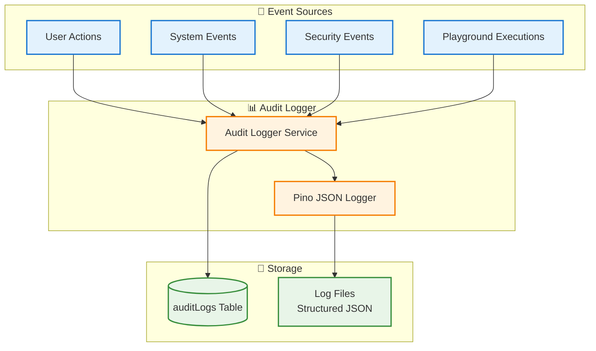
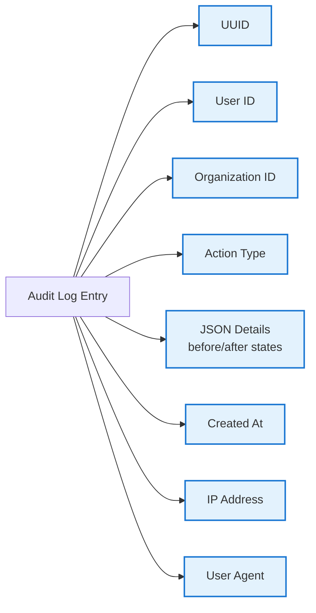
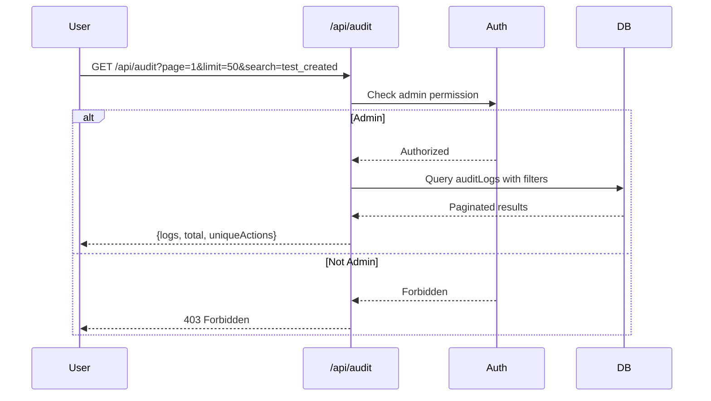

# Audit Logging System

## Overview

The Audit Logging System provides **comprehensive tracking** of user actions, system events, and security-relevant operations for compliance, debugging, and forensic analysis.

---

## Architecture

---

## Audit Events

### Event Categories

| Category | Examples | Retention |
|----------|----------|-----------|
| **Authentication** | login, logout, password_reset | 90 days |
| **Authorization** | role_change, permission_grant | 90 days |
| **Resource Management** | test_created, monitor_updated, job_deleted | 30 days |
| **Execution** | test_executed, job_triggered, playground_test_executed | 30 days |
| **Configuration** | settings_changed, integration_added | 90 days |
| **Security** | failed_login, unauthorized_access | 365 days |

---

## Audit Log Structure

---

## API Endpoint

### GET /api/audit

**Features:**
- Pagination (limit, page)
- Search/filter by action
- Free-text search
- Sort by timestamp (asc/desc)
- Permission check (admin only)

---

## Summary

✅ **Comprehensive Tracking** - All user and system actions
✅ **Structured Logging** - JSON format for easy parsing
✅ **RBAC Integration** - Admin-only access
✅ **Forensic Analysis** - Before/after state tracking
✅ **Compliance Ready** - Configurable retention policies

---

**Document Version:** 1.0
**Last Updated:** January 17, 2025
