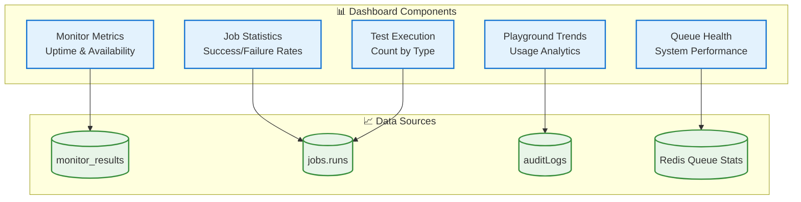
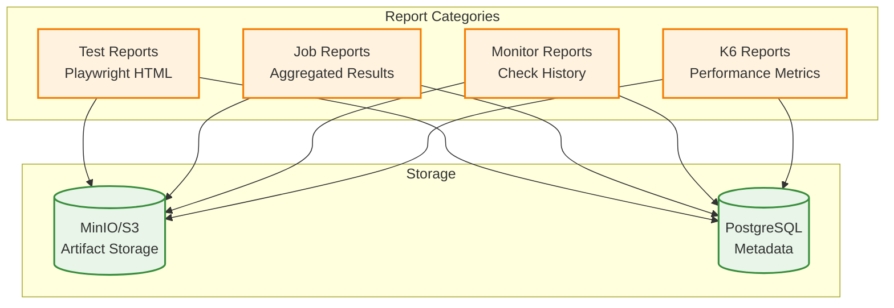
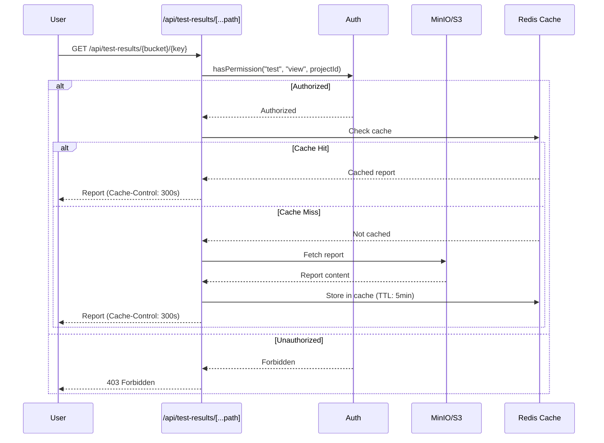
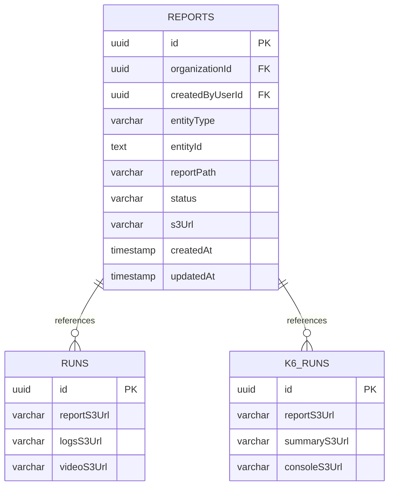
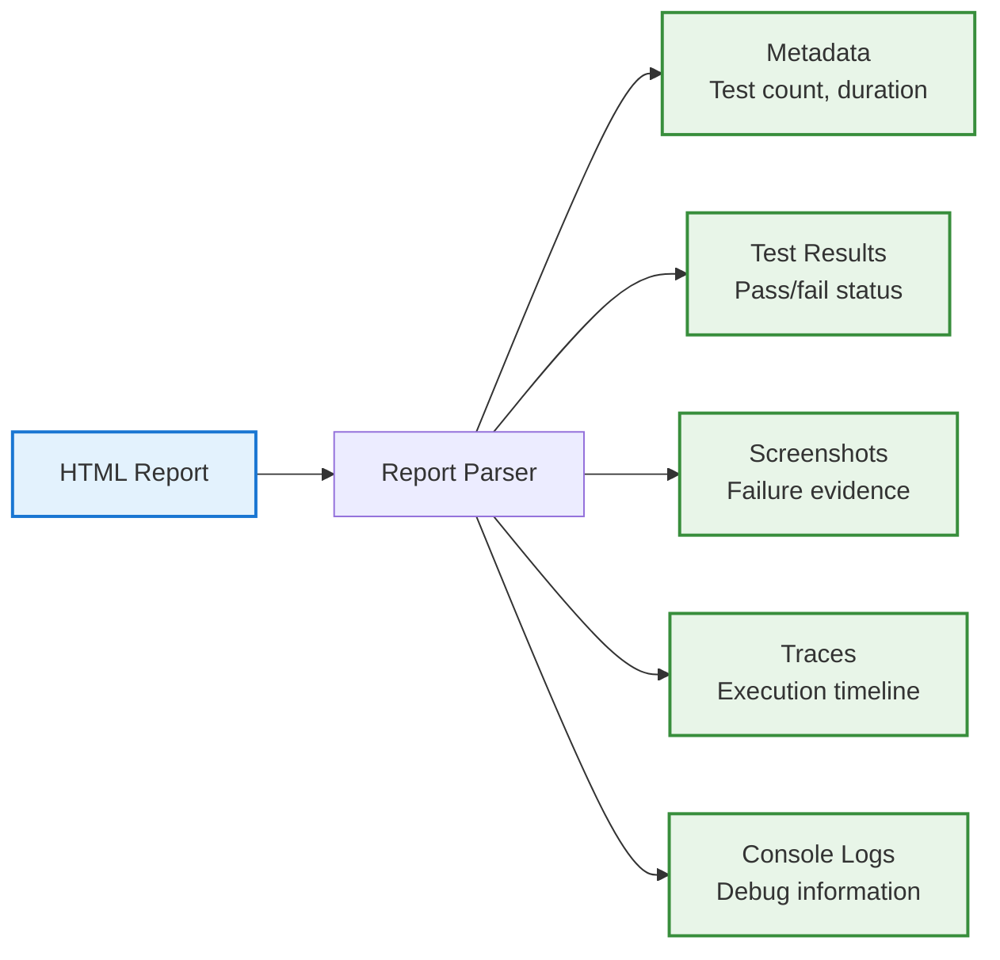
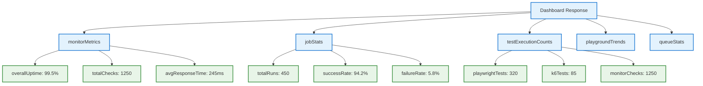

# Dashboard & Reports System

## Overview

The Dashboard & Reports System provides **comprehensive metrics visualization** and **artifact management** for test execution, monitoring, and system health. The system aggregates data from multiple sources to provide real-time insights and historical trends.

---

## Dashboard Architecture



## Dashboard Metrics

### Monitor Metrics
- **Overall Uptime Percentage** - Last 30 days
- **Availability Trends** - Daily aggregation
- **Average Response Time** - P50, P95, P99
- **Status Distribution** - Up/Down/Degraded counts

### Job Execution Statistics
- **Total Executions** - Last 30 days
- **Success Rate** - Percentage of successful runs
- **Failure Rate** - Percentage of failed runs
- **Average Duration** - Mean execution time

### Test Execution Metrics
- **Playwright Tests** - Execution count
- **K6 Performance Tests** - Execution count
- **Monitor Checks** - Check count

### Playground Analytics
- **Playground Executions** - Tracked via audit logs
- **Usage Trends** - Daily/weekly patterns
- **Popular Templates** - Most used examples

---

## Reports System

### Report Types



### Report Retrieval Flow



---

## Report Storage Schema

### Database Schema



---

## HTML Report Parsing

### Report Components



---

## Dashboard API

### Endpoint: GET /api/dashboard

**Response Structure:**


---

## Performance Optimization

### Caching Strategy

```mermaid
graph TB
    subgraph "Cache Layers"
        C1[Report Cache<br/>TTL: 5 minutes]
        C2[Dashboard Metrics<br/>TTL: 1 minute]
        C3[Query Results<br/>TTL: 30 seconds]
    end

    subgraph "Cache Keys"
        K1[report:{bucket}:{key}]
        K2[dashboard:{orgId}:{projectId}]
        K3[metrics:{type}:{date}]
    end

    C1 --> K1
    C2 --> K2
    C3 --> K3

    classDef cache fill:#e8f5e8,stroke:#388e3c,stroke-width:2px
    classDef key fill:#fff3e0,stroke:#f57c00,stroke-width:2px

    class C1,C2,C3 cache
    class K1,K2,K3 key
```

---

## Summary

The Dashboard & Reports System provides:

✅ **Comprehensive Metrics** - All key performance indicators
✅ **Real-Time Updates** - Live dashboard data
✅ **Efficient Caching** - Reduced database and S3 load
✅ **Secure Access** - RBAC-based report retrieval
✅ **Multiple Report Types** - Test, job, monitor, and K6 reports
✅ **Performance Optimization** - Multi-layer caching strategy
