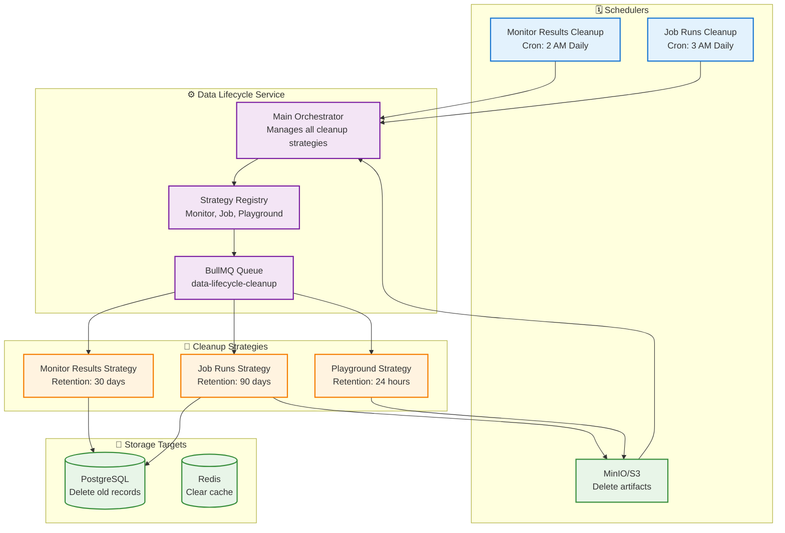
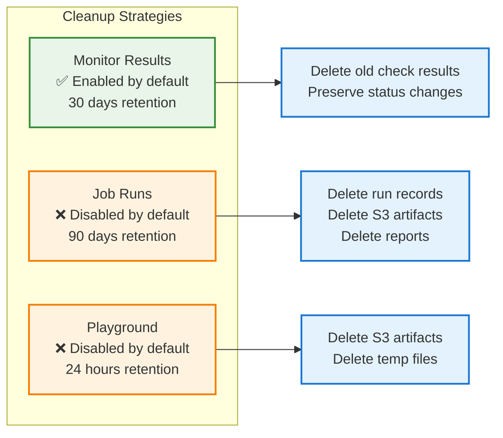
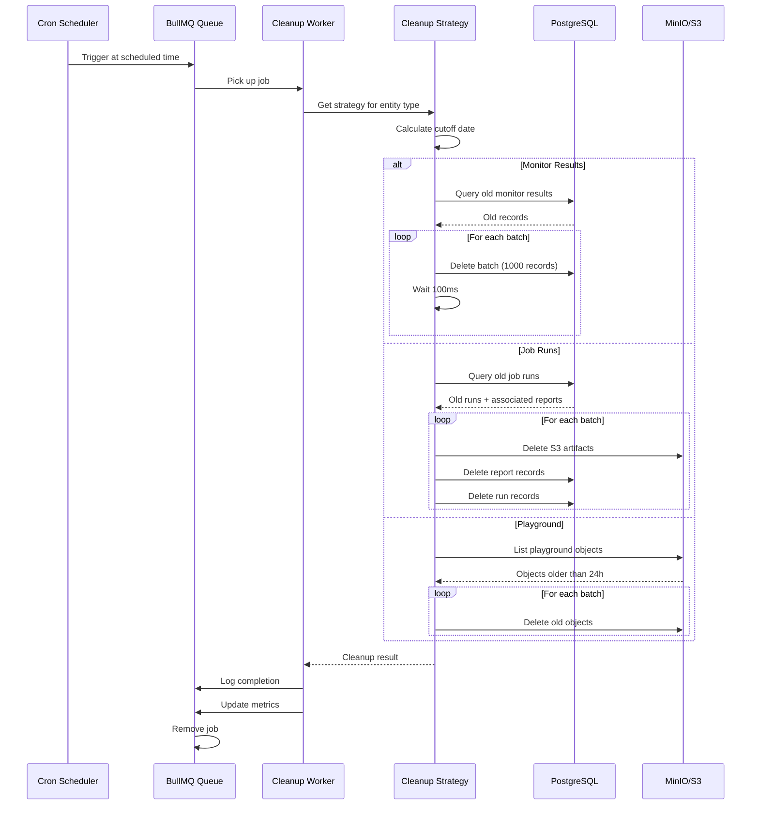
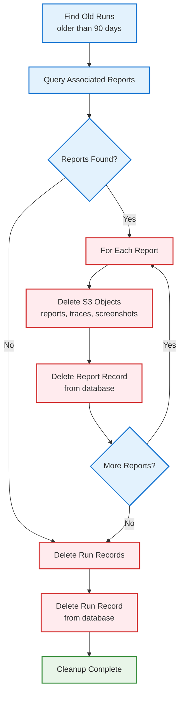
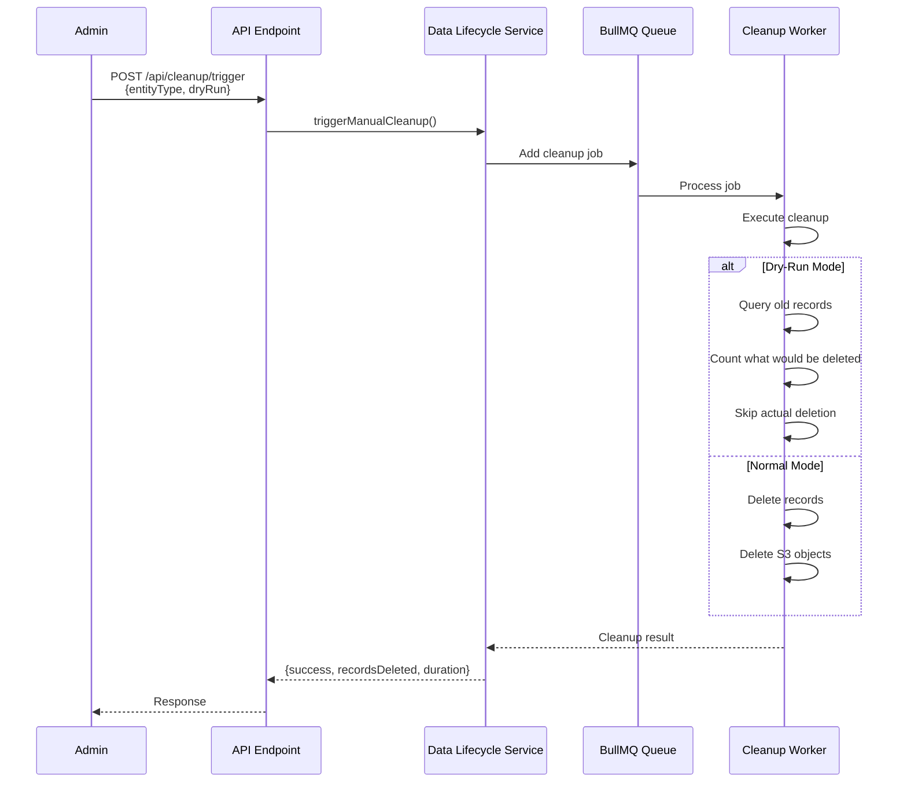
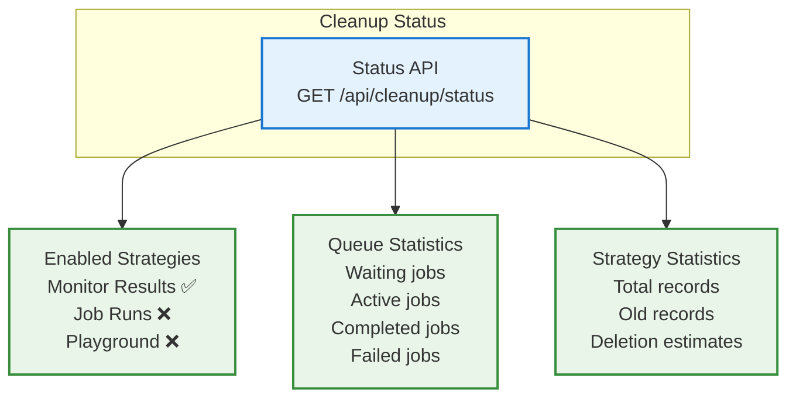
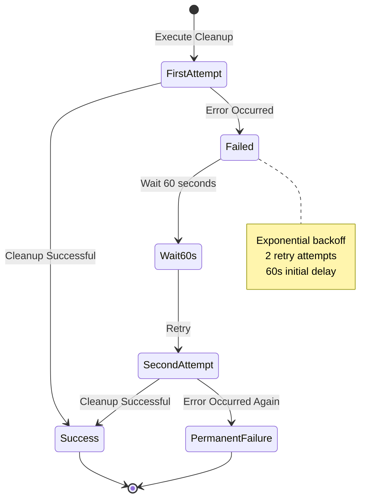
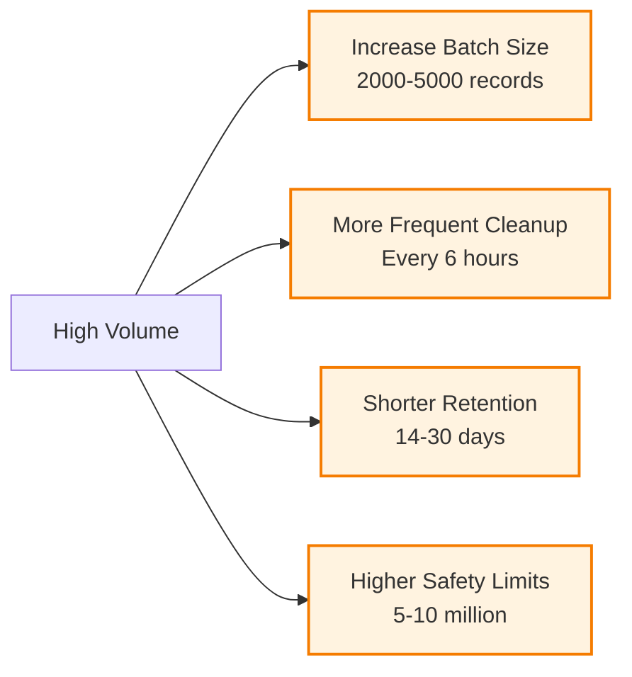
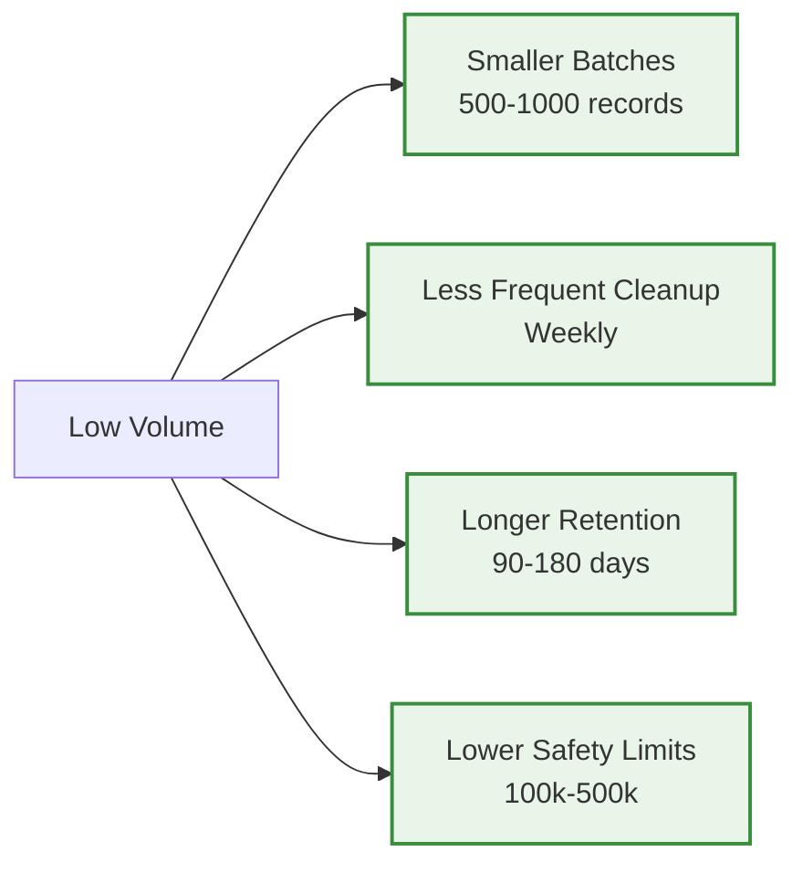

# Data Lifecycle System - Cleanup & Retention Management

## Overview

The Supercheck data lifecycle system provides **enterprise-grade cleanup operations** for managing data retention, archival, and resource cleanup across all entities. The system uses **BullMQ** for distributed job processing and supports **configurable retention policies** per entity type.

**🔄 Automated Cleanup:** Scheduled cleanup jobs run during off-peak hours to maintain optimal database and storage performance.

**🔒 Safe by Design:** Dry-run mode, batch processing, and safety limits prevent accidental data loss.

---

## System Architecture

### Complete Architecture Overview



---

## Cleanup Strategies

### Strategy Overview



### 1. Monitor Results Cleanup

**Configuration:**
- **Entity Type:** monitor_results
- **Status:** ✅ Enabled by default
- **Schedule:** 2 AM daily (0 2 * * *)
- **Retention:** 30 days
- **Batch Size:** 1000 records
- **Safety Limit:** 1,000,000 records

**Environment Variables:**
- `MONITOR_CLEANUP_ENABLED`: true
- `MONITOR_CLEANUP_CRON`: "0 2 * * *"
- `MONITOR_RETENTION_DAYS`: 30
- `MONITOR_CLEANUP_BATCH_SIZE`: 1000
- `MONITOR_CLEANUP_SAFETY_LIMIT`: 1000000

**What Gets Deleted:**
- ✅ Old monitor check results (older than 30 days)
- ❌ Status change records (preserved for alert history)
- ❌ Recent results (within 30 days)

### 2. Job Runs Cleanup

**Configuration:**
- **Entity Type:** job_runs
- **Status:** ❌ Disabled by default (opt-in)
- **Schedule:** 3 AM daily (0 3 * * *)
- **Retention:** 90 days
- **Batch Size:** 100 records
- **Safety Limit:** 10,000 records

**Environment Variables:**
- `JOB_RUNS_CLEANUP_ENABLED`: false
- `JOB_RUNS_CLEANUP_CRON`: "0 3 * * *"
- `JOB_RUNS_RETENTION_DAYS`: 90
- `JOB_RUNS_CLEANUP_BATCH_SIZE`: 100
- `JOB_RUNS_CLEANUP_SAFETY_LIMIT`: 10000

**What Gets Deleted:**
- ✅ Old run records (older than 90 days)
- ✅ Associated reports from reports table
- ✅ S3 artifacts (reports, traces, screenshots)
- ❌ Recent runs (within 90 days)

### 3. Playground Artifacts Cleanup

**Configuration:**
- **Entity Type:** playground_artifacts
- **Status:** ❌ Disabled by default (opt-in)
- **Schedule:** Every 12 hours (0 */12 * * *)
- **Retention:** 24 hours
- **S3 Bucket:** playwright-test-artifacts

**Environment Variables:**
- `PLAYGROUND_CLEANUP_ENABLED`: false
- `PLAYGROUND_CLEANUP_CRON`: "0 */12 * * *"
- `PLAYGROUND_CLEANUP_MAX_AGE_HOURS`: 24
- `S3_TEST_BUCKET_NAME`: "playwright-test-artifacts"

**What Gets Deleted:**
- ✅ S3 playground artifacts older than 24 hours
- ✅ Test reports from playground executions
- ✅ Screenshots and traces from playground tests
- ❌ Recent playground artifacts

---

## Cleanup Execution Flow

### Scheduled Cleanup Flow



### Job Runs Cascading Deletion



---

## Manual Cleanup & Dry-Run

### Manual Cleanup Trigger



### Dry-Run Mode Behavior

| Operation | Normal Mode | Dry-Run Mode |
|-----------|------------|------------|
| Query old records | ✅ Executed | ✅ Executed |
| Count records | ✅ Counted | ✅ Counted |
| Delete from DB | ✅ Deleted | ❌ Skipped |
| Delete from S3 | ✅ Deleted | ❌ Skipped |
| Return metrics | ✅ Returned | ✅ Returned |

---

## Statistics & Monitoring

### Cleanup Status Dashboard



### Performance Metrics

**Cleanup Duration:**
- Monitor Results: ~5-30 seconds
- Job Runs: ~30-120 seconds (includes S3 deletion)
- Playground Artifacts: ~10-60 seconds

**Database Impact:**
- Batch size: 1000 records for monitors, 100 for jobs
- Delay between batches: 100ms
- Minimal impact on running queries

**S3 Impact:**
- Paginated listing: 1000 objects per request
- Batch deletion
- Minimal impact on S3 performance

---

## Error Handling

### Retry Strategy



### Common Errors

| Error | Cause | Resolution |
|-------|-------|-----------|
| "No strategy found" | Invalid entity type | Check entity type spelling |
| "Database connection failed" | DB unavailable | Check DB connection |
| "S3 cleanup had failures" | S3 permission/network issue | Check S3 credentials |
| "Cleanup queue not initialized" | Service not initialized | Call initialize() first |

---

## Configuration & Tuning

### Tuning Guidelines

**For High-Volume Environments:**


**For Low-Volume Environments:**


---

## Best Practices

### Implementation Checklist

```mermaid
graph TB
    START[Enable Cleanup] --> STEP1{Test with Dry-Run?}
    STEP1 -->|No| WARNING[⚠️ Always test first!]
    STEP1 -->|Yes| STEP2[Review records to delete]

    WARNING --> STEP2

    STEP2 --> STEP3[Enable Monitor Cleanup<br/>Safest strategy]
    STEP3 --> STEP4{Monitor for 1 week}
    STEP4 -->|Issues| FIX[Adjust configuration]
    STEP4 -->|No Issues| STEP5[Enable Job Runs Cleanup]

    FIX --> STEP4

    STEP5 --> STEP6{Monitor for 1 week}
    STEP6 -->|Issues| FIX2[Adjust configuration]
    STEP6 -->|No Issues| STEP7[Enable Playground Cleanup]

    FIX2 --> STEP6

    STEP7 --> STEP8[Monitor all strategies]
    STEP8 --> END[✅ Fully Enabled]

    classDef start fill:#e3f2fd,stroke:#1976d2,stroke-width:2px
    classDef step fill:#e8f5e8,stroke:#388e3c,stroke-width:2px
    classDef warning fill:#ffebee,stroke:#d32f2f,stroke-width:2px
    classDef end fill:#e8f5e8,stroke:#388e3c,stroke-width:2px

    class START start
    class STEP1,STEP2,STEP3,STEP4,STEP5,STEP6,STEP7,STEP8 step
    class WARNING,FIX,FIX2 warning
    class END end
```

### Recommended Schedule

| Strategy | Schedule | Rationale |
|----------|----------|-----------|
| Monitor Results | 2 AM Daily | Off-peak hours, sufficient frequency |
| Job Runs | 3 AM Daily | After monitor cleanup, off-peak |
| Playground | Every 12 Hours | Short retention, frequent cleanup |

---

## Summary

The data lifecycle system provides:

✅ **Pluggable cleanup strategies** for different entity types
✅ **Distributed job queue** via BullMQ/Redis
✅ **Configurable retention policies** per entity
✅ **Dry-run support** for safe testing
✅ **Comprehensive error handling** with retries
✅ **Detailed metrics and logging** for monitoring
✅ **Cascading deletion** for related records
✅ **Batch processing** to minimize database impact
✅ **Safety limits** to prevent accidental mass deletion
✅ **Flexible scheduling** with cron patterns
