# Storage System - S3/MinIO Architecture

## Overview

The Supercheck storage system manages artifact storage using **MinIO** (S3-compatible object storage) for test reports, traces, screenshots, videos, and performance metrics. The system provides **secure access control**, **presigned URL generation**, and **automated bucket management** for distributed artifact storage.

**🔒 Security-First Design:** All artifact access is authenticated through a proxy layer with role-based access control. Direct S3 access is restricted to worker services only.

**📦 Multi-Bucket Strategy:** Artifacts are organized across 5 specialized buckets based on execution type for optimal organization and lifecycle management.

---

## Table of Contents

1. [System Architecture](#system-architecture)
2. [Bucket Organization](#bucket-organization)
3. [S3 Client Configuration](#s3-client-configuration)
4. [Upload Flows](#upload-flows)
5. [Access Patterns](#access-patterns)
6. [Presigned URL Generation](#presigned-url-generation)
7. [Security & Access Control](#security--access-control)
8. [Performance Optimization](#performance-optimization)
9. [Lifecycle Management](#lifecycle-management)
10. [Monitoring & Observability](#monitoring--observability)

---

## System Architecture

### Complete Storage Architecture

```mermaid
graph TB
    subgraph "🎨 Client Layer"
        USER[User Browser]
        WORKER[Worker Services]
    end

    subgraph "🔐 Access Layer"
        API[API Proxy<br/>/api/test-results]
        AUTH[Authorization<br/>hasPermission]
        PRESIGN[Presigned URL Generator]
    end

    subgraph "💾 Storage Layer - MinIO/S3"
        S3CLIENT[S3 Service<br/>AWS SDK v3]

        subgraph "Buckets"
            B1[playwright-test-artifacts<br/>Single Tests]
            B2[playwright-job-artifacts<br/>Multi-Test Jobs]
            B3[playwright-monitor-artifacts<br/>Monitor Checks]
            B4[supercheck-performance-artifacts<br/>K6 Load Tests]
            B5[supercheck-status-artifacts<br/>Status Pages]
        end
    end

    subgraph "🗄️ Metadata Layer"
        DB[(PostgreSQL<br/>reports table<br/>k6PerformanceRuns<br/>runs table)]
    end

    USER -->|View Report| API
    API --> AUTH
    AUTH -->|Authorized| PRESIGN
    PRESIGN --> S3CLIENT

    WORKER -->|Upload Artifacts| S3CLIENT
    S3CLIENT --> B1 & B2 & B3 & B4 & B5

    B1 & B2 & B3 & B4 & B5 -.->|Store URLs| DB

    S3CLIENT -.->|Read| B1 & B2 & B3 & B4 & B5

    classDef client fill:#e3f2fd,stroke:#1976d2,stroke-width:2px
    classDef access fill:#f3e5f5,stroke:#7b1fa2,stroke-width:2px
    classDef storage fill:#e8f5e8,stroke:#388e3c,stroke-width:2px
    classDef metadata fill:#fff3e0,stroke:#f57c00,stroke-width:2px

    class USER,WORKER client
    class API,AUTH,PRESIGN access
    class S3CLIENT,B1,B2,B3,B4,B5 storage
    class DB metadata
```



### Data Flow Overview


---

## Bucket Organization

### Bucket Structure & Purpose


### Bucket Details

| Bucket Name | Purpose | Path Pattern | Typical Files |
|-------------|---------|--------------|---------------|
| `playwright-test-artifacts` | Single test execution | `{testId}/report/*` | index.html, screenshots, traces |
| `playwright-job-artifacts` | Multi-test job runs | `{runId}/report/*` | index.html, aggregated reports |
| `playwright-monitor-artifacts` | Health check results | `{uniqueRunId}/report/*` | index.html, check logs (unique IDs preserve history) |
| `supercheck-performance-artifacts` | K6 load tests | `{runId}/*` | summary.json, metrics.json, index.html, console.log |
| `supercheck-status-artifacts` | Status page assets | `{statusPageId}/*` | logos, hero images, custom assets |

### Artifact Types & Locations


---

## S3 Client Configuration

### Client Initialization


### Environment Variables

| Variable | Default | Description |
|----------|---------|-------------|
| `AWS_ACCESS_KEY_ID` | `minioadmin` | MinIO access key |
| `AWS_SECRET_ACCESS_KEY` | `minioadmin` | MinIO secret key |
| `S3_ENDPOINT` | `http://minio:9000` | MinIO endpoint URL |
| `S3_REGION` | `us-east-1` | S3 region (MinIO compatibility) |
| `PLAYWRIGHT_TEST_BUCKET` | `playwright-test-artifacts` | Test artifacts bucket |
| `PLAYWRIGHT_JOB_BUCKET` | `playwright-job-artifacts` | Job artifacts bucket |
| `PLAYWRIGHT_MONITOR_BUCKET` | `playwright-monitor-artifacts` | Monitor artifacts bucket |
| `K6_BUCKET` | `supercheck-performance-artifacts` | K6 performance bucket |
| `STATUS_BUCKET` | `supercheck-status-artifacts` | Status page assets bucket |

### Retry Strategy


---

## Upload Flows

### Test Execution Upload Flow


### Job Execution Upload Flow


### K6 Performance Upload Flow


### Monitor Execution Upload Flow


---

## Access Patterns

### User Access via Proxy


### Direct Worker Access


---

## Presigned URL Generation

### Presigned URL Architecture


### Presigned URL Flow


### Batch Presigned URL Generation


---

## Security & Access Control

### Security Layers

```mermaid
graph TB
    subgraph "🛡️ Security Architecture"
        L1[Network Isolation<br/>MinIO on internal Docker network]
        L2[Authentication<br/>Better Auth sessions]
        L3[Authorization<br/>RBAC hasPermission checks]
        L4[Presigned URLs<br/>Time-limited access tokens]
        L5[Proxy Layer<br/>No direct MinIO exposure]
    end

    subgraph "Access Paths"
        A1[Worker → Direct S3 API]
        A2[User → Proxy → S3]
        A3[User → Presigned URL → MinIO]
    end

    L1 --> L2 --> L3 --> L4 --> L5

    L5 -.-> A1 & A2 & A3

    classDef security fill:#ffebee,stroke:#d32f2f,stroke-width:2px
    classDef access fill:#e3f2fd,stroke:#1976d2,stroke-width:2px

    class L1,L2,L3,L4,L5 security
    class A1,A2,A3 access
```



### Authorization Flow


### Network Security

```mermaid
graph TB
    subgraph "Public Internet"
        USER[Users]
    end

    subgraph "Docker Network - supercheck-network"
        APP[Next.js App<br/>:3000]
        WORKER[Worker Service<br/>:3001]
        MINIO[MinIO<br/>:9000 (internal only)]
    end

    subgraph "External Access"
        TRAEFIK[Traefik Proxy<br/>:443]
    end

    USER -->|HTTPS| TRAEFIK
    TRAEFIK --> APP
    APP -->|S3 API| MINIO
    WORKER -->|S3 API| MINIO

    Note[MinIO is NOT exposed<br/>to public internet]

    classDef public fill:#ffebee,stroke:#d32f2f,stroke-width:2px
    classDef internal fill:#e8f5e8,stroke:#388e3c,stroke-width:2px
    classDef proxy fill:#e3f2fd,stroke:#1976d2,stroke-width:2px

    class USER public
    class APP,WORKER,MINIO internal
    class TRAEFIK proxy
```

---

## Performance Optimization

### Caching Strategy


### Upload Optimization


### Connection Pooling

- AWS SDK v3 maintains connection pool
- Reuses HTTP connections for multiple requests
- Reduces connection overhead
- Configurable via `maxSockets` option

---

## Lifecycle Management

### Retention Policies

```mermaid
graph TB
    subgraph "Retention Strategy"
        R1[Test Artifacts<br/>30 days]
        R2[Job Artifacts<br/>90 days]
        R3[Monitor Artifacts<br/>7 days]
        R4[K6 Performance<br/>60 days]
        R5[Status Assets<br/>Indefinite]
    end

    subgraph "Cleanup Process"
        C1[Data Lifecycle Worker]
        C2[Scan Buckets Daily]
        C3[Identify Expired Objects]
        C4[Delete Objects]
        C5[Update Database]
    end

    R1 & R2 & R3 & R4 --> C1
    C1 --> C2 --> C3 --> C4 --> C5

    classDef retention fill:#e3f2fd,stroke:#1976d2,stroke-width:2px
    classDef cleanup fill:#fff3e0,stroke:#f57c00,stroke-width:2px

    class R1,R2,R3,R4,R5 retention
    class C1,C2,C3,C4,C5 cleanup
```

### Cleanup Flow

```mermaid
sequenceDiagram
    participant Scheduler
    participant Worker as Cleanup Worker
    participant DB as Database
    participant S3 as S3 Service
    participant MinIO

    Scheduler->>Worker: Trigger daily cleanup (cron)
    Worker->>DB: Query expired artifacts
    DB-->>Worker: List of expired S3 URLs

    loop For each expired artifact
        Worker->>S3: deleteObject(bucket, key)
        S3->>MinIO: Delete object
        MinIO-->>S3: Deleted
        S3-->>Worker: Success
        Worker->>DB: Mark artifact as deleted
    end

    Worker->>Worker: Log cleanup metrics
    Worker-->>Scheduler: Cleanup complete
```

---

## Monitoring & Observability

### Storage Metrics

```mermaid
graph TB
    subgraph "Key Metrics"
        M1[Bucket Size - Per Bucket]
        M2[Object Count - Per Bucket]
        M3[Upload Success Rate]
        M4[Upload Duration - P50/P95/P99]
        M5[Download Success Rate]
        M6[Download Duration - P50/P95/P99]
        M7[Cache Hit Rate]
        M8[Storage Costs - Monthly]
    end

    subgraph "Monitoring Tools"
        T1[Prometheus Metrics]
        T2[Grafana Dashboards]
        T3[MinIO Admin UI]
        T4[Application Logs]
    end

    M1 & M2 & M3 & M4 & M5 & M6 & M7 & M8 --> T1
    T1 --> T2
    T3 -.-> M1 & M2
    T4 -.-> M3 & M4 & M5 & M6

    classDef metric fill:#e3f2fd,stroke:#1976d2,stroke-width:2px
    classDef tool fill:#e8f5e8,stroke:#388e3c,stroke-width:2px

    class M1,M2,M3,M4,M5,M6,M7,M8 metric
    class T1,T2,T3,T4 tool
```

### Health Checks

```mermaid
graph LR
    A[Health Check Service] --> B{MinIO Reachable?}

    B -->|Yes| C{Buckets Exist?}
    B -->|No| D[Alert: MinIO Down]

    C -->|Yes| E{Upload Test Object}
    C -->|No| F[Alert: Buckets Missing]

    E -->|Success| G[Healthy]
    E -->|Failure| H[Alert: Upload Failure]

    G --> I[Delete Test Object]

    classDef healthy fill:#e8f5e8,stroke:#388e3c,stroke-width:2px
    classDef unhealthy fill:#ffebee,stroke:#d32f2f,stroke-width:2px

    class A,B,C,E,G,I healthy
    class D,F,H unhealthy
```

---

## Summary

The storage system provides:

✅ **S3-Compatible Storage** via MinIO for cost-effective artifact management
✅ **Multi-Bucket Organization** for logical separation by artifact type
✅ **Secure Access Control** with RBAC and proxy layer
✅ **Presigned URL Support** for temporary, time-limited access
✅ **Automated Bucket Management** with initialization and retry logic
✅ **Performance Optimization** with caching and connection pooling
✅ **Lifecycle Management** with automated cleanup and retention
✅ **Network Isolation** - MinIO accessible only within Docker network
✅ **Comprehensive Monitoring** with metrics and health checks
