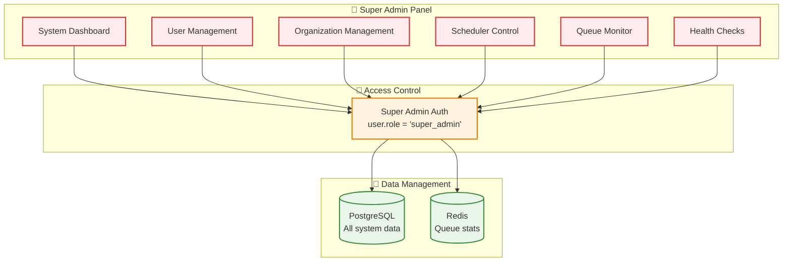
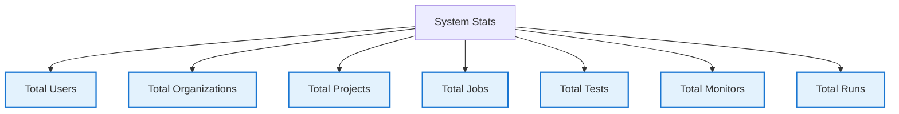
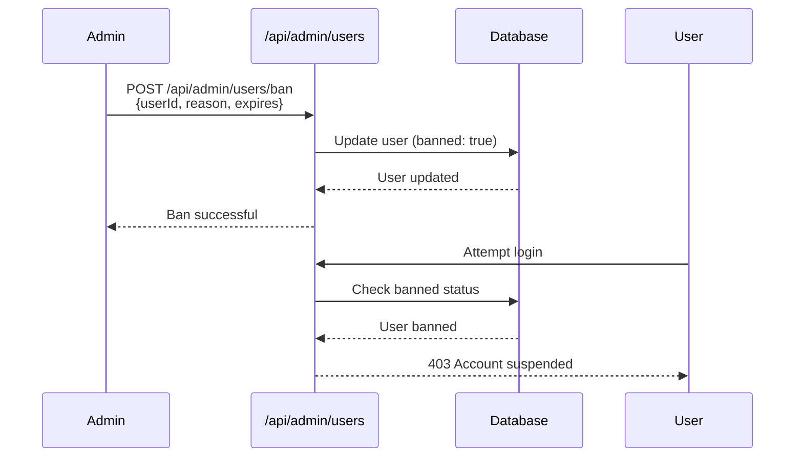
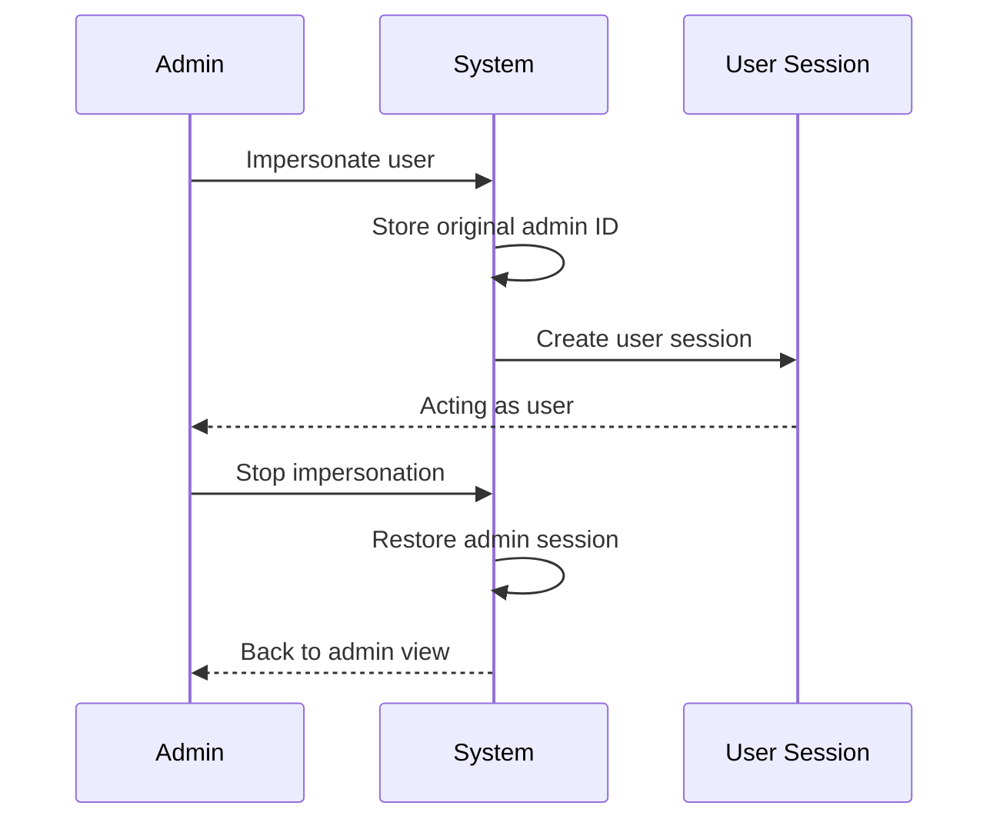

# Super Admin System

## Overview

The Super Admin System provides **platform-level management** capabilities for system administrators, including user management, organization oversight, and system health monitoring.

---

## Architecture



---

## Bootstrapping

The first super admin must be bootstrapped into the system. There are two methods to achieve this:

### 1. Automatic (Environment Variable) - Recommended
Set the `SUPER_ADMIN_EMAIL` environment variable in your deployment configuration (e.g., `docker-compose.yml`). The system will automatically check for this user on startup and promote them to super admin if they exist.

> [!IMPORTANT]
> Only a **single** email address is supported. Comma-separated lists are strictly prohibited to prevent misconfiguration.

```yaml
environment:
  - SUPER_ADMIN_EMAIL=admin@example.com
```

### 2. Manual (Script)
You can manually promote a user by running the bootstrap script inside the container:

```bash
# Inside the app container
npm run setup:admin -- admin@example.com
```

---

### 3. Revoking Privileges
To replace a super admin or downgrade a user, you must explicitly revoke their privileges using the revocation script:

```bash
# Inside the app container
npm run revoke:admin -- admin@example.com
```

> [!NOTE]
> This will downgrade the user's role to `admin` (Organization Admin). You can then bootstrap a new super admin using the methods above.

## Key Features

### 1. System Statistics



### 2. User Management
- Create/update/delete users
- Ban/unban users with reason
- View all user organizations
- Impersonate users for debugging

### 3. Organization Management
- View all organizations
- Organization statistics
- Member management
- Resource allocation

### 4. Scheduler Control
- Initialize schedulers
- View scheduler status
- Manually trigger jobs
- Monitor queue health

### 5. Queue Dashboard
- Real-time queue statistics
- Job counts (waiting, active, completed, failed)
- Worker utilization
- Performance metrics

---

## API Endpoints

| Endpoint | Purpose | Permission |
|----------|---------|------------|
| `/api/admin/stats` | System statistics | super_admin |
| `/api/admin/users` | User CRUD | super_admin |
| `/api/admin/organizations` | Org management | super_admin |
| `/api/admin/scheduler/init` | Init schedulers | super_admin |
| `/api/admin/scheduler/status` | Scheduler status | super_admin |
| `/api/admin/queues` | Queue dashboard | super_admin |
| `/api/admin/check` | Health check | super_admin |

---

## User Ban System



---

## Impersonation System



---

## Summary

✅ **Platform Oversight** - Complete system visibility
✅ **User Management** - Full user lifecycle control
✅ **Organization Management** - Multi-tenant administration
✅ **System Health** - Scheduler and queue monitoring
✅ **Debugging Tools** - Impersonation for troubleshooting
