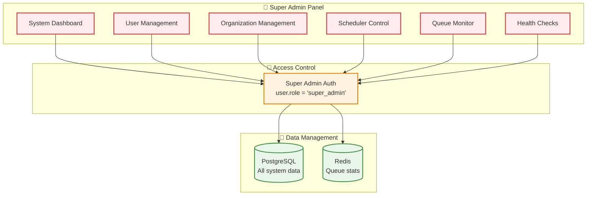
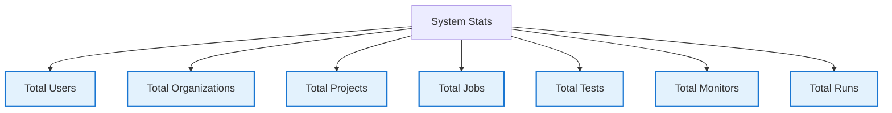
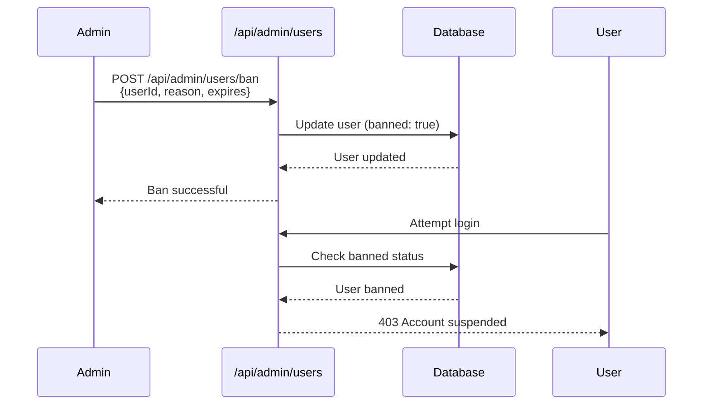
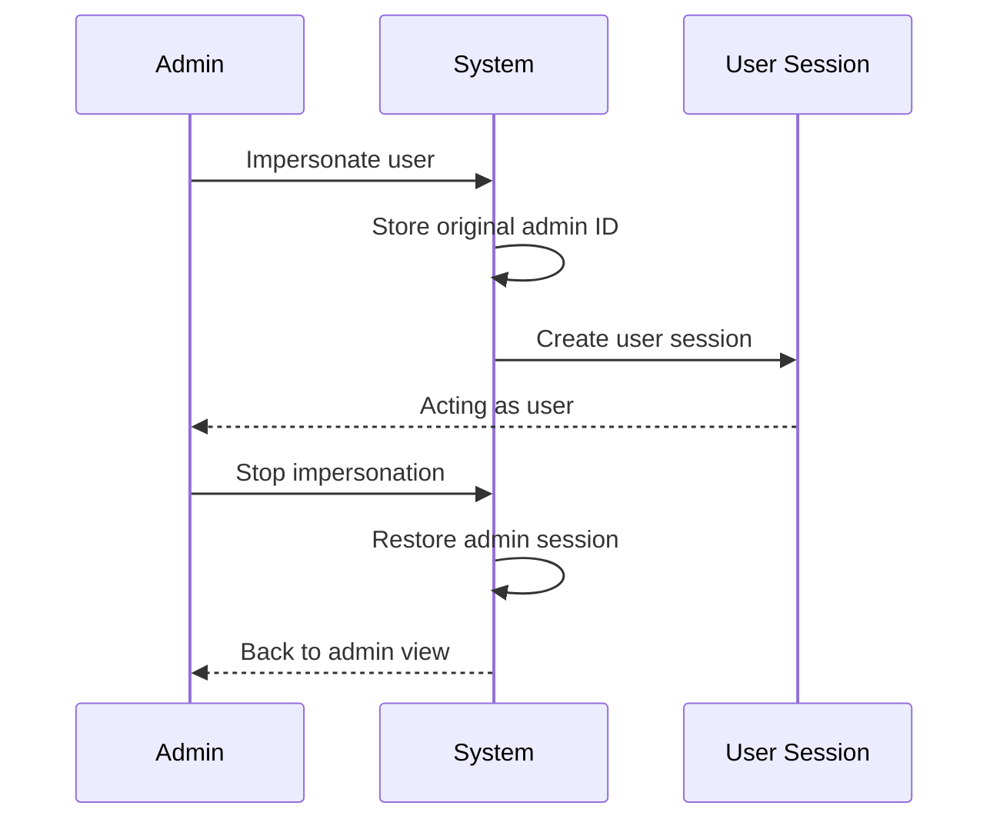

# Super Admin System

## Overview

The Super Admin System provides **platform-level management** capabilities for system administrators, including user management, organization oversight, and system health monitoring.

---

## Architecture

---

## Key Features

### 1. System Statistics

### 2. User Management
- Create/update/delete users
- Ban/unban users with reason
- View all user organizations
- Impersonate users for debugging

### 3. Organization Management
- View all organizations
- Organization statistics
- Member management
- Resource allocation

### 4. Scheduler Control
- Initialize schedulers
- View scheduler status
- Manually trigger jobs
- Monitor queue health

### 5. Queue Dashboard
- Real-time queue statistics
- Job counts (waiting, active, completed, failed)
- Worker utilization
- Performance metrics

---

## API Endpoints

| Endpoint | Purpose | Permission |
|----------|---------|------------|
| `/api/admin/stats` | System statistics | super_admin |
| `/api/admin/users` | User CRUD | super_admin |
| `/api/admin/organizations` | Org management | super_admin |
| `/api/admin/scheduler/init` | Init schedulers | super_admin |
| `/api/admin/scheduler/status` | Scheduler status | super_admin |
| `/api/admin/queues` | Queue dashboard | super_admin |
| `/api/admin/check` | Health check | super_admin |

---

## User Ban System

---

## Impersonation System

---

## Summary

✅ **Platform Oversight** - Complete system visibility
✅ **User Management** - Full user lifecycle control
✅ **Organization Management** - Multi-tenant administration
✅ **System Health** - Scheduler and queue monitoring
✅ **Debugging Tools** - Impersonation for troubleshooting

---

**Document Version:** 1.0
**Last Updated:** January 17, 2025
