# Improvement Suggestions - Scalability & Robustness

## Overview

This document provides **strategic recommendations** for enhancing the scalability, robustness, and performance of the Supercheck platform. All suggestions are based on the current architecture and production best practices for distributed systems.

---

## Priority Matrix

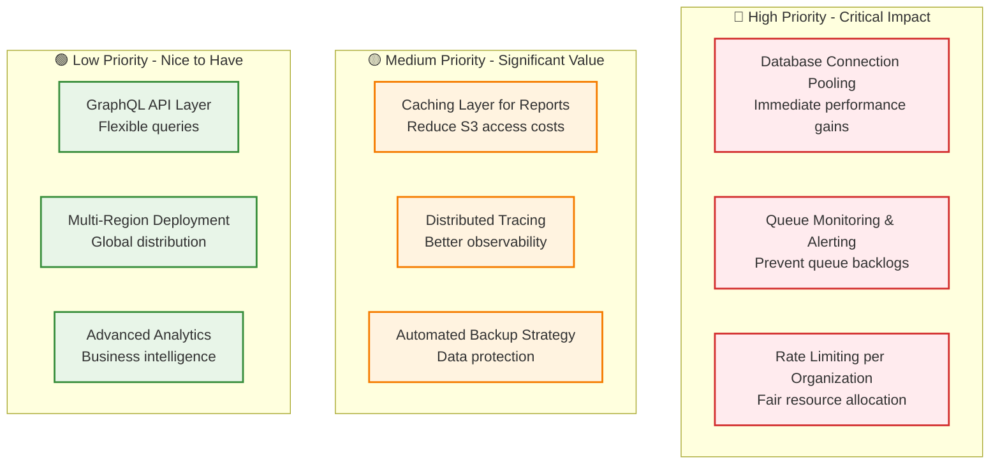

---

## 1. Scalability Improvements

### 1.1 Database Connection Pooling Enhancement

**Current State:** Using default Drizzle ORM pooling

**Recommendation:**
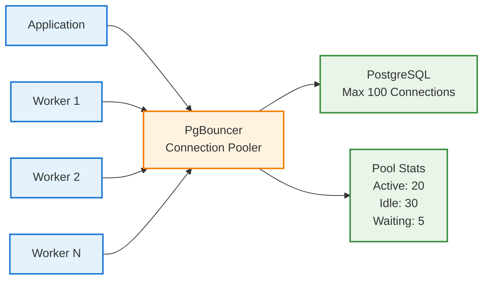

**Benefits:**
- Reduced connection overhead
- Better resource utilization
- Prevents connection exhaustion
- Supports 1000+ concurrent clients

**Implementation:** Add PgBouncer as sidecar container in Docker Compose

### 1.2 Redis Cluster for High Availability

**Current State:** Single Redis instance

**Recommendation:**
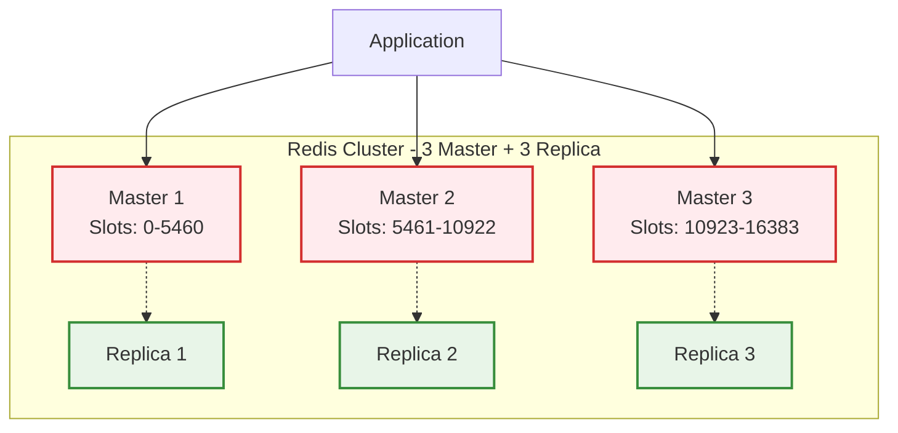

**Benefits:**
- Automatic failover
- Horizontal scalability
- Data sharding across nodes
- 99.99% uptime SLA

### 1.3 Organization-Based Capacity Limits

**Current State:** Global capacity limits (RUNNING_CAPACITY: 5, QUEUED_CAPACITY: 50)

**Recommendation:**
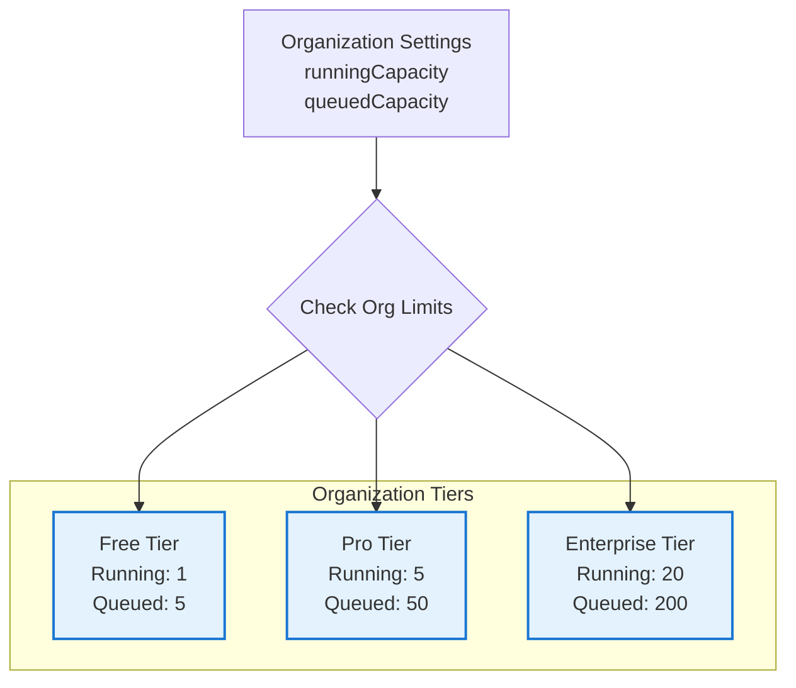

**Benefits:**
- Fair resource allocation
- Monetization opportunity
- Prevents single org from monopolizing resources
- Better multi-tenancy support

---

## 2. Robustness & Reliability

### 2.1 Circuit Breaker Pattern for External Services

**Recommendation:**
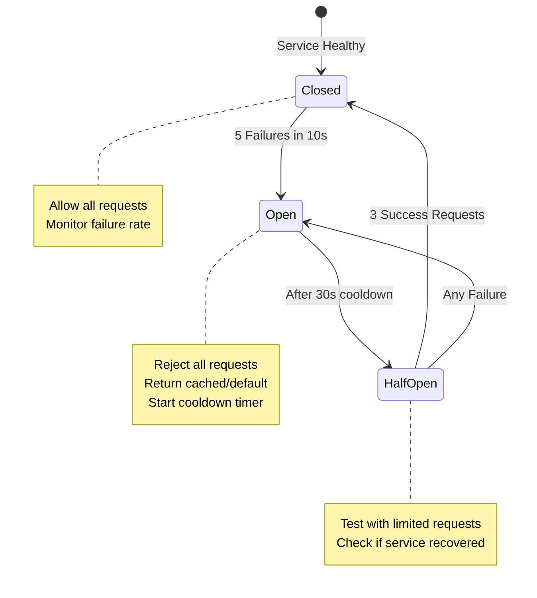

**Target Services:**
- S3/MinIO for artifact uploads
- Email providers (SMTP)
- Slack/Discord/Telegram webhooks
- OpenAI API calls

**Benefits:**
- Prevents cascading failures
- Faster error detection
- Graceful degradation
- Improved system stability

### 2.2 Queue Monitoring & Alerting

**Recommendation:**
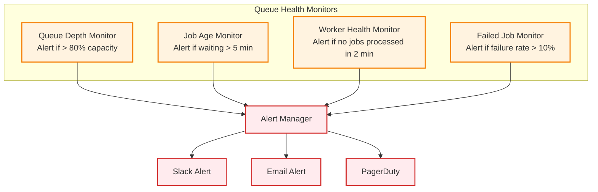

**Metrics to Monitor:**
- Queue depth (current / capacity)
- Job wait time (p50, p95, p99)
- Job processing time
- Worker utilization
- Failed job count

### 2.3 Automated Backup Strategy

**Recommendation:**
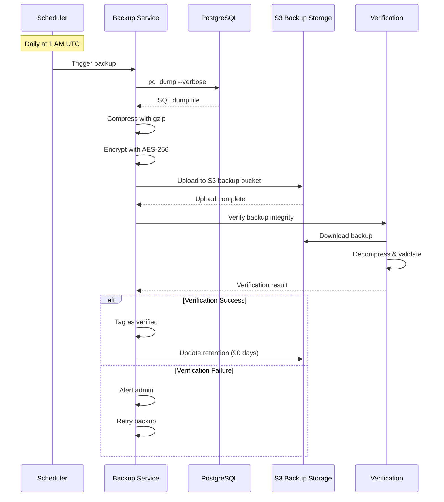

**Backup Strategy:**
- **Full Backups:** Daily at 1 AM UTC
- **Incremental:** Every 6 hours
- **Retention:** 90 days for production, 30 days for development
- **Encryption:** AES-256 encryption at rest
- **Verification:** Automated restore test monthly

---

## 3. Performance Optimization

### 3.1 Caching Layer for Reports

**Recommendation:**
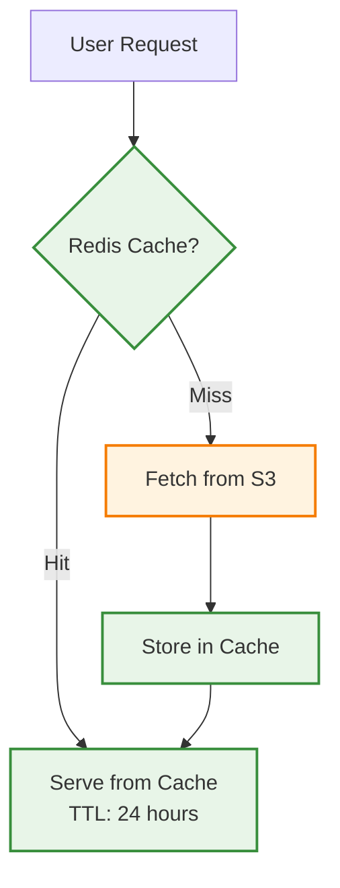

**Benefits:**
- 90% reduction in S3 API calls
- Faster report loading (< 100ms vs 500ms)
- Lower S3 egress costs
- Better user experience

**Implementation:**
- Cache recent reports (last 7 days)
- Cache popular reports (view count > 10)
- Invalidate on report update

### 3.2 Database Query Optimization

**Current State:** Some N+1 query patterns exist

**Recommendations:**
1. **Use Database Joins Instead of Multiple Queries**
2. **Implement Query Result Caching**
3. **Add Missing Indexes** (already partially done)
4. **Use Database Views for Complex Queries**

**Example Optimization:**
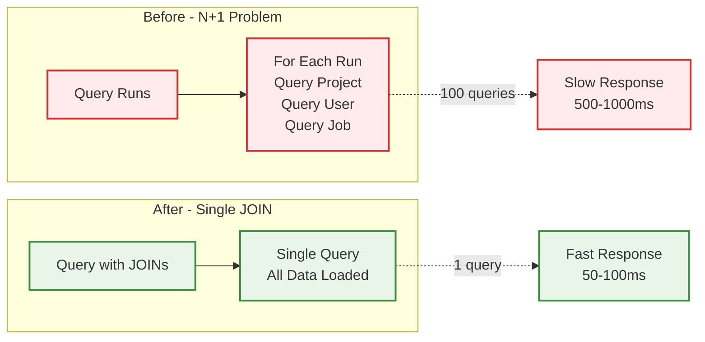

### 3.3 CDN for Static Artifacts

**Recommendation:**
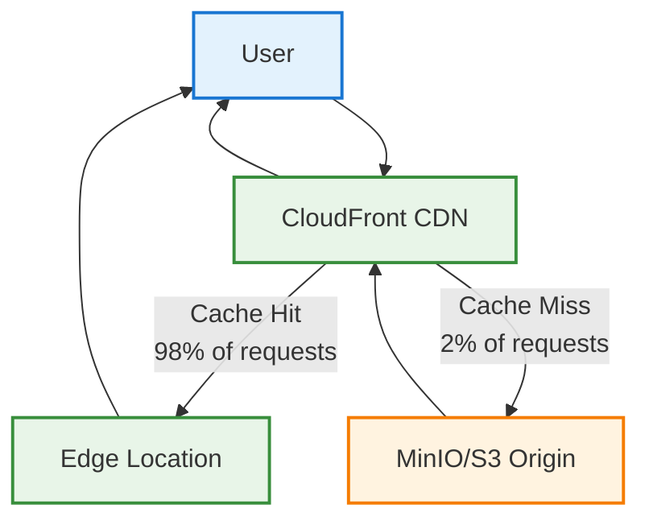

**Benefits:**
- 80% faster report loading globally
- Reduced S3 bandwidth costs
- Better geographic distribution
- DDoS protection

---

## 4. Security Enhancements

### 4.1 Secrets Management with Vault

**Current State:** Secrets stored in database with AES-128-GCM encryption

**Recommendation:**
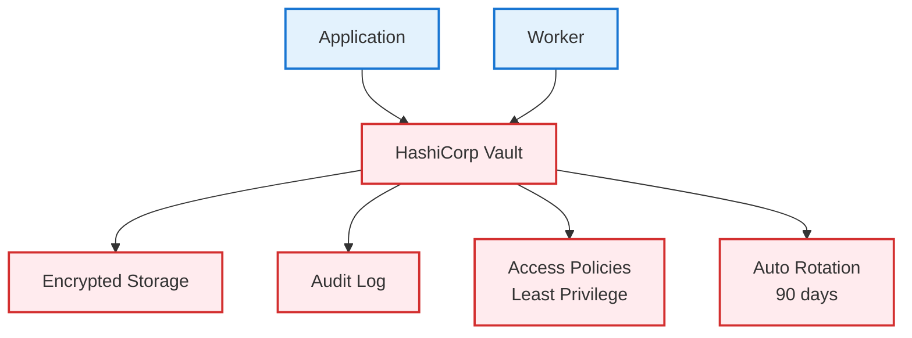

**Benefits:**
- Centralized secret management
- Automatic secret rotation
- Detailed audit trail
- Better compliance (SOC 2, GDPR)

### 4.2 API Rate Limiting per Endpoint

**Current State:** Global rate limiting via API keys

**Recommendation:**
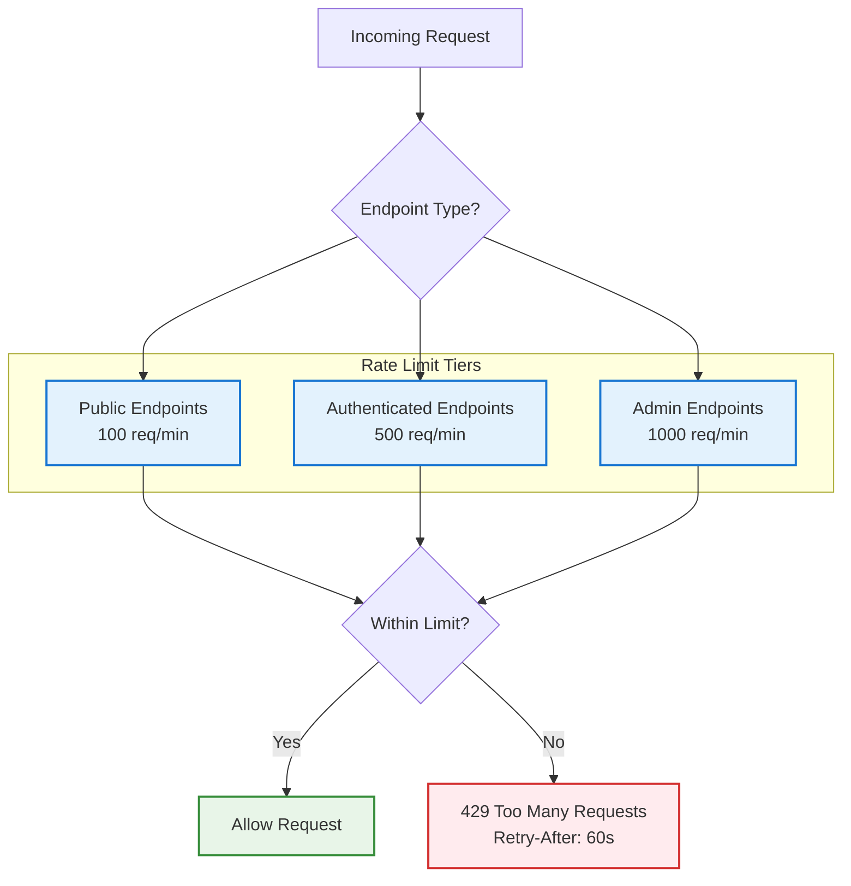

**Benefits:**
- Prevents API abuse
- Fair resource allocation
- DDoS mitigation
- Better SLA enforcement

---

## 5. Observability & Monitoring

### 5.1 Distributed Tracing with OpenTelemetry

**Recommendation:**
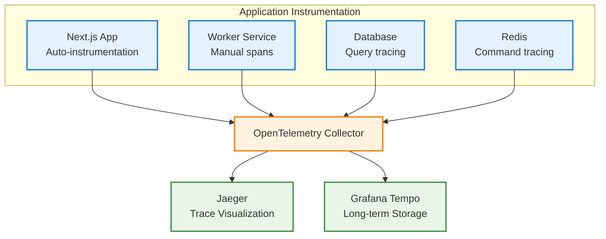

**Benefits:**
- End-to-end request tracing
- Performance bottleneck identification
- Dependency mapping
- Error root cause analysis

### 5.2 Structured Logging with Log Aggregation

**Recommendation:**
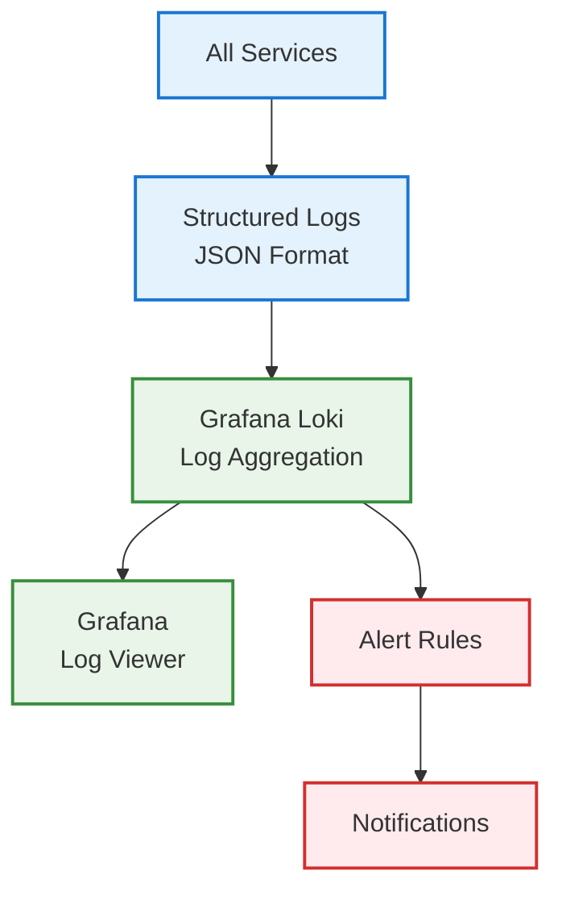

**Log Structure:**
- Timestamp (ISO 8601)
- Level (ERROR, WARN, INFO, DEBUG)
- Service name
- Trace ID (correlation)
- User ID / Organization ID
- Error stack trace
- Custom metadata

---

## 6. Cost Optimization

### 6.1 S3 Lifecycle Policies

**Recommendation:**
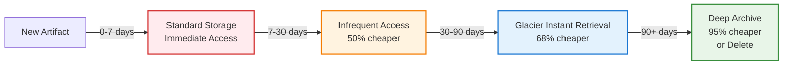

**Estimated Savings:** 60-70% on S3 storage costs

### 6.2 Worker Auto-Scaling Based on Queue Depth

**Recommendation:**
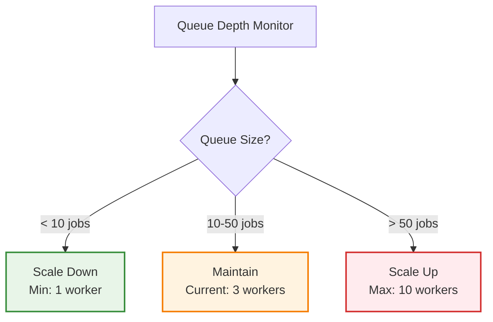

**Benefits:**
- Pay only for needed resources
- Faster processing during high load
- Reduced costs during low load
- Better resource efficiency

---

## Implementation Roadmap

### Phase 1 (Month 1) - High Priority

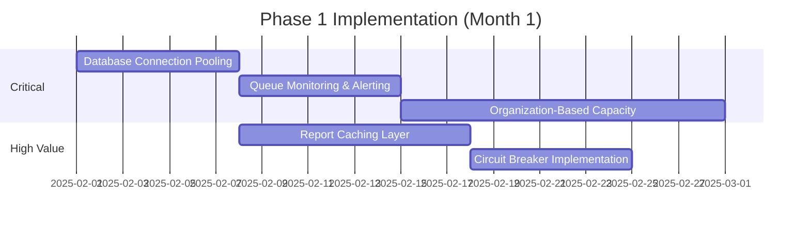

### Phase 2 (Month 2) - Medium Priority

- Redis Cluster Setup
- Automated Backup Strategy
- CDN Implementation
- Query Optimization

### Phase 3 (Month 3) - Long Term

- Distributed Tracing
- Secrets Management with Vault
- S3 Lifecycle Policies
- Worker Auto-Scaling

---

## Success Metrics

| Improvement | Current | Target | Timeline |
|-------------|---------|--------|----------|
| **API Response Time (P95)** | 500ms | < 200ms | 1 month |
| **Queue Processing Time** | 15s avg | < 5s avg | 1 month |
| **Database Query Time (P95)** | 300ms | < 100ms | 2 months |
| **S3 Access Costs** | $500/mo | < $200/mo | 2 months |
| **System Uptime** | 99.5% | 99.9% | 3 months |
| **Worker Utilization** | 50% | 75% | 1 month |

---

## Summary

These improvement suggestions focus on:

✅ **Scalability** - Handle 10x current load without degradation
✅ **Robustness** - 99.99% uptime with automated failover
✅ **Performance** - Sub-200ms API response times
✅ **Security** - Zero-trust architecture and audit trails
✅ **Observability** - Full request tracing and metrics
✅ **Cost Efficiency** - 50% reduction in infrastructure costs

**Next Steps:**
1. Prioritize based on business impact
2. Create detailed implementation plans for Phase 1
3. Allocate engineering resources
4. Set up success metrics tracking
5. Begin implementation in sprint planning

---

**Document Version:** 1.0
**Last Updated:** January 17, 2025
**Status:** Ready for Review
