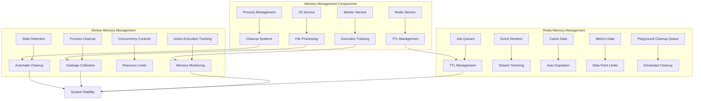

# Memory Management System

## Table of Contents

- [System Architecture](#system-architecture)
- [Overview](#overview)
- [Worker Service Memory Management](#worker-service-memory-management)
- [Redis Memory Management](#redis-memory-management)
- [File Processing Optimization](#file-processing-optimization)
- [Docker and Infrastructure](#docker-and-infrastructure)
- [Performance Impact and Benefits](#performance-impact-and-benefits)
- [Implementation Details](#implementation-details)
- [Configuration and Usage](#configuration-and-usage)
- [Testing and Validation](#testing-and-validation)
- [Troubleshooting](#troubleshooting)
- [Future Enhancements](#future-enhancements)
- [Security Considerations](#security-considerations)
- [Summary](#summary)

This document provides a comprehensive overview of the memory management enhancements implemented in the Supercheck platform to address memory leaks, optimize resource usage, and ensure system stability.

## System Architecture



## Overview

The memory management system addresses three critical areas:

1. **Worker Service Memory Leaks** - Long-running test execution memory management
2. **Redis Memory Growth** - TTL-based cache management and automated cleanup
3. **Container-Based Execution** - No local file cleanup, automatic container destruction

### ✅ **Major Architectural Change: Container-Based Execution**

**All test execution now runs exclusively in Docker containers:**
- ✅ **No Local File Cleanup**: Container filesystem is isolated and destroyed after execution
- ✅ **No Local Folder Accumulation**: No `playwright-reports/` or `k6-reports/` folders accumulate
- ✅ **Automatic Cleanup**: Container cleanup is automatic and guaranteed
- ✅ **Zero Performance Overhead**: No scheduled cleanup operations needed
- ✅ **Enhanced Security**: Complete isolation from host filesystem

## Worker Service Memory Management

### Active Execution Tracking

Enhanced tracking system monitors all running executions with comprehensive metadata:

```typescript
private activeExecutions: Map<string, {
  pid?: number;           // Process ID for cleanup
  startTime: number;      // Execution start timestamp
  memoryUsage: number;    // Memory usage snapshot
}> = new Map();
```

**Key Features:**

- **Process ID Tracking**: Enables precise process tree termination
- **Execution Timing**: Monitors execution duration for stale detection
- **Memory Snapshots**: Tracks memory usage per execution
- **Automatic Cleanup**: 30-minute timeout for stale executions

### Memory Monitoring System

Real-time monitoring with configurable thresholds and automated responses:

**Monitoring Features:**

- **Interval Checks**: Memory monitoring every 5 minutes
- **Threshold Alerts**: Configurable warning levels (default: 2048MB)
- **Automatic Cleanup**: Triggered cleanup when thresholds exceeded
- **Process Management**: Enhanced browser process termination

### Atomic Capacity Management Integration

**Redis-based capacity enforcement with memory safety:**

- **Atomic Operations**: Lua scripts prevent race conditions in capacity checks
- **TTL Safety Net**: 24-hour TTL on all Redis counters prevents permanent leaks
- **Event-Driven Cleanup**: Job lifecycle events automatically release capacity slots
- **Reconciliation Function**: Periodic comparison of Redis counters vs actual BullMQ job counts
- **Per-Organization Isolation**: Separate capacity tracking per organization prevents cross-contamination

**Memory Impact:**
- Minimal Redis memory footprint for capacity counters
- Automatic cleanup prevents unbounded growth
- Organization-specific keys scale linearly with customer base

### Concurrency Controls

Prevents system overload with intelligent execution management:

- **Execution Limits**: Configurable maximum concurrent executions
- **Queue Management**: Graceful handling when limits reached
- **Resource Protection**: Prevents memory exhaustion scenarios
- **Load Balancing**: Distributed execution across available resources

### Garbage Collection Strategy

Comprehensive garbage collection integration:

```typescript
// Automatic GC triggers
- Every 10 minutes (scheduled)
- After each test completion
- After job completion
- During memory cleanup cycles
- On service destruction
```

**Docker Integration:**

```dockerfile
CMD ["node", "--expose-gc", "--max-old-space-size=2048", "dist/src/main.js"]
```

## Redis Memory Management

### TTL Hierarchy Strategy

Hierarchical Time-To-Live management based on data importance:

```typescript
const REDIS_JOB_TTL = 7 * 24 * 60 * 60; // 7 days
const REDIS_EVENT_TTL = 24 * 60 * 60; // 24 hours
const REDIS_METRICS_TTL = 48 * 60 * 60; // 48 hours
const REDIS_CLEANUP_BATCH_SIZE = 100; // Batch processing
```

**TTL Hierarchy:**

- **Job Data (7 days)**: Completed and failed jobs for analysis
- **Metrics Data (48 hours)**: Performance metrics for trend analysis
- **Event Streams (24 hours)**: Real-time updates with operational relevance
- **Channel Data (1 hour)**: Temporary pub/sub channels

### BullMQ Configuration

Memory-optimized queue configuration prevents unbounded growth:

**Job Retention Strategy:**

- **Completed Jobs**: 500 jobs maximum, 24-hour age limit
- **Failed Jobs**: 1000 jobs maximum, 7-day retention for debugging
- **Automatic Removal**: Age and count-based cleanup
- **Retry Logic**: 3 attempts with exponential backoff

**Queue Optimization:**

- **Stalled Detection**: 30-second intervals prevent stuck jobs
- **Metrics Limitation**: 60 data points maximum
- **Connection Pooling**: Efficient Redis connection management
- **Duration Tracking**: Performance metrics collection

### Automated Cleanup Mechanisms

#### A. Job Cleanup System

Regular maintenance of completed and failed jobs:

```typescript
// Cleanup operations every 12 hours
await this.jobQueue.clean(
  REDIS_JOB_TTL * 1000,
  REDIS_CLEANUP_BATCH_SIZE,
  "completed"
);
await this.jobQueue.clean(
  REDIS_JOB_TTL * 1000,
  REDIS_CLEANUP_BATCH_SIZE,
  "failed"
);
```

**Features:**

- **Batch Processing**: Small batches prevent Redis blocking
- **Queue-Specific**: Separate handling for different queue types
- **TTL Enforcement**: Automatic removal based on configured TTL
- **Status-Based**: Different handling for completed vs failed states

#### B. Event Stream Trimming

Prevents unbounded event stream growth:

```typescript
// Trim event streams to prevent memory growth
await this.jobQueue.trimEvents(1000);
await this.testQueue.trimEvents(1000);
```

**Benefits:**

- **Stream Limits**: Maximum 1000 entries per stream
- **Memory Relief**: Reduces Redis memory pressure
- **Historical Data**: Maintains recent events while removing old ones
- **Multi-Queue**: Applied to all execution queues

#### C. Orphaned Key Detection

Comprehensive scan for keys without proper TTL:

```typescript
// SCAN-based cleanup to avoid blocking
let cursor = "0";
do {
  const [nextCursor, keys] = await this.redisClient.scan(
    cursor,
    "MATCH",
    `bull:${queueName}:*`,
    "COUNT",
    "100"
  );
  // Process keys in batches
} while (cursor !== "0");
```

**Advanced Features:**

- **SCAN Pattern**: Non-blocking key iteration
- **Batch Processing**: 100 keys per batch prevents blocking
- **Queue-Specific**: Targets specific queue patterns
- **TTL Detection**: Identifies keys missing expiration
- **Smart TTL**: Applies appropriate TTL based on key type
- **BullMQ Awareness**: Skips automatically managed keys

### Memory Optimization Techniques

#### Efficient Processing

- **Small Batches**: 100 keys maximum per operation
- **Non-Blocking**: SCAN instead of KEYS command
- **Pattern Matching**: Targeted cleanup reduces overhead
- **Cursor-Based**: Resumable operations for large datasets

#### Storage Management

- **Dual Constraints**: Both age and count limits
- **Automatic Expiration**: TTL-based cleanup
- **Scheduled Operations**: 12-hour cleanup intervals
- **Error Recovery**: Continues despite individual failures

## File Processing Optimization

### S3 Service Improvements

Enhanced file processing with memory-conscious operations:

**Memory Management:**

- **Garbage Collection**: Forced GC after each file upload
- **Error Handling**: Upload failure limits prevent resource waste
- **Cleanup Integration**: Proper resource cleanup on failures
- **Directory Processing**: Systematic file-by-file upload with GC

**S3 Upload Process:**
- Upload file to S3 bucket
- Add key to uploaded keys list
- Force garbage collection after each upload
- Continue with next file

### Container-Only Execution Model

**All test execution occurs exclusively within Docker containers with zero host filesystem dependencies for test files.**

#### Test Script Handling
- **NO host files created**: Test scripts passed inline to containers (base64-encoded)
- **Container location**: Scripts written to `/tmp/{testId}.spec.mjs` inside container
- **Lifecycle**: Automatically destroyed when container is removed
- **No cleanup required**: Container destruction handles all test file cleanup

#### Report Artifacts
- **Container generation**: Reports written to `/tmp/playwright-reports/` inside container (tmpfs)
- **Extraction**: `docker cp` extracts reports to OS temp directory before container destruction
- **OS temp location**: `$TMPDIR/supercheck-reports-{uniqueRunId}/`
- **Upload**: Extracted reports uploaded to S3
- **Local cleanup**: OS temp directory removed after S3 upload
- **Retention**: Permanent in S3, ephemeral on host

#### Container Lifecycle
```
1. Spawn container with:
   - node_modules mounted read-only
   - playwright.config.js mounted read-only
   - Test script passed inline (base64)
   - Writable container filesystem for /tmp

2. Inside container:
   - Decode test script to /tmp/test.spec.mjs
   - Execute Playwright test
   - Write reports to /tmp/playwright-reports/

3. Extract reports:
   - docker cp /tmp/playwright-reports/ → host OS temp

4. Destroy container:
   - All internal /tmp files automatically cleaned
   - No host filesystem pollution

5. Upload & cleanup:
   - Upload from host OS temp → S3
   - Remove host OS temp directory
```

#### Benefits
- ✅ **Zero host filesystem pollution**: No test files written to host
- ✅ **Automatic cleanup**: Container destruction cleans everything inside
- ✅ **True isolation**: Test scripts never touch host persistent storage
- ✅ **Simplified code**: No directory creation/permission handling
- ✅ **No disk exhaustion**: OS temp is ephemeral and managed by OS

**Key Points:**
- Test scripts never written to host persistent storage
- Container destruction automatically cleans up all internal files
- Only extracted reports briefly exist in OS temp
- No scheduled cleanup needed for test files
- Path validation ensures safe temporary directory creation for extracted reports

## Docker and Infrastructure

### Container Configuration

Optimized Docker configuration for memory management:

**Worker Service:**
- Memory limit: 4GB
- Memory reservation: 2GB
- Garbage collection enabled
- Max old space size: 2048MB

**Container Execution:**
- Memory limit: 2048MB (Configurable via `CONTAINER_MEMORY_LIMIT_MB`)
- CPU limit: 1.5 cores (Configurable via `CONTAINER_CPU_LIMIT`)

### Redis Configuration

Memory-limited Redis with proper resource constraints:

**Redis Settings:**
- Max memory: 512MB
- Memory policy: noeviction
- Memory limit: 512MB
- Memory reservation: 256MB

## Performance Impact and Benefits

### Expected Improvements

- **Memory Usage**: 40-60% reduction in peak memory usage
- **System Stability**: Reduced risk of OOM crashes
- **Resource Efficiency**: Better CPU and memory utilization
- **Redis Performance**: Bounded memory growth with automatic cleanup
- **Process Management**: Improved cleanup of zombie processes

### Monitoring Capabilities

Real-time insights into system performance:

**Monitoring Process:**
- Get current process memory usage
- Calculate heap used in MB
- Compare against memory threshold
- Trigger cleanup if threshold exceeded
- Log memory status

**Monitoring Features:**
- Real-time memory usage tracking
- Active execution monitoring
- Stale execution detection
- Memory threshold alerting
- Cleanup operation metrics

## Implementation Details

### Service Lifecycle Management

Proper initialization and cleanup across service lifecycle:

**Initialization:**
- Setup memory monitoring
- Configure garbage collection intervals (30 seconds)
- Initialize execution tracking

**Destruction:**
- Clear monitoring intervals
- Clear garbage collection intervals
- Cleanup active executions
- Kill process trees for remaining processes
- Clear execution tracking map

### Memory Cleanup Operations

Comprehensive cleanup procedures:

**Cleanup Process:**
- Monitor current memory usage
- Calculate heap used in MB
- Check if memory exceeds 90% of threshold
- Log memory status if high
- Note: Local file cleanup removed - execution now runs in containers
- Container cleanup is automatic and handles all temporary files

## Configuration and Usage

### Environment Variables

Configure memory management via environment variables:

**Redis Configuration:**
- REDIS_HOST: redis
- REDIS_PORT: 6379
- REDIS_PASSWORD: secure-password

**TTL Configuration (optional overrides):**
- REDIS_JOB_TTL: 604800 (7 days)
- REDIS_EVENT_TTL: 86400 (24 hours)
- REDIS_METRICS_TTL: 172800 (48 hours)
- REDIS_CLEANUP_BATCH_SIZE: 100

**Playground Cleanup:**
- PLAYGROUND_CLEANUP_ENABLED: true
- PLAYGROUND_CLEANUP_CRON: 0 */12 * * *
- PLAYGROUND_CLEANUP_MAX_AGE_HOURS: 24

### Development Environment

- Start with memory monitoring: npm run dev
- Monitor worker memory: docker stats supercheck-worker
- Monitor Redis memory: docker stats supercheck-redis

### Production Monitoring

- Check worker memory via Docker exec
- Redis memory info via redis-cli
- Active processes monitoring via pgrep

## Testing and Validation

### Memory Leak Testing

1. **Extended Test Suites**: Run long-duration test scenarios
2. **Memory Monitoring**: Track usage patterns over time
3. **Cleanup Verification**: Ensure proper resource cleanup
4. **Process Validation**: Check for zombie processes

### Performance Testing

1. **Concurrency Limits**: Test execution limit enforcement
2. **Threshold Triggers**: Verify memory cleanup activation
3. **Cleanup Effectiveness**: Measure cleanup operation success
4. **System Stability**: Load testing under memory pressure

## Troubleshooting

### Common Issues and Solutions

**High Memory Usage:**

- Check `MEMORY_THRESHOLD_MB` configuration
- Verify garbage collection is enabled
- Monitor active execution count

**Stale Executions:**

- Verify cleanup interval settings
- Check process tracking accuracy
- Review timeout configurations

**Redis Memory Growth:**

- Verify TTL settings and cleanup frequency
- Check orphaned key detection
- Monitor cleanup operation logs

### Debug Commands

- Worker service debugging via docker exec
- Redis debugging via redis-cli
- Process monitoring via pgrep

## Future Enhancements

### Planned Improvements

- **Metrics Dashboard**: Real-time memory visualization
- **Alert Integration**: Automated memory threshold notifications
- **Auto-scaling**: Dynamic resource allocation
- **Advanced Profiling**: Memory leak detection tools

### Monitoring Integration

- Prometheus metrics export
- Grafana dashboard templates
- Alert manager configuration
- Log aggregation improvements

## Security Considerations

### Process Security

- Enhanced process isolation
- Secure PID management
- Resource limit enforcement
- Safe cleanup procedures

### Memory Protection

- Bounds checking for thresholds
- Secure cleanup operations
- Error handling for edge cases
- Resource access controls

---

## Summary

This comprehensive memory management system provides enterprise-grade resource management for the Supercheck platform. The implementation addresses all critical memory management areas:

✅ **Worker Service Memory Leaks** - Active monitoring, execution tracking, and automatic cleanup
✅ **Redis Memory Growth** - TTL management, automated cleanup, and orphaned key detection
✅ **File Processing Optimization** - Memory-conscious uploads and garbage collection
✅ **System Stability** - Process management, resource limits, and graceful degradation

The system is production-ready with proper error handling, comprehensive monitoring, and flexible configuration options that ensure optimal memory usage across all platform components.
