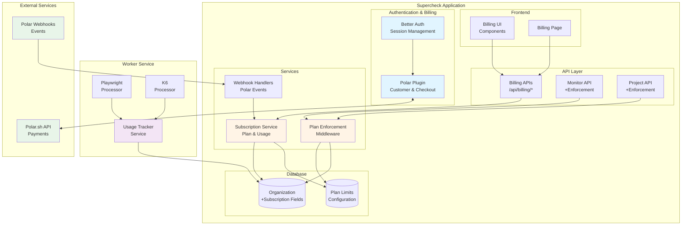
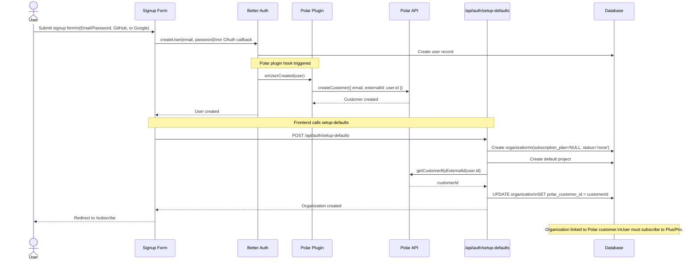
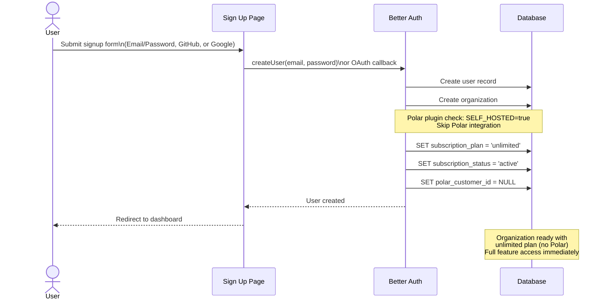
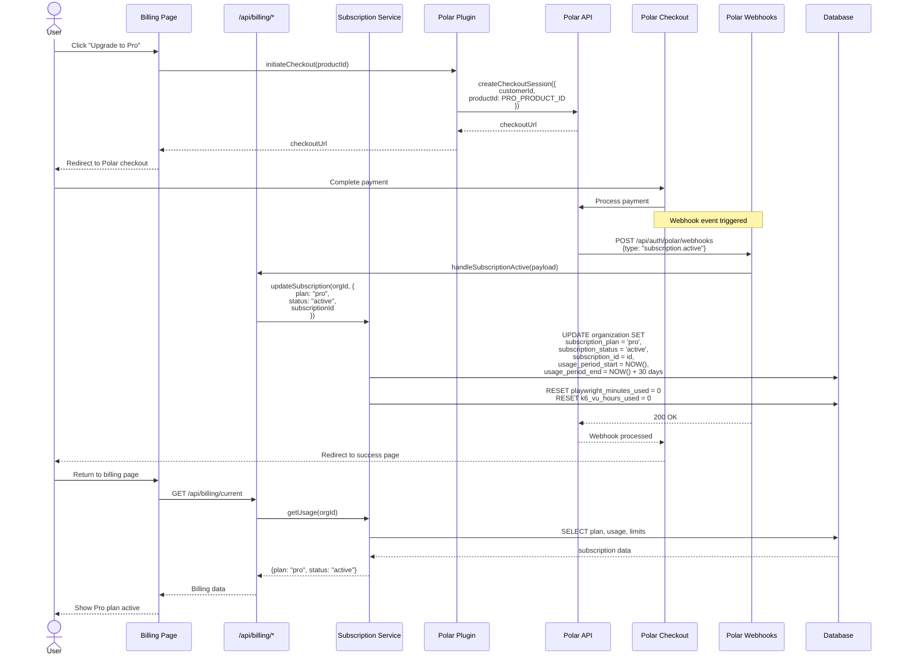
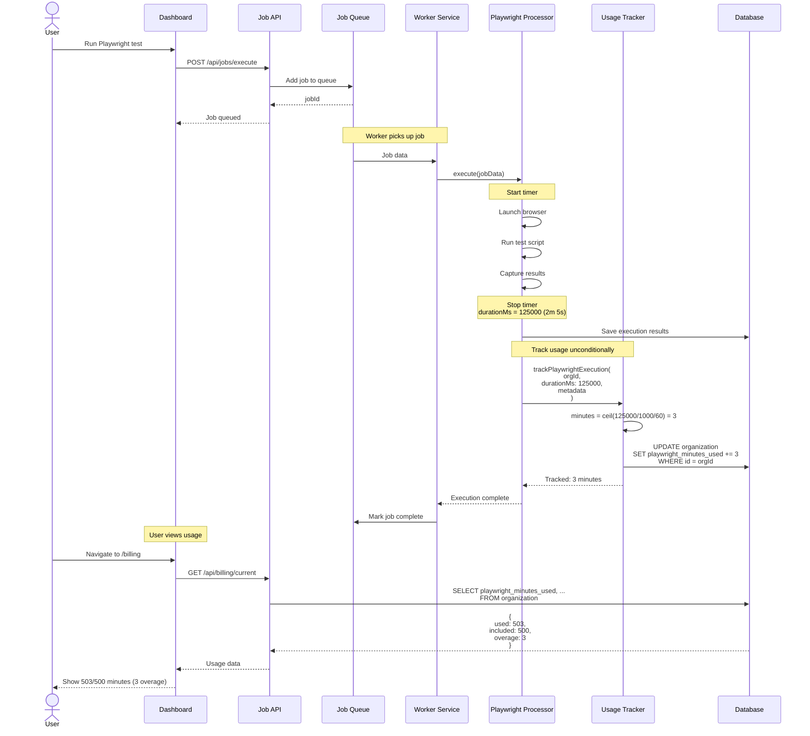
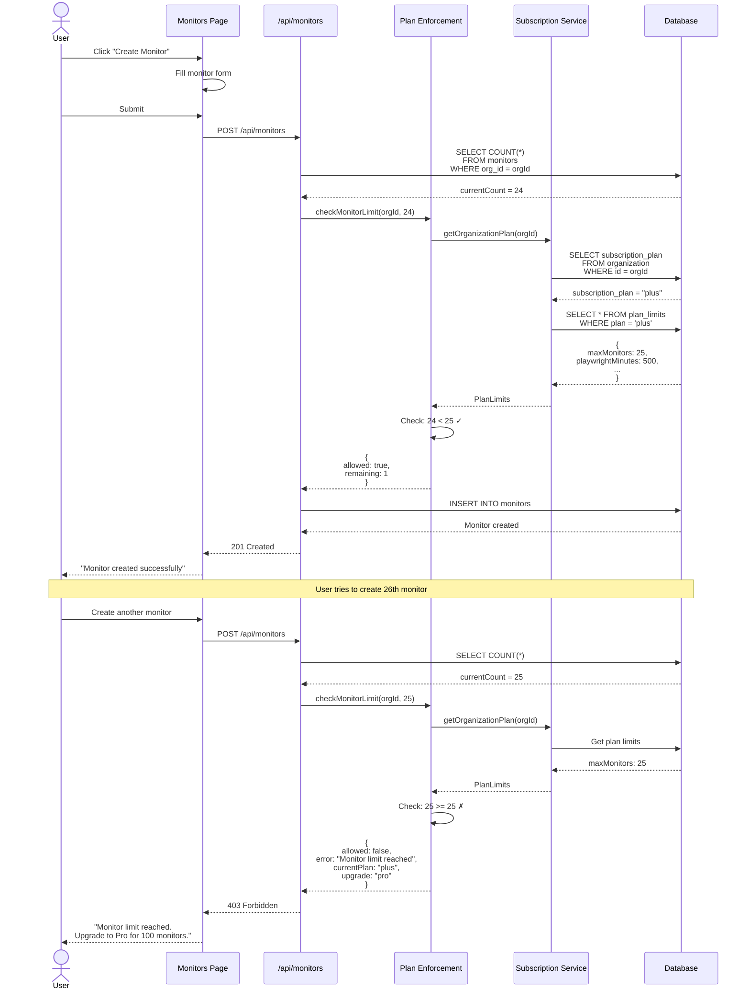
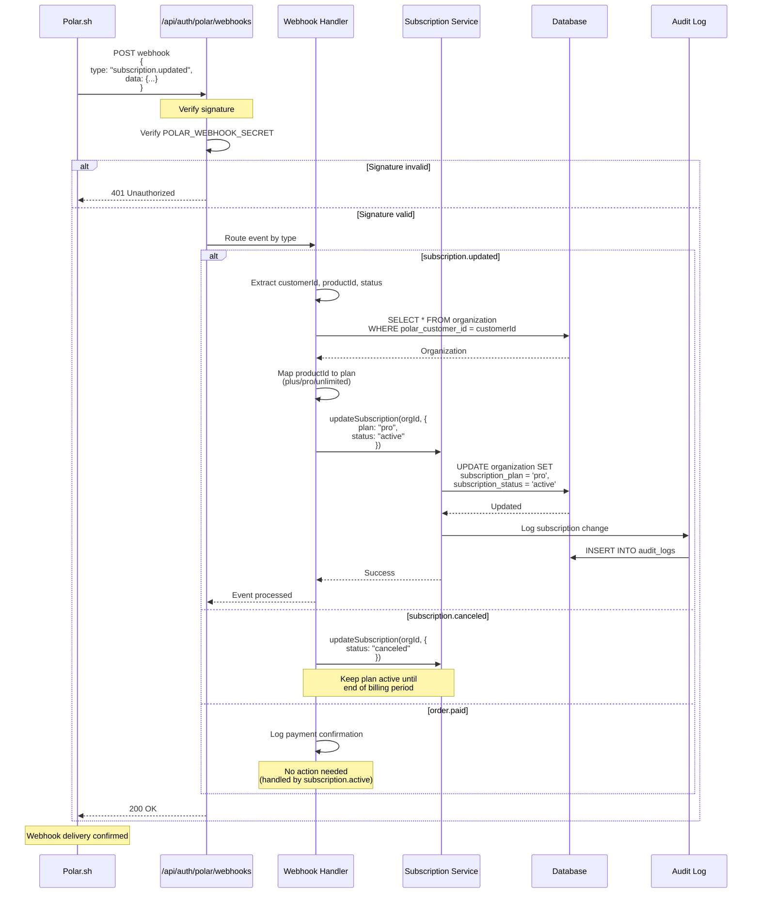
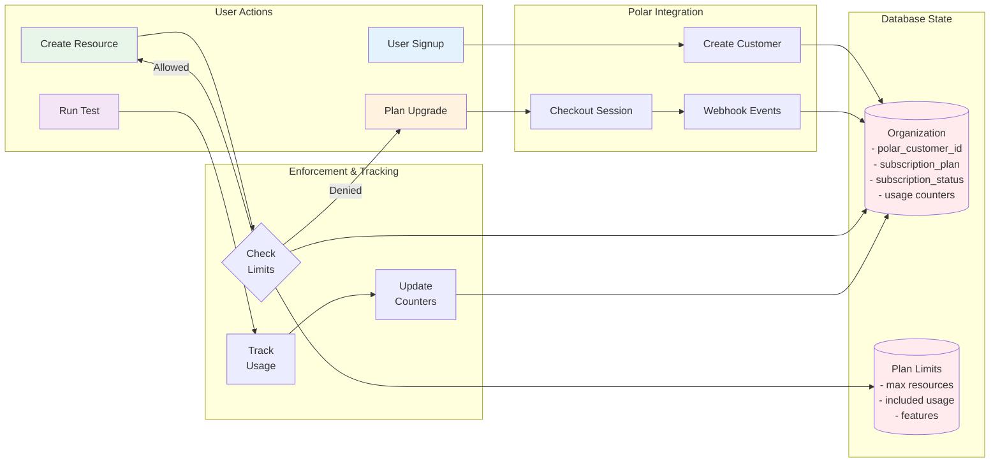
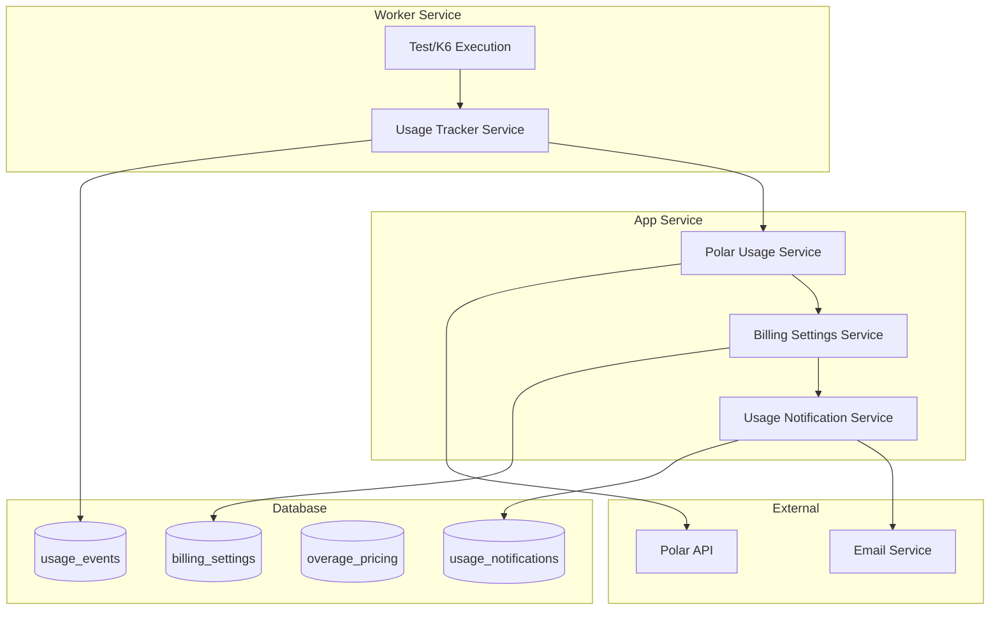

# Polar Billing Integration - Technical Specification

## Table of Contents
1. [Overview](#overview)
2. [Architecture](#architecture)
3. [Implementation](#implementation)
4. [API Reference](#api-reference)
5. [UI Components](#ui-components)
6. [Database Schema](#database-schema)
7. [Testing](#testing)
8. [Deployment](#deployment)
9. [Troubleshooting](#troubleshooting)

---

## Overview

### Purpose
Integrate Polar.sh payment platform to provide subscription-based billing for cloud-hosted Supercheck installations while maintaining a free, unlimited self-hosted option.

### Goals
- ✅ Implement usage-based billing for Playwright minutes and K6 VU hours
- ✅ Enforce plan limits for monitors, status pages, projects, and team members
- ✅ Provide seamless upgrade/downgrade flows
- ✅ Support self-hosted installations without billing dependencies
- ✅ Track and display real-time usage metrics
- ✅ Handle webhook events for subscription lifecycle management
- ✅ **Paid-only cloud model**: Cloud users must subscribe to Plus or Pro

### Non-Goals
- Custom enterprise pricing tiers (handled manually)
- Multi-currency support (Polar handles this)
- Annual billing (monthly only for now)
- Free tier for cloud users (self-hosted is free and unlimited)

---

## Architecture

### System Overview



### Key Components

#### 1. **Better Auth + Polar Plugin**
- Location: `app/src/utils/auth.ts`
- Purpose: Integrate Polar checkout, customer management, and webhooks
- Features:
  - Conditional loading based on `NEXT_PUBLIC_SELF_HOSTED` flag
  - Customer creation on signup
  - Checkout sessions for plan upgrades
  - Webhook signature verification

#### 2. **Subscription Service**
- Location: `app/src/lib/services/subscription-service.ts`
- Purpose: Manage subscription state and usage tracking
- Methods:
  - `requiresSubscription()` - Check if running in cloud mode (requires Polar)
  - `hasActiveSubscription(orgId)` - Verify org has active paid subscription
  - `getOrganizationPlan()` - Retrieve plan limits (throws if cloud + no subscription)
  - `getOrganizationPlanSafe()` - Non-throwing version for display purposes (returns "blocked" state for deleted customers)
  - `getEffectivePlan(orgId)` - Get plan with better error messages
  - `blockUntilSubscribed(orgId)` - Throw error if subscription required but missing
  - `trackPlaywrightUsage()` - Increment Playwright minutes
  - `trackK6Usage()` - Increment K6 VU hours (NUMERIC for precision)
  - `getUsage()` - Get current usage with overage calculations
  - `getUsageSafe()` - Non-throwing version using safe plan lookup
  - `updateSubscription()` - Update plan from webhooks
  - `resetUsageCounters()` - Reset for new billing period
  - `validatePolarCustomer(orgId, customerId)` - Check if customer exists in Polar API
  - `requireValidPolarCustomer(orgId)` - Block operations if Polar customer doesn't exist

#### 2.1. **Polar Customer Validation**
- **Purpose**: Handle scenarios where Polar customers are deleted from Polar but still exist in local database
- **Validation Flow**:
  1. When accessing resources, `validatePolarCustomer()` calls Polar API to check customer existence
  2. If customer returns 404, `requireValidPolarCustomer()` blocks the operation with error message
  3. `getOrganizationPlanSafe()` returns "blocked" state with zero limits for deleted customers
- **Error Message**: "Polar customer not found. Please contact support or subscribe to a new plan."
- **Applied Endpoints**: Monitor creation, project creation, test execution, remote job trigger, and all resource operations
- **Behavior**: Users can log in and view existing resources but cannot create new ones or execute tests

#### 2.2. **Security & Performance Enhancements**
- **API Timeout**: All Polar API calls have a 5-second timeout to prevent request blocking
- **Result Caching**: Customer validation results cached for 60 seconds to reduce API load
- **Safe Logging**: Organization/customer IDs are truncated in logs to prevent data exposure
- **Constants**: Plan limits extracted to constants (`FALLBACK_UNLIMITED_LIMITS`, `BLOCKED_PLAN_LIMITS`) for maintainability
- **Environment URLs**: Correct sandbox (`sandbox-api.polar.sh`) vs production (`api.polar.sh`) URL handling

#### 3. **Plan Enforcement Middleware**  
- Location: `app/src/lib/middleware/plan-enforcement.ts`
- Purpose: Check limits before resource creation
- Functions:
  - `checkMonitorLimit()` - Verify monitor count
  - `checkStatusPageLimit()` - Verify status page count
  - `checkProjectLimit()` - Verify project count
  - `checkTeamMemberLimit()` - Verify team member count
  - `checkCapacityLimits()` - Get execution capacity limits
  - `checkFeatureAvailability()` - Check feature flags (SSO, custom domains)
- Returns:
  - **Cloud + No Subscription**: `{ allowed: false, requiresSubscription: true, availablePlans: ["plus", "pro"] }`
  - **Cloud + Deleted Customer**: `{ allowed: false, error: "Polar customer not found. Please contact support or subscribe to a new plan." }`
  - **Cloud + At Limit**: `{ allowed: false, error: "...", upgrade: "pro" }`
  - **Self-Hosted**: `{ allowed: true }` (always unlimited)

#### 4. **Usage Tracker (Worker)**
- Location: `worker/src/execution/services/usage-tracker.service.ts`
- Purpose: Track execution usage from background jobs
- Features:
  - Integrated into Playwright execution processor
  - Integrated into K6 execution processor
  - Unconditional tracking (tracks usage for both cloud and self-hosted)
  - Error handling without breaking execution

#### 5. **Webhook Handlers**
- Location: `app/src/lib/webhooks/polar-webhooks.ts`
- Purpose: Process Polar subscription events
- Implementation: Uses `onPayload` catch-all handler in Better Auth Polar plugin
- Events handled:
  - `subscription.active` / `subscription.created` - New subscription activation
  - `subscription.updated` - Plan changes
  - `subscription.canceled` - Cancellation
  - `order.paid` / `order.created` / `order.updated` - Payment confirmation (also activates subscription)
  - `checkout.created` / `checkout.updated` - Checkout events (also activates subscription)
  - `customer.*` - Customer info changes (no action)
- **Important**: Polar sends webhook payloads with **camelCase** field names:
  - `customerId` (not `customer_id`)
  - `productId` (not `product_id`)
  - `endsAt` (not `ends_at`)
- Organization linking: Two methods to find organization:
  1. **Primary**: `referenceId` in checkout metadata (organization ID passed during checkout)
  2. **Fallback**: `polarCustomerId` stored on organization (linked during signup via `setup-defaults`)
- Product mapping: Maps Polar product IDs to plan names (plus/pro) via environment variables
- Logging: Minimal logs with truncated IDs for security (e.g., `[Polar] ✅ Activated plus for org abc12345...`)

#### 5.1. **Webhook Security & Reliability**
- **Idempotency**: All webhook handlers check if event was already processed using in-memory cache with 24-hour TTL
- **Cache Cleanup**: Automatic cleanup when cache exceeds 1000 entries to prevent memory leaks
- **Safe Logging**: All IDs are truncated to 8 characters in logs to prevent data exposure
- **Duplicate Detection**: Both webhook-level (by webhook ID) and database-level (by subscription state) idempotency
- **Event Types with Idempotency**:
  - `subscription.active` - Prevents duplicate activations
  - `subscription.updated` - Prevents duplicate plan changes
  - `subscription.canceled` - Prevents duplicate cancellations
  - `order.paid` - Prevents duplicate order processing

#### 6. **Billing Success Page**
- Location: `app/src/app/(main)/billing/success/page.tsx`
- Purpose: Handle post-checkout redirect and verify subscription activation
- Features:
  - Polls `/api/billing/current` every second to verify subscription is active
  - Waits up to 30 seconds for webhook to process (never gives up early)
  - Shows "Activating Subscription..." while verifying
  - Only redirects to dashboard **after subscription is confirmed active**
  - Shows "Retry Verification" button if taking longer than 30 seconds
  - Continues polling slowly (every 3 seconds) in background after timeout
  - Prevents redirect loop by never auto-redirecting without verified subscription

#### 7. **Subscription Guard**
- Location: `app/src/components/subscription-guard.tsx`
- Purpose: Client-side route protection for cloud mode
- Features:
  - Checks actual subscription status in `/api/billing/current` response (not just HTTP status)
  - Verifies both `subscription.status === 'active'` AND `subscription.plan` exists
  - Allows access to: `/billing/*`, `/subscribe`, `/settings`, `/sign-out`, `/org-admin`
  - Redirects unsubscribed users to `/subscribe?required=true`

---

## Sequence Diagrams

### 1. User Signup Flow (Cloud Mode)

> [!NOTE]
> This flow applies to **all signup methods**: email/password, GitHub OAuth, and Google OAuth. All methods trigger Polar customer creation in cloud mode.

The signup flow involves two phases:
1. **User Creation**: Better Auth creates the user and Polar plugin creates a customer with `externalId = user.id`
2. **Organization Setup**: The `setup-defaults` API creates the organization and links it to the Polar customer



### 2. User Signup Flow (Self-Hosted Mode)

> [!NOTE]
> Self-hosted mode supports all authentication methods: email/password, GitHub OAuth, and Google OAuth. No Polar integration occurs. Users get immediate unlimited access.



### 3. Subscription Upgrade Flow



### 4. Usage Tracking Flow (Playwright)



### 5. Plan Enforcement Flow



### 6. Webhook Processing Flow



### 7. Data Flow Diagram



---

## Implementation

### Prerequisites

#### Environment Variables
```bash
# Self-Hosted Mode (set to 'true' for unlimited features)
# Client-side code fetches this from /api/config/hosting-mode at runtime
SELF_HOSTED=false

# Polar Configuration
POLAR_ACCESS_TOKEN=polar_at_xxxxxxxxxxxxx
POLAR_SERVER=production  # or 'sandbox'
POLAR_WEBHOOK_SECRET=whsec_xxxxxxxxxxxxx

# Product IDs from Polar Dashboard
POLAR_PLUS_PRODUCT_ID=prod_xxxxxxxxxxxxx
POLAR_PRO_PRODUCT_ID=prod_xxxxxxxxxxxxx
```

#### Polar Dashboard Setup

1. **Create Organization Access Token**
   - Navigate to: Polar Dashboard → Settings → Access Tokens
   - Create token with required scopes
   - Copy to `POLAR_ACCESS_TOKEN`

2. **Create Products**

   **Plus Plan**:
   - Name: "Supercheck Plus"
   - Price: $49/month
   - Copy Product ID to `POLAR_PLUS_PRODUCT_ID`

   **Pro Plan**:
   - Name: "Supercheck Pro"
   - Price: $149/month
   - Copy Product ID to `POLAR_PRO_PRODUCT_ID`

3. **Configure Webhook**
   - URL: `https://your-domain.com/api/auth/polar/webhooks`
   - Events: `subscription.*`, `order.paid`, `customer.updated`
   - Copy secret to `POLAR_WEBHOOK_SECRET`

### Database Migration

```bash
cd app
npm run db:migrate
```

This migration:
- Adds subscription fields to `organization` table
- Creates `plan_limits` table with plan configurations
- Automatically runs seeds from `src/db/seeds/` folder
- Seeds default plan limits (Plus, Pro, Unlimited)

Note: Seed files are now in a dedicated `seeds/` folder to prevent accidental deletion during migration cleanup.

### Integration Points

#### API Routes Modified

1. **Monitor Creation** - `app/src/app/api/monitors/route.ts:248-266`
```typescript
const limitCheck = await checkMonitorLimit(organizationId, currentMonitorCount.length);
if (!limitCheck.allowed) {
  return NextResponse.json({ error: limitCheck.error }, { status: 403 });
}
```

2. **Status Page Creation** - `app/src/actions/create-status-page.ts:54-67`
```typescript
const limitCheck = await checkStatusPageLimit(organizationId, currentStatusPageCount.length);
if (!limitCheck.allowed) {
  return { success: false, message: limitCheck.error };
}
```

3. **Team Member Invitation** - `app/src/app/api/organizations/members/invite/route.ts:95-108`
```typescript
const limitCheck = await checkTeamMemberLimit(activeOrg.id, currentMemberCount.length);
if (!limitCheck.allowed) {
  return NextResponse.json({ error: limitCheck.error }, { status: 403 });
}
```

4. **Project Creation** - `app/src/app/api/projects/route.ts:128-141`
```typescript
const limitCheck = await checkProjectLimit(targetOrgId, allProjectsInOrg.length);
if (!limitCheck.allowed) {
  return NextResponse.json({ error: limitCheck.error }, { status: 403 });
}
```

#### Worker Integration

**Playwright Execution** - `worker/src/execution/processors/playwright-execution.processor.ts:104-117`
```typescript
await this.usageTrackerService.trackPlaywrightExecution(
  jobData.organizationId,
  durationMs,
  { runId, jobId: originalJobId }
);
```

**K6 Execution** - `worker/src/k6/processors/k6-execution.processor.ts:243-258`
```typescript
await this.usageTrackerService.trackK6Execution(
  taskData.organizationId,
  metrics.maxVUs,
  result.durationMs,
  { runId, jobId, testId }
);
```

---

## API Reference

### GET /api/billing/current

Retrieve current subscription, usage, and limits for the active organization.

**Response:**
```json
{
  "subscription": {
    "plan": "plus",
    "status": "active",
    "currentPeriodStart": "2025-01-01T00:00:00Z",
    "currentPeriodEnd": "2025-02-01T00:00:00Z"
  },
  "usage": {
    "playwrightMinutes": {
      "used": 350,
      "included": 500,
      "overage": 0,
      "percentage": 70
    },
    "k6VuHours": {
      "used": 45,
      "included": 100,
      "overage": 0,
      "percentage": 45
    }
  },
  "limits": {
    "monitors": {
      "current": 15,
      "limit": 25,
      "remaining": 10,
      "percentage": 60
    },
    "statusPages": { /* ... */ },
    "projects": { /* ... */ },
    "teamMembers": { /* ... */ }
  }
}
```

### GET /api/billing/pricing

Get available plans and pricing information.

**Response:**
```json
{
  "plans": [
    {
      "id": "plus",
      "name": "Plus",
      "price": 49,
      "interval": "month",
      "features": {
        "monitors": 25,
        "playwrightMinutes": 500,
        "k6VuHours": 100,
        /* ... */
      },
      "overagePricing": {
        "playwrightMinutes": 0.10,
        "k6VuHours": 0.50
      }
    },
    /* ... */
  ]
}
```

---

## UI Components

### UsageWarning

Display warnings when resources reach 80% or 100% of limits.

**Location**: `app/src/components/billing/usage-warning.tsx`

**Usage:**
```tsx
import { UsageWarning } from "@/components/billing/usage-warning";

<UsageWarning
  type="playwright"
  used={450}
  limit={500}
  percentage={90}
/>
```

**Props:**
- `type`: Resource type (playwright, k6, monitors, statusPages, projects, teamMembers)
- `used`: Current usage count
- `limit`: Plan limit
- `percentage`: Usage percentage (0-100)
- `className?`: Additional CSS classes
- `onUpgradeClick?`: Custom upgrade handler

### UpgradePrompt

Prompt users to upgrade when hitting limits.

**Location**: `app/src/components/billing/upgrade-prompt.tsx`

**Usage:**
```tsx
import { UpgradePrompt } from "@/components/billing/upgrade-prompt";

<UpgradePrompt
  resource="monitors"
  currentPlan="Plus"
  limit={25}
  nextPlan={{ name: "Pro", limit: 100, price: 149 }}
  variant="card"
/>
```

**Props:**
- `resource`: Resource name (e.g., "monitors")
- `currentPlan`: Current plan name
- `limit`: Current plan limit
- `nextPlan?`: Upgrade option details
- `variant?`: Display style ("inline" | "card")
- `className?`: Additional CSS classes

### UsageDashboard

Complete dashboard showing all usage and limits.

**Location**: `app/src/components/billing/usage-dashboard.tsx`

**Usage:**
```tsx
import { UsageDashboard } from "@/components/billing/usage-dashboard";

<UsageDashboard
  usage={billingData.usage}
  limits={billingData.limits}
  plan={{ name: "Plus", overagePricing: { ... } }}
  periodEnd={new Date("2025-02-01")}
/>
```

**Sub-components:**
- `UsageMeter`: Individual resource meter with progress bar
- `LimitCard`: Resource limit display card

### Subscription Tab (Organization Admin)

Full-featured subscription management integrated into the Organization Admin page.

**Location**: `app/src/components/org-admin/subscription-tab.tsx`

**Features:**
- Current plan display with status badge
- Plan renewal information
- "Manage Subscription" button (opens Polar customer portal in new tab)
- Real-time usage meters (Playwright minutes, K6 VU hours)
- Plan features display (data retention, custom domains, SSO)
- Resource limits with progress bars (monitors, status pages, projects, team members)

**Access:**
- Navigate to `/org-admin` and click the "Subscription" tab
- Or access directly via `/org-admin?tab=subscription`

**Note:** The standalone `/billing` page now redirects to the Subscription tab in Organization Admin.

### Customer Portal Integration

The "Manage Subscription" button uses the Better Auth Polar customer portal:

```typescript
// Opens Polar customer portal in new tab
const result = await authClient.customer.portal();
if (result?.data?.url) {
  window.open(result.data.url, '_blank', 'noopener,noreferrer');
}
```

The portal allows customers to:
- View subscription details
- Update payment method
- Cancel subscription
- View invoices and receipts

---

## Database Schema

### Organization Table (Modified)

Added fields for subscription management:

```sql
ALTER TABLE organization ADD COLUMN polar_customer_id VARCHAR(255);
ALTER TABLE organization ADD COLUMN subscription_plan VARCHAR(50); -- Nullable: cloud users start without plan
ALTER TABLE organization ADD COLUMN subscription_status VARCHAR(50) DEFAULT 'none';
ALTER TABLE organization ADD COLUMN subscription_id VARCHAR(255);
ALTER TABLE organization ADD COLUMN playwright_minutes_used INTEGER DEFAULT 0;
ALTER TABLE organization ADD COLUMN k6_vu_hours_used NUMERIC(10,4) DEFAULT 0; -- Changed from INTEGER for fractional hours
ALTER TABLE organization ADD COLUMN usage_period_start TIMESTAMP;
ALTER TABLE organization ADD COLUMN usage_period_end TIMESTAMP;
```

> [!IMPORTANT]
> **Cloud Mode Defaults**: Organizations created in cloud mode start with `subscription_plan = NULL` and `subscription_status = 'none'`. Users must subscribe to Plus or Pro via Polar to create resources.
> 
> **Self-Hosted Mode Defaults**: Organizations created in self-hosted mode get `subscription_plan = 'unlimited'` and `subscription_status = 'active'` immediately.

### Plan Limits Table (New)

Stores plan configuration:

```sql
CREATE TABLE plan_limits (
  plan VARCHAR(50) PRIMARY KEY,
  max_monitors INTEGER NOT NULL,
  max_status_pages INTEGER NOT NULL,
  max_team_members INTEGER NOT NULL,
  max_organizations INTEGER NOT NULL,
  max_projects INTEGER NOT NULL,
  playwright_minutes_included INTEGER NOT NULL,
  k6_vu_hours_included INTEGER NOT NULL,
  running_capacity INTEGER NOT NULL,
  queued_capacity INTEGER NOT NULL,
  data_retention_days INTEGER NOT NULL,
  custom_domains BOOLEAN DEFAULT FALSE,
  sso_enabled BOOLEAN DEFAULT FALSE
);

-- Seed data (Plus, Pro, Unlimited only - no free tier)
INSERT INTO plan_limits VALUES
('plus', 25, 5, 5, 1, 10, 500, 100, 5, 50, 30, false, false),
('pro', 100, 20, 20, 3, 50, 2000, 500, 10, 100, 90, true, true),
('unlimited', 999999, 999999, 999999, 999999, 999999, 999999, 999999, 999, 9999, 365, true, true);
```

> [!NOTE]
> There is no "free" plan. Cloud users must subscribe to Plus or Pro. Self-hosted users get unlimited automatically.

### Capacity Limits Enforcement

Capacity limits (`running_capacity` and `queued_capacity`) control concurrent job execution:

| Plan | Running Capacity | Queued Capacity |
|------|------------------|-----------------|
| Plus | 5 concurrent | 50 queued |
| Pro | 10 concurrent | 100 queued |
| Unlimited | 999 concurrent | 9999 queued |

**How Capacity Enforcement Works:**

1. **API Layer**: Before adding a job to the queue, `verifyQueueCapacityOrThrow(organizationId)` checks:
   - If running jobs < `runningCapacity`: job is accepted immediately
   - If running jobs >= `runningCapacity`: check if queued jobs < `queuedCapacity`
   - Returns 429 (Too Many Requests) if both limits are exceeded

2. **Real-time Display**: The `ParallelThreads` component shows current capacity via SSE:
   - Fetches organization-specific limits based on subscription plan
   - Updates every second with running/queued counts

3. **Self-Hosted Mode**: Environment variables override database limits:
   ```bash
   RUNNING_CAPACITY=10    # Override max concurrent executions
   QUEUED_CAPACITY=100    # Override max queued jobs
   ```

**Edge Cases & Limitations:**
- **Race Conditions**: ✅ **FIXED** - Implemented Redis-based atomic counters using Lua scripts. All capacity checks and slot reservations happen atomically to prevent concurrent requests from exceeding limits.
- **Plan Downgrades**: When an organization downgrades from Pro to Plus mid-execution, existing queued jobs might exceed new limits. The system allows existing jobs to continue but new submissions will be enforced at the lower plan limits.
- **Counter Leaks**: 24-hour TTL on Redis counters prevents permanent leaks. Job lifecycle events (completed/failed/stalled/active) properly release counters.
- **Monitor Execution**: ✅ **BYPASSES CAPACITY** - Critical health monitors are not subject to capacity limits and use dedicated queues to ensure uninterrupted monitoring.

**Production Safety Features:**
- **Reconciliation Function**: Periodic comparison of Redis counters vs actual BullMQ job counts to detect and fix counter drift
- **Event-Driven Cleanup**: Comprehensive job lifecycle event handling ensures accurate counter management
- **Per-Organization Isolation**: Capacity keys are isolated per organization: `capacity:running:{orgId}`, `capacity:queued:{orgId}`

**Implementation Files:**
- `app/src/lib/capacity-manager.ts` - **NEW**: Core atomic capacity management with Lua scripts
- `app/src/lib/queue-stats.ts` - Capacity tracking with org-specific limits
- `app/src/lib/queue.ts` - `verifyQueueCapacityOrThrow()` enforcement and event listeners
- `app/src/lib/middleware/plan-enforcement.ts` - `checkCapacityLimits()` lookup
- `app/src/components/parallel-threads.tsx` - UI display

---

## Testing

### Unit Tests

#### Subscription Service Tests
```typescript
describe("SubscriptionService", () => {
  test("should return unlimited plan for self-hosted", async () => {
    process.env.NEXT_PUBLIC_SELF_HOSTED = "true";
    const plan = await subscriptionService.getOrganizationPlan(orgId);
    expect(plan.plan).toBe("unlimited");
  });

  test("should track Playwright usage correctly", async () => {
    await subscriptionService.trackPlaywrightUsage(orgId, 100);
    const usage = await subscriptionService.getUsage(orgId);
    expect(usage.playwrightMinutes.used).toBeGreaterThanOrEqual(100);
  });
});
```

#### Plan Enforcement Tests
```typescript
describe("Plan Enforcement", () => {
  test("should allow creation within limits", async () => {
    const result = await checkMonitorLimit(orgId, 10); // Plus plan: 25
    expect(result.allowed).toBe(true);
  });

  test("should block creation at limit", async () => {
    const result = await checkMonitorLimit(orgId, 25); // Plus plan: 25
    expect(result.allowed).toBe(false);
    expect(result.error).toContain("limit reached");
  });
});
```

### Integration Tests

#### API Route Tests
```typescript
describe("POST /api/monitors", () => {
  test("should enforce monitor limit", async () => {
    // Create 25 monitors (Plus plan limit)
    for (let i = 0; i < 25; i++) {
      await createMonitor({ name: `Monitor ${i}` });
    }

    // 26th monitor should fail
    const response = await createMonitor({ name: "Monitor 26" });
    expect(response.status).toBe(403);
    expect(response.body.error).toContain("limit reached");
  });
});
```

#### Webhook Tests
```typescript
describe("Polar Webhooks", () => {
  test("should update subscription on active event", async () => {
    const payload = {
      type: "subscription.active",
      data: { /* ... */ }
    };

    await handleWebhook(payload);

    const org = await db.organization.findById(orgId);
    expect(org.subscriptionStatus).toBe("active");
  });
});
```

### Manual Testing Checklist

#### Self-Hosted Mode
- [ ] All features available without Polar configuration
- [ ] No customer creation on signup
- [ ] No usage tracking to database
- [ ] All limits return "unlimited"

#### Cloud Mode
- [ ] Customer created in Polar on signup
- [ ] Plan limits enforced correctly
- [ ] Usage tracked after execution
- [ ] Webhook events processed correctly

#### UI Testing
- [ ] Billing page loads correctly
- [ ] Usage meters display accurate data
- [ ] Warnings appear at 80% and 100%
- [ ] Upgrade buttons function correctly
- [ ] Plan comparison renders properly

---

## Deployment

### Production Checklist

#### 1. Environment Configuration
- [ ] Set `NEXT_PUBLIC_SELF_HOSTED=false`
- [ ] Configure `POLAR_ACCESS_TOKEN` (production)
- [ ] Set `POLAR_SERVER=production`
- [ ] Add `POLAR_WEBHOOK_SECRET`
- [ ] Add `POLAR_PLUS_PRODUCT_ID`
- [ ] Add `POLAR_PRO_PRODUCT_ID`

#### 2. Database Migration
```bash
cd app
npm run db:migrate
```

Verify plan limits:
```sql
SELECT * FROM plan_limits;
-- Should return 3 rows: plus, pro, unlimited
```

#### 3. Polar Dashboard
- [ ] Create production products (Plus, Pro)
- [ ] Configure webhook endpoint
- [ ] Test webhook delivery
- [ ] Verify product IDs match environment variables

#### 4. Smoke Tests
- [ ] Sign up new user → verify customer created in Polar
- [ ] Create monitors up to limit → verify enforcement
- [ ] Run Playwright test → verify usage tracked
- [ ] Run K6 test → verify VU hours tracked
- [ ] Check `/billing` page → verify data displayed

#### 5. Monitoring
- [ ] Set up logging for Polar API calls
- [ ] Monitor webhook delivery success rate
- [ ] Track usage tracking errors
- [ ] Alert on failed subscription updates

---

## Troubleshooting

### Common Issues

#### 1. Webhook Not Receiving Events

**Symptoms:**
- Subscription changes not reflected in app
- Database not updating after Polar events

**Solutions:**
- Verify webhook URL is publicly accessible
- Check `POLAR_WEBHOOK_SECRET` matches Polar dashboard
- Review webhook logs in Polar dashboard
- Ensure Better Auth is properly configured

**Debug:**
```bash
# Test webhook endpoint
curl -X POST https://your-domain.com/api/auth/polar/webhooks \
  -H "Content-Type: application/json" \
  -d '{"test": "payload"}'
```

#### 2. Customer Not Created on Signup

**Symptoms:**
- `polar_customer_id` is null in organization table
- Users can't access checkout

**Solutions:**
- Verify `POLAR_ACCESS_TOKEN` is valid
- Check `NEXT_PUBLIC_SELF_HOSTED` is set to `false`
- Review application logs for Polar API errors
- Ensure Better Auth Polar plugin is loaded

**Debug:**
```typescript
// Check if Polar is enabled
import { isPolarEnabled } from "@/lib/feature-flags";
console.log("Polar enabled:", isPolarEnabled());
```

#### 3. Plan Limits Not Enforcing

**Symptoms:**
- Users can create resources beyond limits
- Limit checks always return allowed

**Solutions:**
- Verify database migration ran successfully
- Check `plan_limits` table has 3 rows
- Confirm organization has correct `subscription_plan`
- Review middleware integration in API routes

**Debug:**
```sql
-- Check organization subscription
SELECT id, name, subscription_plan, subscription_status
FROM organization
WHERE id = 'org_id';

-- Check plan limits
SELECT * FROM plan_limits WHERE plan = 'plus';
```

#### 4. Usage Not Tracking

**Symptoms:**
- Playwright minutes remain at 0 after execution
- K6 VU hours not incrementing

**Solutions:**
- Verify `UsageTrackerService` is injected in worker processors
- Check `SELF_HOSTED` flag (tracking disabled if true)
- Review worker logs for tracking errors
- Ensure organization exists in database

**Debug:**
```typescript
// In worker processor
this.logger.log(`Tracking Playwright usage for org ${organizationId}: ${durationMs}ms`);
```

#### 5. Overage Charges Not Calculated

**Symptoms:**
- Usage shows overage but cost is $0
- Billing page doesn't display overage cost

**Solutions:**
- Verify `plan_limits` table has correct overage pricing
- Check `subscriptionService.getUsage()` calculations
- Ensure `currentPlan.overagePricing` is populated

**Debug:**
```typescript
const usage = await subscriptionService.getUsage(orgId);
console.log("Overage:", usage.playwrightMinutes.overage);
console.log("Cost per minute:", plan.overagePricing.playwrightMinutes);
```

### Error Codes

| Code | Message | Solution |
|------|---------|----------|
| `POLAR_001` | Customer creation failed | Check Polar API token and permissions |
| `POLAR_002` | Webhook signature invalid | Verify `POLAR_WEBHOOK_SECRET` |
| `POLAR_003` | Subscription not found | Check `subscription_id` in database |
| `LIMIT_001` | Monitor limit reached | User needs to upgrade plan |
| `LIMIT_002` | Usage limit exceeded | Overage charges will apply |

### Logging

Logging is kept minimal to reduce noise. Only essential success/error messages are logged.

#### Webhook Logs
```typescript
// Event received (single line)
console.log('[Polar] Webhook:', payload.type);

// Successful activation
console.log(`[Polar] ✅ Activated plus for OrgName`);

// Error case
console.error('[Polar] Org not found for subscription', { orgId, customerId });
```

#### Plan Enforcement Logs
```typescript
// Errors only
console.warn(`Monitor limit reached for org ${orgId}: ${error}`);
```

#### Worker Logs
```typescript
// Playwright execution
this.logger.log(`[Usage] Tracked Playwright execution: ${minutes} minutes`);

// K6 execution
this.logger.log(`[Usage] Tracked K6 usage: ${vuHours} VU hours`);
```

> **Note**: Verbose logging was removed in v1.2.0 to improve console readability. Use database queries for debugging subscription issues.

---

## Performance Considerations

### Database Optimization

#### Indexes
```sql
-- Index on polar_customer_id for quick lookups
CREATE INDEX idx_organization_polar_customer ON organization(polar_customer_id);

-- Index on subscription_plan for filtering
CREATE INDEX idx_organization_subscription_plan ON organization(subscription_plan);
```

#### Query Optimization
- Use `db.query.organization.findFirst()` with specific columns
- Cache plan limits in application memory
- Batch usage updates where possible

### Caching Strategy

#### Plan Limits (Memory Cache)
```typescript
const planCache = new Map<string, PlanLimits>();

async function getCachedPlanLimits(plan: string) {
  if (!planCache.has(plan)) {
    const limits = await db.query.planLimits.findFirst({ where: eq(planLimits.plan, plan) });
    planCache.set(plan, limits);
  }
  return planCache.get(plan);
}
```

#### Usage Data (Short TTL)
- Cache usage metrics for 5 minutes to reduce database load
- Invalidate cache on usage updates
- Use stale-while-revalidate pattern

### Rate Limiting

#### Polar API Calls
- Limit: 100 requests/minute
- Implement exponential backoff for retries
- Queue non-critical operations

#### Webhook Processing
- Process webhooks asynchronously
- Use job queue for heavy operations
- Implement idempotency for retry safety

---

## Security

### API Key Management 
- Store `POLAR_ACCESS_TOKEN` in secure environment variables
- Never commit secrets to version control
- Rotate tokens periodically (recommended: quarterly)

### Webhook Security 
- **Signature Verification**: Better Auth Polar plugin verifies signatures using `POLAR_WEBHOOK_SECRET` BEFORE any database operations
- **Idempotency**: Webhook handlers check if subscription already active to prevent duplicate processing
- **Event Types**: Only processes trusted event types (`subscription.*`, `order.*`, `checkout.*`)
- **Audit Trail**: Logs webhook events for debugging (no sensitive data)

### Data Protection 
- Minimal PII storage (only Polar customer ID)
- No sensitive data logged (removed verbose JSON dumps in v1.2.0)
- Comply with GDPR for European customers

### Server-Side Enforcement 
- All protected API routes validate subscription via `subscriptionService.getOrganizationPlan()`
- Throws error for unsubscribed cloud users before any resource creation
- Client-side `SubscriptionGuard` is UX enhancement only, not security boundary

### Race Condition Mitigation 
- Webhooks primarily use `referenceId` from checkout metadata (reliable)
- `polarCustomerId` linking is fallback mechanism (graceful if fails)
- No artificial delays or fragile workarounds

---

## Maintenance

### Monthly Tasks
- [ ] Review overage charges and notify customers
- [ ] Check webhook delivery success rate
- [ ] Verify usage tracking accuracy
- [ ] Update plan limits if needed

### Quarterly Tasks
- [ ] Rotate Polar API tokens
- [ ] Review and optimize database queries
- [ ] Analyze customer usage patterns
- [ ] Update pricing if market changes

### Annual Tasks
- [ ] Security audit of billing integration
- [ ] Review Polar contract and fees
- [ ] Plan feature additions (e.g., annual billing)
- [ ] Customer satisfaction survey on pricing

---

## References

### Documentation
- [Polar API Documentation](https://polar.sh/docs)
- [Better Auth Polar Plugin](https://www.better-auth.com/plugins/polar)
- [Drizzle ORM Documentation](https://orm.drizzle.team/)

### Related Files
- `docs/pricing.md` - Public pricing information
- `docs/polar-setup.md` - Initial setup guide
- `docs/polar-implementation-status.md` - Implementation checklist

### Support
- **Polar Issues**: https://polar.sh/support
- **Supercheck Issues**: https://github.com/supercheck-io/supercheck/issues
- **Email**: [email protected]

---

## Changelog

### v1.0.0 (2025-01-25)
- ✅ Initial implementation
- ✅ Plus and Pro plan support
- ✅ Usage tracking (Playwright + K6)
- ✅ Plan enforcement middleware
- ✅ Billing UI components
- ✅ Webhook handlers
- ✅ Self-hosted mode support

### v1.1.0 (2025-11-26)
- ✅ Usage-based billing with Polar event ingestion
- ✅ Spending limits with hard stop capability
- ✅ Usage notification emails (50%, 80%, 90%, 100% thresholds)
- ✅ Overage pricing configuration
- ✅ Billing settings API endpoints
- ✅ Spending limits UI component

### v1.2.0 (2025-11-27)
- ✅ **Fixed redirect loop**: Billing success page now properly waits for subscription verification
- ✅ **Improved UX**: Added retry button and extended polling (30s + continuous background polling)
- ✅ **Fixed webhook payload parsing**: Updated to use camelCase fields (`customerId`, `productId`, `endsAt`)
- ✅ **Added checkout/order events**: Handle `order.created`, `order.updated`, `checkout.created`, `checkout.updated`
- ✅ **Minimal logging**: Removed verbose JSON dumps, kept only essential success/error logs
- ✅ **SubscriptionGuard fix**: Now checks actual subscription status in response, not just HTTP 200
- ✅ **Better Auth Polar integration**: Wrapped billing_settings calls in try-catch to prevent transaction rollbacks

### Future Enhancements
- [ ] Annual billing option
- [ ] Enterprise plan with custom pricing
- [ ] Usage forecasting and predictions
- [ ] Cost estimation before execution
- [ ] Usage analytics dashboard

---

## Usage-Based Billing Implementation

### Overview

SuperCheck implements a hybrid usage-based billing model:
1. **Base Subscription**: Monthly fee for Plus/Pro plans with included quotas
2. **Overage Charges**: Per-unit charges when exceeding included quotas
3. **Spending Limits**: User-configurable caps to control costs

### Architecture



### Database Schema

#### billing_settings
Stores per-organization billing preferences:
```sql
CREATE TABLE billing_settings (
  id UUID PRIMARY KEY,
  organization_id UUID NOT NULL UNIQUE,
  monthly_spending_limit_cents INTEGER,
  enable_spending_limit BOOLEAN DEFAULT false,
  hard_stop_on_limit BOOLEAN DEFAULT false,
  notify_at_50_percent BOOLEAN DEFAULT false,
  notify_at_80_percent BOOLEAN DEFAULT true,
  notify_at_90_percent BOOLEAN DEFAULT true,
  notify_at_100_percent BOOLEAN DEFAULT true,
  notification_emails TEXT, -- JSON array
  notifications_sent_this_period TEXT, -- JSON array of sent thresholds
  created_at TIMESTAMP,
  updated_at TIMESTAMP
);
```

#### usage_events
Tracks all usage events for billing reconciliation:
```sql
CREATE TABLE usage_events (
  id UUID PRIMARY KEY,
  organization_id UUID NOT NULL,
  event_type TEXT NOT NULL, -- 'playwright_execution', 'k6_execution', 'monitor_execution'
  event_name TEXT NOT NULL,
  units NUMERIC(10,4) NOT NULL,
  unit_type TEXT NOT NULL, -- 'minutes', 'vu_hours'
  metadata TEXT, -- JSON
  synced_to_polar BOOLEAN DEFAULT false,
  polar_event_id TEXT,
  billing_period_start TIMESTAMP,
  billing_period_end TIMESTAMP,
  created_at TIMESTAMP
);
```

#### overage_pricing
Per-plan overage rates:
```sql
CREATE TABLE overage_pricing (
  id UUID PRIMARY KEY,
  plan TEXT NOT NULL UNIQUE, -- 'plus', 'pro'
  playwright_minute_price_cents INTEGER NOT NULL, -- e.g., 10 = $0.10
  k6_vu_hour_price_cents INTEGER NOT NULL, -- e.g., 50 = $0.50
  created_at TIMESTAMP,
  updated_at TIMESTAMP
);
```

### API Endpoints

#### GET /api/billing/settings
Returns billing settings for the active organization.

#### PATCH /api/billing/settings
Updates billing settings:
```json
{
  "monthlySpendingLimitDollars": 100,
  "enableSpendingLimit": true,
  "hardStopOnLimit": false,
  "notifyAt50Percent": false,
  "notifyAt80Percent": true,
  "notifyAt90Percent": true,
  "notifyAt100Percent": true,
  "notificationEmails": ["billing@example.com"]
}
```

#### GET /api/billing/usage
Returns detailed usage metrics including overage costs:
```json
{
  "usage": {
    "playwrightMinutes": {
      "used": 550,
      "included": 500,
      "overage": 50,
      "overageCostCents": 500,
      "percentage": 110
    },
    "k6VuHours": {
      "used": 80,
      "included": 100,
      "overage": 0,
      "overageCostCents": 0,
      "percentage": 80
    },
    "totalOverageCostCents": 500
  },
  "spending": {
    "currentDollars": 5.00,
    "limitDollars": 100,
    "limitEnabled": true,
    "hardStopEnabled": false,
    "percentageUsed": 5,
    "isAtLimit": false,
    "remainingDollars": 95
  }
}
```

#### GET /api/billing/notifications
Returns notification history for the organization.

### Spending Limits

#### Soft Limit (Default)
- Sends email notifications at configured thresholds
- Does NOT block executions
- Allows unlimited overage charges

#### Hard Stop
- Blocks new executions when limit is reached
- Existing scheduled jobs continue running
- Manual executions are prevented
- User must increase limit or disable hard stop

### Usage Notifications

Notifications are sent via email when usage reaches configured thresholds:

| Threshold | Default | Description |
|-----------|---------|-------------|
| 50% | Off | Early warning |
| 80% | On | Approaching limit |
| 90% | On | Critical warning |
| 100% | On | Limit reached |

Recipients:
- Organization admins (always)
- Custom email addresses (configurable)

### Polar Integration

#### Event Ingestion
Usage events are recorded locally and can be synced to Polar for billing:

```typescript
// Worker tracks usage
await usageTrackerService.trackPlaywrightExecution(
  organizationId,
  durationMs,
  { runId, jobId }
);

// App service syncs to Polar
await polarUsageService.ingestUsageEvent({
  organizationId,
  eventType: "playwright_execution",
  eventName: "playwright_minutes",
  units: minutes,
  unitType: "minutes",
  metadata: { runId, jobId }
});
```

#### Better Auth Usage Plugin
The `usage()` plugin from `@polar-sh/better-auth` provides:
- `authClient.usage.ingestion()` - Client-side event ingestion
- `authClient.usage.meters.list()` - List customer meters

### UI Components

#### SpendingLimits Component
Located at `app/src/components/billing/spending-limits.tsx`:
- Enable/disable spending limit
- Set monthly limit amount
- Toggle hard stop
- Configure notification thresholds
- Add custom notification recipients

#### Integration
The SpendingLimits component is integrated into the Subscription tab in Organization Admin for cloud plans (Plus/Pro).

### Migration

Run the migration to add billing tables:
```bash
cd app
npm run db:migrate
```

The migration creates:
- `billing_settings` table
- `usage_events` table
- `usage_notifications` table
- `overage_pricing` table with default pricing

### Environment Variables

No additional environment variables required. The feature uses existing Polar configuration:
- `POLAR_ACCESS_TOKEN`
- `POLAR_SERVER`
- `POLAR_WEBHOOK_SECRET`
- `POLAR_PLUS_PRODUCT_ID`
- `POLAR_PRO_PRODUCT_ID`

### Testing

#### Manual Testing Checklist
- [ ] Enable spending limit and verify it saves
- [ ] Set hard stop and verify executions are blocked at limit
- [ ] Trigger usage threshold and verify email notification
- [ ] Verify notification is only sent once per period
- [ ] Verify notifications reset on subscription renewal

#### API Testing
```bash
# Get billing settings
curl -X GET /api/billing/settings

# Update spending limit
curl -X PATCH /api/billing/settings \
  -H "Content-Type: application/json" \
  -d '{"monthlySpendingLimitDollars": 50, "enableSpendingLimit": true}'

# Get usage with spending status
curl -X GET /api/billing/usage
```
