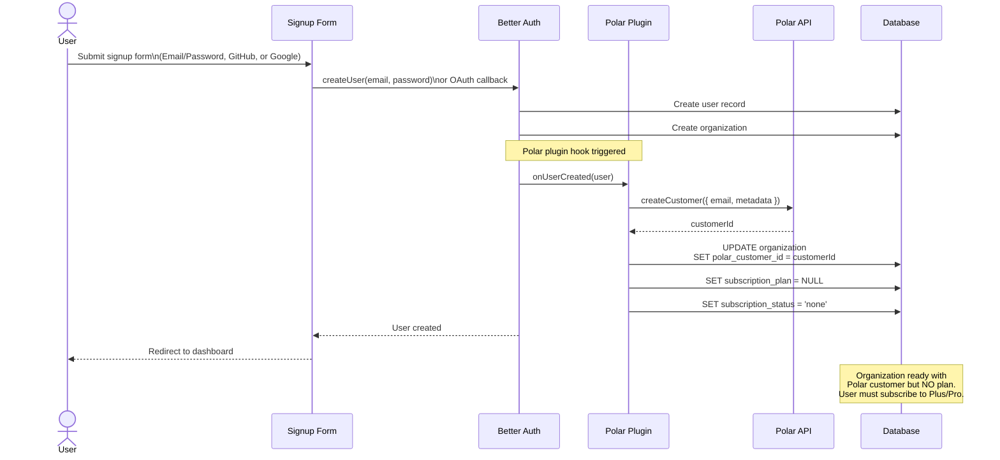

# Polar Billing Integration - Technical Specification

## Table of Contents
1. [Overview](#overview)
2. [Architecture](#architecture)
3. [Implementation](#implementation)
4. [API Reference](#api-reference)
5. [UI Components](#ui-components)
6. [Database Schema](#database-schema)
7. [Testing](#testing)
8. [Deployment](#deployment)
9. [Troubleshooting](#troubleshooting)

---

## Overview

### Purpose
Integrate Polar.sh payment platform to provide subscription-based billing for cloud-hosted Supercheck installations while maintaining a free, unlimited self-hosted option.

### Goals
- ✅ Implement usage-based billing for Playwright minutes and K6 VU hours
- ✅ Enforce plan limits for monitors, status pages, projects, and team members
- ✅ Provide seamless upgrade/downgrade flows
- ✅ Support self-hosted installations without billing dependencies
- ✅ Track and display real-time usage metrics
- ✅ Handle webhook events for subscription lifecycle management
- ✅ **Paid-only cloud model**: Cloud users must subscribe to Plus or Pro

### Non-Goals
- Custom enterprise pricing tiers (handled manually)
- Multi-currency support (Polar handles this)
- Annual billing (monthly only for now)
- Free tier for cloud users (self-hosted is free and unlimited)

---

## Architecture

### System Overview


### Key Components

#### 1. **Better Auth + Polar Plugin**
- Location: `app/src/utils/auth.ts`
- Purpose: Integrate Polar checkout, customer management, and webhooks
- Features:
  - Conditional loading based on `NEXT_PUBLIC_SELF_HOSTED` flag
  - Customer creation on signup
  - Checkout sessions for plan upgrades
  - Webhook signature verification

#### 2. **Subscription Service**
- Location: `app/src/lib/services/subscription-service.ts`
- Purpose: Manage subscription state and usage tracking
- Methods:
  - `requiresSubscription()` - Check if running in cloud mode (requires Polar)
  - `hasActiveSubscription(orgId)` - Verify org has active paid subscription  
  - `getOrganizationPlan()` - Retrieve plan limits (throws if cloud + no subscription)
  - `getEffectivePlan(orgId)` - Get plan with better error messages
  - `blockUntilSubscribed(orgId)` - Throw error if subscription required but missing
  - `trackPlaywrightUsage()` - Increment Playwright minutes
  - `trackK6Usage()` - Increment K6 VU hours (NUMERIC for precision)
  - `getUsage()` - Get current usage with overage calculations
  - `updateSubscription()` - Update plan from webhooks
  - `resetUsageCounters()` - Reset for new billing period

#### 3. **Plan Enforcement Middleware**  
- Location: `app/src/lib/middleware/plan-enforcement.ts`
- Purpose: Check limits before resource creation
- Functions:
  - `checkMonitorLimit()` - Verify monitor count
  - `checkStatusPageLimit()` - Verify status page count
  - `checkProjectLimit()` - Verify project count
  - `checkTeamMemberLimit()` - Verify team member count
  - `checkCapacityLimits()` - Get execution capacity limits
  - `checkFeatureAvailability()` - Check feature flags (SSO, custom domains)
- Returns:
  - **Cloud + No Subscription**: `{ allowed: false, requiresSubscription: true, availablePlans: ["plus", "pro"] }`
  - **Cloud + At Limit**: `{ allowed: false, error: "...", upgrade: "pro" }`
  - **Self-Hosted**: `{ allowed: true }` (always unlimited)

#### 4. **Usage Tracker (Worker)**
- Location: `worker/src/execution/services/usage-tracker.service.ts`
- Purpose: Track execution usage from background jobs
- Features:
  - Integrated into Playwright execution processor
  - Integrated into K6 execution processor
  - Unconditional tracking (tracks usage for both cloud and self-hosted)
  - Error handling without breaking execution

#### 5. **Webhook Handlers**
- Location: `app/src/lib/webhooks/polar-webhooks.ts`
- Purpose: Process Polar subscription events
- Implementation: Uses `onPayload` catch-all handler in Better Auth Polar plugin
- Events handled:
  - `subscription.active` / `subscription.created` - New subscription activation
  - `subscription.updated` - Plan changes
  - `subscription.canceled` - Cancellation
  - `order.paid` - Payment confirmation (also activates subscription)
  - `customer.*` - Customer info changes (logged only)
- Organization linking: Uses `referenceId` in checkout metadata to link subscriptions to organizations
- Product mapping: Maps Polar product IDs to plan names (plus/pro) via environment variables

---

## Sequence Diagrams

### 1. User Signup Flow (Cloud Mode)

> [!NOTE]
> This flow applies to **all signup methods**: email/password, GitHub OAuth, and Google OAuth. All methods trigger Polar customer creation in cloud mode.



### 2. User Signup Flow (Self-Hosted Mode)

> [!NOTE]
> Self-hosted mode supports all authentication methods: email/password, GitHub OAuth, and Google OAuth. No Polar integration occurs. Users get immediate unlimited access.


### 3. Subscription Upgrade Flow


### 4. Usage Tracking Flow (Playwright)


### 5. Plan Enforcement Flow


### 6. Webhook Processing Flow


### 7. Data Flow Diagram


---

## Implementation

### Prerequisites

#### Environment Variables
```bash
# Self-Hosted Mode (set to 'true' for unlimited features)
# Client-side code fetches this from /api/config/hosting-mode at runtime
SELF_HOSTED=false

# Polar Configuration
POLAR_ACCESS_TOKEN=polar_at_xxxxxxxxxxxxx
POLAR_SERVER=production  # or 'sandbox'
POLAR_WEBHOOK_SECRET=whsec_xxxxxxxxxxxxx

# Product IDs from Polar Dashboard
POLAR_PLUS_PRODUCT_ID=prod_xxxxxxxxxxxxx
POLAR_PRO_PRODUCT_ID=prod_xxxxxxxxxxxxx
```

#### Polar Dashboard Setup

1. **Create Organization Access Token**
   - Navigate to: Polar Dashboard → Settings → Access Tokens
   - Create token with required scopes
   - Copy to `POLAR_ACCESS_TOKEN`

2. **Create Products**

   **Plus Plan**:
   - Name: "Supercheck Plus"
   - Price: $49/month
   - Copy Product ID to `POLAR_PLUS_PRODUCT_ID`

   **Pro Plan**:
   - Name: "Supercheck Pro"
   - Price: $149/month
   - Copy Product ID to `POLAR_PRO_PRODUCT_ID`

3. **Configure Webhook**
   - URL: `https://your-domain.com/api/auth/polar/webhooks`
   - Events: `subscription.*`, `order.paid`, `customer.updated`
   - Copy secret to `POLAR_WEBHOOK_SECRET`

### Database Migration

```bash
cd app
npm run db:migrate
```

This migration:
- Adds subscription fields to `organization` table
- Creates `plan_limits` table with plan configurations
- Automatically runs seeds from `src/db/seeds/` folder
- Seeds default plan limits (Plus, Pro, Unlimited)

Note: Seed files are now in a dedicated `seeds/` folder to prevent accidental deletion during migration cleanup.

### Integration Points

#### API Routes Modified

1. **Monitor Creation** - `app/src/app/api/monitors/route.ts:248-266`
```typescript
const limitCheck = await checkMonitorLimit(organizationId, currentMonitorCount.length);
if (!limitCheck.allowed) {
  return NextResponse.json({ error: limitCheck.error }, { status: 403 });
}
```

2. **Status Page Creation** - `app/src/actions/create-status-page.ts:54-67`
```typescript
const limitCheck = await checkStatusPageLimit(organizationId, currentStatusPageCount.length);
if (!limitCheck.allowed) {
  return { success: false, message: limitCheck.error };
}
```

3. **Team Member Invitation** - `app/src/app/api/organizations/members/invite/route.ts:95-108`
```typescript
const limitCheck = await checkTeamMemberLimit(activeOrg.id, currentMemberCount.length);
if (!limitCheck.allowed) {
  return NextResponse.json({ error: limitCheck.error }, { status: 403 });
}
```

4. **Project Creation** - `app/src/app/api/projects/route.ts:128-141`
```typescript
const limitCheck = await checkProjectLimit(targetOrgId, allProjectsInOrg.length);
if (!limitCheck.allowed) {
  return NextResponse.json({ error: limitCheck.error }, { status: 403 });
}
```

#### Worker Integration

**Playwright Execution** - `worker/src/execution/processors/playwright-execution.processor.ts:104-117`
```typescript
await this.usageTrackerService.trackPlaywrightExecution(
  jobData.organizationId,
  durationMs,
  { runId, jobId: originalJobId }
);
```

**K6 Execution** - `worker/src/k6/processors/k6-execution.processor.ts:243-258`
```typescript
await this.usageTrackerService.trackK6Execution(
  taskData.organizationId,
  metrics.maxVUs,
  result.durationMs,
  { runId, jobId, testId }
);
```

---

## API Reference

### GET /api/billing/current

Retrieve current subscription, usage, and limits for the active organization.

**Response:**
```json
{
  "subscription": {
    "plan": "plus",
    "status": "active",
    "currentPeriodStart": "2025-01-01T00:00:00Z",
    "currentPeriodEnd": "2025-02-01T00:00:00Z"
  },
  "usage": {
    "playwrightMinutes": {
      "used": 350,
      "included": 500,
      "overage": 0,
      "percentage": 70
    },
    "k6VuHours": {
      "used": 45,
      "included": 100,
      "overage": 0,
      "percentage": 45
    }
  },
  "limits": {
    "monitors": {
      "current": 15,
      "limit": 25,
      "remaining": 10,
      "percentage": 60
    },
    "statusPages": { /* ... */ },
    "projects": { /* ... */ },
    "teamMembers": { /* ... */ }
  }
}
```

### GET /api/billing/pricing

Get available plans and pricing information.

**Response:**
```json
{
  "plans": [
    {
      "id": "plus",
      "name": "Plus",
      "price": 49,
      "interval": "month",
      "features": {
        "monitors": 25,
        "playwrightMinutes": 500,
        "k6VuHours": 100,
        /* ... */
      },
      "overagePricing": {
        "playwrightMinutes": 0.10,
        "k6VuHours": 0.50
      }
    },
    /* ... */
  ]
}
```

---

## UI Components

### UsageWarning

Display warnings when resources reach 80% or 100% of limits.

**Location**: `app/src/components/billing/usage-warning.tsx`

**Usage:**
```tsx
import { UsageWarning } from "@/components/billing/usage-warning";

<UsageWarning
  type="playwright"
  used={450}
  limit={500}
  percentage={90}
/>
```

**Props:**
- `type`: Resource type (playwright, k6, monitors, statusPages, projects, teamMembers)
- `used`: Current usage count
- `limit`: Plan limit
- `percentage`: Usage percentage (0-100)
- `className?`: Additional CSS classes
- `onUpgradeClick?`: Custom upgrade handler

### UpgradePrompt

Prompt users to upgrade when hitting limits.

**Location**: `app/src/components/billing/upgrade-prompt.tsx`

**Usage:**
```tsx
import { UpgradePrompt } from "@/components/billing/upgrade-prompt";

<UpgradePrompt
  resource="monitors"
  currentPlan="Plus"
  limit={25}
  nextPlan={{ name: "Pro", limit: 100, price: 149 }}
  variant="card"
/>
```

**Props:**
- `resource`: Resource name (e.g., "monitors")
- `currentPlan`: Current plan name
- `limit`: Current plan limit
- `nextPlan?`: Upgrade option details
- `variant?`: Display style ("inline" | "card")
- `className?`: Additional CSS classes

### UsageDashboard

Complete dashboard showing all usage and limits.

**Location**: `app/src/components/billing/usage-dashboard.tsx`

**Usage:**
```tsx
import { UsageDashboard } from "@/components/billing/usage-dashboard";

<UsageDashboard
  usage={billingData.usage}
  limits={billingData.limits}
  plan={{ name: "Plus", overagePricing: { ... } }}
  periodEnd={new Date("2025-02-01")}
/>
```

**Sub-components:**
- `UsageMeter`: Individual resource meter with progress bar
- `LimitCard`: Resource limit display card

### Subscription Tab (Organization Admin)

Full-featured subscription management integrated into the Organization Admin page.

**Location**: `app/src/components/org-admin/subscription-tab.tsx`

**Features:**
- Current plan display with status badge
- Plan renewal information
- "Manage Subscription" button (opens Polar customer portal in new tab)
- Real-time usage meters (Playwright minutes, K6 VU hours)
- Plan features display (data retention, custom domains, SSO)
- Resource limits with progress bars (monitors, status pages, projects, team members)

**Access:**
- Navigate to `/org-admin` and click the "Subscription" tab
- Or access directly via `/org-admin?tab=subscription`

**Note:** The standalone `/billing` page now redirects to the Subscription tab in Organization Admin.

### Customer Portal Integration

The "Manage Subscription" button uses the Better Auth Polar customer portal:

```typescript
// Opens Polar customer portal in new tab
const result = await authClient.customer.portal();
if (result?.data?.url) {
  window.open(result.data.url, '_blank', 'noopener,noreferrer');
}
```

The portal allows customers to:
- View subscription details
- Update payment method
- Cancel subscription
- View invoices and receipts

---

## Database Schema

### Organization Table (Modified)

Added fields for subscription management:

```sql
ALTER TABLE organization ADD COLUMN polar_customer_id VARCHAR(255);
ALTER TABLE organization ADD COLUMN subscription_plan VARCHAR(50); -- Nullable: cloud users start without plan
ALTER TABLE organization ADD COLUMN subscription_status VARCHAR(50) DEFAULT 'none';
ALTER TABLE organization ADD COLUMN subscription_id VARCHAR(255);
ALTER TABLE organization ADD COLUMN playwright_minutes_used INTEGER DEFAULT 0;
ALTER TABLE organization ADD COLUMN k6_vu_hours_used NUMERIC(10,4) DEFAULT 0; -- Changed from INTEGER for fractional hours
ALTER TABLE organization ADD COLUMN usage_period_start TIMESTAMP;
ALTER TABLE organization ADD COLUMN usage_period_end TIMESTAMP;
```

> [!IMPORTANT]
> **Cloud Mode Defaults**: Organizations created in cloud mode start with `subscription_plan = NULL` and `subscription_status = 'none'`. Users must subscribe to Plus or Pro via Polar to create resources.
> 
> **Self-Hosted Mode Defaults**: Organizations created in self-hosted mode get `subscription_plan = 'unlimited'` and `subscription_status = 'active'` immediately.

### Plan Limits Table (New)

Stores plan configuration:

```sql
CREATE TABLE plan_limits (
  plan VARCHAR(50) PRIMARY KEY,
  max_monitors INTEGER NOT NULL,
  max_status_pages INTEGER NOT NULL,
  max_team_members INTEGER NOT NULL,
  max_organizations INTEGER NOT NULL,
  max_projects INTEGER NOT NULL,
  playwright_minutes_included INTEGER NOT NULL,
  k6_vu_hours_included INTEGER NOT NULL,
  running_capacity INTEGER NOT NULL,
  queued_capacity INTEGER NOT NULL,
  data_retention_days INTEGER NOT NULL,
  custom_domains BOOLEAN DEFAULT FALSE,
  sso_enabled BOOLEAN DEFAULT FALSE
);

-- Seed data (Plus, Pro, Unlimited only - no free tier)
INSERT INTO plan_limits VALUES
('plus', 25, 5, 5, 1, 10, 500, 100, 5, 50, 30, false, false),
('pro', 100, 20, 20, 3, 50, 2000, 500, 10, 100, 90, true, true),
('unlimited', 999999, 999999, 999999, 999999, 999999, 999999, 999999, 999, 9999, 365, true, true);
```

> [!NOTE]
> There is no "free" plan. Cloud users must subscribe to Plus or Pro. Self-hosted users get unlimited automatically.

---

## Testing

### Unit Tests

#### Subscription Service Tests
```typescript
describe("SubscriptionService", () => {
  test("should return unlimited plan for self-hosted", async () => {
    process.env.NEXT_PUBLIC_SELF_HOSTED = "true";
    const plan = await subscriptionService.getOrganizationPlan(orgId);
    expect(plan.plan).toBe("unlimited");
  });

  test("should track Playwright usage correctly", async () => {
    await subscriptionService.trackPlaywrightUsage(orgId, 100);
    const usage = await subscriptionService.getUsage(orgId);
    expect(usage.playwrightMinutes.used).toBeGreaterThanOrEqual(100);
  });
});
```

#### Plan Enforcement Tests
```typescript
describe("Plan Enforcement", () => {
  test("should allow creation within limits", async () => {
    const result = await checkMonitorLimit(orgId, 10); // Plus plan: 25
    expect(result.allowed).toBe(true);
  });

  test("should block creation at limit", async () => {
    const result = await checkMonitorLimit(orgId, 25); // Plus plan: 25
    expect(result.allowed).toBe(false);
    expect(result.error).toContain("limit reached");
  });
});
```

### Integration Tests

#### API Route Tests
```typescript
describe("POST /api/monitors", () => {
  test("should enforce monitor limit", async () => {
    // Create 25 monitors (Plus plan limit)
    for (let i = 0; i < 25; i++) {
      await createMonitor({ name: `Monitor ${i}` });
    }

    // 26th monitor should fail
    const response = await createMonitor({ name: "Monitor 26" });
    expect(response.status).toBe(403);
    expect(response.body.error).toContain("limit reached");
  });
});
```

#### Webhook Tests
```typescript
describe("Polar Webhooks", () => {
  test("should update subscription on active event", async () => {
    const payload = {
      type: "subscription.active",
      data: { /* ... */ }
    };

    await handleWebhook(payload);

    const org = await db.organization.findById(orgId);
    expect(org.subscriptionStatus).toBe("active");
  });
});
```

### Manual Testing Checklist

#### Self-Hosted Mode
- [ ] All features available without Polar configuration
- [ ] No customer creation on signup
- [ ] No usage tracking to database
- [ ] All limits return "unlimited"

#### Cloud Mode
- [ ] Customer created in Polar on signup
- [ ] Plan limits enforced correctly
- [ ] Usage tracked after execution
- [ ] Webhook events processed correctly

#### UI Testing
- [ ] Billing page loads correctly
- [ ] Usage meters display accurate data
- [ ] Warnings appear at 80% and 100%
- [ ] Upgrade buttons function correctly
- [ ] Plan comparison renders properly

---

## Deployment

### Production Checklist

#### 1. Environment Configuration
- [ ] Set `NEXT_PUBLIC_SELF_HOSTED=false`
- [ ] Configure `POLAR_ACCESS_TOKEN` (production)
- [ ] Set `POLAR_SERVER=production`
- [ ] Add `POLAR_WEBHOOK_SECRET`
- [ ] Add `POLAR_PLUS_PRODUCT_ID`
- [ ] Add `POLAR_PRO_PRODUCT_ID`

#### 2. Database Migration
```bash
cd app
npm run db:migrate
```

Verify plan limits:
```sql
SELECT * FROM plan_limits;
-- Should return 3 rows: plus, pro, unlimited
```

#### 3. Polar Dashboard
- [ ] Create production products (Plus, Pro)
- [ ] Configure webhook endpoint
- [ ] Test webhook delivery
- [ ] Verify product IDs match environment variables

#### 4. Smoke Tests
- [ ] Sign up new user → verify customer created in Polar
- [ ] Create monitors up to limit → verify enforcement
- [ ] Run Playwright test → verify usage tracked
- [ ] Run K6 test → verify VU hours tracked
- [ ] Check `/billing` page → verify data displayed

#### 5. Monitoring
- [ ] Set up logging for Polar API calls
- [ ] Monitor webhook delivery success rate
- [ ] Track usage tracking errors
- [ ] Alert on failed subscription updates

---

## Troubleshooting

### Common Issues

#### 1. Webhook Not Receiving Events

**Symptoms:**
- Subscription changes not reflected in app
- Database not updating after Polar events

**Solutions:**
- Verify webhook URL is publicly accessible
- Check `POLAR_WEBHOOK_SECRET` matches Polar dashboard
- Review webhook logs in Polar dashboard
- Ensure Better Auth is properly configured

**Debug:**
```bash
# Test webhook endpoint
curl -X POST https://your-domain.com/api/auth/polar/webhooks \
  -H "Content-Type: application/json" \
  -d '{"test": "payload"}'
```

#### 2. Customer Not Created on Signup

**Symptoms:**
- `polar_customer_id` is null in organization table
- Users can't access checkout

**Solutions:**
- Verify `POLAR_ACCESS_TOKEN` is valid
- Check `NEXT_PUBLIC_SELF_HOSTED` is set to `false`
- Review application logs for Polar API errors
- Ensure Better Auth Polar plugin is loaded

**Debug:**
```typescript
// Check if Polar is enabled
import { isPolarEnabled } from "@/lib/feature-flags";
console.log("Polar enabled:", isPolarEnabled());
```

#### 3. Plan Limits Not Enforcing

**Symptoms:**
- Users can create resources beyond limits
- Limit checks always return allowed

**Solutions:**
- Verify database migration ran successfully
- Check `plan_limits` table has 3 rows
- Confirm organization has correct `subscription_plan`
- Review middleware integration in API routes

**Debug:**
```sql
-- Check organization subscription
SELECT id, name, subscription_plan, subscription_status
FROM organization
WHERE id = 'org_id';

-- Check plan limits
SELECT * FROM plan_limits WHERE plan = 'plus';
```

#### 4. Usage Not Tracking

**Symptoms:**
- Playwright minutes remain at 0 after execution
- K6 VU hours not incrementing

**Solutions:**
- Verify `UsageTrackerService` is injected in worker processors
- Check `SELF_HOSTED` flag (tracking disabled if true)
- Review worker logs for tracking errors
- Ensure organization exists in database

**Debug:**
```typescript
// In worker processor
this.logger.log(`Tracking Playwright usage for org ${organizationId}: ${durationMs}ms`);
```

#### 5. Overage Charges Not Calculated

**Symptoms:**
- Usage shows overage but cost is $0
- Billing page doesn't display overage cost

**Solutions:**
- Verify `plan_limits` table has correct overage pricing
- Check `subscriptionService.getUsage()` calculations
- Ensure `currentPlan.overagePricing` is populated

**Debug:**
```typescript
const usage = await subscriptionService.getUsage(orgId);
console.log("Overage:", usage.playwrightMinutes.overage);
console.log("Cost per minute:", plan.overagePricing.playwrightMinutes);
```

### Error Codes

| Code | Message | Solution |
|------|---------|----------|
| `POLAR_001` | Customer creation failed | Check Polar API token and permissions |
| `POLAR_002` | Webhook signature invalid | Verify `POLAR_WEBHOOK_SECRET` |
| `POLAR_003` | Subscription not found | Check `subscription_id` in database |
| `LIMIT_001` | Monitor limit reached | User needs to upgrade plan |
| `LIMIT_002` | Usage limit exceeded | Overage charges will apply |

### Logging

#### Application Logs
```typescript
// Subscription service
console.log(`[Subscription] Updated org ${orgId}:`, data);

// Usage tracking
console.log(`[Usage] Tracked ${minutes} Playwright minutes for org ${orgId}`);

// Plan enforcement
console.warn(`Monitor limit reached for org ${orgId}: ${error}`);
```

#### Worker Logs
```typescript
// Playwright execution
this.logger.log(`[Usage] Tracked Playwright execution: ${minutes} minutes`);

// K6 execution
this.logger.log(`[Usage] Tracked K6 usage: ${vuHours} VU hours`);
```

---

## Performance Considerations

### Database Optimization

#### Indexes
```sql
-- Index on polar_customer_id for quick lookups
CREATE INDEX idx_organization_polar_customer ON organization(polar_customer_id);

-- Index on subscription_plan for filtering
CREATE INDEX idx_organization_subscription_plan ON organization(subscription_plan);
```

#### Query Optimization
- Use `db.query.organization.findFirst()` with specific columns
- Cache plan limits in application memory
- Batch usage updates where possible

### Caching Strategy

#### Plan Limits (Memory Cache)
```typescript
const planCache = new Map<string, PlanLimits>();

async function getCachedPlanLimits(plan: string) {
  if (!planCache.has(plan)) {
    const limits = await db.query.planLimits.findFirst({ where: eq(planLimits.plan, plan) });
    planCache.set(plan, limits);
  }
  return planCache.get(plan);
}
```

#### Usage Data (Short TTL)
- Cache usage metrics for 5 minutes to reduce database load
- Invalidate cache on usage updates
- Use stale-while-revalidate pattern

### Rate Limiting

#### Polar API Calls
- Limit: 100 requests/minute
- Implement exponential backoff for retries
- Queue non-critical operations

#### Webhook Processing
- Process webhooks asynchronously
- Use job queue for heavy operations
- Implement idempotency for retry safety

---

## Security

### API Key Management
- Store `POLAR_ACCESS_TOKEN` in secure environment variables
- Never commit secrets to version control
- Rotate tokens periodically (recommended: quarterly)

### Webhook Security
- Always verify webhook signatures using `POLAR_WEBHOOK_SECRET`
- Implement replay attack prevention
- Log all webhook events for audit

### Data Protection
- Minimal PII storage (only Polar customer ID)
- Encrypt sensitive data at rest
- Comply with GDPR for European customers

---

## Maintenance

### Monthly Tasks
- [ ] Review overage charges and notify customers
- [ ] Check webhook delivery success rate
- [ ] Verify usage tracking accuracy
- [ ] Update plan limits if needed

### Quarterly Tasks
- [ ] Rotate Polar API tokens
- [ ] Review and optimize database queries
- [ ] Analyze customer usage patterns
- [ ] Update pricing if market changes

### Annual Tasks
- [ ] Security audit of billing integration
- [ ] Review Polar contract and fees
- [ ] Plan feature additions (e.g., annual billing)
- [ ] Customer satisfaction survey on pricing

---

## References

### Documentation
- [Polar API Documentation](https://polar.sh/docs)
- [Better Auth Polar Plugin](https://www.better-auth.com/plugins/polar)
- [Drizzle ORM Documentation](https://orm.drizzle.team/)

### Related Files
- `docs/pricing.md` - Public pricing information
- `docs/polar-setup.md` - Initial setup guide
- `docs/polar-implementation-status.md` - Implementation checklist

### Support
- **Polar Issues**: https://polar.sh/support
- **Supercheck Issues**: https://github.com/supercheck-io/supercheck/issues
- **Email**: [email protected]

---

## Changelog

### v1.0.0 (2025-01-25)
- ✅ Initial implementation
- ✅ Plus and Pro plan support
- ✅ Usage tracking (Playwright + K6)
- ✅ Plan enforcement middleware
- ✅ Billing UI components
- ✅ Webhook handlers
- ✅ Self-hosted mode support

### Future Enhancements
- [ ] Annual billing option
- [ ] Enterprise plan with custom pricing
- [ ] Usage forecasting and predictions
- [ ] Automated billing alerts
- [ ] Cost estimation before execution
- [ ] Usage analytics dashboard
