# Observability System Specification

## Overview

Supercheck implements comprehensive observability using **OpenTelemetry** for distributed tracing, **ClickHouse** for data storage, and custom instrumentation for Playwright test execution. The system provides deep visibility into test execution performance, network requests, errors, and system behavior.

## Table of Contents

1. [System Architecture](#system-architecture)
2. [OpenTelemetry Integration](#opentelemetry-integration)
3. [Trace Structure](#trace-structure)
4. [Data Flow](#data-flow)
5. [ClickHouse Storage](#clickhouse-storage)
6. [Custom Attributes](#custom-attributes)
7. [Span Creation](#span-creation)
8. [Playwright Instrumentation](#playwright-instrumentation)
9. [K6 Instrumentation](#k6-instrumentation)
10. [Query API](#query-api)
11. [Frontend Integration](#frontend-integration)
12. [Configuration](#configuration)

## System Architecture

```mermaid
graph TB
    subgraph "⚙️ Worker Service"
        INST[Instrumentation<br/>Must Import First]
        EXEC[Test Execution]
        SPAN[Span Creator]
        PW[Playwright Parser]
        K6[K6 Parser]
    end

    subgraph "📊 OpenTelemetry Stack"
        SDK[OTel SDK]
        EXPORTER[OTLP Exporter<br/>HTTP/gRPC]
        COLLECTOR[OTel Collector<br/>:4317/:4318]
    end

    subgraph "💾 Storage Layer"
        CH[ClickHouse<br/>Port 8123/9000]
        TRACES[(signoz_traces DB)]
        LOGS[(signoz_logs DB)]
    end

    subgraph "🎨 Frontend Layer"
        UI[Observability UI]
        API[Query API]
        FILTERS[Filters & Search]
    end

    INST --> SDK
    EXEC --> SPAN
    SPAN --> PW
    SPAN --> K6
    SPAN --> SDK

    SDK --> EXPORTER
    EXPORTER --> COLLECTOR
    COLLECTOR --> CH
    CH --> TRACES
    CH --> LOGS

    UI --> API
    API --> CH
    FILTERS --> API

    classDef worker fill:#e3f2fd,stroke:#1976d2,stroke-width:2px
    classDef otel fill:#f3e5f5,stroke:#7b1fa2,stroke-width:2px
    classDef storage fill:#e8f5e8,stroke:#388e3c,stroke-width:2px
    classDef frontend fill:#fff3e0,stroke:#f57c00,stroke-width:2px

    class INST,EXEC,SPAN,PW,K6 worker
    class SDK,EXPORTER,COLLECTOR otel
    class CH,TRACES,LOGS storage
    class UI,API,FILTERS frontend
```



## OpenTelemetry Integration

### Instrumentation Setup

**Critical Rule:** The instrumentation file MUST be imported first before any other code.

**Location:** `worker/src/observability/instrumentation.ts`

**Import Order:**


### SDK Configuration

**Features:**
- Auto-instrumentation: **DISABLED** (prevents internal noise)
- Manual instrumentation: **ENABLED** (high-level operations only)
- Resource detection: Service name, version, environment
- Sampling: 100% (configurable via `OTEL_TRACE_SAMPLE_RATE`)
- Batch span processor: Efficient batching for performance

**Environment Variables:**
- `OTEL_EXPORTER_OTLP_ENDPOINT` - Collector endpoint (http://localhost:4318)
- `OTEL_EXPORTER_OTLP_PROTOCOL` - Protocol (http/grpc)
- `OTEL_SERVICE_NAME` - Service identifier (worker)
- `OTEL_TRACE_SAMPLE_RATE` - Sampling rate (0.0-1.0)

## Trace Structure

### Hierarchy


### Span Types

| Span Type | Purpose | Attributes |
|-----------|---------|------------|
| **Job Span** | Top-level job execution | `sc.job_id`, `sc.run_id`, `sc.run_type`, `sc.project_id`, `sc.organization_id` |
| **Test Span** | Individual test execution | `sc.test_id`, `test.name`, `test.status`, `test.duration_ms` |
| **HTTP Span** | Network requests from tests | `http.method`, `http.url`, `http.status_code`, `http.response_time_ms` |
| **Error Span** | Test failures and errors | `error.type`, `error.message`, `error.stack`, `error.screenshot_url` |

## Data Flow

### Complete Observability Pipeline


## ClickHouse Storage

### Database Schema

**Database:** `signoz_traces`

**Primary Table:** `signoz_traces.signoz_index_v3`

**Key Columns:**
- `timestamp` - Span start time (DateTime64)
- `traceID` - Unique trace identifier (UUID)
- `spanID` - Unique span identifier (UUID)
- `parentSpanID` - Parent span identifier (UUID)
- `serviceName` - Service that created span (String)
- `name` - Span operation name (String)
- `kind` - Span kind (INTERNAL, CLIENT, SERVER, etc.)
- `durationNano` - Span duration in nanoseconds (UInt64)
- `statusCode` - Span status (0=Unset, 1=OK, 2=Error)
- `stringTagMap` - Custom attributes (Map)

### Custom Attribute Storage


### Retention Policy

**Configuration:**
- Default retention: 30 days
- Configurable via ClickHouse TTL settings
- Automatic cleanup of expired data
- Compression for historical data

## Custom Attributes

### Supercheck-Specific Attributes


### Run Type Normalization

The system normalizes granular run types to canonical forms:

**Normalization Map:**
- `playwright_job` → `playwright`
- `playwright_test` → `playwright`
- `playwright_monitor` → `playwright`
- `k6_job` → `k6`
- `k6_test` → `k6`

**Implementation Location:** `app/src/lib/observability/clickhouse-client.ts`

## Span Creation

### Manual Span Creation Helper

**Location:** `worker/src/observability/trace-helpers.ts`

**Function:** `createSpanWithContext(name, attributes, callback)`

**Usage Pattern:**

```mermaid
graph LR
    A[Start Operation] --> B[createSpanWithContext]
    B --> C[Execute Callback]
    C --> D{Success?}
    D -->|Yes| E[Set Status OK]
    D -->|Error| F[Set Status Error]
    E --> G[End Span]
    F --> G
    G --> H[Return Result]

    classDef start fill:#e3f2fd,stroke:#1976d2,stroke-width:2px
    classDef process fill:#e8f5e8,stroke:#388e3c,stroke-width:2px
    classDef end fill:#f3e5f5,stroke:#7b1fa2,stroke-width:2px

    class A,B start
    class C,D process
    class E,F,G,H end
```

### Span Context Propagation

**W3C Trace Context Headers:**
- `traceparent` - Trace ID, span ID, trace flags
- `tracestate` - Vendor-specific trace state

**Propagation Flow:**


## Playwright Instrumentation

### Test Result Parsing

**Location:** `worker/src/observability/playwright-test-spans.ts`

**Input:** Playwright JSON results file

**Output:** Tree of spans representing test execution

### Span Creation from Test Results


### Network Event Parsing

**Location:** `worker/src/observability/playwright-network-events-parser.ts`

**Features:**
- Extracts HTTP requests from Playwright traces
- Creates child spans for each network call
- Includes timing information (DNS, connect, TLS, transfer)
- Captures request/response headers
- Records status codes and error messages

## K6 Instrumentation

### Performance Test Span Creation

**Location:** `worker/src/observability/k6-test-spans.ts`

**K6 Result Structure:**


**Attributes Added:**
- `k6.scenario` - Test scenario name
- `k6.vus` - Virtual users count
- `k6.iterations` - Total iterations
- `k6.duration` - Test duration
- `k6.threshold.passed` - Threshold pass/fail status
- `k6.metric.*` - Individual metric values

## Query API

### API Endpoints

**Trace Queries:**
- `GET /api/observability/traces` - List traces with filters
- `GET /api/observability/traces/:traceId` - Get trace details
- `GET /api/observability/runs/:runId/traces` - Get traces for run

**Filter Parameters:**
- `runId` - Filter by run UUID
- `testId` - Filter by test UUID
- `jobId` - Filter by job UUID
- `projectId` - Filter by project UUID
- `runType` - Filter by run type (normalized)
- `serviceName` - Filter by service name
- `status` - Filter by status (success/error)
- `startTime` - Time range start
- `endTime` - Time range end

### Query Flow


### Direct ClickHouse Queries

**Implementation:** Bypasses SigNoz query service for better performance

**Query Example Structure:**
```
SELECT
    traceID,
    spanID,
    parentSpanID,
    serviceName,
    name,
    timestamp,
    durationNano,
    statusCode,
    stringTagMap['sc.run_id'] as runId,
    stringTagMap['sc.test_id'] as testId,
    stringTagMap['sc.run_type'] as runType
FROM signoz_traces.signoz_index_v3
WHERE stringTagMap['sc.run_id'] = {runId}
ORDER BY timestamp ASC
```

## Frontend Integration

### Observability UI

**Location:** `app/src/app/(main)/observability/`

**Features:**
- Trace list view with filtering
- Trace detail view with span waterfall
- Log viewer with level filtering
- Service map visualization
- Metrics dashboard

### Trace Waterfall Visualization


### React Components

**Key Components:**
- `TraceList` - Displays trace results in table
- `TraceDetails` - Shows span tree with waterfall
- `SpanDetails` - Individual span information
- `TraceFilters` - Filter UI for queries
- `ServiceMap` - Visual service dependencies

## Configuration

### Environment Variables

**Worker Service:**
```
OTEL_EXPORTER_OTLP_ENDPOINT=http://localhost:4318
OTEL_EXPORTER_OTLP_PROTOCOL=http
OTEL_SERVICE_NAME=worker
OTEL_TRACE_SAMPLE_RATE=1.0
OTEL_LOGS_EXPORTER=otlp
OTEL_METRICS_EXPORTER=otlp
```

**OTel Collector:**
```
OTEL_COLLECTOR_ENDPOINT=http://otel-collector:4318
CLICKHOUSE_ENDPOINT=http://clickhouse:8123
CLICKHOUSE_DATABASE=signoz_traces
```

**ClickHouse:**
```
CLICKHOUSE_HTTP_PORT=8123
CLICKHOUSE_NATIVE_PORT=9000
CLICKHOUSE_USER=default
CLICKHOUSE_PASSWORD=<secure-password>
```

### Deployment Architecture


## Best Practices

### Span Creation Guidelines

**DO:**
- Import instrumentation FIRST in main.ts
- Use manual spans for high-level operations only
- Add meaningful custom attributes
- Set appropriate span statuses (OK/ERROR)
- Include error details in error spans
- Propagate context across async boundaries

**DON'T:**
- Auto-instrument internal operations (creates noise)
- Create spans for database queries (too granular)
- Create spans for every function call
- Forget to end spans (memory leak)
- Block on span export (use async export)

### Performance Considerations

**Optimization Strategies:**
- Batch span export (default: 2048 spans)
- Use sampling in high-traffic scenarios
- Index custom attributes in ClickHouse
- Implement data retention policies
- Compress historical trace data
- Use materialized views for common queries

### Security Considerations

**Data Protection:**
- Sanitize sensitive data from spans
- Use separate ClickHouse user for queries
- Restrict access to trace data by project
- Implement RBAC for observability UI
- Audit access to sensitive traces
- Encrypt data in transit and at rest

## Testing Guide

### Verify Instrumentation

**Steps:**
1. Start worker service
2. Check logs for OTel initialization
3. Execute a test
4. Query ClickHouse for trace data
5. Verify spans created with correct attributes

**ClickHouse Verification Query:**
```sql
SELECT
    traceID,
    spanID,
    name,
    serviceName,
    stringTagMap['sc.run_id'] as runId
FROM signoz_traces.signoz_index_v3
WHERE serviceName = 'worker'
ORDER BY timestamp DESC
LIMIT 10
```

### Test Span Creation

**Unit Test Pattern:**
1. Mock OTel SDK
2. Execute operation
3. Verify span started
4. Verify attributes set
5. Verify span ended
6. Verify status set correctly

## Related Documentation

- **Test Execution:** See `TEST_EXECUTION_AND_JOB_QUEUE_FLOW.md`
- **Worker Service:** See `SUPERCHECK_ARCHITECTURE.md`
- **Database Schema:** See `ERD_DIAGRAM.md`
- **API Routes:** See `API_ROUTES_ANALYSIS.md`

## Revision History

| Version | Date | Changes |
|---------|------|---------|
| 1.0 | 2025-01-12 | Initial observability specification |
