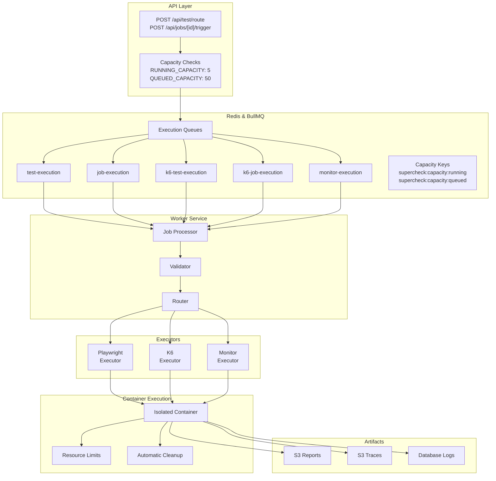
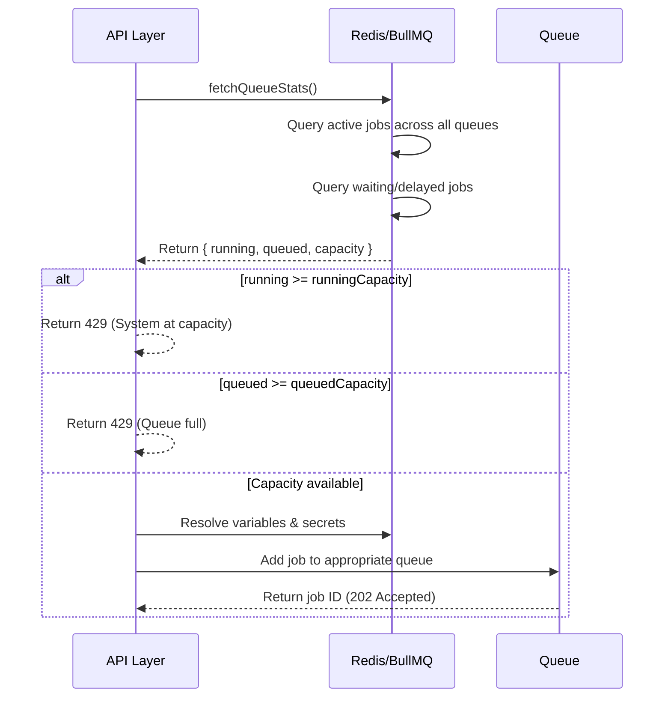
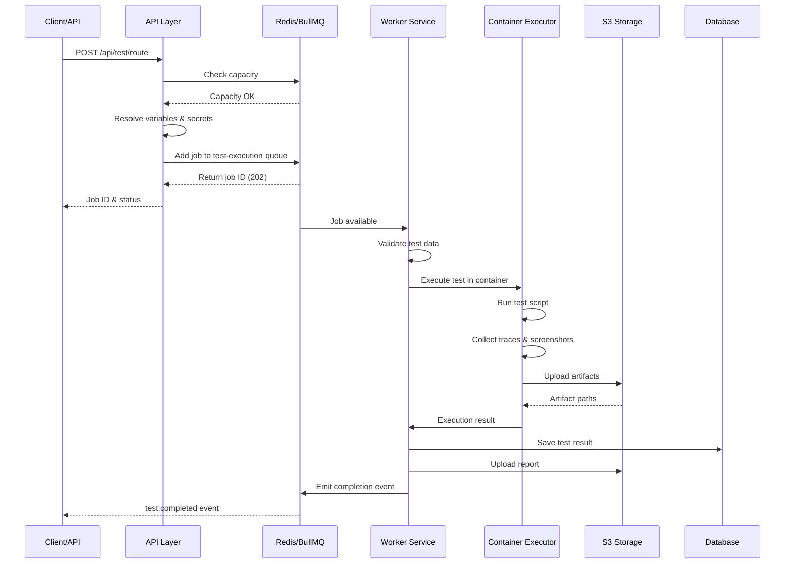
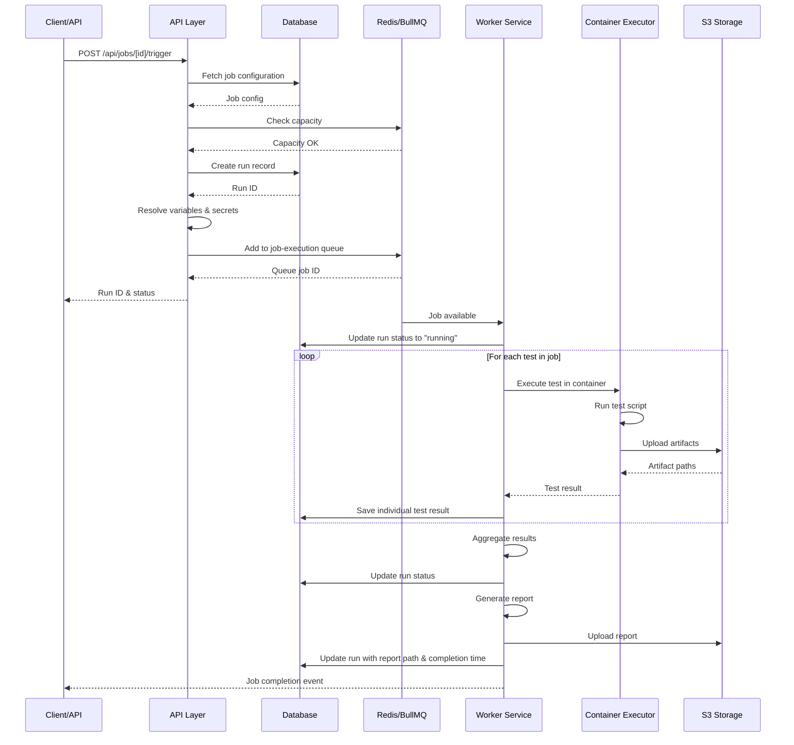
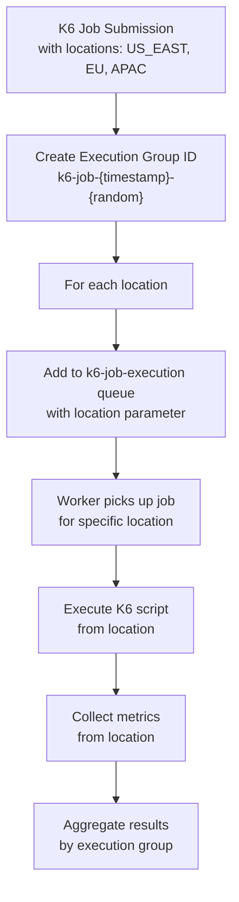
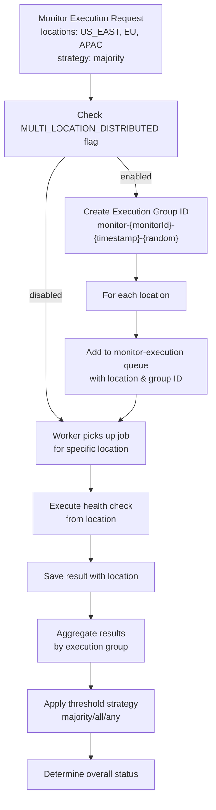
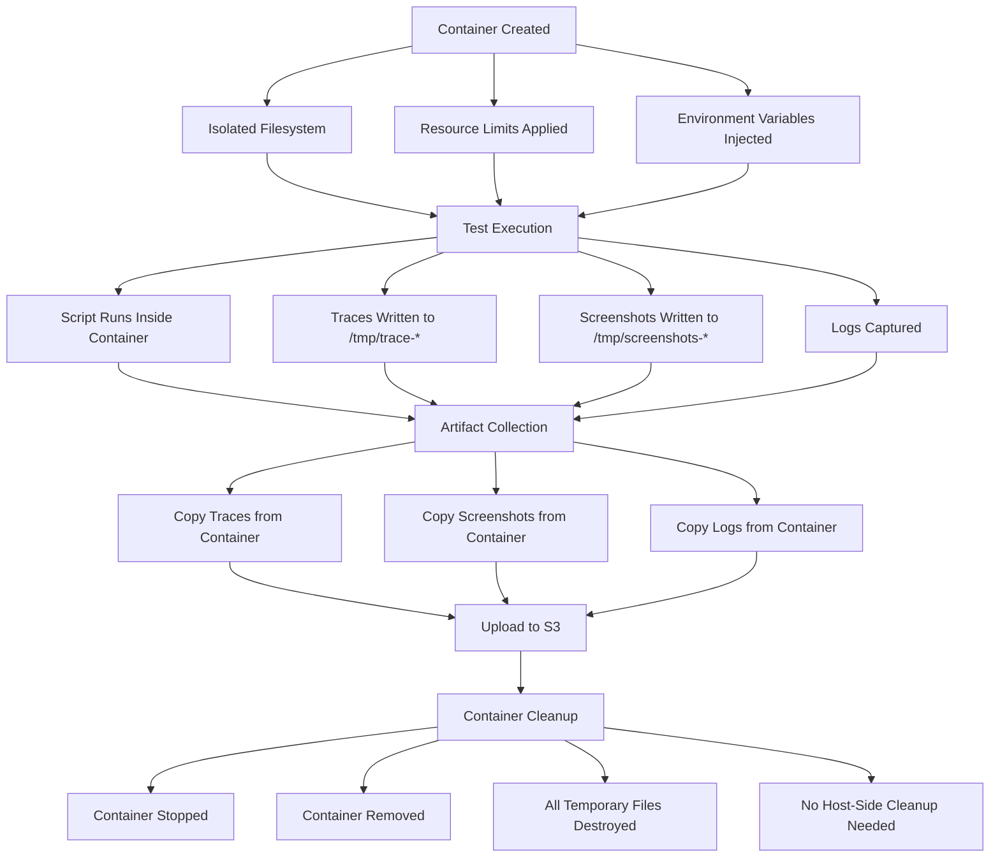

# Queue Execution Flow - Complete Working

## Overview

This document provides a comprehensive overview of how job and test execution flows through the queue system in Supercheck. The system uses **BullMQ** for distributed job queuing with **Redis** as the backing store, and execution has been moved to **containerized environments** for security and isolation.

---

## System Architecture

---

## BullMQ Queue System

### Queue Definitions

The system manages 10 distinct queues for different execution types:

**Execution Queues:**
- **test-execution**: Playwright and browser-based test execution
- **job-execution**: Multi-test job execution (sequential)
- **k6-test-execution**: K6 load test execution
- **k6-job-execution**: K6 job execution (multiple tests)
- **monitor-execution**: Health check and monitoring execution

**Scheduler Queues:**
- **job-scheduler**: Triggers scheduled jobs hourly
- **k6-job-scheduler**: Triggers scheduled K6 jobs hourly
- **monitor-scheduler**: Triggers scheduled monitors every 5 minutes

**Utility Queues:**
- **email-template-render**: Email template rendering
- **data-lifecycle-cleanup**: Database and artifact cleanup

### Queue Configuration

Each queue is configured with memory-optimized settings:

**Job Retention:**
- Completed jobs: 500 maximum, kept for 24 hours
- Failed jobs: 1000 maximum, kept for 7 days
- Automatic removal based on age and count

**Retry Strategy:**
- Attempts: 3 retries for execution jobs, 2 for job execution
- Backoff: Exponential with 1-second initial delay
- Stalled job detection: Every 30 seconds

**Metrics:**
- Maximum 60 data points per queue (1 hour at 1-minute intervals)
- Prevents unbounded Redis memory growth

---

## Capacity Management System

### Overview

Capacity is managed entirely through **Redis keys** rather than local state. This allows distributed capacity tracking across multiple worker instances.

### Capacity Limits

**RUNNING_CAPACITY (Default: 5)**
- Maximum number of jobs actively executing simultaneously
- Enforced at API layer before job submission
- Tracked via Redis key: `supercheck:capacity:running`
- Includes all execution types: Playwright tests, K6 tests, Monitor checks

**QUEUED_CAPACITY (Default: 50)**
- Maximum number of jobs waiting in queue
- Hard limit enforced at API layer
- Returns 429 (Too Many Requests) when exceeded
- Tracked via Redis key: `supercheck:capacity:queued`

### Capacity Check Flow

### Queue Statistics

Queue statistics track:
- Currently active jobs (running count)
- Max allowed running jobs (capacity)
- Jobs waiting to run (queued count)
- Max allowed queued jobs (capacity)

Execution queues counted in statistics:
- test-execution
- job-execution
- k6-test-execution
- k6-job-execution
- monitor-execution

---

## Test Execution Flow

### Sequence Diagram

### Process Steps

**1. Job Submission (API Layer)**
- Receive test execution request with test data
- Check current capacity via fetchQueueStats()
- Validate running count < RUNNING_CAPACITY
- Validate queued count < QUEUED_CAPACITY
- Resolve variables and secrets
- Add job to test-execution queue with priority and retention settings
- Return job ID and status 202 (Accepted)

**2. Worker Processing**
- Worker picks up job from test-execution queue
- Validate job data structure and required fields
- Route to appropriate executor (Playwright, K6, Monitor)
- Execute in container environment
- Process and return results

**3. Container Execution**
- Create isolated container context with unique ID
- Prepare test script with trace configuration
- Execute inside container with resource limits
- Collect artifacts (traces, screenshots, logs)
- Upload artifacts to S3
- Container cleanup is automatic - no local folders remain

**4. Result Handling**
- Save results to database
- Upload reports to S3
- Emit completion event
- Update run status if applicable
- Clean up execution tracking

---

## Job Execution Flow

### Sequence Diagram

### Process Steps

**1. Job Submission**
- Fetch job configuration from database
- Check capacity limits
- Create run record
- Resolve variables and secrets
- Add to job-execution queue with retention settings
- Return run ID and queue job ID

**2. Sequential Test Execution**
- Update run status to "running"
- Execute tests sequentially (one at a time)
- For each test:
  - Execute in container
  - Save individual test result
  - Continue on error
- Aggregate all results
- Update run status based on aggregated results
- Generate report
- Upload report to S3
- Update run with report path and completion time

---

## Multi-Location Execution

### K6 Multi-Location Execution

K6 load tests can be executed from multiple geographic locations for distributed load testing:

**Location Configuration:**
- US East (Primary)
- US West
- Europe
- Asia Pacific

**Execution Strategy:**
- Each location runs the same K6 script independently
- Results are aggregated by execution group ID
- Distributed load from multiple geographic points
- Better simulation of global user behavior

**Queue Flow for Multi-Location K6:**

### Monitor Multi-Location Execution

Health checks and monitors can run from multiple locations for global coverage:

**Location Configuration:**
- US East (Default)
- US West
- Europe
- Asia Pacific
- Additional custom locations

**Execution Modes:**

**Single Location Mode (Default):**
- Monitor runs from US East only
- Fastest execution
- Lower resource usage

**Multi-Location Mode:**
- Monitor runs from all configured locations simultaneously
- Execution group ID tracks related jobs
- Results aggregated by location
- Threshold strategy determines overall status

**Threshold Strategies:**
- **Majority**: More than 50% of locations must be up
- **All**: All locations must be up
- **Any**: At least one location must be up

**Queue Flow for Multi-Location Monitors:**

### Location Service

The location service manages location configurations:

**Available Monitoring Locations:**
- US_EAST: United States (East Coast)
- US_WEST: United States (West Coast)
- EU: Europe
- APAC: Asia Pacific

**Default Configuration:**
- Enabled: false (single location mode)
- Primary location: US_EAST
- Threshold: 50% (majority strategy)
- Strategy: Majority

**Effective Locations Logic:**
- If multi-location disabled: Use default primary location (US_EAST)
- If multi-location enabled: Use configured locations
- Fallback: Default to US_EAST if no locations specified

---

## Container Execution & Cleanup

### Container Lifecycle

### Why No Local Cleanup is Needed

**Execution happens inside container:**
- Temporary files created inside container's isolated filesystem
- Container has its own /tmp directory
- No files written to host machine

**Container cleanup is automatic:**
- When container execution completes, container is destroyed
- All temporary files destroyed with container
- No scheduled cleanup operations needed

**Host machine remains clean:**
- No local `playwright-reports/` folders accumulate
- No local `k6-reports/` folders accumulate
- No temporary test files on host
- Container filesystem is completely isolated

---

## Scheduler Flow

### Job Scheduler

**Execution Schedule:** Every hour (0 * * * *)

**Process:**
1. Scheduler checks database for scheduled jobs
   - Query jobs with schedule enabled
   - Check if next execution time has passed
   - Filter by organization/project access
2. For each job to schedule:
   - Create run record
   - Add to job-execution queue
   - Update next execution time
3. Scheduler runs asynchronously
   - Non-blocking operation
   - Continues even if individual jobs fail

### Monitor Scheduler

**Execution Schedule:** Every 5 minutes (*/5 * * * *)

**Process:**
1. Scheduler checks database for active monitors
   - Query monitors with enabled status
   - Check if next check time has passed
   - Determine execution location(s)
2. For each monitor to check:
   - Add to monitor-execution queue
   - Include location configuration
   - Update next check time
3. Multi-location support:
   - If multi-location enabled: Create jobs for each location
   - If single location: Create single job
   - Execution group ID tracks related jobs

---

## Error Handling & Retries

### Retry Strategy

**Default job options for all execution queues:**
- Attempts: 3 retries for execution jobs, 2 for job execution
- Backoff type: Exponential
- Initial delay: 1 second
- Keep completed jobs: 500 max, 24 hours
- Keep failed jobs: 1000 max, 7 days

### Failure Scenarios

| Scenario | Handling | Reason |
|----------|----------|--------|
| Container timeout | Fail job, don't retry | Timeout is fatal, indicates resource issue |
| Network error | Retry with exponential backoff | Transient error, likely to succeed on retry |
| Database error | Retry with exponential backoff | Transient error, database may recover |
| Invalid script | Fail immediately, don't retry | Code error, retries won't help |
| Out of memory | Fail job, don't retry | Resource issue, needs manual intervention |
| Location unavailable | Fail for that location, continue others | Multi-location: other locations may succeed |

---

## Performance Considerations

### Capacity Tuning

**Environment variables to tune:**
- RUNNING_CAPACITY: 5 (increase for more parallelism)
- QUEUED_CAPACITY: 50 (increase to allow more queuing)
- REDIS_HOST: localhost (Redis connection)
- REDIS_PORT: 6379

**Tuning Guidelines:**
- Increase RUNNING_CAPACITY if system has spare resources
- Increase QUEUED_CAPACITY if jobs are being rejected
- Monitor queue depth to detect bottlenecks
- Adjust based on container resource limits

### Monitoring

**Queue Statistics:**
- Running: current active jobs / capacity
- Queued: current waiting jobs / capacity
- Check if system is at capacity
- Monitor queue depth trends

**Health Checks:**
- Stalled job detection: Every 30 seconds
- Failed job tracking: 7-day retention
- Completed job tracking: 24-hour retention
- Metrics collection: 60 data points per queue

### Redis Memory Management

- Completed jobs kept for 24 hours (500 max)
- Failed jobs kept for 7 days (1000 max)
- Metrics limited to 60 data points (1 hour at 1 min interval)
- Stalled job check every 30 seconds
- Automatic cleanup of orphaned keys
- TTL-based expiration for all keys

---

## Summary

The queue execution flow provides:

✅ **Distributed capacity management** via Redis  
✅ **Container-based execution** with automatic cleanup  
✅ **Multi-location support** for K6 and monitors  
✅ **Reliable job processing** with retry logic  
✅ **Comprehensive artifact management** via S3  
✅ **Scalable architecture** supporting multiple execution types  
✅ **No local folder accumulation** - containers handle cleanup  
✅ **Global monitoring coverage** with location-based execution  
