# Specification Files Reorganization Plan

## Executive Summary

This document outlines the comprehensive reorganization plan for all specification files in the `/specs` folder. The reorganization follows best practices for technical documentation by organizing content by **feature/domain** rather than technical layers, eliminating duplication, and ensuring all functionality is properly documented using Mermaid diagrams instead of code snippets.

## Current State Analysis

### Existing Specification Files (13 files)

| File Name | Status | Issues Identified |
|-----------|--------|-------------------|
| README.md | ✅ Good | Acts as index, needs minor updates after reorganization |
| SUPERCHECK_ARCHITECTURE.md | ✅ Excellent | Comprehensive architecture overview with great Mermaid diagrams |
| ERD_DIAGRAM.md | ✅ Excellent | Complete database schema documentation |
| QUEUE_EXECUTION_FLOW.md | ⚠️ Duplicate | 60% overlap with TEST_EXECUTION_AND_JOB_QUEUE_FLOW.md |
| TEST_EXECUTION_AND_JOB_QUEUE_FLOW.md | ⚠️ Duplicate | 60% overlap with QUEUE_EXECUTION_FLOW.md, very detailed on Docker |
| MONITORING_SYSTEM.md | ✅ Good | Comprehensive monitoring documentation |
| NOTIFICATIONS_SPEC.md | ⚠️ Naming | Inconsistent naming (should be *_SYSTEM.md) |
| STATUS_PAGES_COMPLETE_SPEC.md | ⚠️ Naming | Inconsistent naming (should be *_SYSTEM.md) |
| AUTHENTICATION.md | ✅ Good | Better Auth integration documentation |
| RBAC_DOCUMENTATION.md | ⚠️ Naming | Inconsistent naming (should be *_SYSTEM.md) |
| AI_FIX_DOCUMENTATION.md | ⚠️ Naming | Inconsistent naming (should be *_SYSTEM.md) |
| API_KEY_SYSTEM.md | ✅ Excellent | Follows naming convention, comprehensive |
| PROJECT_VARIABLES.md | ✅ Good | Variable and secret management |

### Missing Documentation (9 areas)

1. **Data Lifecycle Management** - Cleanup workers, retention policies, artifact management
2. **Audit Logging System** - User actions, system events, compliance tracking
3. **Tag System** - Tag creation, assignment, filtering
4. **Reports System** - Report generation, storage, viewing
5. **Playground Feature** - Interactive test playground
6. **Dashboard System** - Metrics, widgets, visualizations
7. **Storage System** - S3/MinIO artifact management, upload/download flows
8. **Script Validation** - Validation services for test scripts
9. **Improvement Suggestions** - Scalability and robustness recommendations

## Reorganization Strategy

### Naming Convention

All specification files will follow consistent naming:
- **Pattern**: `{FEATURE}_SYSTEM.md` for feature-specific documentation
- **Pattern**: `{ENTITY}_DIAGRAM.md` for diagram-only files
- **Exception**: Core files like `README.md`, `SUPERCHECK_ARCHITECTURE.md`

### File Organization by Domain

```mermaid
graph TB
    subgraph "📚 Core System Documentation"
        C1[README.md<br/>Index & Navigation]
        C2[SUPERCHECK_ARCHITECTURE.md<br/>High-level Architecture]
        C3[ERD_DIAGRAM.md<br/>Database Schema]
    end

    subgraph "🔐 Authentication & Security"
        A1[AUTHENTICATION_SYSTEM.md<br/>Better Auth Integration]
        A2[RBAC_SYSTEM.md<br/>Role-Based Access Control]
        A3[API_KEY_SYSTEM.md<br/>API Key Management]
        A4[PROJECT_VARIABLES_SYSTEM.md<br/>Variables & Secrets]
    end

    subgraph "⚡ Testing & Execution"
        E1[EXECUTION_SYSTEM.md<br/>Queue, Container, Multi-location]
    end

    subgraph "👀 Monitoring & Alerting"
        M1[MONITORING_SYSTEM.md<br/>HTTP, Ping, Port Monitors]
        M2[NOTIFICATIONS_SYSTEM.md<br/>Multi-channel Notifications]
    end

    subgraph "📢 Public Features"
        P1[STATUS_PAGES_SYSTEM.md<br/>Public Status Pages]
    end

    subgraph "🤖 AI Features"
        AI1[AI_FIX_SYSTEM.md<br/>AI-powered Test Fixing]
    end

    subgraph "💾 Data & Storage"
        D1[STORAGE_SYSTEM.md<br/>S3 Artifact Management]
        D2[DATA_LIFECYCLE_SYSTEM.md<br/>Cleanup & Retention]
    end

    subgraph "📋 Management & Organization"
        MG1[TAG_SYSTEM.md<br/>Tag Management]
        MG2[DASHBOARD_SYSTEM.md<br/>Metrics & Widgets]
        MG3[REPORTS_SYSTEM.md<br/>Report Generation]
    end

    subgraph "🔍 Audit & Compliance"
        AU1[AUDIT_SYSTEM.md<br/>Audit Logging]
    end

    subgraph "🛠️ Developer Tools"
        DV1[PLAYGROUND_SYSTEM.md<br/>Interactive Playground]
        DV2[SCRIPT_VALIDATION_SYSTEM.md<br/>Script Validation]
    end

    subgraph "📈 Improvements"
        IM1[IMPROVEMENT_SUGGESTIONS.md<br/>Scalability & Robustness]
    end

    C1 -.-> C2 & C3
    C1 -.-> A1 & A2 & A3 & A4
    C1 -.-> E1
    C1 -.-> M1 & M2
    C1 -.-> P1
    C1 -.-> AI1
    C1 -.-> D1 & D2
    C1 -.-> MG1 & MG2 & MG3
    C1 -.-> AU1
    C1 -.-> DV1 & DV2
    C1 -.-> IM1

    classDef core fill:#e3f2fd,stroke:#1976d2,stroke-width:2px
    classDef auth fill:#f3e5f5,stroke:#7b1fa2,stroke-width:2px
    classDef execution fill:#fff3e0,stroke:#f57c00,stroke-width:2px
    classDef monitoring fill:#e8f5e8,stroke:#388e3c,stroke-width:2px
    classDef public fill:#ffebee,stroke:#d32f2f,stroke-width:2px
    classDef ai fill:#f3e5f5,stroke:#9c27b0,stroke-width:2px
    classDef data fill:#e0f2f1,stroke:#00796b,stroke-width:2px
    classDef management fill:#fce4ec,stroke:#c2185b,stroke-width:2px
    classDef audit fill:#e8eaf6,stroke:#3f51b5,stroke-width:2px
    classDef tools fill:#fff9c4,stroke:#f9a825,stroke-width:2px
    classDef improvement fill:#e0f7fa,stroke:#00acc1,stroke-width:2px

    class C1,C2,C3 core
    class A1,A2,A3,A4 auth
    class E1 execution
    class M1,M2 monitoring
    class P1 public
    class AI1 ai
    class D1,D2 data
    class MG1,MG2,MG3 management
    class AU1 audit
    class DV1,DV2 tools
    class IM1 improvement
```

## Detailed Action Plan

### Phase 1: Merge Duplicate Files

#### Action 1.1: Create EXECUTION_SYSTEM.md (Merge duplicates)

**Source Files:**
- QUEUE_EXECUTION_FLOW.md (604 lines)
- TEST_EXECUTION_AND_JOB_QUEUE_FLOW.md (1452 lines)

**Merged Content Structure:**

```mermaid
graph TB
    subgraph "EXECUTION_SYSTEM.md Structure"
        S1[1. Overview & Architecture]
        S2[2. BullMQ Queue System]
        S3[3. Capacity Management]
        S4[4. Container Execution]
        S5[5. Test Execution Flow]
        S6[6. Job Execution Flow]
        S7[7. Multi-Location Execution]
        S8[8. Scheduler System]
        S9[9. Worker Architecture]
        S10[10. Resource Management]
        S11[11. Docker Compose Best Practices]
        S12[12. Error Handling & Retries]
        S13[13. Performance Optimization]
    end

    S1 --> S2 --> S3 --> S4
    S4 --> S5 & S6
    S5 & S6 --> S7
    S7 --> S8 --> S9
    S9 --> S10 --> S11
    S11 --> S12 --> S13

    classDef section fill:#e3f2fd,stroke:#1976d2,stroke-width:2px
    class S1,S2,S3,S4,S5,S6,S7,S8,S9,S10,S11,S12,S13 section
```

**Key Content from Each Source:**
- From QUEUE_EXECUTION_FLOW.md:
  - Multi-location execution details
  - Monitor scheduler flow
  - Location service configuration
  - Container cleanup lifecycle

- From TEST_EXECUTION_AND_JOB_QUEUE_FLOW.md:
  - Detailed Docker container security
  - Path mapping and volume mounts
  - Worker service architecture
  - Resource limits and allocation
  - Docker Compose production configuration
  - Scaling strategies

**Result:** Single comprehensive 1200-1400 line spec with all execution-related content

**Files to Delete:**
- ❌ QUEUE_EXECUTION_FLOW.md
- ❌ TEST_EXECUTION_AND_JOB_QUEUE_FLOW.md

### Phase 2: Rename Files for Consistency

| Current Name | New Name | Reason |
|--------------|----------|--------|
| NOTIFICATIONS_SPEC.md | NOTIFICATIONS_SYSTEM.md | Consistent naming convention |
| STATUS_PAGES_COMPLETE_SPEC.md | STATUS_PAGES_SYSTEM.md | Consistent naming convention |
| RBAC_DOCUMENTATION.md | RBAC_SYSTEM.md | Consistent naming convention |
| AI_FIX_DOCUMENTATION.md | AI_FIX_SYSTEM.md | Consistent naming convention |
| AUTHENTICATION.md | AUTHENTICATION_SYSTEM.md | Consistent naming convention |
| PROJECT_VARIABLES.md | PROJECT_VARIABLES_SYSTEM.md | Consistent naming convention |

### Phase 3: Create Missing Documentation

#### 3.1 STORAGE_SYSTEM.md (NEW)

**Content Focus:**
- S3/MinIO architecture and configuration
- Artifact upload/download flows
- Bucket organization strategy
- Presigned URL generation
- Storage lifecycle policies
- CDN integration
- Security and access control

**Primary Diagrams:**
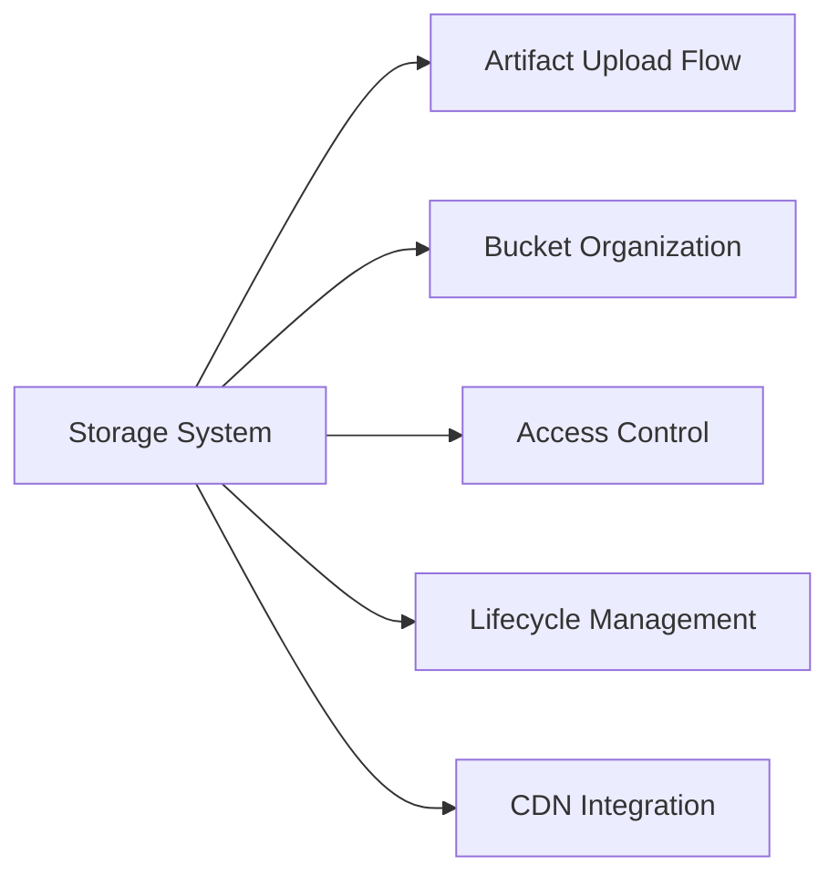

#### 3.2 DATA_LIFECYCLE_SYSTEM.md (NEW)

**Content Focus:**
- Cleanup worker architecture
- Retention policies
- Automated cleanup jobs
- Database cleanup (old runs, results)
- S3 cleanup (expired artifacts)
- Scheduling and triggers
- Performance considerations

**Primary Diagrams:**
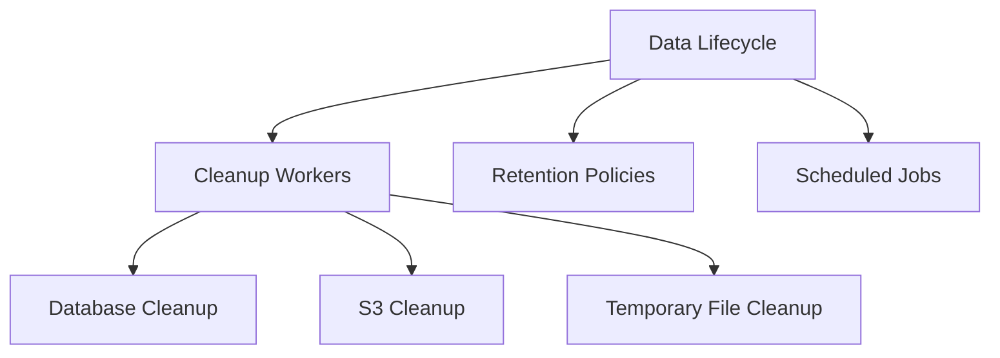

#### 3.3 AUDIT_SYSTEM.md (NEW)

**Content Focus:**
- Audit log architecture
- Event types and categories
- User action tracking
- System event logging
- Compliance reporting
- Log retention and archival
- Query and search capabilities

**Primary Diagrams:**
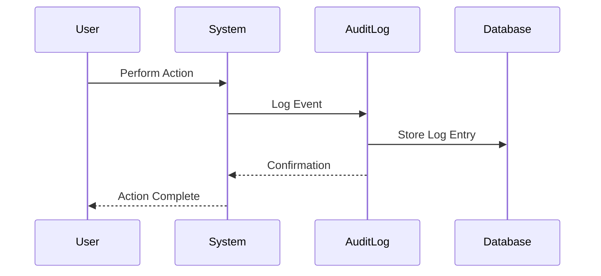

#### 3.4 TAG_SYSTEM.md (NEW)

**Content Focus:**
- Tag creation and management
- Tag assignment to tests/monitors
- Tag-based filtering
- Tag hierarchy and organization
- Bulk operations
- Tag analytics

**Primary Diagrams:**
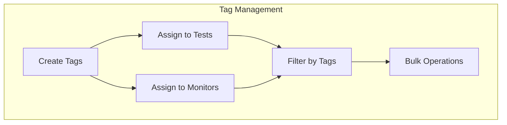

#### 3.5 REPORTS_SYSTEM.md (NEW)

**Content Focus:**
- Report generation pipeline
- Report types (HTML, JSON, PDF)
- Storage and retrieval
- Report viewing interface
- Scheduled report generation
- Export formats
- Report sharing

**Primary Diagrams:**
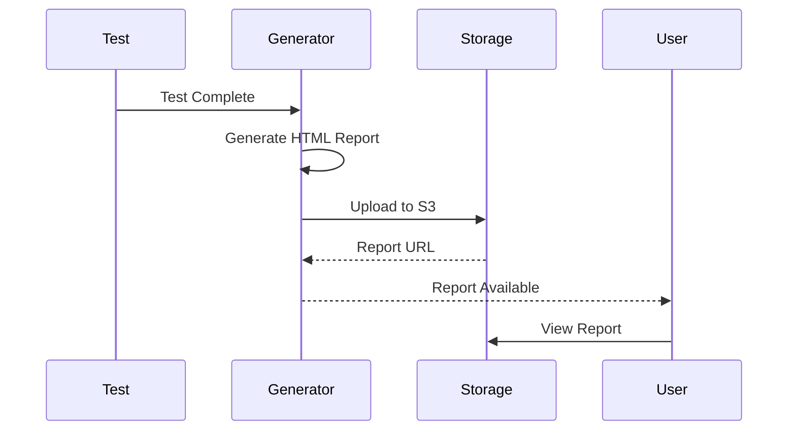

#### 3.6 DASHBOARD_SYSTEM.md (NEW)

**Content Focus:**
- Dashboard metrics and widgets
- Real-time data updates
- Chart and visualization types
- Performance metrics
- Customization options
- Data aggregation
- Caching strategy

**Primary Diagrams:**
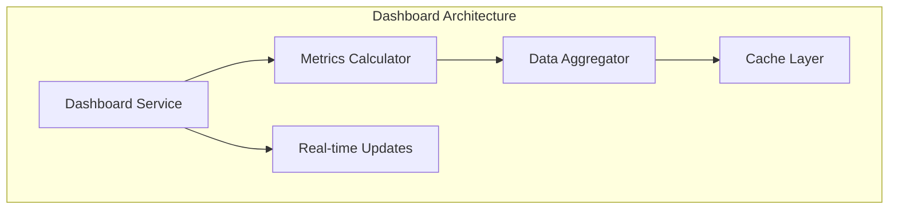

#### 3.7 PLAYGROUND_SYSTEM.md (NEW)

**Content Focus:**
- Interactive test playground
- Code editor integration (Monaco)
- Live test execution
- Instant feedback
- Script validation
- Example templates
- Debugging tools

**Primary Diagrams:**
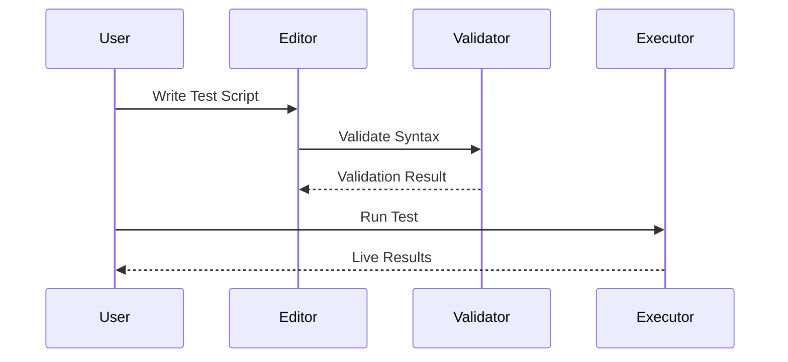

#### 3.8 SCRIPT_VALIDATION_SYSTEM.md (NEW)

**Content Focus:**
- Script validation services
- Syntax checking
- Security validation
- Best practices enforcement
- Error reporting
- Integration with playground
- Validation rules

**Primary Diagrams:**
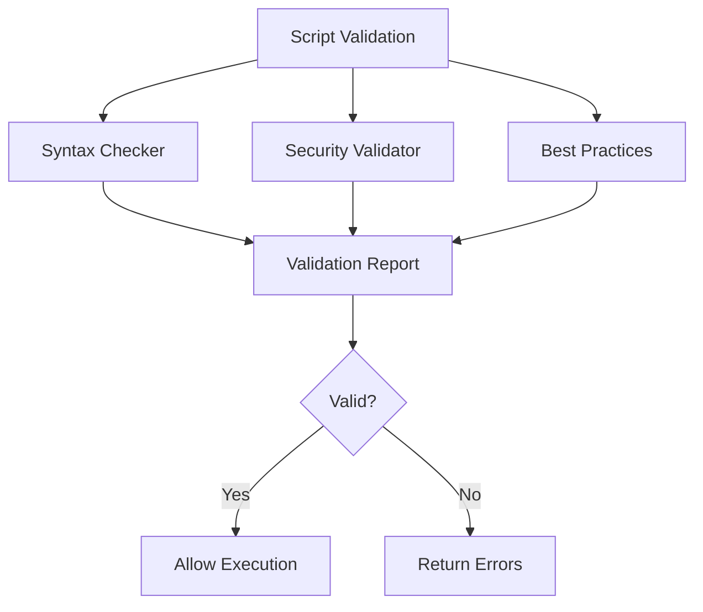

#### 3.9 IMPROVEMENT_SUGGESTIONS.md (NEW)

**Content Focus:**
- Scalability improvements
- Performance optimizations
- Security hardening
- Code quality enhancements
- Infrastructure upgrades
- Monitoring enhancements
- Cost optimization

**Structure:**
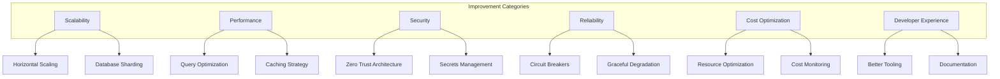

### Phase 4: Update README.md Index

Update the README.md to reflect the new organization with clear sections and consistent navigation.

**New Structure:**

```markdown
# Supercheck Technical Documentation

## 📚 Core System Documentation
- [Supercheck Architecture](SUPERCHECK_ARCHITECTURE.md)
- [Database Schema (ERD)](ERD_DIAGRAM.md)

## 🔐 Authentication & Security
- [Authentication System](AUTHENTICATION_SYSTEM.md)
- [Role-Based Access Control (RBAC)](RBAC_SYSTEM.md)
- [API Key System](API_KEY_SYSTEM.md)
- [Project Variables & Secrets](PROJECT_VARIABLES_SYSTEM.md)

## ⚡ Testing & Execution
- [Execution System (Queue, Container, Multi-location)](EXECUTION_SYSTEM.md)

## 👀 Monitoring & Alerting
- [Monitoring System](MONITORING_SYSTEM.md)
- [Notifications System](NOTIFICATIONS_SYSTEM.md)

## 📢 Public Features
- [Status Pages System](STATUS_PAGES_SYSTEM.md)

## 🤖 AI Features
- [AI Fix System](AI_FIX_SYSTEM.md)

## 💾 Data & Storage
- [Storage System (S3/MinIO)](STORAGE_SYSTEM.md)
- [Data Lifecycle Management](DATA_LIFECYCLE_SYSTEM.md)

## 📋 Management & Organization
- [Tag System](TAG_SYSTEM.md)
- [Dashboard System](DASHBOARD_SYSTEM.md)
- [Reports System](REPORTS_SYSTEM.md)

## 🔍 Audit & Compliance
- [Audit System](AUDIT_SYSTEM.md)

## 🛠️ Developer Tools
- [Playground System](PLAYGROUND_SYSTEM.md)
- [Script Validation System](SCRIPT_VALIDATION_SYSTEM.md)

## 📈 Improvements
- [Improvement Suggestions](IMPROVEMENT_SUGGESTIONS.md)
```

## Implementation Timeline

### Week 1: Foundation
- ✅ Day 1-2: Create EXECUTION_SYSTEM.md (merge duplicates)
- ✅ Day 3: Rename all files for consistency
- ✅ Day 4-5: Validate all existing specs, ensure no code snippets

### Week 2: New Documentation - Data & Infrastructure
- ✅ Day 1-2: Create STORAGE_SYSTEM.md
- ✅ Day 2-3: Create DATA_LIFECYCLE_SYSTEM.md
- ✅ Day 4-5: Create AUDIT_SYSTEM.md

### Week 3: New Documentation - Management & Tools
- ✅ Day 1: Create TAG_SYSTEM.md
- ✅ Day 2: Create REPORTS_SYSTEM.md
- ✅ Day 3: Create DASHBOARD_SYSTEM.md
- ✅ Day 4: Create PLAYGROUND_SYSTEM.md
- ✅ Day 5: Create SCRIPT_VALIDATION_SYSTEM.md

### Week 4: Improvements & Finalization
- ✅ Day 1-2: Create IMPROVEMENT_SUGGESTIONS.md
- ✅ Day 3-4: Update README.md with new structure
- ✅ Day 4-5: Final review, ensure all Mermaid diagrams are correct

## Quality Standards

### ✅ Mermaid Diagram Requirements

All specifications MUST use Mermaid diagrams exclusively. No code snippets allowed.

**Required Diagram Types:**
1. **Architecture Diagrams** - System component relationships
2. **Sequence Diagrams** - Flow of operations over time
3. **State Diagrams** - State transitions
4. **Flow Charts** - Decision flows
5. **Entity Relationship Diagrams** - Data relationships
6. **Graph Diagrams** - Component connections

**Color Coding Standard:**
```mermaid
graph LR
    classDef frontend fill:#e3f2fd,stroke:#1976d2,stroke-width:2px
    classDef backend fill:#f3e5f5,stroke:#7b1fa2,stroke-width:2px
    classDef data fill:#e8f5e8,stroke:#388e3c,stroke-width:2px
    classDef worker fill:#fff3e0,stroke:#f57c00,stroke-width:2px
    classDef external fill:#ffebee,stroke:#d32f2f,stroke-width:2px
    classDef security fill:#e0f2f1,stroke:#00796b,stroke-width:2px
```

### ✅ Content Requirements

1. **Clear Overview** - What is this system/feature?
2. **Architecture Diagram** - How is it structured?
3. **Flow Diagrams** - How does it work?
4. **Configuration** - How to configure it?
5. **Best Practices** - How to use it correctly?
6. **Troubleshooting** - Common issues and solutions

### ✅ Documentation Standards

- ✅ Use active voice
- ✅ Be concise and clear
- ✅ Use bullet points for lists
- ✅ Use tables for comparisons
- ✅ Use callouts for important notes
- ✅ Include "last updated" dates
- ✅ Cross-reference related documents

### ❌ Prohibited Content

- ❌ Code snippets (use Mermaid diagrams instead)
- ❌ Outdated information
- ❌ Vague descriptions
- ❌ Missing diagrams
- ❌ Inconsistent naming

## Success Criteria

### Quantitative Metrics
- ✅ 0 duplicate content across files
- ✅ 100% of features documented
- ✅ 100% Mermaid diagram usage (0% code snippets)
- ✅ Consistent naming convention across all files
- ✅ 22 total specification files (up from 13)

### Qualitative Metrics
- ✅ Easy navigation via README.md
- ✅ Logical organization by feature/domain
- ✅ Clear, actionable documentation
- ✅ Comprehensive coverage of all systems
- ✅ Professional visual consistency

## Post-Reorganization Maintenance

### Update Triggers
Update specifications when:
1. New features are added
2. Architecture changes
3. Configuration changes
4. Breaking changes occur
5. Security updates implemented

### Review Schedule
- **Monthly**: Quick review for accuracy
- **Quarterly**: Comprehensive review and updates
- **After Major Releases**: Full documentation audit

## Conclusion

This reorganization will transform the `/specs` folder into a professional, comprehensive, and maintainable technical documentation resource. The feature-based organization makes it intuitive for developers to find information, while the consistent use of Mermaid diagrams ensures visual clarity without exposing implementation details.

**Next Steps:**
1. Approve this reorganization plan
2. Execute Phase 1 (merge duplicates)
3. Execute Phase 2 (rename files)
4. Execute Phase 3 (create new docs)
5. Execute Phase 4 (update README)
6. Final review and quality check

---

**Document Version:** 1.0
**Created:** 2025-01-17
**Author:** Technical Documentation Team
**Status:** Ready for Implementation
